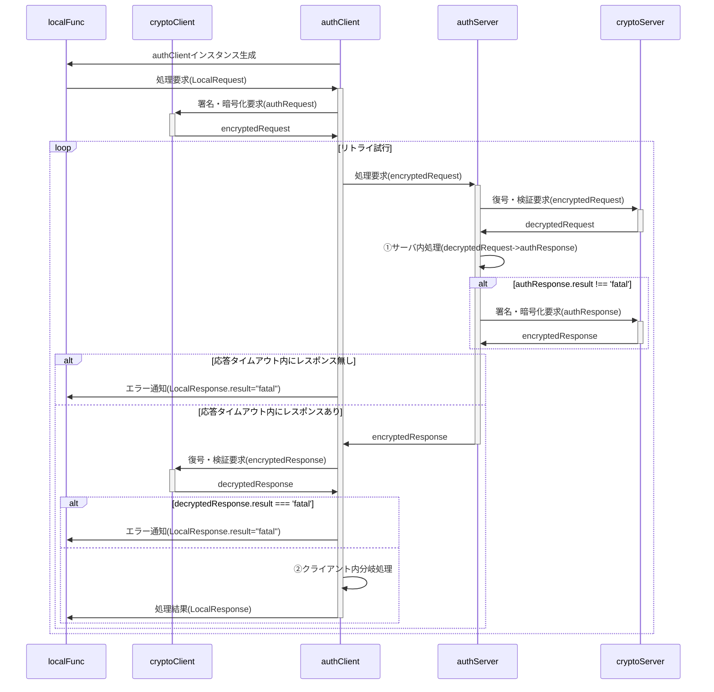
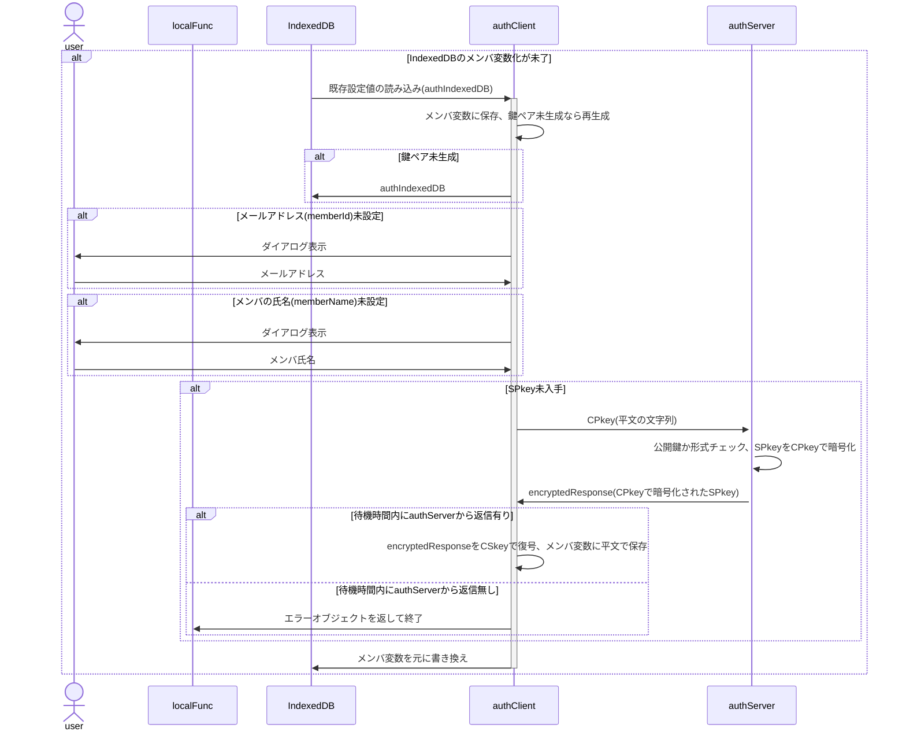
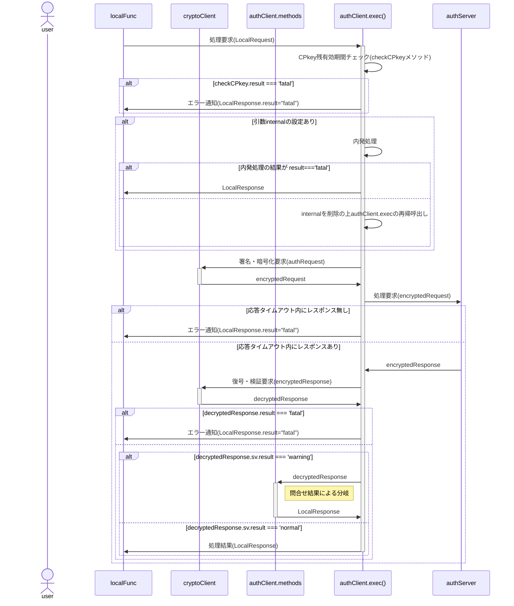
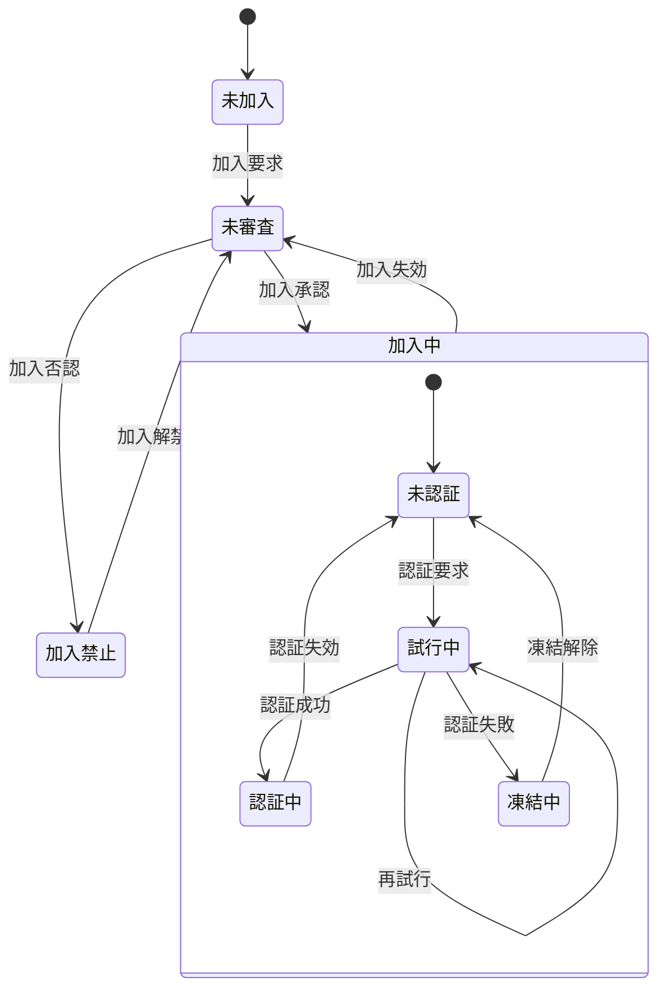
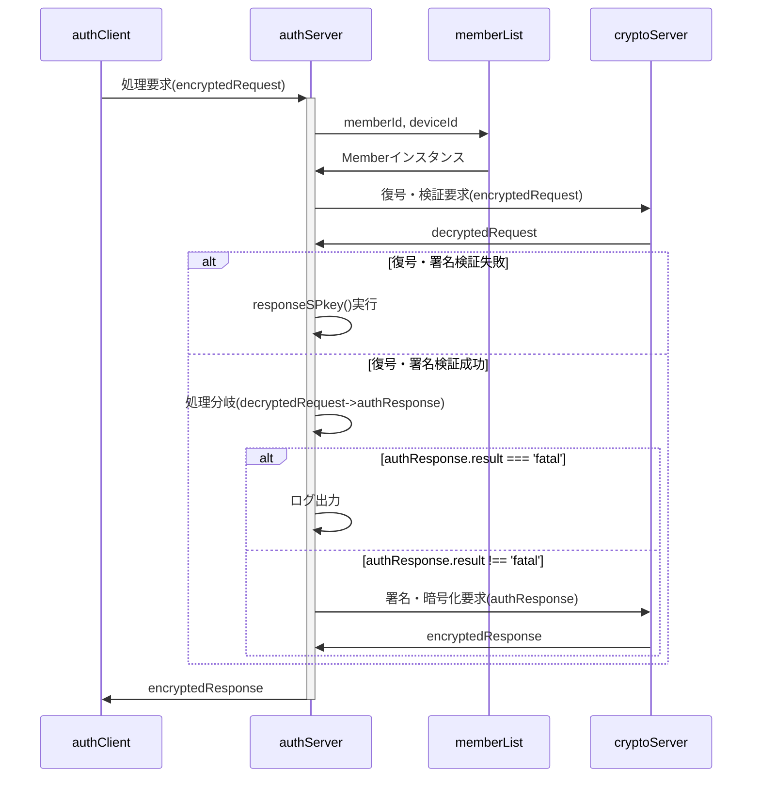
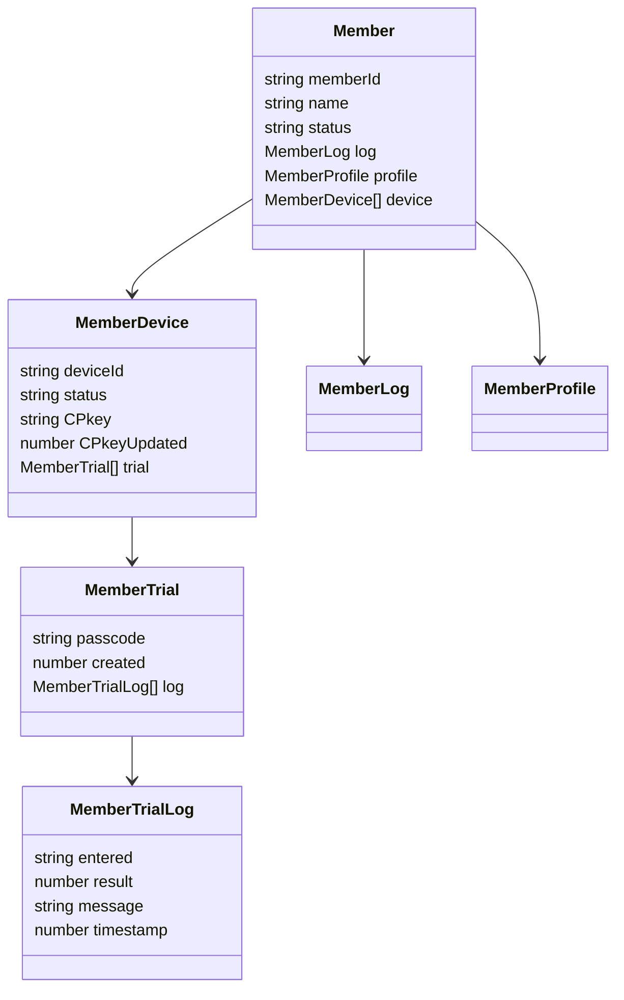

# Auth System Full Specification (統合版)
version: draft-20251017
included sections:
  - spec.md
  - cryptoClient.md
  - cryptoServer.md
  - authServer.md
  - authClient.md
  - Member.md

--- spec.md ---

## 総説

ブラウザ(クライアント)とGAS(サーバ)の間で認証された通信を行う。

関連仕様書：[authClient](doc/authClient.md) | [authServer](doc/authServer.md) | [Member](doc/Member.md) | [cryptoServer](doc/cryptoServer.md) | [cryptoClient](doc/cryptoClient.md)

### 要求仕様

- 本システムは限られた人数のサークルや小学校のイベント等での利用を想定する。<br>
  よってセキュリティ上の脅威は極力排除するが、恒久性・安全性より導入時の容易さ・技術的ハードルの低さ、運用の簡便性を重視する。
- サーバ側(以下authServer)はスプレッドシートのコンテナバインドスクリプト、クライアント側(以下authClient)はHTMLのJavaScript
- サーバ側・クライアント側とも鍵ペアを使用
- 原則として通信は受信側公開鍵で暗号化＋発信側秘密鍵で署名
- クライアントの識別(ID)はメールアドレスで行う

### 用語

- SPkey, SSkey：サーバ側の公開鍵(Server side Public key)と秘密鍵(Server side Secret key)
- CPkey, CSkey：クライアント側の公開鍵(Client side Public key)と秘密鍵(Client side Secret key)
- パスフレーズ：クライアント側鍵ペア作成時のキー文字列。JavaScriptで自動的に生成
- パスワード：運用時、クライアント(人間)がブラウザ上で入力する本人確認用の文字列
- パスコード：二段階認証実行時、サーバからクライアントに送られる6桁※の数字<br>
  ※既定値。実際の桁数はauthConfig.trial.passcodeLengthで規定

### 暗号化・署名方式、運用

- 署名方式 : RSA-PSS
- 暗号化方式 : RSA-OAEP
- ハッシュ関数 : SHA-256以上
- 許容時差±120秒※以内
  ※既定値。実際の桁数はauthConfig.cryptoServer.allowableTimeDifferenceで規定
- 順序は「暗号化->署名」ではなく「署名->暗号化」で行う
  1. クライアントがデータをJSON化
  2. 自身の秘密鍵で署名（署名→暗号化）
  3. サーバの公開鍵で暗号化
  4. サーバは復号後、クライアント公開鍵(memberList.CPkey)で署名を検証
- パスワードの生成は「ライブラリ > createPassword」を使用
- パスコードのメール送信は「ライブラリ > sendMail」を使用
- CPkeyの有効期限が切れた場合、以下の手順で更新する
  1. クライアント側から古いCPkeyで署名された要求を受信
  2. サーバ側で署名検証の結果、期限切れを確認
    - memberList.trial[0].CPkeyUpdateUntilに「現在日時＋authConfig.cryptoServer.loginLifeTime」をセット
    - クライアント側に通知
  3. クライアント側でCPkeyを更新、新CPkeyで再度リクエスト
  4. サーバ側でauthConfig.cryptoServer.loginLifeTimeを確認、期限内ならmemberList.CPkeyを書き換え。期限切れなら加入処理同様、adminによる個別承認を必要とする。
  5. 以降は未ログイン状態で要求が来た場合として処理を継続

## 処理手順

### localFuncからの処理要求時



- `localFunc`とは、クライアント側(ブラウザ)内で動作するJavaScriptの関数を指す
- ①サーバ内処理：decryptedRequestを入力としてメイン処理またはメソッドを実行
- ②クライアント内分岐処理：decryptedResponse.sv.resultに基づきメイン処理またはメソッドを実行
- 「リトライ試行」は以下の場合にループを抜ける
  - 応答タイムアウト内にauthServerからレスポンスが来なかった場合<br>
    ※`fetch timeout`を使用。許容時間は`authConfig.allowableTimeDifference`
  - ②クライアント内分岐処理の結果が'fatal'だった場合

## データ格納方法と形式

- 日時は特段の注記が無い限り、UNIX時刻でミリ秒単位で記録する(new Date().getTime())
- スプレッドシート(memberList)については[Memberクラス仕様書](Member.md)参照

## 動作設定変数(config)

### authConfig

<a name="authConfig"></a>

- authClient/authServer共通で使用される設定値。
- authClientConfig, authServerConfigの親クラス

| No | 項目名 | 任意 | データ型 | 既定値 | 説明 |
| --: | :-- | :--: | :-- | :-- | :-- |
| 1 | systemName | ⭕ | string | auth | システム名 |
| 2 | adminMail | ❌ | string |  | 管理者のメールアドレス |
| 3 | adminName | ❌ | string |  | 管理者名 |
| 4 | allowableTimeDifference | ⭕ | number | 120000 | クライアント・サーバ間通信時の許容時差。既定値は2分 |
| 5 | RSAbits | ⭕ | string | 2048 | 鍵ペアの鍵長 |

### authServerConfig

<a name="authServerConfig"></a>

authConfigを継承した、authServerでのみ使用する設定値

| No | 項目名 | 任意 | データ型 | 既定値 | 説明 |
| --: | :-- | :--: | :-- | :-- | :-- |
| 1 | memberList | ⭕ | string | memberList | memberListシート名 |
| 2 | defaultAuthority | ⭕ | number | 0 | 新規加入メンバの権限の既定値 |
| 3 | memberLifeTime | ⭕ | number | 31536000000 | 加入有効期間(=メンバ加入承認後の有効期間)。既定値は1年 |
| 4 | prohibitedToJoin | ⭕ | number | 259200000 | 加入禁止期間(=管理者による加入否認後、再加入申請が自動的に却下される期間)。既定値は3日 |
| 5 | loginLifeTime | ⭕ | number | 86400000 | 認証有効時間(=ログイン成功後の有効期間、CPkeyの有効期間)。既定値は1日 |
| 6 | loginFreeze | ⭕ | number | 600000 | 認証凍結時間(=認証失敗後、再認証要求が禁止される期間)。既定値は10分 |
| 7 | requestIdRetention | ⭕ | number | 300000 | 重複リクエスト拒否となる時間。既定値は5分 |
| 8 | func | ❌ | Object.<string,Object> |  | サーバ側の関数マップ<br>例：{registerMember:{authority:0b001,do:m=>register(m)},approveMember:{authority:0b100,do:m=>approve(m)}} |
| 9 | func.authority | ⭕ | number | 1 | サーバ側関数毎に設定される当該関数実行のために必要となるユーザ権限,`Member.profile.authority & authServerConfig.func.authority > 0`なら実行可とする。 |
| 10 | func.do | ❌ | Function |  | 実行するサーバ側関数 |
| 11 | trial | ❌ | Object |  | ログイン試行関係の設定値 |
| 12 | trial.passcodeLength | ⭕ | number | 6 | パスコードの桁数 |
| 13 | trial.maxTrial | ⭕ | number | 3 | パスコード入力の最大試行回数 |
| 14 | trial.passcodeLifeTime | ⭕ | number | 600000 | パスコードの有効期間。既定値は10分 |
| 15 | trial.generationMax | ⭕ | number | 5 | ログイン試行履歴(MemberTrial)の最大保持数。既定値は5世代 |

### authClientConfig

<a name="authClientConfig"></a>

authConfigを継承した、authClientでのみ使用する設定値

| No | 項目名 | 任意 | データ型 | 既定値 | 説明 |
| --: | :-- | :--: | :-- | :-- | :-- |
| 1 | api | ❌ | string |  | サーバ側WebアプリURLのID(`https://script.google.com/macros/s/(この部分)/exec`) |
| 2 | timeout | ⭕ | number | 300000 | サーバからの応答待機時間。これを超えた場合はサーバ側でfatalとなったと解釈する。既定値は5分 |
| 3 | CPkeyGraceTime | ⭕ | number | 600000 | CPkey期限切れまでの猶予時間。CPkey有効期間がこれを切ったら更新処理実行。既定値は10分 |

## データ型(typedef)

### LocalRequest

<a name="LocalRequest"></a>

- クライアント側関数からauthClientに渡すオブジェクト
- func,arg共、平文

| No | 項目名 | 任意 | データ型 | 既定値 | 説明 |
| --: | :-- | :--: | :-- | :-- | :-- |
| 1 | func | ❌ | string |  | サーバ側関数名 |
| 2 | arguments | ❌ | any[] |  | サーバ側関数に渡す引数の配列 |

### authRequest

<a name="authRequest"></a>

authClientからauthServerに送られる処理要求オブジェクト

| No | 項目名 | 任意 | データ型 | 既定値 | 説明 |
| --: | :-- | :--: | :-- | :-- | :-- |
| 1 | memberId | ❌ | string |  | メンバの識別子(=メールアドレス) |
| 2 | deviceId | ❌ | string |  | デバイスの識別子 |
| 3 | requestId | ❌ | string |  | 要求の識別子。UUID |
| 4 | timestamp | ❌ | number |  | 要求日時。UNIX時刻 |
| 5 | func | ❌ | string |  | サーバ側関数名 |
| 6 | arguments | ❌ | any[] |  | サーバ側関数に渡す引数の配列 |
| 7 | signature | ❌ | string |  | クライアント側署名 |

### encryptedRequest

<a name="encryptedRequest"></a>

- authClientからauthServerに渡す暗号化された処理要求オブジェクト
- ciphertextはauthRequestをJSON化、RSA-OAEP暗号化＋署名付与した文字列
- memberId,deviceIdは平文

| No | 項目名 | 任意 | データ型 | 既定値 | 説明 |
| --: | :-- | :--: | :-- | :-- | :-- |
| 1 | memberId | ❌ | string |  | メンバの識別子(=メールアドレス) |
| 2 | deviceId | ❌ | string |  | デバイスの識別子 |
| 3 | ciphertext | ❌ | string |  | 暗号化した文字列 |

### decryptedRequest

<a name="decryptedRequest"></a>

cryptoServerで復号された処理要求オブジェクト

| No | 項目名 | 任意 | データ型 | 既定値 | 説明 |
| --: | :-- | :--: | :-- | :-- | :-- |
| 1 | result | ❌ | string |  | 処理結果。"fatal"(後続処理不要なエラー), "warning"(後続処理が必要なエラー), "success" |
| 2 | message | ⭕ | string |  | エラーメッセージ。result="normal"の場合`undefined` |
| 3 | request | ❌ | authRequest |  | ユーザから渡された処理要求 |
| 4 | timestamp | ❌ | string |  | 復号処理実施日時。メール・ログでの閲覧が容易になるよう、文字列で保存 |

### authResponse

<a name="authResponse"></a>

authServerからauthClientに返される処理結果オブジェクト

| No | 項目名 | 任意 | データ型 | 既定値 | 説明 |
| --: | :-- | :--: | :-- | :-- | :-- |
| 1 | timestamp | ❌ | number |  | サーバ側処理日時。UNIX時刻 |
| 2 | result | ❌ | string |  | サーバ側処理結果。fatal/warning/normal |
| 3 | message | ⭕ | string |  | サーバ側からのエラーメッセージ。normal時は`undefined` |
| 4 | request | ❌ | authRequest |  | 処理要求オブジェクト |
| 5 | response | ⭕ | any |  | 要求されたサーバ側関数の戻り値。fatal/warning時は`undefined` |

### encryptedResponse

<a name="encryptedResponse"></a>

- authServerからauthClientに返す暗号化された処理結果オブジェクト
- ciphertextはauthResponseをJSON化、RSA-OAEP暗号化＋署名付与した文字列

| No | 項目名 | 任意 | データ型 | 既定値 | 説明 |
| --: | :-- | :--: | :-- | :-- | :-- |
| 1 | ciphertext | ❌ | string |  | 暗号化した文字列 |

### decryptedResponse

<a name="decryptedResponse"></a>

cryptoClientで復号された処理結果オブジェクト

| No | 項目名 | 任意 | データ型 | 既定値 | 説明 |
| --: | :-- | :--: | :-- | :-- | :-- |
| 1 | timestamp | ❌ | number |  | cryptoClient処理日時。UNIX時刻 |
| 2 | result | ❌ | string |  | cryptoClient処理結果。fatal/warning/normal |
| 3 | message | ⭕ | string |  | cryptoClientからのエラーメッセージ。normal時は`undefined` |
| 4 | request | ❌ | authRequest |  | 処理要求オブジェクト(authResponse.request) |
| 5 | response | ⭕ | any |  | 要求されたサーバ側関数の戻り値(authResponse.response)。fatal/warning時は`undefined` |
| 6 | sv | ❌ | Object |  |  |
| 7 | sv.timestamp | ❌ | number |  | サーバ側処理日時。UNIX時刻 |
| 8 | sv.result | ❌ | string |  | サーバ側処理結果。fatal/warning/normal |
| 9 | sv.message | ⭕ | string |  | サーバ側からのエラーメッセージ。normal時は`undefined` |

### LocalResponse

<a name="LocalResponse"></a>

authClientからクライアント側関数に返される処理結果オブジェクト

| No | 項目名 | 任意 | データ型 | 既定値 | 説明 |
| --: | :-- | :--: | :-- | :-- | :-- |
| 1 | result | ❌ | string |  | 処理結果。fatal/warning/normal |
| 2 | message | ⭕ | string |  | エラーメッセージ。normal時は`undefined`。 |
| 3 | response | ⭕ | any |  | 要求された関数の戻り値。fatal/warning時は`undefined`。`JSON.parse(authResponse.response)` |

## クラス・関数定義

- [authClient](doc/authClient.md) 関数 仕様書
- [authServer](doc/authServer.md) 関数 仕様書
- [Member](doc/Member.md) クラス 仕様書
- [cryptoServer](doc/cryptoServer.md) 関数 仕様書
- [cryptoClient](doc/cryptoClient.md) 関数 仕様書

--- cryptoClient.md ---

### 🧭 概要

- クライアント側でサーバへ安全に処理要求を送信するための復号・署名検証処理モジュール
- サーバ側仕様書（`cryptoServer`）と対になる設計であり、署名・暗号化・鍵管理を統一方針で運用する。
- `cryptoClient.encrypt()`形式での使用を想定し、メソッドはstaticとする
- 暗号化ライブラリは `jsrsasign` を使用。

### ■ 設計方針

- 暗号化・署名には **Web Crypto API** を使用。
- 鍵ペアは **署名用（RSA-PSS）** と **暗号化用（RSA-OAEP）**の2種類を生成し、それぞれ非エクスポータブル（`exportable: false`）として**IndexedDB** に保存。
- IndexedDB の store 名および keyPath は `authConfig.system.name`に基づく。
- クライアント側公開鍵（CPkey）は`authConfig.loginLifeTime`（既定：1日）で有効期限管理。
- 暗号化・署名時に利用するハッシュ関数は **SHA-256** 以上を使用。

### 🧩 内部構成(クラス変数)

#### authIndexedDB

<a name="encryptedRequest"></a>

- authClientからauthServerに渡す暗号化された処理要求オブジェクト
- ciphertextはauthRequestをJSON化、RSA-OAEP暗号化＋署名付与した文字列
- memberId,deviceIdは平文

| No | 項目名 | 任意 | データ型 | 既定値 | 説明 |
| --: | :-- | :--: | :-- | :-- | :-- |
| 1 | memberId | ❌ | string |  | メンバの識別子(=メールアドレス) |
| 2 | deviceId | ❌ | string |  | デバイスの識別子 |
| 3 | ciphertext | ❌ | string |  | 暗号化した文字列 |

### 🧱 constructor()

- IndexedDB を開く。鍵ペアが存在しない場合、RSA-PSS と RSA-OAEPを生成。
- 生成した鍵をメンバ変数に保持し、IndexedDB に保存。

### 🧱 decrypt()メソッド

- authServer->authClientのメッセージを復号＋署名検証
- サーバから送信された暗号文を安全に復号・検証し、結果を構造化オブジェクトとして返す。
- レスポンスのタイムスタンプをチェックし、許容誤差(authConfig.allowableTimeDifference)を超えていないか確認。<br>
  超過していれば`console.warn('[cryptoClient] Timestamp skew detected')` を出力。
- 本関数はauthClientから呼ばれるため、fatalエラーでも戻り値を返す

#### 📤 入力項目

##### `encryptedResponse`

<a name="encryptedResponse"></a>

- authServerからauthClientに返す暗号化された処理結果オブジェクト
- ciphertextはauthResponseをJSON化、RSA-OAEP暗号化＋署名付与した文字列

| No | 項目名 | 任意 | データ型 | 既定値 | 説明 |
| --: | :-- | :--: | :-- | :-- | :-- |
| 1 | ciphertext | ❌ | string |  | 暗号化した文字列 |

#### 📥 出力項目

##### `decryptedResponse`

<a name="decryptedResponse"></a>

cryptoClientで復号された処理結果オブジェクト

| No | 項目名 | 任意 | データ型 | 既定値 | 説明 |
| --: | :-- | :--: | :-- | :-- | :-- |
| 1 | timestamp | ❌ | number |  | cryptoClient処理日時。UNIX時刻 |
| 2 | result | ❌ | string |  | cryptoClient処理結果。fatal/warning/normal |
| 3 | message | ⭕ | string |  | cryptoClientからのエラーメッセージ。normal時は`undefined` |
| 4 | request | ❌ | authRequest |  | 処理要求オブジェクト(authResponse.request) |
| 5 | response | ⭕ | any |  | 要求されたサーバ側関数の戻り値(authResponse.response)。fatal/warning時は`undefined` |
| 6 | sv | ❌ | Object |  |  |
| 7 | sv.timestamp | ❌ | number |  | サーバ側処理日時。UNIX時刻 |
| 8 | sv.result | ❌ | string |  | サーバ側処理結果。fatal/warning/normal |
| 9 | sv.message | ⭕ | string |  | サーバ側からのエラーメッセージ。normal時は`undefined` |

#### 処理概要


### 🧱 encrypt()メソッド

- authClient->authServerのメッセージを暗号化＋署名
- `authRequest`をJSON化し、RSA-PSS署名を付与。
- 署名付きペイロードを RSA-OAEP により暗号化
- 暗号文は Base64 エンコードし、`encryptedRequest`形式にして返す

#### 📤 入力項目

##### authRequest

<a name="authRequest"></a>

authClientからauthServerに送られる処理要求オブジェクト

| No | 項目名 | 任意 | データ型 | 既定値 | 説明 |
| --: | :-- | :--: | :-- | :-- | :-- |
| 1 | memberId | ❌ | string |  | メンバの識別子(=メールアドレス) |
| 2 | deviceId | ❌ | string |  | デバイスの識別子 |
| 3 | requestId | ❌ | string |  | 要求の識別子。UUID |
| 4 | timestamp | ❌ | number |  | 要求日時。UNIX時刻 |
| 5 | func | ❌ | string |  | サーバ側関数名 |
| 6 | arguments | ❌ | any[] |  | サーバ側関数に渡す引数の配列 |
| 7 | signature | ❌ | string |  | クライアント側署名 |

#### 📥 出力項目

##### encryptedRequest

<a name="encryptedRequest"></a>

- authClientからauthServerに渡す暗号化された処理要求オブジェクト
- ciphertextはauthRequestをJSON化、RSA-OAEP暗号化＋署名付与した文字列
- memberId,deviceIdは平文

| No | 項目名 | 任意 | データ型 | 既定値 | 説明 |
| --: | :-- | :--: | :-- | :-- | :-- |
| 1 | memberId | ❌ | string |  | メンバの識別子(=メールアドレス) |
| 2 | deviceId | ❌ | string |  | デバイスの識別子 |
| 3 | ciphertext | ❌ | string |  | 暗号化した文字列 |

### 🧱 generateKeys()メソッド

- 新たなクライアント側鍵ペアを作成する
- 引数は無し、戻り値は`authClientKeys`

#### authClientKeys

<a name="authClientKeys"></a>

クライアント側鍵ペア

| No | 項目名 | 任意 | データ型 | 既定値 | 説明 |
| --: | :-- | :--: | :-- | :-- | :-- |
| 1 | CSkeySign | ❌ | CryptoKey |  | 署名用秘密鍵 |
| 2 | CPkeySign | ❌ | CryptoKey |  | 署名用公開鍵 |
| 3 | CSkeyEnc | ❌ | CryptoKey |  | 暗号化用秘密鍵 |
| 4 | CPkeyEnc | ❌ | CryptoKey |  | 暗号化用公開鍵 |

### 🧱 updateKeys()メソッド

- 引数で渡された鍵ペアでIndexedDBの内容を更新する
- 引数は`authClientKeys`、戻り値はnullまたはError

### ⏰ メンテナンス処理

### 🔐 セキュリティ仕様

#### 鍵種別と用途

| 鍵名 | アルゴリズム | 用途 | 保存先 |
| :-- | :-- | :-- | :-- |
| CPkey-sign | RSA-PSS | 署名 | IndexedDB |
| CPkey-enc | RSA-OAEP | 暗号化 | IndexedDB |

#### 鍵生成時パラメータ

``` js
{
  name: "RSA-PSS",
  modulusLength: authConfig.RSAbits,
  publicExponent: new Uint8Array([0x01, 0x00, 0x01]),
  hash: "SHA-256",
  extractable: false,
  keyUsages: ["sign", "verify"]
}
```

暗号化鍵は `name: "RSA-OAEP"`、`keyUsages: ["encrypt", "decrypt"]`とする。

#### 暗号・署名パラメータ

| 区分 | アルゴリズム | ハッシュ | 鍵長 | 備考 |
| :-- | :-- | :-- | :-- | :-- |
| 署名 | RSA-PSS | SHA-256 | authConfig.RSAbits | 鍵用途:sign |
| 暗号化 | RSA-OAEP | SHA-256 | authConfig.RSAbits | 鍵用途:encrypt |

### 🧾 エラーハンドリング仕様

--- cryptoServer.md ---

### 🧭 概要

- 認証サーバ (`authServer`) から独立した復号・署名検証処理モジュール。
- クライアント側仕様書（`cryptoClient`）と対になる設計であり、署名・暗号化・鍵管理を統一方針で運用する。
- `cryptoServer.encrypt()`形式での使用を想定し、メソッドはstaticとする
- 暗号化ライブラリは `jsrsasign` を使用。

### ■ 設計方針

- 署名→暗号化（Sign-then-Encrypt）方式に準拠
- 鍵ペアは `ScriptProperties` に保存（`SSkey`, `SPkey`）
- `ScriptProperties`のキー名は`authConfig.system.name`に基づく
- 復号処理は副作用のない純関数構造を目指す（stateを持たない）
- 可能な範囲で「外部ライブラリ」を使用する

### 🧩 内部依存クラス・モジュール

#### authScriptProperties

<a name="authScriptProperties"></a>

キー名は`authConfig.system.name`、データは以下のオブジェクトをJSON化した文字列。

| No | 項目名 | 任意 | データ型 | 既定値 | 説明 |
| --: | :-- | :--: | :-- | :-- | :-- |
| 1 | keyGeneratedDateTime | ❌ | number |  | UNIX時刻 |
| 2 | SPkey | ❌ | string |  | PEM形式の公開鍵文字列 |
| 3 | SSkey | ❌ | string |  | PEM形式の秘密鍵文字列（暗号化済み） |
| 4 | requestLog | ⭕ | authRequestLog[] |  | 重複チェック用のリクエスト履歴 |

#### authRequestLog

<a name="authRequestLog"></a>

重複チェック用のリクエスト履歴。ScriptPropertiesに保存

| No | 項目名 | 任意 | データ型 | 既定値 | 説明 |
| --: | :-- | :--: | :-- | :-- | :-- |
| 1 | timestamp | ⭕ | number | 1760858841189 | リクエストを受けたサーバ側日時 |
| 2 | requestId | ❌ | string |  | クライアント側で採番されたリクエスト識別子。UUID |

#### Member

<a name="Member"></a>

メンバ一覧(アカウント管理表)上のメンバ単位の管理情報

| No | 項目名 | 任意 | データ型 | 既定値 | 説明 |
| --: | :-- | :--: | :-- | :-- | :-- |
| 1 | memberId | ❌ | string |  | メンバの識別子(=メールアドレス) |
| 2 | name | ❌ | string |  | メンバの氏名 |
| 3 | status | ⭕ | string | 未加入 | メンバの状態。未加入,未審査,審査済,加入中,加入禁止 |
| 4 | log | ❌ | string |  | メンバの履歴情報(MemberLog)を保持するJSON文字列 |
| 5 | profile | ❌ | string |  | メンバの属性情報(MemberProfile)を保持するJSON文字列 |
| 6 | device | ❌ | string |  | マルチデバイス対応のためのデバイス情報(MemberDevice[])を保持するJSON文字列 |
| 7 | note | ⭕ | string |  | 当該メンバに対する備考 |

### 🧱 constructor()

- ScriptPropertiesを取得、未作成なら作成
- ScriptPropertiesが存在したらインスタンス変数'pv'に内容を保存
- pv.SPkey/SSkey未作成なら作成、ScriptPropertiesに保存

### 🧱 decrypt()メソッド

- authClient->authServerのメッセージを復号＋署名検証
- クライアントから送信された暗号文を安全に復号・検証し、結果を構造化オブジェクトとして返す。
- 復号・署名検証直後に `authRequest.timestamp` と `Date.now()` の差を算出し、
  `authConfig.allowableTimeDifference` を超過した場合、`throw new Error('Timestamp difference too large')` を実行。<br>
  処理結果は `{result:'fatal', message:'Timestamp difference too large'}`。
- 本関数はauthServerから呼ばれるため、fatalエラーでも戻り値を返す

#### 📤 入力項目

##### `encryptedRequest`

<a name="encryptedRequest"></a>

- authClientからauthServerに渡す暗号化された処理要求オブジェクト
- ciphertextはauthRequestをJSON化、RSA-OAEP暗号化＋署名付与した文字列
- memberId,deviceIdは平文

| No | 項目名 | 任意 | データ型 | 既定値 | 説明 |
| --: | :-- | :--: | :-- | :-- | :-- |
| 1 | memberId | ❌ | string |  | メンバの識別子(=メールアドレス) |
| 2 | deviceId | ❌ | string |  | デバイスの識別子 |
| 3 | ciphertext | ❌ | string |  | 暗号化した文字列 |

##### 参考：`authRequest`

- 復号化されたcipherTextの中身

<a name="authRequest"></a>

authClientからauthServerに送られる処理要求オブジェクト

| No | 項目名 | 任意 | データ型 | 既定値 | 説明 |
| --: | :-- | :--: | :-- | :-- | :-- |
| 1 | memberId | ❌ | string |  | メンバの識別子(=メールアドレス) |
| 2 | deviceId | ❌ | string |  | デバイスの識別子 |
| 3 | requestId | ❌ | string |  | 要求の識別子。UUID |
| 4 | timestamp | ❌ | number |  | 要求日時。UNIX時刻 |
| 5 | func | ❌ | string |  | サーバ側関数名 |
| 6 | arguments | ❌ | any[] |  | サーバ側関数に渡す引数の配列 |
| 7 | signature | ❌ | string |  | クライアント側署名 |

#### 📥 出力項目

##### `decryptedRequest`

<a name="decryptedRequest"></a>

cryptoServerで復号された処理要求オブジェクト

| No | 項目名 | 任意 | データ型 | 既定値 | 説明 |
| --: | :-- | :--: | :-- | :-- | :-- |
| 1 | result | ❌ | string |  | 処理結果。"fatal"(後続処理不要なエラー), "warning"(後続処理が必要なエラー), "success" |
| 2 | message | ⭕ | string |  | エラーメッセージ。result="normal"の場合`undefined` |
| 3 | request | ❌ | authRequest |  | ユーザから渡された処理要求 |
| 4 | timestamp | ❌ | string |  | 復号処理実施日時。メール・ログでの閲覧が容易になるよう、文字列で保存 |

##### 参考：`authRequest`

<a name="authRequest"></a>

authClientからauthServerに送られる処理要求オブジェクト

| No | 項目名 | 任意 | データ型 | 既定値 | 説明 |
| --: | :-- | :--: | :-- | :-- | :-- |
| 1 | memberId | ❌ | string |  | メンバの識別子(=メールアドレス) |
| 2 | deviceId | ❌ | string |  | デバイスの識別子 |
| 3 | requestId | ❌ | string |  | 要求の識別子。UUID |
| 4 | timestamp | ❌ | number |  | 要求日時。UNIX時刻 |
| 5 | func | ❌ | string |  | サーバ側関数名 |
| 6 | arguments | ❌ | any[] |  | サーバ側関数に渡す引数の配列 |
| 7 | signature | ❌ | string |  | クライアント側署名 |


#### 処理概要

- memberId,deviceId,cipherTextが全て存在
  - memberListシートからmemberId,deviceIdが合致するMemberオブジェクトの取得を試行
  - Memberオブジェクトの取得成功 ⇒ 登録済メンバ<br>
    ※以下、取得したMemberオブジェクトでdeviceIdが一致するものを`Member`と呼称
    - 加入期限内(`Date.now() < Member.expire`)
      - CPkey有効期限内(`Date.now() < Member.CPkeyUpdated + authConfig.loginLifeTime`)
        - cipherTextのSSkeyでの復号成功、authRequestを取得
          - `authRequest.signature`と署名とMemberList.CPkeyが全て一致
            -`{result:'normal',response:authRequest}`を返して終了
          - `authRequest.signature`と署名とMemberList.CPkeyのいずれかが不一致
            - `{result:'fatal',message:'Signature unmatch'}`を返して終了
        - cipherTextのSSkeyでの復号失敗
          - `{result:'fatal',message:'decrypt failed'}`を返して終了
      - CPkey有効期限外
        - `{result:'warning',message:'CPkey has expired'}`を返して終了
    - 加入期限切れ
      - `{result:'warning',message:'Membership has expired'}`を返して終了
  - Memberオブジェクトの取得不成功 ⇒ 新規加入要求
    - memberId(=メールアドレス)がメールアドレスとして適切
      - cipherTextのSSkeyでの復号を試行
      - cipherTextのSSkeyでの復号成功、authRequestを取得
        - `authRequest.signature`と署名が一致
          - `{result:'warning',message:'Member registerd'}`を返して終了
        - `authRequest.signature`と署名が不一致
          - `{result:'fatal',message:'Signature unmatch'}`を返して終了
      - cipherTextのSSkeyでの復号失敗
          - `{result:'fatal',message:'decrypt failed'}`を返して終了
    - memberId(=メールアドレス)がメールアドレスとして不適切
      - `{result:'fatal',message:'Invalid mail address'}`を返して終了
- memberId,deviceId,cipherTextのいずれかが欠落
  - `{result:'fatal',message:'[memberId|deviceId|cipherText] not specified'}`を返して終了

### 🧱 encrypt()メソッド

- authServer->authClientのメッセージを暗号化＋署名

#### 📤 入力項目

##### authResponse

<a name="authResponse"></a>

authServerからauthClientに返される処理結果オブジェクト

| No | 項目名 | 任意 | データ型 | 既定値 | 説明 |
| --: | :-- | :--: | :-- | :-- | :-- |
| 1 | timestamp | ❌ | number |  | サーバ側処理日時。UNIX時刻 |
| 2 | result | ❌ | string |  | サーバ側処理結果。fatal/warning/normal |
| 3 | message | ⭕ | string |  | サーバ側からのエラーメッセージ。normal時は`undefined` |
| 4 | request | ❌ | authRequest |  | 処理要求オブジェクト |
| 5 | response | ⭕ | any |  | 要求されたサーバ側関数の戻り値。fatal/warning時は`undefined` |

#### 📥 出力項目

##### encryptedResponse

<a name="decryptedRequest"></a>

cryptoServerで復号された処理要求オブジェクト

| No | 項目名 | 任意 | データ型 | 既定値 | 説明 |
| --: | :-- | :--: | :-- | :-- | :-- |
| 1 | result | ❌ | string |  | 処理結果。"fatal"(後続処理不要なエラー), "warning"(後続処理が必要なエラー), "success" |
| 2 | message | ⭕ | string |  | エラーメッセージ。result="normal"の場合`undefined` |
| 3 | request | ❌ | authRequest |  | ユーザから渡された処理要求 |
| 4 | timestamp | ❌ | string |  | 復号処理実施日時。メール・ログでの閲覧が容易になるよう、文字列で保存 |

#### 処理概要

### 🧱 reset()メソッド

- 緊急時、サーバ側鍵ペアを変更する
- pv.SPkey/SSkeyを更新、ScriptPropertiesに保存

### ⏰ メンテナンス処理

### 🔐 セキュリティ仕様

| 項目 | 対策 |
|------|------|
| **リプレイ攻撃** | requestIdキャッシュ（TTL付き）で検出・拒否 |
| **タイミング攻撃** | 定数時間比較（署名・ハッシュ照合）を採用 |
| **ログ漏えい防止** | 復号データは一切記録しない |
| **エラー通知スパム** | メンバ単位で送信間隔を制御 |
| **鍵管理** | `SSkey`/`SPkey` は ScriptProperties に格納し、Apps Script内でのみ参照可 |

### 🧾 エラーハンドリング仕様

### 🗒️ ログ出力仕様

| 種別 | 保存先 | 内容 |
| :-- | :-- | :-- |
| requestLog | ScriptProperties (TTL短期) | requestId, memberId, timestamp |
| errorLog | Spreadsheetまたはログシート | 発生日時, memberId, errorMessage, stackTrace |
| auditLog | Spreadsheet | 処理種別, 成功／警告／失敗, 対象メンバID |


### 外部ライブラリ

<details><summary>createPassword</summary>

```js
/** 長さ・文字種指定に基づき、パスワードを生成
 *
 * @param {number} [len=16] - パスワードの長さ
 * @param {Object} opt
 * @param {boolean} [opt.lower=true] - 英小文字を使うならtrue
 * @param {boolean} [opt.upper=true] - 英大文字を使うならtrue
 * @param {boolean} [opt.symbol=true] - 記号を使うならtrue
 * @param {boolean} [opt.numeric=true] - 数字を使うならtrue
 * @returns {string}
 */
function createPassword(len=16,opt={lower:true,upper:true,symbol:true,numeric:true}){
  const v = {
    whois: 'createPassword',
    lower: 'abcdefghijklmnopqrstuvwxyz',
    upper: 'ABCDEFGHIJKLMNOPQRSTUVWXYZ',
    symbol: '!#$%&()=~|@[];:+-*<>?_>.,',
    numeric: '0123456789',
    base: '',
    rv: '',
  }
  try {
    Object.keys(opt).forEach(x => {
      if( opt[x] ) v.base += v[x];
    });
    for( v.i=0 ; v.i<len ; v.i++ ){
      v.rv += v.base.charAt(Math.floor(Math.random() * v.base.length));
    }
  } catch(e) {
    console.error(v.whois+' abnormal end.\n'+e.stack+'\n'+JSON.stringify(v));
    v.rv = e;
  } finally {
    return v.rv;
  }
}
```

</details>

--- authClient.md ---

### 🧭 概要

authClientは、ローカル関数(ブラウザ内JavaScript)からの要求を受け、
サーバ側(authServer)への暗号化通信リクエストを署名・暗号化、
サーバ側処理を経てローカル側に戻された結果を復号・検証し、
処理結果に応じてクライアント側処理を適切に振り分ける中核関数です。

### ■ 設計方針、用語定義

- クロージャ関数とする
- ローカル関数からの要求に基づかない、authClientでの処理の必要上発生するauthServerへの問合せを「内発処理」と呼称
  - CPkey更新：期限切れまたは残有効期間が短い場合のCPkey更新処理
  - パスコード突合：メンバが未認証または試行中の場合のパスコード突き合わせ処理
- 内発処理はローカル関数からの処理要求に先行して行う

### 🧩 内部構成(クラス変数)

#### authIndexedDB

<a name="authIndexedDB"></a>

- クライアントのIndexedDBに保存するオブジェクト
- IndexedDB保存時のキー名は`authConfig.system.name`から取得

| No | 項目名 | 任意 | データ型 | 既定値 | 説明 |
| --: | :-- | :--: | :-- | :-- | :-- |
| 1 | keyGeneratedDateTime | ❌ | number |  | 鍵ペア生成日時。UNIX時刻(new Date().getTime()),なおサーバ側でCPkey更新中にクライアント側で新たなCPkeyが生成されるのを避けるため、鍵ペア生成は30分以上の間隔を置く。 |
| 2 | memberId | ❌ | string |  | メンバの識別子(=メールアドレス) |
| 3 | memberName | ❌ | string |  | メンバ(ユーザ)の氏名(ex."田中　太郎")。加入要求確認時に管理者が申請者を識別する他で使用。 |
| 4 | CSkeySign | ❌ | CryptoKey |  | 署名用秘密鍵 |
| 5 | CPkeySign | ❌ | CryptoKey |  | 署名用公開鍵 |
| 6 | CSkeyEnc | ❌ | CryptoKey |  | 暗号化用秘密鍵 |
| 7 | CPkeyEnc | ❌ | CryptoKey |  | 暗号化用公開鍵 |
| 8 | SPkey | ❌ | string |  | サーバ公開鍵(Base64) |
| 9 | expireCPkey | ⭕ | number | 0 | CPkeyの有効期限(無効になる日時)。未ログイン時は0 |

#### authClientKeys

<a name="authClientKeys"></a>

クライアント側鍵ペア

| No | 項目名 | 任意 | データ型 | 既定値 | 説明 |
| --: | :-- | :--: | :-- | :-- | :-- |
| 1 | CSkeySign | ❌ | CryptoKey |  | 署名用秘密鍵 |
| 2 | CPkeySign | ❌ | CryptoKey |  | 署名用公開鍵 |
| 3 | CSkeyEnc | ❌ | CryptoKey |  | 暗号化用秘密鍵 |
| 4 | CPkeyEnc | ❌ | CryptoKey |  | 暗号化用公開鍵 |

### 🧱 メイン処理

#### 概要

- authClientインスタンス化時の処理。classのconstructor()に相当
- 引数はauthClient内共有用の変数`pv`に保存
- `cryptoClient.constructor()`で鍵ペアの準備
- IndexedDBからメールアドレスを取得、存在しなければダイアログから入力
- IndexedDBからメンバの氏名を取得、存在しなければダイアログから入力
- deviceId未採番なら採番(UUID)
- SPkey未取得ならサーバ側に要求
- 更新した内容はIndexedDBに書き戻す
- SPkey取得がエラーになった場合、SPkey以外は書き戻す
- IndexedDBの内容はauthClient内共有用変数`pv`に保存
- サーバ側から一定時間レスポンスが無い場合、`{result:'fatal',message:'No response'}`を返して終了



- 鍵ペア(CPkey)の更新が必要な場合はexec()メソッドから行い、メイン処理では行わない。

#### 📤 入力項目

##### `authClientConfig`

<a name="authClientConfig"></a>

authConfigを継承した、authClientでのみ使用する設定値

| No | 項目名 | 任意 | データ型 | 既定値 | 説明 |
| --: | :-- | :--: | :-- | :-- | :-- |
| 1 | api | ❌ | string |  | サーバ側WebアプリURLのID(`https://script.google.com/macros/s/(この部分)/exec`) |
| 2 | timeout | ⭕ | number | 300000 | サーバからの応答待機時間。これを超えた場合はサーバ側でfatalとなったと解釈する。既定値は5分 |
| 3 | CPkeyGraceTime | ⭕ | number | 600000 | CPkey期限切れまでの猶予時間。CPkey有効期間がこれを切ったら更新処理実行。既定値は10分 |

##### 参考：`authConfig`

<a name="authConfig"></a>

- authClient/authServer共通で使用される設定値。
- authClientConfig, authServerConfigの親クラス

| No | 項目名 | 任意 | データ型 | 既定値 | 説明 |
| --: | :-- | :--: | :-- | :-- | :-- |
| 1 | systemName | ⭕ | string | auth | システム名 |
| 2 | adminMail | ❌ | string |  | 管理者のメールアドレス |
| 3 | adminName | ❌ | string |  | 管理者名 |
| 4 | allowableTimeDifference | ⭕ | number | 120000 | クライアント・サーバ間通信時の許容時差。既定値は2分 |
| 5 | RSAbits | ⭕ | string | 2048 | 鍵ペアの鍵長 |

#### 📥 出力項目

- 利用可能なメソッドのオブジェクト

### 🧱 exec()メソッド

#### 概要

- ローカル関数からの要求を受けてauthServerに問合せを行い、返信された処理結果に基づき適宜メソッドを呼び出す

```js
/**
 * @param {LocalRequest} request - localFuncからの要求
 * @param {authRequest} [internal] - authClient内発の先行処理
 * @returns {LocalResponse}
 */
```
- CPkeyの残有効期間をチェック(checkCPkeyメソッドの実行)

- 内発処理が有った場合(`typeof internal !== 'undefined'`)は以下を実行
  - `cryptoClient.encrypt`に`internal`を渡して`encryptedRequest`を作成
  - authServerへの問合せ
  - 待機時間内にレスポンスあり
    - レスポンスの復号、署名検証
    - 結果がfatalだった場合、LocalRequestに`{result:'fatal',message:'No response'}`をセット、呼出元ローカル関数に返して終了
    - internalを外してexec()を再帰呼出(`exec(request)`)
  - 待機時間内にレスポンスなし
    - LocalRequestに`{result:'fatal',message:'No response'}`をセット、呼出元ローカル関数に返して終了
- `cryptoClient.encrypt`に`request`を渡して`encryptedRequest`を作成
- authServerへの問合せ
- 待機時間内にレスポンスあり
  - レスポンスの復号、署名検証
  - 問合せ結果による分岐
- 待機時間内にレスポンスなし
  - LocalRequestに`{result:'fatal',message:'No response'}`をセット、呼出元ローカル関数に返して終了



##### 問合せ結果による分岐

- 問合せ結果(`decryptedResponse.sv.message`)により呼出先メソッドは分岐する。

| message | 呼出先 | 処理概要 |
| :-- | :-- | :-- |
| registerd | showMessage() | authClientからの新規メンバ加入要求に対して、authServerがmemberListに登録＋管理者へメール通知を発行した場合のmessage<br>⇒ 「加入申請しました。管理者による加入認否結果は後程メールでお知らせします」表示 |
| under review | showMessage() | authClientからの加入審査状況の問合せに対するauthServerからの「現在審査中」の回答<br>⇒ 「現在審査中です。今暫くお待ちください」表示 |
| denial | showMessage() | authClientからの加入審査状況の問合せに対するauthServerからの「加入申請否認」の回答<br>⇒ 「残念ながら加入申請は否認されました」表示 |
| send passcode | enterPasscode() | authClientからの処理要求に対するauthServerからの「未認証⇒パスコード通知済」の回答<br>⇒ パスコード入力画面を表示 |
| unmatch | enterPasscode() | authClientで入力されたパスコードに対するauthServerからの「パスコード不一致(再試行可)」の回答<br>⇒ パスコード入力画面を表示 |
| freezing | showMessage() | authClientで入力されたパスコードに対するauthServerからの「試行回数上限、凍結中」の回答<br>⇒ 「パスコードが連続して不一致だったため、現在アカウントは凍結中です。時間をおいて再試行してください」表示 |

##### 参考：メンバの状態遷移



No | 状態 | 説明
:-- | :-- | :--
1 | 未加入 | memberList未登録
2 | 未審査 | memberList登録済だが、管理者による加入認否が未決定
3 | 加入中 | 管理者により加入が承認された状態
3.1 | 未認証 | 認証(ログイン)不要の処理しか行えない状態
3.2 | 試行中 | パスコードによる認証を試行している状態
3.3 | 認証中 | 認証が通り、ログインして認証が必要な処理も行える状態
3.4 | 凍結中 | 規定の試行回数連続して認証に失敗し、再認証要求が禁止された状態
4 | 加入禁止 | 管理者により加入が否認された状態

#### 📤 入力項目

##### LocalRequest

<a name="LocalRequest"></a>

- クライアント側関数からauthClientに渡すオブジェクト
- func,arg共、平文

| No | 項目名 | 任意 | データ型 | 既定値 | 説明 |
| --: | :-- | :--: | :-- | :-- | :-- |
| 1 | func | ❌ | string |  | サーバ側関数名 |
| 2 | arguments | ❌ | any[] |  | サーバ側関数に渡す引数の配列 |

##### authRequest

<a name="authRequest"></a>

authClientからauthServerに送られる処理要求オブジェクト

| No | 項目名 | 任意 | データ型 | 既定値 | 説明 |
| --: | :-- | :--: | :-- | :-- | :-- |
| 1 | memberId | ❌ | string |  | メンバの識別子(=メールアドレス) |
| 2 | deviceId | ❌ | string |  | デバイスの識別子 |
| 3 | requestId | ❌ | string |  | 要求の識別子。UUID |
| 4 | timestamp | ❌ | number |  | 要求日時。UNIX時刻 |
| 5 | func | ❌ | string |  | サーバ側関数名 |
| 6 | arguments | ❌ | any[] |  | サーバ側関数に渡す引数の配列 |
| 7 | signature | ❌ | string |  | クライアント側署名 |

#### 📥 出力項目

##### LocalResponse

<a name="LocalResponse"></a>

authClientからクライアント側関数に返される処理結果オブジェクト

| No | 項目名 | 任意 | データ型 | 既定値 | 説明 |
| --: | :-- | :--: | :-- | :-- | :-- |
| 1 | result | ❌ | string |  | 処理結果。fatal/warning/normal |
| 2 | message | ⭕ | string |  | エラーメッセージ。normal時は`undefined`。 |
| 3 | response | ⭕ | any |  | 要求された関数の戻り値。fatal/warning時は`undefined`。`JSON.parse(authResponse.response)` |

##### 参考：authResponse

<a name="authResponse"></a>

authServerからauthClientに返される処理結果オブジェクト

| No | 項目名 | 任意 | データ型 | 既定値 | 説明 |
| --: | :-- | :--: | :-- | :-- | :-- |
| 1 | timestamp | ❌ | number |  | サーバ側処理日時。UNIX時刻 |
| 2 | result | ❌ | string |  | サーバ側処理結果。fatal/warning/normal |
| 3 | message | ⭕ | string |  | サーバ側からのエラーメッセージ。normal時は`undefined` |
| 4 | request | ❌ | authRequest |  | 処理要求オブジェクト |
| 5 | response | ⭕ | any |  | 要求されたサーバ側関数の戻り値。fatal/warning時は`undefined` |

### 🧱 showMessage()メソッド

- execメソッドから呼ばれる関数
- 引数は`decryptedResponse`
- 戻り値は`LocalResponse(={result:'fatal',message:decryptedResponse.sv.message,response:undefind})`
- `decryptedResponse.sv.message`の値に基づき、メッセージをダイアログで表示
  | message | メッセージ |
  | :-- | :-- |
  | registerd | 加入申請しました。管理者による加入認否結果は後程メールでお知らせします |
  | under review | 現在審査中です。今暫くお待ちください |
  | denial | 残念ながら加入申請は否認されました |
  | freezing | パスコードが連続して不一致だったため、現在アカウントは凍結中です。時間をおいて再試行してください |

### 🧱 enterPasscode()メソッド

- execメソッドから呼ばれる関数
- パスコードを入力するダイアログを表示
- ダイアログに表示するメッセージは`decryptedResponse.sv.message`の値に基づき変更
  | message | メッセージ |
  | :-- | :-- |
  | send passcode | パスコード通知メールを送信しました。記載されたパスコードを入力してください |
  | unmatch | 入力されたパスコードが一致しません。再入力してください |
- `authRequest(={func:'::passcode::',arguments:[入力されたパスコード]})`を作成
- 作成したauthRequestをinternalとしてexecメソッドを再帰呼出
- 再帰呼出先のexecの戻り値を自身の戻り値とする

### 🧱 checkCPkey()メソッド

- 引数は無し、戻り値は`authResponse`
- CPkey残有効期間をチェック、期限切れまたは猶予時間未満になってないか計算<br>
  `authIndexedDB.expireCPkey - Date.now() < authClientConfig.CPkeyGraceTime`
- 残有効期間が十分な場合、`authResponse(={result:'normal'})`を返して終了
- 残有効期間が不十分な場合
  - 新しい鍵ペアを作成(`cryptoClient.generateKeys()`)
  - `authRequest(={func:'::updateCPkey::',signature:更新後CPkey})`を作成
  - 作成したauthRequestをinternalとしてexecメソッドを再帰呼出<br>
    ※ この時点では古い鍵ペアで署名・暗号化される
  - 再帰呼出先のexecが`result === 'normal'`ならIndexedDBも更新(`cryptoClient.updateKeys`)

### ⏰ メンテナンス処理

### 🔐 セキュリティ仕様

### 🧾 エラーハンドリング仕様

--- authServer.md ---

### 🧭 概要

authServerは、クライアント（authClient）からの暗号化通信リクエストを復号・検証し、
メンバ状態と要求内容に応じてサーバ側処理を適切に振り分ける中核関数です。

### ■ 設計方針

- クロージャ関数とする

### 🧩 内部構成(クラス変数)

#### authScriptProperties

<a name="authScriptProperties"></a>

キー名は`authConfig.system.name`、データは以下のオブジェクトをJSON化した文字列。

| No | 項目名 | 任意 | データ型 | 既定値 | 説明 |
| --: | :-- | :--: | :-- | :-- | :-- |
| 1 | keyGeneratedDateTime | ❌ | number |  | UNIX時刻 |
| 2 | SPkey | ❌ | string |  | PEM形式の公開鍵文字列 |
| 3 | SSkey | ❌ | string |  | PEM形式の秘密鍵文字列（暗号化済み） |
| 4 | requestLog | ⭕ | authRequestLog[] |  | 重複チェック用のリクエスト履歴 |

#### `memberList`シート

<a name="Member"></a>

メンバ一覧(アカウント管理表)上のメンバ単位の管理情報

| No | 項目名 | 任意 | データ型 | 既定値 | 説明 |
| --: | :-- | :--: | :-- | :-- | :-- |
| 1 | memberId | ❌ | string |  | メンバの識別子(=メールアドレス) |
| 2 | name | ❌ | string |  | メンバの氏名 |
| 3 | status | ⭕ | string | 未加入 | メンバの状態。未加入,未審査,審査済,加入中,加入禁止 |
| 4 | log | ❌ | string |  | メンバの履歴情報(MemberLog)を保持するJSON文字列 |
| 5 | profile | ❌ | string |  | メンバの属性情報(MemberProfile)を保持するJSON文字列 |
| 6 | device | ❌ | string |  | マルチデバイス対応のためのデバイス情報(MemberDevice[])を保持するJSON文字列 |
| 7 | note | ⭕ | string |  | 当該メンバに対する備考 |

### 🧱 メイン処理

#### 概要

- classのconstructor()に相当
- 引数はauthServer内共有用の変数`pv`に保存




##### 処理分岐

- 重複リクエストチェック。<br>
  authScriptProperties.requestLogに重複したリクエストが存在しないかチェック、存在すればthrow。<br>
  同時にauthServerConfig.requestIdRetention以上経過したリクエスト履歴は削除。
- cryptoServer.decryptでの復号・署名検証失敗
  - `responseSPkey()`メソッドを呼び出し
- cryptoServer.decryptでの復号・署名検証成功
  - `decryptedResponse.request.func`がauthClient内発処理か判定(`func.match(/::(.+)::/)`)
  - 内発処理の場合、文字列(`$1`の部分)に従ってメソッドを呼び出し
    | 文字列 | 呼び出すメソッド |
    | :-- | :-- |
    | updateCPkey | updateCPkey() |
    | passcode | loginTrial() |
  - 内発処理では無い場合
    - 当該メンバの状態を確認(`Member.getStatus()`)
    - 以下の表に従って処理分岐

      No | 状態 | 動作(①処理、②Member設定変更、③戻り値)
      :-- | :-- | :--
      1 | 未加入 | memberList未登録<br>⇒ `membershipRequest()`メソッドを呼び出し
      2 | 未審査 | memberList登録済だが、管理者による加入認否が未決定(=加入審査状況の問合せ)<br>⇒ `notifyAcceptance()`メソッドを呼び出し
      3 | 審査済 | 管理者による加入認否が決定済<br>⇒ `notifyAcceptance()`メソッドを呼び出し
      4.1 | 未認証 | 認証(ログイン)不要の処理しか行えない状態。<br>無権限で行える処理 ⇒ `callFunction()`メソッドを呼び出し<br>無権限では行えない処理 ⇒ `loginTrial()`メソッドを呼び出し
      4.2 | 試行中 | パスコードによる認証を試行している状態<br>⇒ `loginTrial()`メソッドを呼び出し
      4.3 | 認証中 | 認証が通り、ログインして認証が必要な処理も行える状態<br>⇒ `callFunction()`メソッドを呼び出し
      4.4 | 凍結中 | 規定の試行回数連続して認証に失敗し、再認証要求が禁止された状態<br>⇒ `loginTrial()`メソッドを呼び出し
      5 | 加入禁止 | 管理者により加入が否認された状態<br>⇒ `notifyAcceptance()`メソッドを呼び出し

##### 参考：メンバの状態遷移


No | 状態 | 説明
:-- | :-- | :--
1 | 未加入 | memberList未登録
2 | 未審査 | memberList登録済だが、管理者による加入認否が未決定
3 | 加入中 | 管理者により加入が承認された状態
3.1 | 未認証 | 認証(ログイン)不要の処理しか行えない状態
3.2 | 試行中 | パスコードによる認証を試行している状態
3.3 | 認証中 | 認証が通り、ログインして認証が必要な処理も行える状態
3.4 | 凍結中 | 規定の試行回数連続して認証に失敗し、再認証要求が禁止された状態
4 | 加入禁止 | 管理者により加入が否認された状態

#### 📤 入力項目

##### encryptedRequest

<a name="encryptedRequest"></a>

- authClientからauthServerに渡す暗号化された処理要求オブジェクト
- ciphertextはauthRequestをJSON化、RSA-OAEP暗号化＋署名付与した文字列
- memberId,deviceIdは平文

| No | 項目名 | 任意 | データ型 | 既定値 | 説明 |
| --: | :-- | :--: | :-- | :-- | :-- |
| 1 | memberId | ❌ | string |  | メンバの識別子(=メールアドレス) |
| 2 | deviceId | ❌ | string |  | デバイスの識別子 |
| 3 | ciphertext | ❌ | string |  | 暗号化した文字列 |

#### 📥 出力項目

##### encryptedResponse

<a name="encryptedResponse"></a>

- authServerからauthClientに返す暗号化された処理結果オブジェクト
- ciphertextはauthResponseをJSON化、RSA-OAEP暗号化＋署名付与した文字列

| No | 項目名 | 任意 | データ型 | 既定値 | 説明 |
| --: | :-- | :--: | :-- | :-- | :-- |
| 1 | ciphertext | ❌ | string |  | 暗号化した文字列 |

### メイン処理の処理分岐から呼ばれるメソッド群

- 引数はいずれも`authRequest`型、戻り値は`authResponse`型のオブジェクト

#### 🧱 membershipRequest()

- 新規メンバ加入要求を登録。管理者へメール通知。
- 戻り値は`{result:'warning',message:'registerd'}`<br>
  ⇒ authClientでメンバに「加入申請しました。管理者による加入認否結果は後程メールでお知らせします」表示

#### 🧱 notifyAcceptance()

- 加入審査状況の問合せへの回答
- 審査結果が未決定の場合(Member.log.approval/denialが両方0)、戻り値は`{result:'warning',message:'under review'}`<br>
  ⇒ authClientでメンバに「現在審査中です。今暫くお待ちください」表示
- 審査の結果加入不可の場合(Member.log.denial>0)、戻り値は`{result:'warning',message:'denial'}`<br>
  ⇒ authClientでメンバに「残念ながら加入申請は否認されました」表示

※ 審査結果が「加入OK」となっていた場合、Member.getStatus==='未認証'となるので、このメソッドは呼ばれない

#### 🧱 loginTrial()

ログイン要求を処理し、試行結果をMemberTrialに記録する

- メンバが「未認証」の場合(=新たなログイン試行の場合)
  - 認証要求日時を設定(`Member.log.loginRequest = Date.now()`)
  - `Member.trial.log`の先頭に試行ログ(MemberTrialLogオブジェクト)を追加
  - パスコード通知メールをメンバに送信
  - 戻り値は`{result:'warning',message:'send passcode'}`<br>⇒ authClientはこれを受けパスコード再入力画面を表示
- メンバが「試行中」の場合、入力されたパスコードが正しいか検証
  - 正しかった場合
    - 認証成功日時を設定(`Member.log.loginSuccess = Date.now()`)
    - 認証有効期限を設定(`Member.log.loginExpiration = Date.now() + authServerConfig.loginLifeTime`)
  - 正しくなかった場合
    - 試行回数上限(authServerConfig.maxTrial)以下の場合
      - 戻り値は`{result:'warning',message:'unmatch'}`<br>⇒ authClientはこれを受けパスコード再入力画面を表示
    - 試行回数が上限に達した場合は「凍結中」に遷移
      - 認証失敗日時を設定(`Member.log.loginFailure = Date.now()`)
      - 認証無効期限を設定(`Member.log.unfreezeLogin = Date.now() + authServerConfig.loginFreeze`)
      - 戻り値は`{result:'warning',message:'freezing'}`<br>⇒ authClientはこれを受け「パスコードが連続して不一致だったため、現在アカウントは凍結中です。時間をおいて再試行してください」表示

#### 🧱 callFunction()

- authServerConfig.funcを参照し、該当関数を実行。

#### 🧱 updateCPkey()

- memberList上の該当するmemberId/deviceIdのCPkeyをauthRequest.signatureの値で更新する<br>
- 未更新のMember.CPkeyでencryptedResonseを作成し、authClientに返す<br>
- authClientはencryptedResonse受信時点では旧CPkeyで復号・署名検証を行い、サーバ側更新成功を受けてIndexedDBの更新を行う

<!-- Review: CPkey更新時に同時アクセスを防止するロック管理を追加検討。
⇒ ロック管理手順が複雑になりそうなこと、また運用上必要性が高いとは考えにくいことから見送り。
-->

### その他のメソッド群

#### 🧱 responseSPkey(arg)

- クライアントから送られた文字列がCPkeyと推定される場合に、SPkeyを暗号化して返却。
- 公開鍵として不適切な文字列の場合、`{status:'fatal'}`を返す

#### 🧱 setupEnvironment()

- 初期環境の整備を行う。GAS初回実行時の権限確認処理も含む。
- クラスで`static`で定義した関数のように、`authServer.setupEnvironment()`形式での実行を想定
- ScriptProperties未設定なら設定
- memberListへのアクセス(ダミー)
- admin宛テストメールの送信

#### 🧱 resetSPkey()

- 緊急時用。authServerの鍵ペアを更新する
- クラスで`static`で定義した関数のように、`authServer.resetSPkey()`形式での実行を想定
- 引数・戻り値共に無し

#### 🧱 listNotYetDecided()

- シートのメニューから呼び出す
- 加入否認が未定のメンバをリストアップ、順次認否入力のダイアログを表示
- 入力された認否をmemberListに記入(Member.log.approval/denial)
- 認否が確定したメンバに対して結果通知メールを発行

### ⏰ メンテナンス処理

### 🔐 セキュリティ仕様

### 🧾 エラーハンドリング仕様

--- Member.md ---

### 🧭 概要

- 'Member'はGoogle SpreadSheet上でメンバ(アカウント)情報・状態を一元的に管理するためのクラスです。
- 加入・ログイン・パスコード試行・デバイス別公開鍵(CPkey)管理などの状態を統一的に扱います。
- マルチデバイス利用を前提とし、memberListスプレッドシートの1行を1メンバとして管理します。
- 日時は全てUNIX時刻(number型)。比較も全てミリ秒単位で行う

### 🧩 内部構成(クラス変数)



#### Member

<a name="Member"></a>

メンバ一覧(アカウント管理表)上のメンバ単位の管理情報

| No | 項目名 | 任意 | データ型 | 既定値 | 説明 |
| --: | :-- | :--: | :-- | :-- | :-- |
| 1 | memberId | ❌ | string |  | メンバの識別子(=メールアドレス) |
| 2 | name | ❌ | string |  | メンバの氏名 |
| 3 | status | ⭕ | string | 未加入 | メンバの状態。未加入,未審査,審査済,加入中,加入禁止 |
| 4 | log | ❌ | string |  | メンバの履歴情報(MemberLog)を保持するJSON文字列 |
| 5 | profile | ❌ | string |  | メンバの属性情報(MemberProfile)を保持するJSON文字列 |
| 6 | device | ❌ | string |  | マルチデバイス対応のためのデバイス情報(MemberDevice[])を保持するJSON文字列 |
| 7 | note | ⭕ | string |  | 当該メンバに対する備考 |

#### MemberLog

<a name="MemberLog"></a>

メンバの各種要求・状態変化の時刻

| No | 項目名 | 任意 | データ型 | 既定値 | 説明 |
| --: | :-- | :--: | :-- | :-- | :-- |
| 1 | joiningRequest | ⭕ | number | 0 | 加入要求日時。加入要求をサーバ側で受信した日時 |
| 2 | approval | ⭕ | number | 0 | 加入承認日時。管理者がmemberList上で加入承認処理を行った日時。値設定は加入否認日時と択一 |
| 3 | denial | ⭕ | number | 0 | 加入否認日時。管理者がmemberList上で加入否認処理を行った日時。値設定は加入承認日時と択一 |
| 4 | loginRequest | ⭕ | number | 0 | 認証要求日時。未認証メンバからの処理要求をサーバ側で受信した日時 |
| 5 | loginSuccess | ⭕ | number | 0 | 認証成功日時。未認証メンバの認証要求が成功した最新日時 |
| 6 | loginExpiration | ⭕ | number | 0 | 認証有効期限。認証成功日時＋認証有効時間 |
| 7 | loginFailure | ⭕ | number | 0 | 認証失敗日時。未認証メンバの認証要求失敗が確定した最新日時 |
| 8 | unfreezeLogin | ⭕ | number | 0 | 認証無効期限。認証失敗日時＋認証凍結時間 |
| 9 | joiningExpiration | ⭕ | number | 0 | 加入有効期限。加入承認日時＋加入有効期間 |
| 10 | unfreezeDenial | ⭕ | number | 0 | 加入禁止期限。加入否認日時＋加入禁止期間 |

#### MemberProfile

<a name="MemberProfile"></a>

メンバの属性情報(Member.profile)

| No | 項目名 | 任意 | データ型 | 既定値 | 説明 |
| --: | :-- | :--: | :-- | :-- | :-- |
| 1 | authority | ⭕ | number | 1 | メンバの持つ権限。authServerConfig.func.authorityとの論理積>0なら当該関数実行権限ありと看做す |

#### MemberDevice

<a name="MemberDevice"></a>

メンバが使用する通信機器の情報(マルチデバイス対応)

| No | 項目名 | 任意 | データ型 | 既定値 | 説明 |
| --: | :-- | :--: | :-- | :-- | :-- |
| 1 | deviceId | ❌ | string |  | デバイスの識別子。UUID |
| 2 | status | ⭕ | string | 未認証 | デバイスの状態。未認証,認証中,試行中,凍結中 |
| 3 | CPkey | ❌ | string |  | メンバの公開鍵 |
| 4 | CPkeyUpdated | ❌ | number |  | 最新のCPkeyが登録された日時 |
| 5 | trial | ❌ | string |  | ログイン試行関連情報オブジェクト(MemberTrial[])。シート保存時はJSON文字列 |

#### MemberTrial

<a name="MemberTrial"></a>

ログイン試行単位の試行情報(Member.trial)

| No | 項目名 | 任意 | データ型 | 既定値 | 説明 |
| --: | :-- | :--: | :-- | :-- | :-- |
| 1 | passcode | ⭕ | string |  | 設定されているパスコード。最初の認証試行で作成 |
| 2 | created | ❌ | number |  | パスコード生成日時(≒パスコード通知メール発信日時) |
| 3 | log | ⭕ | MemberTrialLog[] |  | 試行履歴。常に最新が先頭(unshift()使用)。保持上限はauthServerConfig.trial.generationMaxに従い、上限超過時は末尾から削除する。 |

#### MemberTrialLog

<a name="MemberTrialLog"></a>

MemberTrial.logに記載される、パスコード入力単位の試行記録

| No | 項目名 | 任意 | データ型 | 既定値 | 説明 |
| --: | :-- | :--: | :-- | :-- | :-- |
| 1 | entered | ❌ | string |  | 入力されたパスコード |
| 2 | result | ❌ | number |  | -1:恒久的エラー(再試行不可), 0:要リトライ(再試行可), 1:成功(パスコード一致) |
| 3 | message | ❌ | string |  | エラーメッセージ |
| 4 | timestamp | ❌ | number |  | 判定処理日時 |

### 🧱 constructor()

- 引数は`authServerConfig`
- `authServerConfig.memberList`シートが存在しなければシートを新規作成
  - 項目名はMemberクラスのメンバ名
  - 各項目の「説明」を項目名セルのメモとしてセット

##### authConfig

<a name="authConfig"></a>

- authClient/authServer共通で使用される設定値。
- authClientConfig, authServerConfigの親クラス

| No | 項目名 | 任意 | データ型 | 既定値 | 説明 |
| --: | :-- | :--: | :-- | :-- | :-- |
| 1 | systemName | ⭕ | string | auth | システム名 |
| 2 | adminMail | ❌ | string |  | 管理者のメールアドレス |
| 3 | adminName | ❌ | string |  | 管理者名 |
| 4 | allowableTimeDifference | ⭕ | number | 120000 | クライアント・サーバ間通信時の許容時差。既定値は2分 |
| 5 | RSAbits | ⭕ | string | 2048 | 鍵ペアの鍵長 |

##### authServerConfig

<a name="authServerConfig"></a>

authConfigを継承した、authServerでのみ使用する設定値

| No | 項目名 | 任意 | データ型 | 既定値 | 説明 |
| --: | :-- | :--: | :-- | :-- | :-- |
| 1 | memberList | ⭕ | string | memberList | memberListシート名 |
| 2 | defaultAuthority | ⭕ | number | 0 | 新規加入メンバの権限の既定値 |
| 3 | memberLifeTime | ⭕ | number | 31536000000 | 加入有効期間(=メンバ加入承認後の有効期間)。既定値は1年 |
| 4 | prohibitedToJoin | ⭕ | number | 259200000 | 加入禁止期間(=管理者による加入否認後、再加入申請が自動的に却下される期間)。既定値は3日 |
| 5 | loginLifeTime | ⭕ | number | 86400000 | 認証有効時間(=ログイン成功後の有効期間、CPkeyの有効期間)。既定値は1日 |
| 6 | loginFreeze | ⭕ | number | 600000 | 認証凍結時間(=認証失敗後、再認証要求が禁止される期間)。既定値は10分 |
| 7 | requestIdRetention | ⭕ | number | 300000 | 重複リクエスト拒否となる時間。既定値は5分 |
| 8 | func | ❌ | Object.<string,Object> |  | サーバ側の関数マップ<br>例：{registerMember:{authority:0b001,do:m=>register(m)},approveMember:{authority:0b100,do:m=>approve(m)}} |
| 9 | func.authority | ⭕ | number | 1 | サーバ側関数毎に設定される当該関数実行のために必要となるユーザ権限,`Member.profile.authority & authServerConfig.func.authority > 0`なら実行可とする。 |
| 10 | func.do | ❌ | Function |  | 実行するサーバ側関数 |
| 11 | trial | ❌ | Object |  | ログイン試行関係の設定値 |
| 12 | trial.passcodeLength | ⭕ | number | 6 | パスコードの桁数 |
| 13 | trial.maxTrial | ⭕ | number | 3 | パスコード入力の最大試行回数 |
| 14 | trial.passcodeLifeTime | ⭕ | number | 600000 | パスコードの有効期間。既定値は10分 |
| 15 | trial.generationMax | ⭕ | number | 5 | ログイン試行履歴(MemberTrial)の最大保持数。既定値は5世代 |

### 🧱 getMember()

指定メンバ・デバイス情報をmemberListシートから取得

```js
/**
 * @param {string} memberId
 * @param {string} [deviceId]
 * @returns {Member}
 */
```

- 指定されたmemberIdのインスタンスを返す
- JSON文字列の項目はオブジェクト化(Member.log, Member.profile, Member.device)
- deviceIdの指定が有った場合、Member.deviceは当該MemberDeviceとする

### 🧱 judgeStatus()

- 後述「状態遷移」に基づき、引数で指定されたメンバ・デバイスの状態を判断
- 引数は`Member`、戻り値は`MemberJudgeStatus`
- 事前にgetMemberメソッドで、メンバ・デバイスは特定済の前提
- memberList上のstatusは judgeStatus() の評価結果を反映して自動更新

<a name="MemberJudgeStatus"></a>

Memeber.judgeStatusメソッドの戻り値

| No | 項目名 | 任意 | データ型 | 既定値 | 説明 |
| --: | :-- | :--: | :-- | :-- | :-- |
| 1 | memberId | ❌ | string |  | メンバの識別子(=メールアドレス) |
| 2 | status | ❌ | string |  | Member.deviceが空ならメンバの、空で無ければデバイスのstatus |
| 3 | memberStatus | ❌ | string |  | メンバの状態。未加入,未審査,審査済,加入中,加入禁止 |
| 4 | deviceId | ⭕ | string |  | デバイスの識別子。UUID |
| 5 | deviceStatus | ⭕ | string |  | デバイスの状態。未認証,認証中,試行中,凍結中 |

#### 状態遷移

- メンバの状態遷移
- 下表内の変数名は`MemberLog`のメンバ名


No | 状態 | 説明
:-- | :-- | :--
1 | 未加入 | memberList未登録
2 | 未審査 | memberList登録済だが、管理者による加入認否が未決定
3 | 加入中 | 管理者により加入が承認された状態
3.1 | 未認証 | 認証(ログイン)不要の処理しか行えない状態
3.2 | 試行中 | パスコードによる認証を試行している状態
3.3 | 認証中 | 認証が通り、ログインして認証が必要な処理も行える状態
3.4 | 凍結中 | 規定の試行回数連続して認証に失敗し、再認証要求が禁止された状態
4 | 加入禁止 | 管理者により加入が否認された状態

状態 | 判定式
:-- | :--
未加入 | 加入要求をしたことが無い、または加入期限切れ(失効)<br>joiningRequest === 0 || (0 < approval &&　0 < joiningExpiration && joiningExpiration < Date.now())
加入禁止 | 加入禁止されている<br>0 < denial && Date.now() <= unfreezeDenial
未審査 | 管理者の認否が未決定<br>approval === 0 && denial === 0
認証中 | 加入承認済かつパスコード認証に成功し認証有効期間内の状態<br>0 < approval && Date.now() ≦ loginExpiration
凍結中 | 加入承認済かつ凍結期間内<br>0 < approval && 0 < loginFailure && loginFailure < Date.now() && Date.now() <= unfreezeLogin
未認証 | 加入承認後認証要求されたことが無い<br>0 < approval && loginRequest === 0
試行中 | 加入承認済かつ認証要求済(かつ認証中でも凍結中でもない)<br>0 < approval && 0 < loginRequest && !(0 < loginFailure && loginFailure < Date.now() && Date.now() <= unfreezeLogin)


- 上から順に判定する(下順位の状態は上順位の何れにも該当しない)
- 試行中は「凍結中」「認証中」いずれにも該当しない場合にのみ成立

### 🧱 setMember()

指定メンバ・デバイス情報をmemberListシートに保存

- arg.deviceが配列だった場合
  - arg.deviceをMemberに設定(Member.device=arg.device)
- arg.deviceが配列では無い場合
  - memberList.deviceにarg.device.deviceIdが存在する場合<br>
    => memberList.device内のdevice.deviceIdをarg.deviceで置換
  - memberList.deviceにarg.device.deviceIdが存在しない場合<br>
    => memberList.deviceにarg.deviceを追加
- Member.status は judgeStatus().memberStatus の結果を保存
- 各 Member.device[n].status は judgeStatus().deviceStatus の結果を個別に保存
- JSON文字列の項目は文字列化(Member.log, Member.profile, Member.device)

```js
/**
 * @param {Member} arg
 * @returns {Member|Error} 更新後のMemberインスタンスを返す。失敗時はError。
 */
```

<!--
### 🧱 proto()

#### 概要

#### 📤 入力項目

#### 📥 出力項目
-->

### 外部ライブラリ

- ソース先頭(グローバル領域)に`const dev=devTools()`を挿入

<details><summary>devTools</summary>

```js
/** devTools: 開発支援関係メソッド集
 * @param {Object} option
 * @param {boolean} option.start=true - 開始・終了メッセージの表示
 * @param {boolean} option.arg=true - 開始時に引数を表示
 * @param {boolean} option.step=false - step毎の進捗ログの出力
 */
function devTools(option) {
  let opt = Object.assign({ start: true, arg: true, step: false }, option);
  let seq = 0;  // 関数の呼出順
  let stack = []; // 呼出元関数情報のスタック
  return { changeOption: changeOption, check: check, dump: dump, end: end, error: error, start: start, step: step };

  /** オプションの変更 */
  function changeOption(option) {
    opt = Object.assign(opt, option);
    console.log(`devTools.changeOption result: ${JSON.stringify(opt)}`);
  }
  /** 実行結果の確認
   * - JSON文字列の場合、オブジェクト化した上でオブジェクトとして比較する
   * @param {Object} arg
   * @param {any} arg.asis - 実行結果
   * @param {any} arg.tobe - 確認すべきポイント(Check Point)。エラーの場合、エラーオブジェクトを渡す
   * @param {string} arg.title='' - テストのタイトル(ex. SpreadDbTest.delete.4)
   * @param {Object} [arg.opt] - isEqualに渡すオプション
   * @returns {boolean} - チェック結果OK:true, NG:false
   */
  function check(arg = {}) {
    /** recursive: 変数の内容を再帰的にチェック
     * @param {any} asis - 結果の値
     * @param {any} tobe - 有るべき値
     * @param {Object} opt - isEqualに渡すオプション
     * @param {number} depth=0 - 階層の深さ
     * @param {string} label - メンバ名または添字
     */
    const recursive = (asis, tobe, opt, depth = 0, label = '') => {
      let rv;
      // JSON文字列はオブジェクト化
      asis = (arg => { try { return JSON.parse(arg) } catch { return arg } })(asis);
      // データ型の判定
      let type = String(Object.prototype.toString.call(tobe).slice(8, -1));
      switch (type) {
        case 'Number': if (Number.isNaN(tobe)) type = 'NaN'; break;
        case 'Function': if (!('prototype' in tobe)) type = 'Arrow'; break;
      }
      let indent = '  '.repeat(depth);
      switch (type) {
        case 'Object':
          msg.push(`${indent}${label.length > 0 ? label + ': ' : ''}{`);
          for (let mn in tobe) {
            rv = !Object.hasOwn(asis, mn) ? false // 該当要素が不在
              : recursive(asis[mn], tobe[mn], opt, depth + 1, mn);
          }
          msg.push(`${indent}}`);
          break;
        case 'Array':
          msg.push(`${indent}${label.length > 0 ? label + ': ' : ''}[`);
          for (let i = 0; i < tobe.length; i++) {
            rv = (asis[i] === undefined && tobe[i] !== undefined) ? false // 該当要素が不在
              : recursive(asis[i], tobe[i], opt, depth + 1, String(i));
          }
          msg.push(`${indent}]`);
          break;
        case 'Function': case 'Arrow':
          rv = tobe(asis);  // 合格ならtrue, 不合格ならfalseを返す関数を定義
          msg.push(
            indent + (label.length > 0 ? (label + ': ') : '')
            + (rv ? asis : `[NG] (${tobe.toString()})(${asis}) -> false`)
          );
          break;
        default:
          if (tobe === undefined) {
            rv = true;
          } else {
            rv = isEqual(asis, tobe, opt);
            msg.push(
              indent + (label.length > 0 ? (label + ': ') : '')
              + (rv ? asis : `[NG] ToBe=${tobe}, AsIs=${asis}`)
            );
          }
      }
      return rv;
    }

    // 主処理
    let msg = [];
    let isOK = true;  // チェックOKならtrue

    arg = Object.assign({ msg: '', opt: {} }, arg);
    if (arg.tobe === undefined) {
      // check未指定の場合、チェック省略、結果表示のみ
      msg.push(`===== ${arg.title} Check Result : Not checked`);
    } else {
      // arg.asisとarg.tobeのデータ型が異なる場合、またはrecursiveで不一致が有った場合はエラーと判断
      if (String(Object.prototype.toString.call(arg.asis).slice(8, -1))
        !== String(Object.prototype.toString.call(arg.tobe).slice(8, -1))
        || recursive(arg.asis, arg.tobe, arg.opt) === false
      ) {
        isOK = false;
        msg.unshift(`===== ${arg.title} Check Result : Error`);
      } else {
        msg.unshift(`===== ${arg.title} Check Result : OK`);
      }
    }

    // 引数として渡されたmsgおよび結果(JSON)を先頭に追加後、コンソールに表示
    msg = `::::: Verified by devTools.check\n`
      + `===== ${arg.title} Returned Value\n`
      + JSON.stringify(arg.asis, (k, v) => typeof v === 'function' ? v.toString() : v, 2)
      + `\n\n\n${msg.join('\n')}`;
    if (isOK) console.log(msg); else console.error(msg);
    return isOK;
  }
  /** dump: 渡された変数の内容をコンソールに表示
   * - 引数には対象変数を列記。最後の引数が数値だった場合、行番号と看做す
   * @param {any|any[]} arg - 表示する変数および行番号
   * @returns {void}
   */
  function dump() {
    let arg = [...arguments];
    let line = typeof arg[arg.length - 1] === 'number' ? arg.pop() : null;
    const o = stack[stack.length - 1];
    let msg = (line === null ? '' : `l.${line} `)
      + `::dump::${o.label}.${o.step}`;
    for (let i = 0; i < arg.length; i++) {
      // 対象変数が複数有る場合、Noを追記
      msg += '\n' + (arg.length > 0 ? `${i}: ` : '') + stringify(arg[i]);
    }
    console.log(msg);
  }
  /** end: 正常終了時の呼出元関数情報の抹消＋終了メッセージの表示
   * @param {Object} rt - end実行時に全体に優先させるオプション指定(run time option)
   */
  function end(rt={}) {
    const localOpt = Object.assign({},opt,rt);
    const o = stack.pop();
    if (localOpt.start) console.log(`${o.label} normal end.`);
  }
  /** error: 異常終了時の呼出元関数情報の抹消＋終了メッセージの表示 */
  function error(e) {
    const o = stack.pop();
    // 参考 : e.lineNumber, e.columnNumber, e.causeを試したが、いずれもundefined
    e.message = `[Error] ${o.label}.${o.step}\n${e.message}`;
    console.error(e.message
      + `\n-- footprint\n${o.footprint}`
      + `\n-- arguments\n${o.arg}`
    );
  }
  /** start: 呼出元関数情報の登録＋開始メッセージの表示
   * @param {string} name - 関数名
   * @param {any[]} arg - start呼出元関数に渡された引数([...arguments]固定)
   * @param {Object} rt - start実行時に全体に優先させるオプション指定(run time option)
   */
  function start(name, arg = [], rt={}) {
    const localOpt = Object.assign({},opt,rt);
    const o = {
      class: '',  // nameがクラス名.メソッド名だった場合のクラス名
      name: name,
      seq: seq++,
      step: 0,
      footprint: [],
      arg: [],
    };
    o.sSeq = ('000' + o.seq).slice(-4);
    const caller = stack.length === 0 ? null : stack[stack.length - 1]; // 呼出元
    // nameがクラス名.メソッド名だった場合、クラス名をセット
    if (name.includes('.')) [o.class, o.name] = name.split('.');
    // ラベル作成。呼出元と同じクラスならクラス名は省略
    o.label = `[${o.sSeq}]` + (o.class && (!caller || caller.class !== o.class) ? o.class+'.' : '') + o.name;
    // footprintの作成
    stack.forEach(x => o.footprint.push(`${x.label}.${x.step}`));
    o.footprint = o.footprint.length === 0 ? '(root)' : o.footprint.join(' > ');
    // 引数情報の作成
    if (arg.length === 0) {
      o.arg = '(void)';
    } else {
      for (let i = 0; i < arg.length; i++) o.arg[i] = stringify(arg[i]);
      o.arg = o.arg.join('\n');
    }
    // 作成した呼出元関数情報を保存
    stack.push(o);

    if (localOpt.start) {  // 開始メッセージの表示指定が有った場合
      console.log(`${o.label} start.\n-- footprint\n${o.footprint}`
        + (localOpt.arg ? `\n-- arguments\n${o.arg}` : ''));
    }
  }
  /** step: 呼出元関数の進捗状況の登録＋メッセージの表示 */
  function step(step, msg = '') {
    const o = stack[stack.length - 1];
    o.step = step;
    if (opt.step) console.log(`${o.label} step.${o.step} ${msg}`);
  }
  /** stringify: 変数の内容をラベル＋データ型＋値の文字列として出力
   * @param {any} arg - 文字列化する変数
   * @returns {string}
   */
  function stringify(arg) {
    /** recursive: 変数の内容を再帰的にメッセージ化
     * @param {any} arg - 内容を表示する変数
     * @param {number} depth=0 - 階層の深さ
     * @param {string} label - メンバ名または添字
     */
    const recursive = (arg, depth = 0, label = '') => {
      // データ型の判定
      let type = String(Object.prototype.toString.call(arg).slice(8, -1));
      switch (type) {
        case 'Number': if (Number.isNaN(arg)) type = 'NaN'; break;
        case 'Function': if (!('prototype' in arg)) type = 'Arrow'; break;
      }
      // ラベル＋データ型＋値の出力
      let indent = '  '.repeat(depth);
      switch (type) {
        case 'Object':
          msg.push(`${indent}${label.length > 0 ? label + ': ' : ''}{`);
          for (let mn in arg) recursive(arg[mn], depth + 1, mn);
          msg.push(`${indent}}`);
          break;
        case 'Array':
          msg.push(`${indent}${label.length > 0 ? label + ': ' : ''}[`);
          for (let i = 0; i < arg.length; i++) recursive(arg[i], depth + 1, String(i));
          msg.push(`${indent}]`);
          break;
        default:
          let val = typeof arg === 'function' ? `"${arg.toString()}"` : (typeof arg === 'string' ? `"${arg}"` : arg);
          // Class Sheetのメソッドのように、toStringが効かないnative codeは出力しない
          if (typeof val !== 'string' || val.indexOf('[native code]') < 0) {
            msg.push(`${indent}${label.length > 0 ? label + ': ' : ''}${val}(${type})`);
          }
      }
    }
    const msg = [];
    recursive(arg);
    return msg.join('\n');
  }
}
```

</details>

<details><summary>SpreadDb</summary>

```js
// 以下、typedefはSchema 1.1.0より引用。

/** schemaDef: DB構造定義オブジェクト (引数用)
 * @typedef {Object} schemaDef
 * @property {string} [dbName] - データベース名(IndexedDB上ではストア名)
 * @property {string} [note] - 備考
 * @property {Object.<string, tableDef>} tableDef - テーブル構造定義名をメンバ名とするテーブル構造定義
 * @property {Object.<string, Object>} tableMap - 実テーブル名をメンバ名とする実テーブルの定義
 * @property {string} [tableMap.def] - 使用するテーブル定義名。実テーブル名と定義名が一致する場合は省略可。
 * @property {string|Object[]} [tableMap.data] - テーブルに格納される初期データ
 *   - string: CSV/TSV形式。先頭行は項目名(labelの配列=header)。
 *   - Object[]: 行オブジェクトの配列
 * @property {Object.<string, string>} [custom] - AlaSQLのカスタム関数。{関数名: toString()で文字列化した関数}
 */

/** schemaDefEx: Schemaの戻り値となる拡張済DB構造定義オブジェクト
 * 引数用のschemaDefに以下を追加・変更したもの
 * @typedef {Object} schemaDefEx
 * @property {string} original - インスタンス化前の引数(schemaDef)をJSON文字列化したもの
 *   (一部文字列を関数化しているため、保存時はプリミティブ変数のみ)
 * @property {string} [created] - 作成日時。export時に使用
 * @property {Function} expand - expandSchemaメソッド(公開API)。schemaDefExを再作成
 */

// =====================================================================

/** tableDef: テーブル構造定義オブジェクト (引数用)
 * @typedef {Object} tableDef
 * @property {string} [note] - テーブルに関する備考
 * @property {string|string[]} [primaryKey] - 主キーとなる項目名。複合キーの場合は配列で指定
 * @property {columnDef[]} colDef - 項目定義(順序を考慮するためオブジェクトでは無く配列で定義)
 * @property {number} [top=1] - シート・CSVイメージ上のヘッダ行番号
 * @property {number} [left=1] - シート・CSVイメージ上の開始列番号
 * @property {number} [startingRowNumber=2] - シート上の行番号"RowNumber"を追加する場合の開始行番号。<0なら追加しない。
 */

/** tableDefEx: Schemaの戻り値となる拡張済テーブル構造定義オブジェクト
 * 引数用のtableDefに以下の項目を追加・変更したもの
 * @typedef {Object} tableDefEx
 * @property {string} name - 実テーブル名
 * @property {string[]} header - columnDef.labelの配列
 * @property {Object.<string, columnObj>} colDef - {columnDef.name: columnObj}
 */

// =====================================================================

/** columnDef: 項目定義オブジェクト (引数用)
 * @typedef {Object} columnDef
 * @property {string} name - 項目名。原則英数字で構成(システム用)
 * @property {string} [note] - 備考
 * @property {string} [label] - テーブル・シート表示時の項目名。省略時はnameを流用
 * @property {string} [type='string'] - データ型。string / number / boolean
 * @property {string[]} [alias] - 複数タイプのCSVを統一フォーマットで読み込む際の別名リスト
 * @property {any} [default=null] - 既定値。関数の場合は引数を行オブジェクトとするtoString()化された文字列
 * @property {string} [printf=null] - 表示整形用関数。引数を行オブジェクトとするtoString()化された文字列
 */

/** columnDefEx: Schemaの戻り値となる拡張済項目定義オブジェクト
 * 引数用のcolumnDefに以下の項目を追加・変更したもの
 * @typedef {Object} columnDefEx
 * @property {number} seq - 左端を0とする列番号
 */

// =====================================================================

/** SpreadDb: シートをテーブルとして扱うGAS内部のRDB
 * - ヘッダ行は1行目に固定、左端から隙間無く項目を並べる(空白セル不可)
 * - シート上には存在しないが、テーブル上はRowNumber(シート上の行番号)を持たせる。データ部先頭は'2'
 * @namespace SpreadDb
 * @param {schemaDef} schema={tableMap:{}} - DB構造定義オブジェクト
 * @param {Object} opt - オプション
 * @returns {Object} 使用可能なメソッドのオブジェクト
 */
function SpreadDb(schema={tableMap:{}},opt={}) {
  const pv = { whois: 'SpreadDb', rv: null,
    spread: SpreadsheetApp.getActiveSpreadsheet(),
    schema: null,
    opt: Object.assign({},opt), // 現状、オプションは未定義
    rdb: new alasql.Database(),
  };

  /** array2obj: シートイメージの二次元配列を行オブジェクトの配列に変換
   * @memberof SpreadDb
   * @param {string|number|boolean[][]} arg=[] - シートイメージの二次元配列。先頭行はヘッダ
   * @param {Object} opt - オプション
   * @param {number|null} opt.RowNumber=null - 行番号(RowNumber)追加ならヘッダ行の行番号、追加無しならnull
   * @param {Object.<string,columnDefEx>|null} opt.colMap=null - シートイメージの項目定義集
   * @returns {Object[]} 行オブジェクトの配列
   */
  function array2obj(arg=[],opt={}) {
    const v = { whois: `${pv.whois}.array2obj`, rv: []};
    dev.start(v.whois, [...arguments]);
    try {

      dev.step(1);  // オプションの既定値設定
      opt = Object.assign({RowNumber:null,colMap:null},opt);

      for (v.r = 1; v.r < arg.length; v.r++) {  // ヘッダ行(0行目)は飛ばす

        dev.step(2);  // 行オブジェクトの原型作成
        v.o = opt.RowNumber === null ? {} : {RowNumber:opt.RowNumber++};

        for( v.c=0 ; v.c<arg[0].length ; v.c++ ){

          dev.step(3);  // 項目名空欄は除外
          if( !arg[0][v.c] ) continue;

          dev.step(4);  // 項目定義上のデータ型を特定
          v.type = typeof opt.colMap[arg[0][v.c]].type === 'undefined'
          ? 'undefined' : opt.colMap[arg[0][v.c]].type;

          switch( v.type ){
            case 'number':
              dev.step(5.1);  // 数値化。なおNumber('')=0
              v.o[arg[0][v.c]] = Number(arg[v.r][v.c].replace(/,/g,''));
              // 数値項目に数値以外が入っていたらエラー
              if( isNaN(v.o[arg[0][v.c]]) ) throw v.o[arg[0][v.c]];
              break;
            case 'boolean':
              dev.step(5.2);  // 真偽値欄の空欄は未設定と看做して空文字列を設定、
              // 空文字列以外でリストに含まれる文字列はfalse、それ以外はtrueを設定
              v.o[arg[0][v.c]] = (arg[v.r][v.c] === '' ? '' : (
                ['0','false','no','ng','偽','誤','□']
                .find(x => x === arg[v.r][v.c].toLowerCase()) ? false : true
              ));
              break;
            default:
              dev.step(5.3);  // string型、またはデータ型不明はそのままセット
              v.o[arg[0][v.c]] = arg[v.r][v.c];
          }

        }

        dev.step(6);  // 行オブジェクトを戻り値に格納
        v.rv.push(v.o);
      }

      dev.end(); // 終了処理
      return v.rv;

    } catch (e) { dev.error(e); return e; }
  }

  /** execSQL: alasqlでSQLを実行
   * @memberof SpreadDb
   * @param {string} sql
   * @param {Array[]} arg - alasqlの第二引数
   * @returns {Object[]}
   */
  function execSQL(sql,arg=null) {
    console.log(`${pv.whois}.execSQL start.\nsql: ${sql}\narg: `
      + ( arg === null ? 'null' : `placeholder num = ${arg.length}\n`
      + arg.map(x => `record num = ${x.length}, sample=${JSON.stringify(x[0])}`).join('\n')
    ));
    return arg === null ? pv.rdb.exec(sql) : pv.rdb.exec(sql,arg);
  }

  /** exportFile: テーブルの構造及びデータをファイルとしてダウンロード
   * なおschema.tableDefが無い場合も出力自体は可能とする。
   * @memberof SpreadDb
   * @param {Object|string} arg={} - 文字列型の場合、ダウンロードファイル名と看做す
   * @param {string} arg.file='data.json' - ダウンロードファイル名
   * @param {string|string[]} arg.table=[] - 出力対象テーブル名。無指定なら全テーブル
   * @param {boolean} arg.format='JSON' - 出力形式
   *   - JSON: schemaDefに基づき、tableDef.dataに行オブジェクト化
   *   - CSV,TSV他は必要に応じて追加実装(テーブル指定が1つの場合のみ対応とする？)
   * @returns {void}
   * - 出力されるJSONの構造はschemaDef参照
   */
  function exportFile(arg={}) {
    const v = { whois: `${pv.whois}.exportFile`, rv: null};
    dev.start(v.whois, [...arguments]);
    try {

      // オプションの既定値設定
      arg = Object.assign({
        file: 'data.json',
        table: [],
        format: 'JSON',
      },(typeof arg === 'string' ? {file:arg} : arg));
      arg.table = Array.isArray(arg.table) ? arg.table : [arg.table];
      arg.format = arg.format.toLowerCase();  // 表記揺れ回避

      dev.step(1);  // ダウンロードする内容の作成
      v.content = JSON.parse(pv.schema.original);
      // 作成日時を付記
      v.content.created = toLocale();
      //v.content.data = {};

      dev.step(1.2);  // 各テーブルのデータをセット
      for( v.i=0 ; v.i<arg.table.length ; v.i++ ){
        v.r = execSQL(`select * from \`${arg.table[v.i]}\` order by RowNumber;`);
        if( v.r instanceof Error ) throw v.r;
        v.content.tableMap[arg.table[v.i]].data = v.r;
      }

      dev.step(1.3);  // 文字列化
      v.json = JSON.stringify(v.content);

      dev.step(2);  // HTMLをコード内で定義
      const html = HtmlService.createHtmlOutput(`
        <html>
          <head><base target="_top"></head>
          <body>
            <p>JSONファイルのダウンロードを開始しています...</p>
            <script>
              const data = ${v.json};

              // JSONとしてファイルを生成して自動ダウンロード
              const blob = new Blob([JSON.stringify(data, null, 2)], { type: 'application/json' });
              const url = URL.createObjectURL(blob);
              const a = document.createElement('a');
              a.href = url;
              a.download = '${arg.file}';
              document.body.appendChild(a);
              a.click();
              a.remove();
              URL.revokeObjectURL(url);

              // ダイアログを自動的に閉じる（少し待ってから）
              setTimeout(() => {
                google.script.host.close();
              }, 1000);
            </script>
          </body>
        </html>
      `).setWidth(300).setHeight(100);

      dev.step(3);  // ダイアログの表示
      SpreadsheetApp.getUi().showModalDialog(html, 'JSONをダウンロード中');

      dev.end(); // 終了処理
      return v.rv;

    } catch (e) { dev.error(e); return e; }
  }

  /** hasTable: RDB(alasql)内にテーブルを持っているか確認
   * @memberof SpreadDb
   * @param {string} tableName
   * @returns {boolean}
   */
  function hasTable(tableName) {
    return tableName in pv.rdb.tableMap;
  }

  /** importGDCSV: Google Drive上のCSVからデータ取得、行オブジェクトの配列を返す
   * @memberof SpreadDb
   * @param {string} id - Google Drive上のファイルID
   * @param {Object} opt
   * @param {string} opt.table - schemaDefでテーブル定義されている場合、そのテーブル名
   *   これが指定されていた場合、メンバ名はCSV上の項目名ではなく、colNameが使用される。
   *   尚後工程(ex.行/伝票/明細番号の付与)も考えられるため、本メソッドではRDB・シートへの追加は行わない
   * @param {string} opt.encode='utf-8' - エンコード指定。MS932(Shift-JIS)等
   * @param {number} opt.header=1 - ヘッダ行番号(≧1)
   * @param {number} opt.RowNumber=1 - 過年度CSVの一括読込等、CSV毎にRowNumberを指定する場合に使用
   * @param {string|string[]} arg=[] - ロード対象テーブル名
   * @returns {Object} {header,data}
   */
  function importGDCSV(id,opt={}) {
    const v = { whois: `${pv.whois}.importGDCSV`, rv: null};
    dev.start(v.whois, [...arguments]);
    try {

      // -------------------------------------------------------------
      dev.step(1);  // 事前準備
      // -------------------------------------------------------------
      dev.step(1.1);  // オプションの既定値設定
      opt = Object.assign({
        table:　null,
        encode:　'utf-8',
        header:　1,
        RowNumber: 1,
      },opt);

      dev.step(1.2);  // テーブル構造定義が指定されていたらtableDefにセット
      v.table = opt.table && pv.schema.tableMap.hasOwnProperty(opt.table)
        ? pv.schema.tableMap[opt.table] : null;

      // -------------------------------------------------------------
      dev.step(2);  // CSVファイルの読み込み
      // -------------------------------------------------------------
      v.text = DriveApp.getFileById(id).getBlob().getDataAsString(opt.encode);
      v.csv = Utilities.parseCsv(v.text); // parseCsvは全て文字列項目(数値他への型変換は一切無し)
      // 先頭の不要行はカット
      if( opt.header>1 ) v.csv.splice(0,opt.header-1);

      // -------------------------------------------------------------
      dev.step(3);  // 行オブジェクト化
      // -------------------------------------------------------------
      dev.step(3.1);  // 空欄等、無効な項目名は外して項目名リスト(header)を作成
      v.rv = {header:v.csv[0].filter(x => x),data:[]};

      dev.step(3.2);  // テーブル構造定義が有る場合ヘッダ行を書き換え。該当項目無しの場合、項目名は空文字列
      if( v.table !== null ){
        v.rv = {header:v.table.header,data:[]};
        for( v.c=0 ; v.c<v.csv[0].length ; v.c++ ){
          v.csv[0][v.c] = v.table.colDef.hasOwnProperty(v.csv[0][v.c])
          ? v.table.colDef[v.csv[0][v.c]].name : '';
        }
      }

      dev.step(3.3);  // 行オブジェクト化、戻り値(v.rv.data)に格納
      v.rv.data = array2obj(v.csv,{
        RowNumber: 1,
        colMap: ( v.table === null ? null : v.table.colMap ),
      });
      if( v.rv.data instanceof Error ) throw v.rv.data;

      dev.end(); // 終了処理
      return v.rv;

    } catch (e) { dev.error(e); return e; }
  }

  /** importJSON: JSONからテーブル・シートへデータを格納する
   * @memberof SpreadDb
   * @param {string|string[]} arg=[] - ロード対象テーブル名
   * @returns {void}
   */
  function importJSON(arg=[]) {
    const v = { whois: `${pv.whois}.importJSON`, rv: null};
    dev.start(v.whois, [...arguments]);
    try {

      /*
      dev.step(1);  // 汎用画面にインポート用画面を作成
      cf.gpScr.innerHTML = '';
      v.r = createElement([
        {tag:'h1',text:'インポート'},
        {tag:'input',attr:{type:'file'},event:{change:e=>ldb.import(e)}},
        {tag:'textarea',attr:{colDef:60,rows:15}},
      ],cf.gpScr);


    dev.step(1);  // オプションに既定値設定
      pv.opt = Object.assign(pv.opt,arg);

      dev.step(2);
      pv.idb = await openIndexedDB();

      for( v.tableName in cf.tableDef.mappingTable){
        dev.step(3);  // rdbからテーブル名をキーとして検索
        v.existingData = await getIndexedDB(v.tableName);

        if (v.existingData) {
          dev.step(4.1);  // 存在すればrowsをJSON.parseしてpv.rdbに格納
          pv.rdb.tableMap[v.tableName] = JSON.parse(v.existingData.rows);
        } else {
          dev.step(4.2);  // 存在しなければ新規登録
          await setIndexedDB(v.tableName, '[]');
          pv.rdb.exec(`create table \`${v.tableName}\``);
        }
      }
      */

      dev.end(); // 終了処理
      return v.rv;

    } catch (e) { dev.error(e); return e; }
  }

  /** loadSheet: シートからRDBへデータをロードする
   * @memberof SpreadDb
   * @param {string|string[]} arg=[] - ロード対象テーブル名
   * @returns {void} 戻り値のメンバ名はcolumnDef.colName(labelではないことに注意)
   */
  function loadSheet(arg) {
    const v = { whois: `${pv.whois}.loadSheet`, rv: null};
    dev.start(v.whois, [...arguments]);
    try {

      dev.step(1);  // 対象テーブルリストを作成
      v.list = Array.isArray(arg) ? arg : ( typeof arg === 'string' ? [arg] : []);
      if( v.list.length === 0 ) throw new Error('テーブル指定が不適切です');

      dev.step(2);  // 対象テーブルを順次ロード
      for( v.i=0 ; v.i<v.list.length ; v.i++ ){

        dev.step(2.1);  // シートを取得。メイン処理で作成済なので不存在は考慮不要
        v.table = pv.schema.tableMap[v.list[v.i]];
        v.sheet = pv.spread.getSheetByName(v.table.name);
        v.raw = v.sheet.getDataRange().getDisplayValues();

        dev.step(2.2);  // ヘッダ行が先頭に来るよう、余分な行を削除
        if( v.table.top > 1 ) v.raw.splice(0,v.table.top-1);

        dev.step(2.3);  // シートが存在する場合、内容をv.rObjに読み込み
        v.rObj = array2obj(v.raw,{RowNumber:2,colMap:v.table.colMap});
        if( v.rObj instanceof Error ) throw v.rObj;

        dev.step(2.4);  // テーブルに追加
        v.sql = `drop table if exists \`${v.list[v.i]}\`;` // 全件削除
        + `create table \`${v.list[v.i]}\`;`
        + `insert into \`${v.list[v.i]}\` select * from ?`;
        v.r = execSQL(v.sql,[v.rObj]);
        if( v.r instanceof Error ) throw v.r;
      }

      dev.end(); // 終了処理
      return v.rv;

    } catch (e) { dev.error(e); return e; }
  }

  /** saveRDB: RDBからシートへデータを保存する
   * @memberof SpreadDb
   * @param {string|string[]} arg=[] - 保存対象テーブル名
   * @returns {void}
   */
  function saveRDB(arg=[]) {
    const v = { whois: `${pv.whois}.saveRDB`, rv: null};
    dev.start(v.whois, [...arguments]);
    try {

      dev.step(1);  // 対象テーブルリストを作成
      v.list = Array.isArray(arg) ? arg : ( typeof arg === 'string' ? [arg] : []);
      if( v.list.length === 0 ) throw new Error('テーブル指定が不適切です');

      dev.step(2);  // 対象テーブルを順次格納
      for( v.i=0 ; v.i<v.list.length ; v.i++ ){

        dev.step(2.1);  // 項目定義をv.colDefに格納
        v.table = pv.schema.tableMap[v.list[v.i]];
        v.colnum = v.table.header.length;

        dev.step(2.2);  // シートを取得。メイン処理で作成済なので不存在は考慮不要
        v.sheet = pv.spread.getSheetByName(v.list[v.i]);

        dev.step(2.3);  // 現状クリア：行固定解除、ヘッダを残し全データ行・列削除
        v.sheet.setFrozenRows(0);
        v.maxRows = v.sheet.getMaxRows();
        v.maxCols = v.sheet.getMaxColumns();
        if( v.maxRows > 1)
          v.sheet.deleteRows(2,v.maxRows-1);
        if( v.maxCols > v.colnum )
          v.sheet.deleteColumns(v.colnum+1, v.maxCols-v.colnum);

        dev.step(2.4);  // 対象テーブル全件取得
        v.r = execSQL(`select * from \`${v.list[v.i]}\` order by \`RowNumber\`;`);
        if( v.r instanceof Error ) throw v.r;
        if( v.r.length === 0 ) continue;  // レコード数0なら保存対象外

        dev.step(2.5);  // 行オブジェクト -> 二次元配列への変換
        v.arr = [];
        v.r.forEach(o => {
          for( v.j=0,v.l=[] ; v.j<v.colnum ; v.j++ ){
            v.l[v.j] = o[v.table.colDef[v.j].name] || '';
          }
          v.arr.push(v.l);
        });

        // シートに出力
        v.sheet.getRange(2,1,v.arr.length,v.colnum).setValues(v.arr);

        // シートの整形：1行目のみ固定化
        v.sheet.setFrozenRows(1);
      }

      dev.end(); // 終了処理
      return v.rv;

    } catch (e) { dev.error(e); return e; }
  }

  /** upsert: 指定されたテーブルに対して、既存のレコードがあれば更新し、なければ挿入する
   * @memberof SpreadDb
   * @param {string} tableName - 操作対象テーブル名
   * @param {Object[]} upsertRows - 挿入データの行オブジェクトの配列
   *   シートイメージを処理したい場合、事前にarray2objでオブジェクト化しておく。
   * @returns {Object} {update:[],insert:[],error:[]}
   */
  function upsert(tableName,upsertRows=[]) {
    const v = { whois: `${pv.whois}.upsert`, rv: {update:[],insert:[],error:[]}};
    dev.start(v.whois, [...arguments]);
    try {

      // -------------------------------------------------------------
      dev.step(1);  // 事前準備
      // -------------------------------------------------------------
      dev.step(1.1);  // テーブル情報の存否確認
      if( pv.schema.tableMap.hasOwnProperty(tableName) ){
        v.table = pv.schema.tableMap[tableName];
      } else {
        throw new Error(`「${tableName}」は存在しません`);
      }

      dev.step(1.2);  // 挿入データが無ければ終了
      if( upsertRows.length === 0 ){
        dev.end(); // 終了処理
        return v.rv;
      }

      dev.step(1.3);  // 挿入先テーブルのRowNumberの開始値を求める
      v.r = execSQL(`select max(RowNumber) as a from \`${tableName}\`;`);
      if( v.r instanceof Error ) throw v.r;
      v.startingRowNumber = v.r[0].a ? (v.r[0].a + 1) : v.table.startingRowNumber;

      // -------------------------------------------------------------
      dev.step(2);  // データをupdate対象とinsert対象に振り分け
      // -------------------------------------------------------------
      if( v.table.primaryKey.length === 0 ){
        dev.step(2.1);  // 主キー不存在 ⇒ 全件insert
        v.updateRows = [];
        v.insertRows = upsertRows;
      } else {
        // 主キーが存在 ⇒ upsertRowsの主キーが挿入先テーブルに存在するかで振り分け

        dev.step(2.2);  // 挿入対象とデータ用テーブルを連結(SQLのON句)
        v.pColsOn = v.table.primaryKey
          .map(x => `\`upsertRows\`.\`${x}\`=\`${tableName}\`.\`${x}\``)
          .join(' and ');

        dev.step(2.3);  // upsertRows.primaryKeyが未定義ならinsert
        v.pColsWhere = v.table.primaryKey
          .map(x => `\`${tableName}\`.\`${x}\` is null`)
          .join(' and ');
        v.sql = `select * from ? as \`upsertRows\``
        + ` inner join \`${tableName}\` on ${v.pColsOn}`
        + ` where ${v.pColsWhere};`;
        v.r = execSQL(v.sql,[upsertRows]);
        if( v.r instanceof Error ) throw v.r;
        v.insertRows = v.r;

        dev.step(2.4);  // upsertRows.primaryKeyが定義済ならupdate
        v.pColsWhere = v.table.primaryKey
          .map(x => `\`${tableName}\`.\`${x}\` is not null`)
          .join(' or ');
        v.sql = `select * from ? as \`upsertRows\``
        + ` inner join \`${tableName}\` on ${v.pColsOn}`
        + ` where ${v.pColsWhere};`;
        v.r = execSQL(v.sql,[upsertRows]);
        if( v.r instanceof Error ) throw v.r;
        v.updateRows = v.r;
      }

      // -------------------------------------------------------------
      dev.step(3);  // update分の実行
      // -------------------------------------------------------------
      if( v.updateRows.length > 0 ){
        v.updateRows.forEach(row => {
          dev.step(3.1);  // set句(更新項目名=更新値)
          v.set = [];
          for( v.label in row )
            v.set.push(`\`${v.label}\`=${row[v.label]}`);

          dev.step(3.2);  // where句(pKey項目名=キー値)
          v.pKey = v.table.primaryKey.map(x => `\`${x}\`=${row[x]}`);

          dev.step(3.3);  // 一レコード分のSQLを作成、実行
          v.sql = `update \`${tableName}\` set ${v.set.join(',')} where ${v.pKey.join(' and ')};`;
          v.r = execSQL(v.sql);
          if( v.r instanceof Error ) throw v.r;

          dev.step(3.4);  // 結果を戻り値に保存
          v.rv[(v.r === 1 ? 'update' : 'error')].push(row);
        });
      }

      // -------------------------------------------------------------
      dev.step(4);  // insert分の実行
      // -------------------------------------------------------------
      if( v.insertRows.length > 0 ){
        v.insertRows.forEach(row => {
          dev.step(4.1);  // SQL文の作成と実行
          row.RowNumber = v.startingRowNumber++;
          v.sql = `insert into \`${tableName}\` ?`;
          v.r = execSQL(v.sql,[row]);
          if( v.r instanceof Error ) throw v.r;

          dev.step(4.2);  // 結果を戻り値に保存
          v.rv[(v.r === 1 ? 'insert' : 'error')].push(row);
        });
      }

      dev.end(); // 終了処理
      return v.rv;

    } catch (e) { dev.error(e); return e; }
  }

  // SpreadDbメイン処理
  dev.start(pv.whois, [...arguments]);
  try {

    dev.step(1);  // schema.tableMapを基にテーブル・シートを初期化
    pv.schema = Schema(schema);
    if( pv.schema instanceof Error ) throw pv.schema;

    for( pv.table of Object.values(pv.schema.tableMap) ){

      dev.step(1.1);  // RDBのテーブルを初期化
      // create tableの各項目用SQL文を作成
      pv.table.colDef.forEach(col => {
        // 項目名 データ型 主キーなら"not null"
        col.sql = `\`${col.name}\` ${col.type}${
          pv.table.primaryKey.includes(col.name) ? ' not null' : ''}`;
      })

      dev.step(1.2);  // テーブルの再作成
      pv.sql = `drop table if exists \`${pv.table.name}\`;`
      + `create table \`${pv.table.name}\` (${pv.table.colDef.map(x => x.sql).join(',')}${
        pv.table.primaryKey.length === 0 ? ''
        : `, primary key (${pv.table.primaryKey.map(x => '`'+x+'`').join(',')})`
      });`;
      pv.r = execSQL(pv.sql);
      if( pv.r instanceof Error ) throw pv.r;

      dev.step(1.3);  // 作成結果確認
      const { pk, columns }=pv.rdb.tables[pv.table.name];
      dev.dump({ pk, columns });

      dev.step(2);  // シートの作成
      pv.sheet = pv.spread.getSheetByName(pv.table.name);
      if( pv.sheet ){
        dev.step(2.1);  // シート作成済の場合、シートからRDBにロード
        pv.r = loadSheet(pv.table.name);
        if( pv.r instanceof Error ) throw pv.r;
      } else {
        dev.step(2.2);  // シート未作成の場合、シートを作成してヘッダ行を登録
        pv.sheet = pv.spread.insertSheet(pv.table.name);
        pv.range = pv.sheet.getRange(1, 1, 1, pv.table.header.length);
        pv.range.setValues([pv.table.header]);
        pv.noteArray = [];
        for( pv.i=0 ; pv.i<pv.table.header.length ; pv.i++ ){
          pv.noteArray.push(pv.table.colDef[pv.i].note);
        }
        pv.range.setNotes([pv.noteArray]);
        pv.sheet.autoResizeColumns(1, pv.table.header.length);  // 各列の幅を項目名の幅に調整
        pv.sheet.setFrozenRows(1); // 先頭1行を固定

        if( pv.table.data.length > 0 ){
          dev.step(2.3);  // 初期データが存在する場合、RDBに追加してシートに反映
          pv.sql = `insert into \`${pv.table.name}\` select * from ?;`;
          pv.r = execSQL(pv.sql,[pv.table.data]);
          if( pv.r instanceof Error ) throw pv.r;
          pv.r = saveRDB(pv.table.name);
          if( pv.r instanceof Error ) throw pv.r;
        }
      }
    }

    dev.step(3);  // AlaSQLカスタム関数の用意
    if( pv.schema.hasOwnProperty('custom') ){
      Object.keys(pv.schema.custom).forEach(x => alasql.fn[x] = pv.schema.custom[x]);
    }

    dev.end(); // 終了処理
    return {
      'exec': execSQL,
      'export': exportFile,
      'getSchema': ()=>pv.schema,
      'hasTable': hasTable,
      'import': importJSON,
      'importGDCSV': importGDCSV,
      'load': loadSheet,
      'save': saveRDB,
      'upsert': upsert,
    };

  } catch (e) { dev.error(e); return e; }
}
```

</details>

<details><summary>toLocale</summary>

```js
/** 日時を指定形式の文字列にして返す
 * @param {string|Date} arg=null - 変換元の日時。nullなら現在日時
 * @param {Object} opt - オプション。文字列型ならformat指定と看做す
 * @param {boolean} opt.verbose=false - falseなら開始・終了時のログ出力を抑止
 * @param {string} opt.format='yyyy-MM-ddThh:mm:ss.nnnZ' - 日時を指定する文字列
 *   年:y,月:M,日:d,時:h,分:m,秒:s,ミリ秒:n,タイムゾーン:Z
 * @param {boolean} opt.undecimber=false - "yyyy/13"を期末日として変換するならtrue
 * @param {string} opt.fyEnd="3/31" - 期末日。opt.undecimber=trueなら必須。"\d+\/\d+"形式
 * @param {string} opt.errValue='empty' - 変換不能時の戻り値。※不測のエラーはErrorオブジェクト。
 *   empty:空文字列, error:Errorオブジェクト, null:null値, arg:引数argを無加工で返す
 * @returns {string} 指定形式に変換された文字列。無効な日付なら長さ0の文字列
 *
 * - arg無指定なら現在日時と看做す
 * - optが文字列ならformatと看做す
 * - 「yyyy/13」は期末日に置換
 * - 和暦なら西暦に変換
 *
 * @example
 * ```
 * "1965/9/5"[yy/MM/dd hh:mm:ss.nnn] ⇒ "65/09/05 00:00:00.000"
 * "1965/9/5"[yyyy-MM-dd] ⇒ "1965-09-05"
 * "1965/9/5"[hh:mm] ⇒ "00:00"
 * "1977-03-04"[yy/MM/dd hh:mm:ss.nnn] ⇒ "77/03/04 09:00:00.000"
 * "1977-03-04"[yyyy-MM-dd] ⇒ "1977-03-04"
 * "1977-03-04"[hh:mm] ⇒ "09:00"
 * 1688189258262[yy/MM/dd hh:mm:ss.nnn] ⇒ "23/07/01 14:27:38.262"
 * 1688189258262[yyyy-MM-dd] ⇒ "2023-07-01"
 * 1688189258262[hh:mm] ⇒ "14:27"
 * "Sat Jul 01 2023 14:16:30 GMT+0900"[yy/MM/dd hh:mm:ss.nnn] ⇒ "23/07/01 14:16:30.000"
 * "Sat Jul 01 2023 14:16:30 GMT+0900"[yyyy-MM-dd] ⇒ "2023-07-01"
 * "Sat Jul 01 2023 14:16:30 GMT+0900"[hh:mm] ⇒ "14:16"
 * "12:34"[yy/MM/dd hh:mm:ss.nnn] ⇒ ""
 * "12:34"[yyyy-MM-dd] ⇒ ""
 * "12:34"[hh:mm] ⇒ ""
 * ```
 */
function toLocale(arg=null,opt={}) {
  const v = { whois: 'toLocale', rv: null,
    wareki:{  // 元号の開始年定義
      '明治':1867,'大正':1911,'昭和':1925,'平成':1988,'令和':2018,
      M:1867,T:1911,S:1925,H:1988,R:2018,
    },
    errValues:{ // 変換不能時の戻り値定義
      empty:'',
      error:new Error(`Couldn't convert "${arg}" to date.`),
      null: null,
      arg: arg,
    }
  };
  opt = Object.assign({
    verbose: false,
    format: 'yyyy-MM-ddThh:mm:ss.nnnZ',
    undecimber : false,
    fyEnd: '03/31',
    errValue: 'empty'
  },( typeof opt === 'string' ? {format:opt} : opt));
  dev.start(v.whois, [...arguments], {start:opt.verbose});
  try {

    // -------------------------------------------------------------
    dev.step(1);  // 処理対象をDate型に変換
    // -------------------------------------------------------------
    if( arg === null ){
      dev.step(1.1);  // 無指定なら現在日時
      v.dObj = new Date();
    } else if( whichType(arg,'Date') ){
      dev.step(1.2);  // 日付型はそのまま採用
      v.dObj = arg;
    } else {
      dev.step(1.3);  // その他。和暦は修正(時分秒は割愛)した上でDate型に
      arg = String(arg).replace(/元/,'1');
      v.m = arg.match(/^([^\d]+)(\d+)[^\d]+(\d+)[^\d]+(\d+)/);
      if( v.m ){
        dev.step(1.4);  // 和暦
        v.dObj = new Date(
          v.wareki[v.m[1]] + Number(v.m[2]),
          Number(v.m[3]) - 1,
          Number(v.m[4])
        );
      } else {
        dev.step(1.5);  // その他
        v.dObj = opt.undecimber // trueなら「yyyy/13」は期末日に置換
          ? new Date(arg.replace(/^(\d+)\/13$/,"$1/"+opt.fyEnd))
          : new Date(arg);
      }
      dev.step(1.6);  // 無効な日付ならエラー値を返して終了
      if( isNaN(v.dObj.getTime()) ) return v.errValues[opt.errValue];
    }

    // -------------------------------------------------------------
    dev.step(2);  // 戻り値(文字列)の作成
    // -------------------------------------------------------------
    v.rv = opt.format;  // 戻り値の書式(テンプレート)
    v.local = { // 地方時ベース
      y: v.dObj.getFullYear(),
      M: v.dObj.getMonth()+1,
      d: v.dObj.getDate(),
      h: v.dObj.getHours(),
      m: v.dObj.getMinutes(),
      s: v.dObj.getSeconds(),
      n: v.dObj.getMilliseconds(),
      Z: Math.abs(v.dObj.getTimezoneOffset())
    }
    dev.step(2.1);  // タイムゾーン文字列の作成
    v.local.Z = v.local.Z === 0 ? 'Z'
    : ((v.dObj.getTimezoneOffset() < 0 ? '+' : '-')
    + ('0' + Math.floor(v.local.Z / 60)).slice(-2)
    + ':' + ('0' + (v.local.Z % 60)).slice(-2));

    dev.step(2.2);// 日付文字列作成
    for( v.x in v.local ){
      v.m = v.rv.match(new RegExp(v.x+'+'));
      if( v.m ){
        v.str = v.m[0].length > 1
          ? ('000'+v.local[v.x]).slice(-v.m[0].length)
          : String(v.local[v.x]);
        v.rv = v.rv.replace(v.m[0],v.str);
      }
    }

    dev.end({start:opt.verbose}); // 終了処理
    return v.rv;

  } catch (e) { dev.error(e); return e; }
}
```

</details>

<details><summary>whichType</summary>

```js
/** 変数の型を判定
 *
 * - 引数"is"が指定された場合、判定対象が"is"と等しいかの真偽値を返す。
 *
 * @param {any} arg - 判定対象の変数
 * @param {string} [is] - 想定される型(型名の大文字小文字は意識不要)
 * @returns {string|boolean} - 型の名前。is指定有りなら判定対象が想定型かの真偽値
 *
 * @example
 * ```
 * let a = 10;
 * whichType(a);  // 'Number'
 * whichType(a,'string'); // false
 * ```
 *
 * <b>確認済戻り値一覧</b>
 *
 * オブジェクトは型名が返るので、限定列挙は困難。以下は確認済みの戻り値のみ記載。
 *
 * | 型名 | 戻り値 | 備考 |
 * | :-- | :-- | :-- |
 * | 文字列 | String |  |
 * | 数値 | Number |  |
 * | NaN | NaN |  |
 * | 長整数 | BigInt |  |
 * | 論理値 | Boolean |  |
 * | シンボル | Symbol |  |
 * | undefined | Undefined | 先頭大文字 |
 * | Null | Null |  |
 * | オブジェクト | Object |  |
 * | 配列 | Array |  |
 * | 関数 | Function |  |
 * | アロー関数 | Arrow |  |
 * | エラー | Error | RangeError等も'Error' |
 * | Date型 | Date |  |
 * | Promise型 | Promise |  |
 *
 * - Qiita [JavaScriptの型などの判定いろいろ](https://qiita.com/amamamaou/items/ef0b797156b324bb4ef3)
 *
 */
function whichType(arg,is){
  let rv = String(Object.prototype.toString.call(arg).slice(8,-1));
  switch(rv){
    case 'Number': if(Number.isNaN(arg)) rv = 'NaN'; break;
    case 'Function': if(!('prototype' in arg)) rv = 'Arrow'; break;
  }
  if( typeof is === 'string' ){
    return rv.toLowerCase() === is.toLowerCase();
  } else {
    return rv;
  }
}
```

</details>
