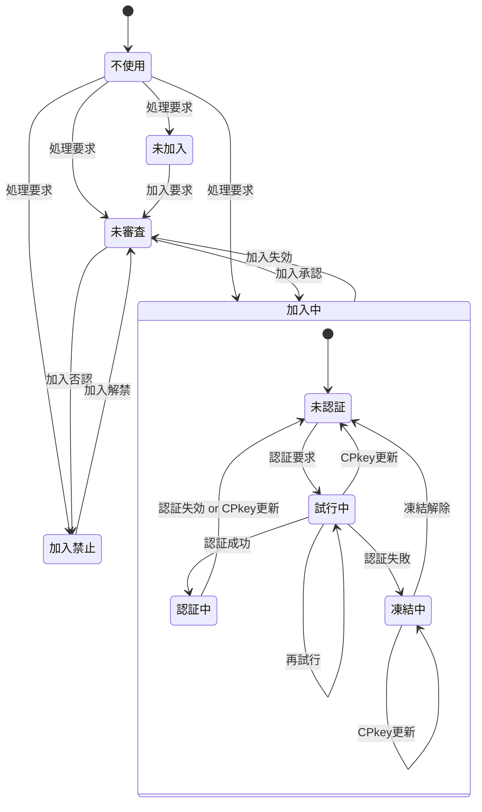

[総説](spec.md) | [authClient](authClient.md) | [authServer](authServer.md) | [クラス一覧](classes.md#list) | [JSLib](JSLib.md)

# Member クラス仕様書

## 🧭 概要

メンバ一覧シートに対応したメンバ単位の管理情報

- 'Member'はGoogle SpreadSheet上でメンバ(アカウント)情報・状態を一元的に管理するためのクラスです。
- 加入・ログイン・パスコード試行・デバイス別公開鍵(CPkey)管理などの状態を統一的に扱います。
- マルチデバイス利用を前提とし、memberListスプレッドシートの1行を1メンバとして管理します。

### 設計方針

#### 状態遷移図

| No | 状態 | 説明 | SPkey | CPkey | memberId/メンバ名 | 無権限関数 | 要権限関数 |
| --: | :-- | :-- | :-- | :-- | :-- | :-- | :-- |
| 1 | 不使用 | Auth不使用のコンテンツのみ表示 | 未取得 | 未生成(※1) | 未登録(※1) | 実行不可 | 実行不可 |
| 2 | 未加入 | memberListにUUIDのmemberId/メンバ名で仮登録 | 取得済 | 生成済 | 仮登録(UUID) | 実行可 | 実行不可 |
| 3 | 未審査 | memberListに本来のmemberId/メンバ名で登録済だが管理者による加入認否が未決定 | 取得済 | 生成済 | 本登録 | 実行可 | 実行不可 |
| 4 | 加入中 | 管理者により加入が承認された状態 | 取得済 | 生成済 | 本登録 | 実行可 | 実行不可 |
| 4.1 | 未認証 | 未認証(未ログイン)で権限が必要な処理は行えない状態 | 取得済 | 生成済 | 本登録 | 実行可 | 実行不可 |
| 4.2 | 試行中 | パスコードによる認証を試行している状態 | 取得済 | 生成済 | 本登録 | 実行可 | 実行不可 |
| 4.3 | 認証中 | 認証が通り、ログインして認証が必要な処理も行える状態 | 取得済 | 生成済 | 本登録 | 実行可 | 実行可 |
| 4.4 | 凍結中 | 規定の試行回数連続して認証に失敗し、再認証要求が禁止された状態 | 取得済 | 生成済 | 本登録 | 実行可 | 実行不可 |
| 5 | 加入禁止 | 管理者により加入が否認された状態 | 取得済 | 生成済 | 本登録 | 実行可 | 実行不可 |

- [クラス図](classes.md#member_classdiagram)

### 🧩 内部構成

🔢 Member メンバ一覧

| 項目名 | 任意 | データ型 | 既定値 | 説明 | 備考 |
| :-- | :-- | :-- | :-- | :-- | :-- |
| memberId | ⭕ | string | UUID | メンバの識別子 | メールアドレス | 
| name | ⭕ | string | "dummy" | メンバの氏名 |  | 
| status | ⭕ | string | "未加入" | メンバの状態 | 未加入,未審査,審査済,加入中,加入禁止 | 
| log | ⭕ | [MemberLog](MemberLog.md#memberlog_internal) | new MemberLog() | メンバの履歴情報 | シート上はJSON文字列 | 
| profile | ⭕ | [MemberProfile](MemberProfile.md#memberprofile_internal) | new MemberProfile() | メンバの属性情報 | シート上はJSON文字列 | 
| device | ⭕ | MemberDevice[] | 空配列 | デバイス情報 | マルチデバイス対応のため配列。シート上はJSON文字列 | 
| note | ⭕ | string | 空文字列 | 当該メンバに対する備考 |  | 

🧱 Member メソッド一覧

| メソッド名 | 型 | 内容 |
| :-- | :-- | :-- |
| [constructor](#member_constructor) | private | コンストラクタ |
| [getMember](#member_getmember) | public | 指定メンバの情報をmemberListシートから取得 |
| [removeMember](#member_removemember) | public | 登録中メンバをアカウント削除、または加入禁止にする |
| [setMember](#member_setmember) | public | 指定メンバ情報をmemberListシートに保存 |

## 🧱 <a href="#member_method">Member.constructor()</a>

コンストラクタ

### 📥 引数

| 項目名 | 任意 | データ型 | 既定値 | 説明 |
| :-- | :--: | :-- | :-- | :-- |
| config | ❌ | [authServerConfig](authServerConfig.md#authserverconfig_internal) | — | ユーザ指定の設定値 | 

### 🧾 処理手順

- [authServerConfig.memberList](authServerConfig.md#internal)シートが存在しなければシートを新規作成
  - シート上の項目名はMemberクラスのメンバ名
  - 各項目の「説明」を項目名セルのメモとしてセット
- this.log = new [MemberLog()](MemberLog.md#memberlog_constructor)
- this.profile = new [MemberProfile()](MemberProfile.md#memberprofile_constructor)

### 📤 戻り値

  - [Member](Member.md#member_internal): メンバ一覧シートに対応したメンバ単位の管理情報
    | 項目名 | データ型 | 生成時 | 正常終了 |
    | :-- | :-- | :-- | :-- |
    | memberId | string | UUID | — |
    | name | string | "dummy" | — |
    | status | string | "未加入" | — |
    | log | MemberLog | new MemberLog() | — |
    | profile | MemberProfile | new MemberProfile() | — |
    | device | MemberDevice[] | 空配列 | — |
    | note | string | 空文字列 | — |

## 🧱 <a href="#member_method">Member.getMember()</a>

指定メンバの情報をmemberListシートから取得

### 📞 呼出元

- [Member.removeMember()](Member.md#member_getmember)

### 📥 引数

| 項目名 | 任意 | データ型 | 既定値 | 説明 |
| :-- | :--: | :-- | :-- | :-- |
| memberId | ❌ | string | — | ユーザ識別子(メールアドレス) | 

### 🧾 処理手順

- JSON文字列の項目はオブジェクト化(Member.log, Member.profile, Member.device)
- memberIdがmemberListシート登録済なら「登録済」、未登録なら「未登録」パターンを返す

### 📤 戻り値

  - [authResponse](authResponse.md#authresponse_internal): 暗号化前の処理結果
    | 項目名 | データ型 | 生成時 | 登録済 | 未登録 |
    | :-- | :-- | :-- | :-- | :-- |
    | timestamp | number | Date.now() | — | — |
    | result | string | normal | **"normal"** | **"fatal"** |
    | message | string | 【任意】 | — | **not exists** |
    | request | authRequest | 【任意】 | {memberId:引数のmemberId} | {memberId:引数のmemberId} |
    | response | any | 【任意】 | **Member(シート)** | — |

## 🧱 <a href="#member_method">Member.removeMember()</a>

登録中メンバをアカウント削除、または加入禁止にする

- memberListシートのGoogle Spreadのメニューから管理者が実行することを想定

### 📥 引数

| 項目名 | 任意 | データ型 | 既定値 | 説明 |
| :-- | :--: | :-- | :-- | :-- |
| memberId | ❌ | string | — | ユーザ識別子 | 
| physical | ⭕ | boolean | false | 物理削除ならtrue、論理削除ならfalse | 

### 🧾 処理手順

- 処理開始日時を記録("const start = Date.now()")
- [getMember](#member_getmember)で当該メンバのMemberを取得
- 物理削除の場合("physical === true")
  - シート上に確認のダイアログを表示、OKが選択されたら当該メンバの行をmemberListから削除
  - 監査ログに「物理削除」を記録([authAuditLog.log](authAuditLog.md#authauditlog_log))
  - 戻り値「物理削除」を返して終了
- 論理削除の場合("physical === false")
  - 既に「加入禁止」なら戻り値「加入禁止」を返して終了
  - シート上に確認のダイアログを表示、キャンセルが選択されたら戻り値「キャンセル」を返して終了
  - [MemberLog.prohibitJoining](MemberLog.md#memberlog_prohibitjoining)で加入禁止状態に変更
  - [setMember](#member_setmember)にMemberを渡してmemberListを更新
  - 監査ログに「論理削除」を記録([authAuditLog.log](authAuditLog.md#authauditlog_log))
  - 戻り値「論理削除」を返して終了
- 監査ログ出力項目

  - [authAuditLog](authAuditLog.md#authauditlog_internal): authServerの監査ログ
    | 項目名 | データ型 | 生成時 | 物理削除 | 論理削除 |
    | :-- | :-- | :-- | :-- | :-- |
    | timestamp | string | Date.now() | — | — |
    | duration | number | 【必須】 | Date.now() - start | Date.now() - start |
    | memberId | string | 【必須】 | this.memberId | this.memberId |
    | deviceId | string | 【任意】 | — | — |
    | func | string | 【必須】 | **"remove(physical)"** | **"remove(logical)"** |
    | result | string | normal | — | — |
    | note | string | 【必須】 | 削除前Member(JSON) | 削除前Member(JSON) |

### 📤 戻り値

  - [authResponse](authResponse.md#authresponse_internal): 暗号化前の処理結果
    | 項目名 | データ型 | 生成時 | 物理削除 | 加入禁止 | キャンセル | 論理削除 |
    | :-- | :-- | :-- | :-- | :-- | :-- | :-- |
    | timestamp | number | Date.now() | — | — | — | — |
    | result | string | normal | **"normal"** | **"warning"** | **"warning"** | **"normal"** |
    | message | string | 【任意】 | **"physically removed"** | **"already banned from joining"** | **"logical remove canceled"** | **"logically removed"** |
    | request | authRequest | 【任意】 | {memberId, physical} | {memberId, physical} | {memberId, physical} | {memberId, physical} |
    | response | any | 【任意】 | — | **更新前のMember** | **更新前のMember** | **更新後のMember** |

## 🧱 <a href="#member_method">Member.setMember()</a>

指定メンバ情報をmemberListシートに保存

登録済メンバの場合は更新、未登録の場合は新規登録(追加)を行う

### 📞 呼出元

- [Member.removeMember()](Member.md#member_setmember)

### 📥 引数

| 項目名 | 任意 | データ型 | 既定値 | 説明 |
| :-- | :--: | :-- | :-- | :-- |
| arg | ❌ | [Member](Member.md#member_internal) \| [authRequest](authRequest.md#authrequest_internal) | — | 既存メンバ(Member)または新規登録要求 | 

### 🧾 処理手順

いまここ：Member.log/profile/deviceのメソッドにリンクが張られるよう修正
- 引数がMember型の場合、既存メンバの更新と看做して以下の処理を行う
  1. memberListシートに存在しない場合(エラー)、以下の戻り値①を返して終了
  2. [judgeStatus](Member.md#member_judgestatus)でstatusを最新にしておく
  3. JSON文字列の項目は文字列化した上でmemberListシートの該当者を更新(Member.log/profile/device)
  4. 戻り値②を返して終了
- 引数がauthRequestの場合、新規登録要求と看做して以下の処理を行う
  1. memberListシートに存在する場合(エラー)、戻り値③を返して終了
  2. authRequestが新規登録要求か確認
    - 確認項目
      - authRequest.func ==== '::newMember::'
      - authRequest.arguments[0]にメンバの氏名(文字列)が入っている
      - memberId, deviceId, signatureが全て設定されている
    - 確認項目の全条件が満たされ無かった場合(エラー)、戻り値④を返して終了
  3. Memberの新規作成
    - Member.memberId = authRequest.memberId
    - Member.name = authRequest.arguments[0]
    - Member.device = [new MemberDevice](MemberDevice.md#memberdevice_constructor)({deviceId:authRequest.deviceId, CPkey:authRequest.signature})
    - Member.log = [new MemberLog](MemberLog.md#memberlog_constructor)()
    - [judgeStatus](Member.md#member_judgestatus)にMemberを渡し、状態を設定
  4. JSON文字列の項目は文字列化した上でmemberListシートに追加(Member.log/profile/device)
  5. 本番運用中なら加入要請メンバへの通知 
    [authServerConfig.underDev.sendInvitation](authServerConfig.md#authserverconfig_internal) === falseなら開発中なので通知しない
  6. 戻り値⑤を返して終了

### 📤 戻り値

  - [authResponse](authResponse.md#authresponse_internal): 暗号化前の処理結果
    | 項目名 | データ型 | 生成時 | ① | ② | ③ | ④ | ⑤ |
    | :-- | :-- | :-- | :-- | :-- | :-- | :-- | :-- |
    | timestamp | number | Date.now() | — | — | — | — | — |
    | result | string | normal | **"fatal"** | **"normal"** | **"fatal"** | **"fatal"** | **"normal"** |
    | message | string | 【任意】 | **"not exist"** | **"updated"** | **"already exist"** | **"Invalid registration request"** | **"appended"** |
    | request | authRequest | 【任意】 | arg | arg | arg | arg | arg |
    | response | any | 【任意】 | — | **Member(更新済)** | — | — | **Member(新規作成)** |