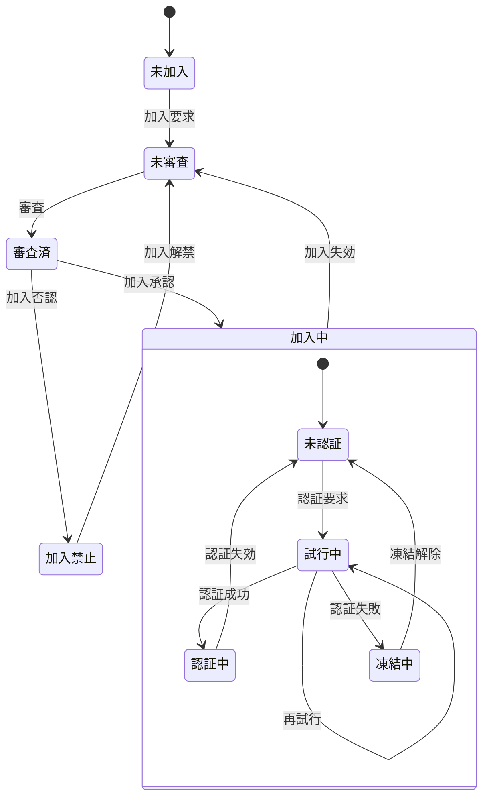

# Member クラス 仕様書

## 🧭 概要

- Member は サーバ側 でメンバ情報を一元的に管理するクラスです。
- 加入・ログイン・パスコード試行・デバイス別CPkey管理などの状態を統一的に扱います。
- マルチデバイス利用を前提とし、memberListスプレッドシートの1行を1メンバとして管理します。

### 状態遷移



No | 状態 | 説明
:-- | :-- | :--
1 | 未加入 | memberList未登録
2 | 未審査 | memberList登録済だが、管理者による加入認否が未決定
3 | 審査済 | 管理者による加入認否が決定済
4 | 加入中 | 管理者により加入が承認された状態
4.1 | 未認証 | 認証(ログイン)不要の処理しか行えない状態
4.2 | 試行中 | パスコードによる認証を試行している状態
4.3 | 認証中 | 認証が通り、ログインして認証が必要な処理も行える状態
4.4 | 凍結中 | 規定の試行回数連続して認証に失敗し、再認証要求が禁止された状態
5 | 加入禁止 | 管理者により加入が否認された状態

※ 下表内の変数名は`Member.log`のメンバ名

状態 | 判定式
:-- | :--
未加入 | 加入要求をしたことが無い<br>joiningRequest === 0
加入禁止 | 加入禁止されている<br>Date.now() <= unfreezeDenial
未審査 | 管理者の認否が未決定<br>approval === 0 && denial === 0
認証中 | 加入承認済かつ認証有効期限内<br>0 < approval && Date.now() ≦ loginExpiration
凍結中 | 加入承認済かつ凍結期間内<br>0 < approval && loginFailure　<= Date.now() && Date.now() <= unfreezeLogin
未認証 | 加入承認後認証要求されたことが無い<br>0 < approval && loginRequest === 0
試行中 | 加入承認済かつ認証要求済(かつ認証中でも凍結中でもない)<br>0 < approval && 0 < loginRequest
審査済 | 加入認否決定済<br>0 < approval || 0 < denial

- 上から順に判定する(下順位の状態は上順位の何れにも該当しない)

## 🧩 内部構成(クラス変数)

### Member

<a name="Member"></a>

メンバ一覧(アカウント管理表)上のメンバ単位の管理情報

| No | 項目名 | 任意 | データ型 | 既定値 | 説明 |
| --: | :-- | :--: | :-- | :-- | :-- |
| 1 | memberId | ❌ | string | — | メンバの識別子(=メールアドレス) |
| 2 | name | ❌ | string | — | メンバの氏名 |
| 3 | log | ❌ | string | — | メンバの履歴情報(MemberLog)を保持するJSON文字列 |
| 4 | profile | ❌ | string | — | メンバの属性情報(MemberProfile)を保持するJSON文字列 |
| 5 | device | ❌ | string | — | マルチデバイス対応のためのデバイス情報(MemberDevice[])を保持するJSON文字列 |
| 6 | note | ⭕ | string | — | 当該メンバに対する備考 |

### MemberLog

<a name="MemberLog"></a>

メンバの各種要求・状態変化の時刻

| No | 項目名 | 任意 | データ型 | 既定値 | 説明 |
| --: | :-- | :--: | :-- | :-- | :-- |
| 1 | joiningRequest | ❌ | number | — | 加入要求日時。加入要求をサーバ側で受信した日時 |
| 2 | approval | ❌ | number | — | 加入承認日時。管理者がmemberList上で加入承認処理を行った日時。値設定は加入否認日時と択一 |
| 3 | denial | ❌ | number | — | 加入否認日時。管理者がmemberList上で加入否認処理を行った日時。値設定は加入承認日時と択一 |
| 4 | loginRequest | ❌ | number | — | 認証要求日時。未認証メンバからの処理要求をサーバ側で受信した日時 |
| 5 | loginSuccess | ❌ | number | — | 認証成功日時。未認証メンバの認証要求が成功した最新日時 |
| 6 | loginExpiration | ❌ | number | — | 認証有効期限。認証成功日時＋認証有効時間 |
| 7 | loginFailure | ❌ | number | — | 認証失敗日時。未認証メンバの認証要求失敗が確定した最新日時 |
| 8 | unfreezeLogin | ❌ | number | — | 認証無効期限。認証失敗日時＋認証凍結時間 |
| 9 | joiningExpiration | ❌ | number | — | 加入有効期限。加入承認日時＋加入有効期間 |
| 10 | unfreezeDenial | ❌ | number | — | 加入禁止期限。加入否認日時＋加入禁止期間 |

### MemberProfile

<a name="MemberProfile"></a>

メンバの属性情報(Member.profile)

| No | 項目名 | 任意 | データ型 | 既定値 | 説明 |
| --: | :-- | :--: | :-- | :-- | :-- |
| 1 |  | ❌ | string | — |  |

### MemberDevice

<a name="MemberDevice"></a>

メンバが使用する通信機器の情報(マルチデバイス対応)

| No | 項目名 | 任意 | データ型 | 既定値 | 説明 |
| --: | :-- | :--: | :-- | :-- | :-- |
| 1 | deviceId | ❌ | string | — | デバイスの識別子。UUID |
| 2 | CPkey | ❌ | string | — | メンバの公開鍵 |
| 3 | CPkeyUpdated | ❌ | string | — | 最新のCPkeyが登録された日時 |
| 4 | trial | ❌ | string | — | ログイン試行関連情報オブジェクト(MemberTrial[])のJSON文字列 |

### MemberTrial

<a name="MemberTrial"></a>

ログイン試行単位の試行情報(Member.trial)

| No | 項目名 | 任意 | データ型 | 既定値 | 説明 |
| --: | :-- | :--: | :-- | :-- | :-- |
| 1 | passcode | ❌ | string | — | 設定されているパスコード |
| 2 | created | ❌ | number | — | パスコード生成日時(≒パスコード通知メール発信日時) |
| 3 | log | ⭕ | MemberTrialLog[] |  | 試行履歴。常に最新が先頭(unshift()使用) |

### MemberTrialLog

<a name="MemberTrialLog"></a>

MemberTrial.logに記載される、パスコード入力単位の試行記録

| No | 項目名 | 任意 | データ型 | 既定値 | 説明 |
| --: | :-- | :--: | :-- | :-- | :-- |
| 1 | entered | ❌ | string | — | 入力されたパスコード |
| 2 | result | ❌ | number | — | -1:恒久的エラー, 0:要リトライ, 1:パスコード一致 |
| 3 | message | ❌ | string | — | エラーメッセージ |
| 4 | timestamp | ❌ | number | — | 判定処理日時 |

## 🧱 constructor()

### 概要


- 指定されたmemberIdのインスタンスを返す
- deviceIdの指定が有った場合は該当しないMemberDeviceオブジェクトは削除

```js
/**
 * @param {string} memberId
 * @param {string} [deviceId]
 * @returns {Member}
 */
```

## 🧱 getStatus()

### 概要


### 📤 入力項目

### 📥 出力項目
