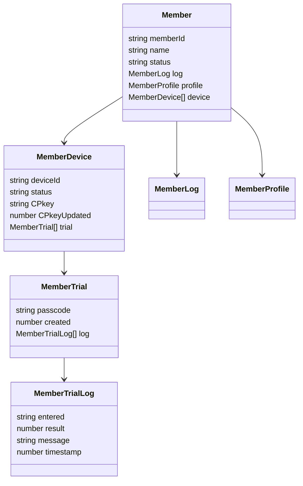
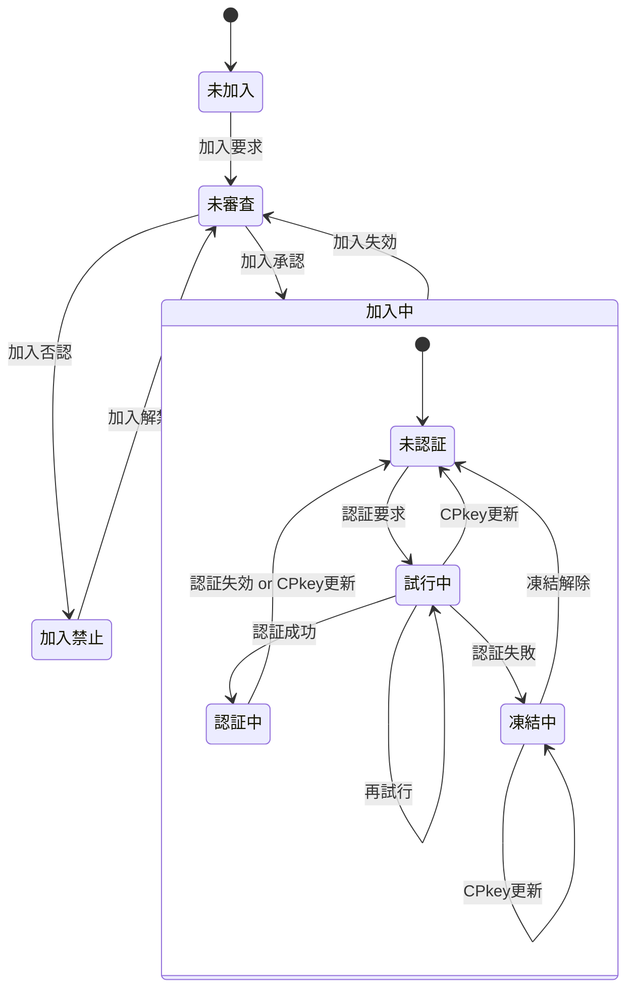

# Member クラス 仕様書

## 🧭 概要

- 'Member'はGoogle SpreadSheet上でメンバ(アカウント)情報・状態を一元的に管理するためのクラスです。
- 加入・ログイン・パスコード試行・デバイス別公開鍵(CPkey)管理などの状態を統一的に扱います。
- マルチデバイス利用を前提とし、memberListスプレッドシートの1行を1メンバとして管理します。
- 日時は全てUNIX時刻(number型)。比較も全てミリ秒単位で行う

## 🧩 内部構成(クラス変数)



### Member

<a name="Member"></a>

メンバ一覧(アカウント管理表)上のメンバ単位の管理情報

| No | 項目名 | 任意 | データ型 | 既定値 | 説明 |
| --: | :-- | :--: | :-- | :-- | :-- |
| 1 | memberId | ❌ | string |  | メンバの識別子(=メールアドレス) |
| 2 | name | ❌ | string |  | メンバの氏名 |
| 3 | status | ⭕ | string | 未加入 | メンバの状態。未加入,未審査,審査済,加入中,加入禁止 |
| 4 | log | ⭕ | string | new MemberLog() | メンバの履歴情報(MemberLog)を保持するJSON文字列 |
| 5 | profile | ⭕ | string | new MemberProfile() | メンバの属性情報(MemberProfile)を保持するJSON文字列 |
| 6 | device | ❌ | string |  | マルチデバイス対応のためのデバイス情報(MemberDevice[])を保持するJSON文字列 |
| 7 | note | ⭕ | string |  | 当該メンバに対する備考 |

### MemberLog

<a name="MemberLog"></a>

メンバの各種要求・状態変化の時刻

| No | 項目名 | 任意 | データ型 | 既定値 | 説明 |
| --: | :-- | :--: | :-- | :-- | :-- |
| 1 | joiningRequest | ⭕ | number | 0 | 加入要求日時。加入要求をサーバ側で受信した日時 |
| 2 | approval | ⭕ | number | 0 | 加入承認日時。管理者がmemberList上で加入承認処理を行った日時。値設定は加入否認日時と択一 |
| 3 | denial | ⭕ | number | 0 | 加入否認日時。管理者がmemberList上で加入否認処理を行った日時。値設定は加入承認日時と択一 |
| 4 | loginRequest | ⭕ | number | 0 | 認証要求日時。未認証メンバからの処理要求をサーバ側で受信した日時 |
| 5 | loginSuccess | ⭕ | number | 0 | 認証成功日時。未認証メンバの認証要求が成功した最新日時 |
| 6 | loginExpiration | ⭕ | number | 0 | 認証有効期限。認証成功日時＋認証有効時間 |
| 7 | loginFailure | ⭕ | number | 0 | 認証失敗日時。未認証メンバの認証要求失敗が確定した最新日時 |
| 8 | unfreezeLogin | ⭕ | number | 0 | 認証無効期限。認証失敗日時＋認証凍結時間 |
| 9 | joiningExpiration | ⭕ | number | 0 | 加入有効期限。加入承認日時＋加入有効期間 |
| 10 | unfreezeDenial | ⭕ | number | 0 | 加入禁止期限。加入否認日時＋加入禁止期間 |

### MemberProfile

<a name="MemberProfile"></a>

メンバの属性情報(Member.profile)

| No | 項目名 | 任意 | データ型 | 既定値 | 説明 |
| --: | :-- | :--: | :-- | :-- | :-- |
| 1 | authority | ⭕ | number | 1 | メンバの持つ権限。authServerConfig.func.authorityとの論理積>0なら当該関数実行権限ありと看做す |

### MemberDevice

<a name="MemberDevice"></a>

メンバが使用する通信機器の情報(マルチデバイス対応)

| No | 項目名 | 任意 | データ型 | 既定値 | 説明 |
| --: | :-- | :--: | :-- | :-- | :-- |
| 1 | deviceId | ❌ | string |  | デバイスの識別子。UUID |
| 2 | status | ⭕ | string | 未認証 | デバイスの状態。未認証,認証中,試行中,凍結中 |
| 3 | CPkey | ❌ | string |  | メンバの公開鍵 |
| 4 | CPkeyUpdated | ⭕ | number | Date.now() | 最新のCPkeyが登録された日時 |
| 5 | trial | ⭕ | string |  | ログイン試行関連情報オブジェクト(MemberTrial[])。シート保存時はJSON文字列 |

### MemberTrial

<a name="MemberTrial"></a>

ログイン試行単位の試行情報(Member.trial)

| No | 項目名 | 任意 | データ型 | 既定値 | 説明 |
| --: | :-- | :--: | :-- | :-- | :-- |
| 1 | passcode | ⭕ | string |  | 設定されているパスコード。最初の認証試行で作成 |
| 2 | created | ⭕ | number | Date.now() | パスコード生成日時(≒パスコード通知メール発信日時) |
| 3 | log | ⭕ | MemberTrialLog[] |  | 試行履歴。常に最新が先頭(unshift()使用)。保持上限はauthServerConfig.trial.generationMaxに従い、上限超過時は末尾から削除する。 |

### MemberTrialLog

<a name="MemberTrialLog"></a>

MemberTrial.logに記載される、パスコード入力単位の試行記録

| No | 項目名 | 任意 | データ型 | 既定値 | 説明 |
| --: | :-- | :--: | :-- | :-- | :-- |
| 1 | entered | ❌ | string |  | 入力されたパスコード |
| 2 | result | ❌ | number |  | -1:恒久的エラー(再試行不可), 0:要リトライ(再試行可), 1:成功(パスコード一致) |
| 3 | message | ❌ | string |  | エラーメッセージ |
| 4 | timestamp | ❌ | number |  | 判定処理日時 |

## 🧱 constructor()

- 引数は`authServerConfig`
- `authServerConfig.memberList`シートが存在しなければシートを新規作成
  - 項目名はMemberクラスのメンバ名
  - 各項目の「説明」を項目名セルのメモとしてセット

#### authConfig

<a name="authConfig"></a>

- authClient/authServer共通で使用される設定値。
- authClientConfig, authServerConfigの親クラス

| No | 項目名 | 任意 | データ型 | 既定値 | 説明 |
| --: | :-- | :--: | :-- | :-- | :-- |
| 1 | systemName | ⭕ | string | auth | システム名 |
| 2 | adminMail | ❌ | string |  | 管理者のメールアドレス |
| 3 | adminName | ❌ | string |  | 管理者名 |
| 4 | allowableTimeDifference | ⭕ | number | 120000 | クライアント・サーバ間通信時の許容時差。既定値は2分 |
| 5 | RSAbits | ⭕ | string | 2048 | 鍵ペアの鍵長 |
| 6 | underDev | ❌ | Object |  | テスト時の設定 |
| 7 | underDev.isTest | ⭕ | boolean | false | 開発モードならtrue |

#### authServerConfig

<a name="authServerConfig"></a>

authConfigを継承した、authServerでのみ使用する設定値

| No | 項目名 | 任意 | データ型 | 既定値 | 説明 |
| --: | :-- | :--: | :-- | :-- | :-- |
| 1 | memberList | ⭕ | string | memberList | memberListシート名 |
| 2 | defaultAuthority | ⭕ | number | 1 | 新規加入メンバの権限の既定値 |
| 3 | memberLifeTime | ⭕ | number | 31536000000 | 加入有効期間(=メンバ加入承認後の有効期間)。既定値は1年 |
| 4 | prohibitedToJoin | ⭕ | number | 259200000 | 加入禁止期間(=管理者による加入否認後、再加入申請が自動的に却下される期間)。既定値は3日 |
| 5 | loginLifeTime | ⭕ | number | 86400000 | 認証有効時間(=ログイン成功後の有効期間、CPkeyの有効期間)。既定値は1日 |
| 6 | loginFreeze | ⭕ | number | 600000 | 認証凍結時間(=認証失敗後、再認証要求が禁止される期間)。既定値は10分 |
| 7 | requestIdRetention | ⭕ | number | 300000 | 重複リクエスト拒否となる時間。既定値は5分 |
| 8 | errorLog | ⭕ | string | errorLog | エラーログのシート名 |
| 9 | storageDaysOfErrorLog | ⭕ | number | 604800000 | 監査ログの保存日数。単位はミリ秒。既定値は7日分 |
| 10 | auditLog | ⭕ | string | auditLog | 監査ログのシート名 |
| 11 | storageDaysOfAuditLog | ⭕ | number | 604800000 | 監査ログの保存日数。単位はミリ秒。既定値は7日分 |
| 12 | func | ❌ | Object.<string,Object> |  | サーバ側の関数マップ<br>例：{registerMember:{authority:0b001,do:m=>register(m)},approveMember:{authority:0b100,do:m=>approve(m)}} |
| 13 | func.authority | ⭕ | number | 1 | サーバ側関数毎に設定される当該関数実行のために必要となるユーザ権限,`Member.profile.authority & authServerConfig.func.authority > 0`なら実行可とする。 |
| 14 | func.do | ❌ | Function |  | 実行するサーバ側関数 |
| 15 | trial | ❌ | Object |  | ログイン試行関係の設定値 |
| 16 | trial.passcodeLength | ⭕ | number | 6 | パスコードの桁数 |
| 17 | trial.maxTrial | ⭕ | number | 3 | パスコード入力の最大試行回数 |
| 18 | trial.passcodeLifeTime | ⭕ | number | 600000 | パスコードの有効期間。既定値は10分 |
| 19 | trial.generationMax | ⭕ | number | 5 | ログイン試行履歴(MemberTrial)の最大保持数。既定値は5世代 |
| 20 | underDev.sendPasscode | ⭕ | boolean | false | 開発中、パスコード通知メール送信を抑止するならtrue |
| 21 | underDev.sendInvitation | ⭕ | boolean | false | 開発中、加入承認通知メール送信を抑止するならtrue |

## 🧱 getMember()

指定メンバの情報をmemberListシートから取得

- 引数は`memberId`
- 戻り値は`authResponse`
  - `authResponse.request` = `{memberId:引数のmemberId}`
  - `authResponse.response` = memberListシートから取得した`Member`
- memberIdがmemberListシート未登録<br>
  ⇒ `{result:'fatal',message:'not exists',response:undefined}`
- JSON文字列の項目はオブジェクト化(Member.log, Member.profile, Member.device)

## 🧱 setMember()

- 指定メンバ情報をmemberListシートに保存。
- 登録済メンバの場合は更新、未登録の場合は新規登録(追加)を行う

### 登録済メンバの更新

引数が`Member`の場合、以下の処理を行う。

1. memberListシートに存在しない場合、以下の`authResponse`を返して終了
  - `authResponse.result` = 'fatal'
  - `authResponse.message` = 'not exist'
  - `authResponse.request` = 引数で渡された`Member`
  - `authResponse.response` = 'undefined'
2. judgeStatusでstatusを最新にしておく
3. JSON文字列の項目は文字列化した上でmemberListシートの該当者を更新(`Member.log/profile/device`)
4. 以下の`authResponse`を返して終了
  - `authResponse.result` = 'normal'
  - `authResponse.message` ='updated'
  - `authResponse.request` = 引数で渡された`Member`
  - `authResponse.response` = judgeStatusでstatusをチェック済の`Member`

### 新規登録メンバの追加

引数が`authRequest`の場合、新規登録要求と看做して以下の処理を行う。

1. memberListシートに存在する場合、以下の`authResponse`を返して終了
  - `authResponse.result` = 'fatal'
  - `authResponse.message` = 'already exist'
  - `authResponse.request` = 引数で渡された`authRequest`
  - `authResponse.response` = 'undefined'
2. authRequestが新規登録要求か確認
  - 確認項目
    - `authRequest.func ==== '::newMember::'`
    - `authRequest.arguments[0]`にメンバの氏名(文字列)が入っている
    - `memberId, deviceId, signature`が全て設定されている
  - 確認項目の全条件が満たされ無かった場合、以下の`authResponse`を返して終了
    - `authResponse.result` = 'fatal'
    - `authResponse.message` = 'Invalid registration request'
    - `authResponse.request` = 引数で渡された`authRequest`
    - `authResponse.response` = 'undefined'
3. `Member`の新規作成
  - `Member.memberId = authRequest.memberId`
  - `Member.name = authRequest.arguments[0]`
  - `Member.device = new MemberDevice({deviceId:authRequest.deviceId, CPkey:authRequest.signature})`
  - `Member.log.joiningRequest`に現在日時を設定
  - judgeStatusメソッドにMemberを渡し、状態を設定
4. JSON文字列の項目は文字列化した上でmemberListシートに追加(`Member.log/profile/device`)
5. 本番運用中なら加入要請メンバへの通知<br>
  `authServerConfig.underDev.sendInvitation === false`なら開発中なので通知しない
6. 以下の`authResponse`を返して終了
  - `authResponse.result` = 'normal'
  - `authResponse.message='appended'`
  - `authResponse.request` = 引数で渡された`authRequest`
  - `authResponse.response` = 新規作成した`Member`

## 🧱 removeMember()

- 登録中メンバをアカウント削除、または加入禁止にする。
- memberListシートのGoogle Spreadのメニューから管理者が実行することを想定。

```js
/**
 * @param {string} memberId
 * @param {boolean} [physical=false] - 物理削除ならtrue、論理削除ならfalse
 * @returns {authResponse}
 */
```

### 物理削除

- auditLogにメンバ削除を記録
  - `authAuditLog.func` = 'physical remove'
  - `authAuditLog.note` = 削除対象メンバの`Member`(JSON)
- シート上に確認のダイアログを表示、OKが選択されたら当該メンバの行をmemberListから削除
- 以下の`authResponse`を返して終了
  - `authResponse.result` = 'normal'
  - `authResponse.message` = 'physically removed'
  - `authResponse.request` = `{memberId, physical}`
  - `authResponse.response` = undefined

### 論理削除

- getMemberメソッドで当該メンバの`Member`を取得
- 既に「加入禁止」なら以下を返して終了
  - `authResponse.result` = 'warning'
  - `authResponse.message` = 'already logically removed'
  - `authResponse.request` = `{memberId, physical}`
  - `authResponse.response` = 更新前の`Member`
- シート上に確認のダイアログを表示、キャンセルが選択されたら以下を返して終了
  - `authResponse.result` = 'warning'
  - `authResponse.message` = 'logically remove canceled'
  - `authResponse.request` = `{memberId, physical}`
  - `authResponse.response` = 更新前の`Member`
- `Member`の以下項目を更新
  - `Member.status` = '加入禁止'
  - `MemberLog.joiningExpiration` = 現在日時(UNIX時刻)
  - `MemberLog.unfreezeDenial` = 現在日時(UNIX時刻)＋authServerConfig.prohibitedToJoin
- setMemberに`Member`を渡してmemberListを更新
- 以下の`authResponse`を返して終了
  - `authResponse.result` = 'normal'
  - `authResponse.message` = 'logically removed'
  - `authResponse.request` = `{memberId, physical}`
  - `authResponse.response` = 更新後の`Member`

## 🧱 restoreMember()

- 加入禁止(論理削除)されているメンバを復活させる。
- memberListシートのGoogle Spreadのメニューから管理者が実行することを想定。

```js
/**
 * @param {string} memberId
 * @param {boolean} [examined=true] - 「(審査済)未認証」にするならtrue「未審査」ならfalse。なお未審査なら改めて審査登録が必要
 * @returns {authResponse}
 */
```

- getMemberメソッドで当該メンバの`Member`を取得
- 状態が「加入禁止」ではないなら以下を返して終了
  - `authResponse.result` = 'warning'
  - `authResponse.message` = 'not logically removed'
  - `authResponse.request` = `{memberId, examined}`
  - `authResponse.response` = 更新前の`Member`
- シート上に確認のダイアログを表示、キャンセルが選択されたら以下を返して終了
  - `authResponse.result` = 'warning'
  - `authResponse.message` = 'restore canceled'
  - `authResponse.request` = `{memberId, examined}`
  - `authResponse.response` = 更新前の`Member`
- `Member`の以下項目を更新
  - `Member.status` = '加入済'
  - `MemberLog.approval` = `examined === true ? Date.now() : 0`
  - `MemberLog.denial` = 0
  - `MemberLog.joiningExpiration` = 現在日時(UNIX時刻)＋authServerConfig.memberLifeTime
  - `MemberLog.unfreezeDenial` = 0
- setMemberに`Member`を渡してmemberListを更新
- 以下の`authResponse`を返して終了
  - `authResponse.result` = 'normal'
  - `authResponse.request` = `{memberId, examined}`
  - `authResponse.response` = 更新後の`Member`

## 🧱 judgeMember()

- 加入審査画面を呼び出し、管理者が記入した結果をmemberListに登録、審査結果をメンバに通知する。
- memberListシートのGoogle Spreadのメニューから管理者が実行することを想定。

```js
/**
 * @param {string} memberId
 * @returns {authResponse}
 */
```

- getMemberメソッドで当該メンバの`Member`を取得
- 状態が「未審査」ではないなら以下を返して終了
  - `authResponse.result` = 'warning'
  - `authResponse.message` = 'not unexamined'
  - `authResponse.request` = memberId
  - `authResponse.response` = 更新前の`Member`
- シート上にmemberId・氏名と「承認」「否認」「取消」ボタンを表示、取消が選択されたら以下を返して終了
  - `authResponse.result` = 'warning'
  - `authResponse.message` = 'examin canceled'
  - `authResponse.request` = memberId
  - `authResponse.response` = 更新前の`Member`
- 「承認」時は`Member`の以下項目を更新
  - `Member.status` = '加入済'
  - `MemberLog.approval` = 現在日時
  - `MemberLog.denial` = 0
  - `MemberLog.joiningExpiration` = 現在日時(UNIX時刻)＋authServerConfig.memberLifeTime
  - `MemberLog.unfreezeDenial` = 0
- 「否認」時は`Member`の以下項目を更新
  - `Member.status` = '加入禁止'
  - `MemberLog.approval` = 0
  - `MemberLog.denial` = 現在日時
  - `MemberLog.joiningExpiration` = 0
  - `MemberLog.unfreezeDenial` = 現在日時＋authServerConfig.prohibitedToJoin
- setMemberに`Member`を渡してmemberListを更新
- 以下の`authResponse`を返して終了
  - `authResponse.result` = 'normal'
  - `authResponse.request` = memberId
  - `authResponse.response` = 更新後の`Member`

## 🧱 unfreeze()

- 指定されたメンバ・デバイスの「凍結中」状態を強制的に解除
- 引数でmemberIdが指定されなかった場合、凍結中デバイス一覧の要求と看做す
- memberListシートのGoogle Spreadのメニューから管理者が実行することを想定

```js
/**
 * @param {string} [memberId]
 * @param {boolean} [deviceId]
 * @returns {authResponse}
 */
```

### 凍結解除

deviceIdの指定が無い場合、memberIdが使用する凍結中デバイス全てを対象とする

- getMemberメソッドで当該メンバの`Member`を取得、対象デバイスが存在しない場合は以下を返す
  - `authResponse.result` = 'warning'
  - `authResponse.message` = 'no frozen devices'
  - `authResponse.request` = memberId
  - `authResponse.response` = 更新前の`Member`
- 対象デバイスそれぞれについて以下項目を更新
  - `MemberDevice.status` = '未認証'
  - `MemberDevice.trial` = 空配列
  - `MemberLog.unfreezeLogin` = 現在日時
- setMemberに`Member`を渡してmemberListを更新
- 以下の`authResponse`を返して終了
  - `authResponse.result` = 'normal'
  - `authResponse.request` = `{memberId,deviceId:[凍結解除したdeviceIdの配列]}`
  - `authResponse.response` = 更新後の`Member`

### 凍結中デバイス一覧

- memberList.deviceから「凍結中」デバイスがある全メンバを抽出
- 以下の`authResponse`を返して終了
  - `authResponse.result` = 'normal'
  - `authResponse.request` = 'list freezing'
  - `authResponse.response` = 「凍結中」デバイスがある全メンバの`Member`配列

## 🧱 judgeStatus()

指定メンバ・デバイスの状態を判定

- 引数は`Member`またはmemberId(文字列)
- 引数がmemberIdだった場合、getMemberメソッドで`Member`を取得
- 後述「状態遷移」に基づき、引数で指定されたメンバおよびデバイス全ての状態を判断
- 戻り値は`authResponse`
  - `authResponse.request` = `{Member:引数のMember,deviceId:引数のdeviceId}`
  - `authResponse.response` = メンバ・デバイスのstatusを更新後の`Member`

### 状態遷移

- メンバの状態遷移
- 下表内の変数名は`MemberLog`のメンバ名



No | 状態 | 説明
:-- | :-- | :--
1 | 未加入 | memberList未登録
2 | 未審査 | memberList登録済だが、管理者による加入認否が未決定
3 | 加入中 | 管理者により加入が承認された状態
3.1 | 未認証 | 認証(ログイン)不要の処理しか行えない状態
3.2 | 試行中 | パスコードによる認証を試行している状態
3.3 | 認証中 | 認証が通り、ログインして認証が必要な処理も行える状態
3.4 | 凍結中 | 規定の試行回数連続して認証に失敗し、再認証要求が禁止された状態
4 | 加入禁止 | 管理者により加入が否認された状態

状態 | 判定式
:-- | :--
未加入 | 加入要求をしたことが無い、または加入期限切れ(失効)<br>joiningRequest === 0 || (0 < approval &&　0 < joiningExpiration && joiningExpiration < Date.now())
加入禁止 | 加入禁止されている<br>0 < denial && Date.now() <= unfreezeDenial
未審査 | 管理者の認否が未決定<br>approval === 0 && denial === 0
認証中 | 加入承認済かつパスコード認証に成功し認証有効期間内の状態<br>0 < approval && Date.now() ≦ loginExpiration
凍結中 | 加入承認済かつ凍結期間内<br>0 < approval && 0 < loginFailure && loginFailure < Date.now() && Date.now() <= unfreezeLogin
未認証 | 加入承認後認証要求されたことが無い<br>0 < approval && loginRequest === 0
試行中 | 加入承認済かつ認証要求済(かつ認証中でも凍結中でもない)<br>0 < approval && 0 < loginRequest && !(0 < loginFailure && loginFailure < Date.now() && Date.now() <= unfreezeLogin)

- 上から順に判定する(下順位の状態は上順位の何れにも該当しない)
- 試行中は「凍結中」「認証中」いずれにも該当しない場合にのみ成立

## 🧱 addTrial()

新しい試行を登録し、メンバにパスコード通知メールを発信

- 引数は`authRequest`、戻り値は`authResponse`
- 状態チェック
  - authRequest.memberIdを基にgetMember()でMemberインスタンスを取得
  - authRequest.deviceIdで対象デバイスを特定
  - 状態が「未認証」以外はエラーを返して終了
    - `authResponse.result` = 'fatal'
    - `authResponse.message` = 'not qualified'
    - `authResponse.request` = 引数で渡された`authRequest`
    - `authResponse.response` = 対象メンバの`Member`
- 新しい試行を登録するに伴い、以下のメンバの値を更新する
  - MemberDevice.status: 未認証 -> 試行中
  - MemberTrial.passcode: '' -> ゼロパディングされたauthServerConfig.trial.passcodeLength桁の乱数
  - MemberTrial.created: 現在日時(UNIX時刻)
  - MemberTrial.log: [] ※空配列
  - MemberLog.loginRequest: 現在日時(UNIX時刻)
- 新しい試行(`authTrial`)をMember.trialの先頭に追加
- ログイン試行履歴の最大保持数を超えた場合、古い世代を削除<br>
  (`Member.trial.length >= authServerConfig.generationMax`)
- 更新後の`Member`を引数にsetMemberを呼び出し、memberListシートを更新
- メンバにパスコード通知メールを発信<br>
  但し`authServerConfig.underDev.sendPasscode === false`なら発信を抑止(∵開発中)
- 以下の`authResponse`を返して終了
  - `authResponse.result` = 'normal'
  - `authResponse.request` = 引数で渡された`authRequest`
  - `authResponse.response` = 更新後の`Member`

## 🧱 checkPasscode()

入力されたパスコードをチェック、Member内部の各種メンバの値を更新の上、チェック結果を返す。

- 引数は`authRequest`、戻り値は`authResponse`
- `authRequest.func='::passcode::'`,`authRequest.arguments=[入力されたパスコード]`
- 状態チェック
  - authRequest.memberIdを基にgetMember()でMemberインスタンスを取得
  - authRequest.deviceIdで対象デバイスを特定
  - 状態が「試行中」以外はエラーを返して終了
- パスコードをチェック、結果(MemberTrialLog)をMemberTrial.logの先頭に追加(unshift())
- パスコードが一致した場合
  - MemberDevice.status: 試行中 -> 認証中
  - MemberLog.loginSuccess: 現在日時(UNIX時刻)
  - MemberLog.loginExpiration: 現在日時＋authServerConfig.loginLifeTime
- パスコードが不一致だった場合
  - 試行回数の上限未満の場合(`MemberTrial.log.length < authServerConfig.trial.maxTrial`)<br>
    ⇒ 変更すべき項目無し
  - 試行回数の上限に達した場合(`MemberTrial.log.length >= authServerConfig.trial.maxTrial`)
    - MemberDevice.status: 試行中 -> 凍結中
    - MemberLog.loginFailure: 現在日時(UNIX時刻)
    - MemberLog.unfreezeLogin: 現在日時＋authServerConfig.loginFreeze
- 更新後の`Member`を引数にsetMemberを呼び出し、memberListシートを更新<br>
  ※ setMember内でjudgeStatusメソッドを呼び出しているので、状態の最新化は担保
- 以下の`authResponse`を返して終了
  - `authResponse.result` = 'normal'
  - `authResponse.message` = MemberDevice.status
  - `authResponse.request` = 引数で渡された`authRequest`
  - `authResponse.response` = 更新後の`Member`
- 後続処理は戻り値(`authResponse.message`)で分岐先処理を判断

## 🧱 reissuePasscode()

パスコードを再発行する

- 引数は`authRequest`、戻り値は`authResponse`
- 状態チェック
  - authRequest.memberIdを基にgetMember()でMemberインスタンスを取得
  - authRequest.deviceIdで対象デバイスを特定
  - 状態が「試行中」かつ`authRequest.func === '::reissue::'`以外はエラーを返して終了
    - `authResponse.result` = 'fatal'
    - `authResponse.message` = 'not qualified'
    - `authResponse.request` = 引数で渡された`authRequest`
    - `authResponse.response` = 対象メンバの`Member`
- 新たなパスコードを生成
- auditLogにパスコード再発行を記録
  - `authAuditLog.func` = 'reissuePasscode'
  - `authAuditLog.note` = 旧パスコード + ' -> ' + 新パスコード
- 現在試行中のMemberTrialを書き換え<br>
  ※ `MemberDevice.status`,`MemberTrial.log`,`MemberLog.loginRequest`は書き換えない(継続使用)
  - `Member.trial[0].passcode` = 新パスコード
  - `Member.trial[0].created` = 現在日時
- 更新後の`Member`を引数にsetMemberを呼び出し、memberListシートを更新
- メンバにパスコード通知メールを発信<br>
  但し`authServerConfig.underDev.sendPasscode === false`なら発信を抑止(∵開発中)
- 以下の`authResponse`を返して終了
  - `authResponse.result` = 'normal'
  - `authResponse.request` = 引数で渡された`authRequest`
  - `authResponse.response` = 更新後の`Member`

## 🧱 updateCPkey()

- 対象メンバ・デバイスの公開鍵を更新する
- 引数チェック
  - 引数は`authRequest`で以下を持つ想定
    - `authRequest.func === '::updateCPkey::'`
    - `authRequest.arguments === 更新後CPkey`
  - 引数(CPkey)がRSAの公開鍵形式か(PEMフォーマットなど)チェック、不適合なら以下を返す
    - `authResponse.result` = 'fatal'
    - `authResponse.message` = 'Invalid public key'
    - `authResponse.request` = 引数で渡された`authRequest`
    - `authResponse.response` = undefined
- 状態チェック
  - authRequest.memberIdを基にgetMember()でMemberインスタンスを取得、
    **取得したMemberインスタンスはupdateCPkey内部のみのローカル変数**とし、以下操作はローカル変数のMemberに対して行う
  - authRequest.deviceIdで対象デバイスを特定
  - 状態が「未認証・試行中・認証中・凍結中」以外はエラーを返して終了
- Memberインスタンス配下の各項目の値を更新
  - MemberDevice.CPkey: 更新後CPkey
  - MemberDevice.CPkeyUpdated: 現在日時
- 状態が「未認証」の場合
  - MemberDevice.status: 変化無し(未認証のまま)
- 状態が「試行中」の場合
  - MemberDevice.status: 試行中 -> 未認証
  - CPkeyが更新されても試行回数はリセットしない
- 状態が「認証中」の場合
  - MemberDevice.status: 認証中 -> 未認証
  - 認証中にCPkeyが更新された場合、再ログインを必要とする
- 状態が「凍結中」の場合
  - MemberDevice.status: 変化無し(凍結中のまま)
  - CPkeyが更新されても凍結中の状態は継続
- judgeStatusメソッドに更新後Memberを渡し、状態を更新した上でmemberListシートを更新
- auditLogにCPkey更新を記録
  - `authAuditLog.func` = 'updateCPkey'
  - `authAuditLog.note` = 旧CPkey + ' -> ' + 新CPkey
- CPkeyを更新するのはmemberListシートのみ。インスタンス化された'Member.device'以下は更新しない<br>
  ※ authServer->authClientに送るencryptedResponseの暗号化は旧CPkeyで行い、authClient側ではauthServer側での処理結果を確認の上、新CPkeyへの置換を行うため
- 以下の`authResponse`を返して終了
  - `authResponse.result` = 'normal'
  - `authResponse.request` = 引数で渡された`authRequest`
  - `authResponse.response` = **更新前**の`Member`

## 外部ライブラリ

- ソース先頭(グローバル領域)に`const dev=devTools()`を挿入

<details><summary>devTools</summary>

```js
/** devTools: 開発支援関係メソッド集
 * @param {Object} option
 * @param {boolean} option.start=true - 開始・終了メッセージの表示
 * @param {boolean} option.arg=true - 開始時に引数を表示
 * @param {boolean} option.step=false - step毎の進捗ログの出力
 */
function devTools(option) {
  let opt = Object.assign({ start: true, arg: true, step: false }, option);
  let seq = 0;  // 関数の呼出順
  let stack = []; // 呼出元関数情報のスタック
  return { changeOption: changeOption, check: check, dump: dump, end: end, error: error, start: start, step: step };

  /** オプションの変更 */
  function changeOption(option) {
    opt = Object.assign(opt, option);
    console.log(`devTools.changeOption result: ${JSON.stringify(opt)}`);
  }
  /** 実行結果の確認
   * - JSON文字列の場合、オブジェクト化した上でオブジェクトとして比較する
   * @param {Object} arg
   * @param {any} arg.asis - 実行結果
   * @param {any} arg.tobe - 確認すべきポイント(Check Point)。エラーの場合、エラーオブジェクトを渡す
   * @param {string} arg.title='' - テストのタイトル(ex. SpreadDbTest.delete.4)
   * @param {Object} [arg.opt] - isEqualに渡すオプション
   * @returns {boolean} - チェック結果OK:true, NG:false
   */
  function check(arg = {}) {
    /** recursive: 変数の内容を再帰的にチェック
     * @param {any} asis - 結果の値
     * @param {any} tobe - 有るべき値
     * @param {Object} opt - isEqualに渡すオプション
     * @param {number} depth=0 - 階層の深さ
     * @param {string} label - メンバ名または添字
     */
    const recursive = (asis, tobe, opt, depth = 0, label = '') => {
      let rv;
      // JSON文字列はオブジェクト化
      asis = (arg => { try { return JSON.parse(arg) } catch { return arg } })(asis);
      // データ型の判定
      let type = String(Object.prototype.toString.call(tobe).slice(8, -1));
      switch (type) {
        case 'Number': if (Number.isNaN(tobe)) type = 'NaN'; break;
        case 'Function': if (!('prototype' in tobe)) type = 'Arrow'; break;
      }
      let indent = '  '.repeat(depth);
      switch (type) {
        case 'Object':
          msg.push(`${indent}${label.length > 0 ? label + ': ' : ''}{`);
          for (let mn in tobe) {
            rv = !Object.hasOwn(asis, mn) ? false // 該当要素が不在
              : recursive(asis[mn], tobe[mn], opt, depth + 1, mn);
          }
          msg.push(`${indent}}`);
          break;
        case 'Array':
          msg.push(`${indent}${label.length > 0 ? label + ': ' : ''}[`);
          for (let i = 0; i < tobe.length; i++) {
            rv = (asis[i] === undefined && tobe[i] !== undefined) ? false // 該当要素が不在
              : recursive(asis[i], tobe[i], opt, depth + 1, String(i));
          }
          msg.push(`${indent}]`);
          break;
        case 'Function': case 'Arrow':
          rv = tobe(asis);  // 合格ならtrue, 不合格ならfalseを返す関数を定義
          msg.push(
            indent + (label.length > 0 ? (label + ': ') : '')
            + (rv ? asis : `[NG] (${tobe.toString()})(${asis}) -> false`)
          );
          break;
        default:
          if (tobe === undefined) {
            rv = true;
          } else {
            rv = isEqual(asis, tobe, opt);
            msg.push(
              indent + (label.length > 0 ? (label + ': ') : '')
              + (rv ? asis : `[NG] ToBe=${tobe}, AsIs=${asis}`)
            );
          }
      }
      return rv;
    }

    // 主処理
    let msg = [];
    let isOK = true;  // チェックOKならtrue

    arg = Object.assign({ msg: '', opt: {} }, arg);
    if (arg.tobe === undefined) {
      // check未指定の場合、チェック省略、結果表示のみ
      msg.push(`===== ${arg.title} Check Result : Not checked`);
    } else {
      // arg.asisとarg.tobeのデータ型が異なる場合、またはrecursiveで不一致が有った場合はエラーと判断
      if (String(Object.prototype.toString.call(arg.asis).slice(8, -1))
        !== String(Object.prototype.toString.call(arg.tobe).slice(8, -1))
        || recursive(arg.asis, arg.tobe, arg.opt) === false
      ) {
        isOK = false;
        msg.unshift(`===== ${arg.title} Check Result : Error`);
      } else {
        msg.unshift(`===== ${arg.title} Check Result : OK`);
      }
    }

    // 引数として渡されたmsgおよび結果(JSON)を先頭に追加後、コンソールに表示
    msg = `::::: Verified by devTools.check\n`
      + `===== ${arg.title} Returned Value\n`
      + JSON.stringify(arg.asis, (k, v) => typeof v === 'function' ? v.toString() : v, 2)
      + `\n\n\n${msg.join('\n')}`;
    if (isOK) console.log(msg); else console.error(msg);
    return isOK;
  }
  /** dump: 渡された変数の内容をコンソールに表示
   * - 引数には対象変数を列記。最後の引数が数値だった場合、行番号と看做す
   * @param {any|any[]} arg - 表示する変数および行番号
   * @returns {void}
   */
  function dump() {
    let arg = [...arguments];
    let line = typeof arg[arg.length - 1] === 'number' ? arg.pop() : null;
    const o = stack[stack.length - 1];
    let msg = (line === null ? '' : `l.${line} `)
      + `::dump::${o.label}.${o.step}`;
    for (let i = 0; i < arg.length; i++) {
      // 対象変数が複数有る場合、Noを追記
      msg += '\n' + (arg.length > 0 ? `${i}: ` : '') + stringify(arg[i]);
    }
    console.log(msg);
  }
  /** end: 正常終了時の呼出元関数情報の抹消＋終了メッセージの表示
   * @param {Object} rt - end実行時に全体に優先させるオプション指定(run time option)
   */
  function end(rt={}) {
    const localOpt = Object.assign({},opt,rt);
    const o = stack.pop();
    if (localOpt.start) console.log(`${o.label} normal end.`);
  }
  /** error: 異常終了時の呼出元関数情報の抹消＋終了メッセージの表示 */
  function error(e) {
    const o = stack.pop();
    // 参考 : e.lineNumber, e.columnNumber, e.causeを試したが、いずれもundefined
    e.message = `[Error] ${o.label}.${o.step}\n${e.message}`;
    console.error(e.message
      + `\n-- footprint\n${o.footprint}`
      + `\n-- arguments\n${o.arg}`
    );
  }
  /** start: 呼出元関数情報の登録＋開始メッセージの表示
   * @param {string} name - 関数名
   * @param {any[]} arg - start呼出元関数に渡された引数([...arguments]固定)
   * @param {Object} rt - start実行時に全体に優先させるオプション指定(run time option)
   */
  function start(name, arg = [], rt={}) {
    const localOpt = Object.assign({},opt,rt);
    const o = {
      class: '',  // nameがクラス名.メソッド名だった場合のクラス名
      name: name,
      seq: seq++,
      step: 0,
      footprint: [],
      arg: [],
    };
    o.sSeq = ('000' + o.seq).slice(-4);
    const caller = stack.length === 0 ? null : stack[stack.length - 1]; // 呼出元
    // nameがクラス名.メソッド名だった場合、クラス名をセット
    if (name.includes('.')) [o.class, o.name] = name.split('.');
    // ラベル作成。呼出元と同じクラスならクラス名は省略
    o.label = `[${o.sSeq}]` + (o.class && (!caller || caller.class !== o.class) ? o.class+'.' : '') + o.name;
    // footprintの作成
    stack.forEach(x => o.footprint.push(`${x.label}.${x.step}`));
    o.footprint = o.footprint.length === 0 ? '(root)' : o.footprint.join(' > ');
    // 引数情報の作成
    if (arg.length === 0) {
      o.arg = '(void)';
    } else {
      for (let i = 0; i < arg.length; i++) o.arg[i] = stringify(arg[i]);
      o.arg = o.arg.join('\n');
    }
    // 作成した呼出元関数情報を保存
    stack.push(o);

    if (localOpt.start) {  // 開始メッセージの表示指定が有った場合
      console.log(`${o.label} start.\n-- footprint\n${o.footprint}`
        + (localOpt.arg ? `\n-- arguments\n${o.arg}` : ''));
    }
  }
  /** step: 呼出元関数の進捗状況の登録＋メッセージの表示 */
  function step(step, msg = '') {
    const o = stack[stack.length - 1];
    o.step = step;
    if (opt.step) console.log(`${o.label} step.${o.step} ${msg}`);
  }
  /** stringify: 変数の内容をラベル＋データ型＋値の文字列として出力
   * @param {any} arg - 文字列化する変数
   * @returns {string}
   */
  function stringify(arg) {
    /** recursive: 変数の内容を再帰的にメッセージ化
     * @param {any} arg - 内容を表示する変数
     * @param {number} depth=0 - 階層の深さ
     * @param {string} label - メンバ名または添字
     */
    const recursive = (arg, depth = 0, label = '') => {
      // データ型の判定
      let type = String(Object.prototype.toString.call(arg).slice(8, -1));
      switch (type) {
        case 'Number': if (Number.isNaN(arg)) type = 'NaN'; break;
        case 'Function': if (!('prototype' in arg)) type = 'Arrow'; break;
      }
      // ラベル＋データ型＋値の出力
      let indent = '  '.repeat(depth);
      switch (type) {
        case 'Object':
          msg.push(`${indent}${label.length > 0 ? label + ': ' : ''}{`);
          for (let mn in arg) recursive(arg[mn], depth + 1, mn);
          msg.push(`${indent}}`);
          break;
        case 'Array':
          msg.push(`${indent}${label.length > 0 ? label + ': ' : ''}[`);
          for (let i = 0; i < arg.length; i++) recursive(arg[i], depth + 1, String(i));
          msg.push(`${indent}]`);
          break;
        default:
          let val = typeof arg === 'function' ? `"${arg.toString()}"` : (typeof arg === 'string' ? `"${arg}"` : arg);
          // Class Sheetのメソッドのように、toStringが効かないnative codeは出力しない
          if (typeof val !== 'string' || val.indexOf('[native code]') < 0) {
            msg.push(`${indent}${label.length > 0 ? label + ': ' : ''}${val}(${type})`);
          }
      }
    }
    const msg = [];
    recursive(arg);
    return msg.join('\n');
  }
}
```

</details>

<details><summary>sendMail</summary>

```js
/** GASからメールを発信する
 * 実行に当たっては権限の承認を必要とする。
 *
 * - [Google App Script メモ（メール送信制限 回避術）](https://zenn.dev/tatsuya_okzk/articles/259203cc416328)
 * - GAS公式[createDraft](https://developers.google.com/apps-script/reference/gmail/gmail-app?hl=ja#createdraftrecipient,-subject,-body,-options)
 *
 * @param {String} recipient - 受信者のアドレス
 * @param {String} subject - 件名
 * @param {String} body - メールの本文
 * @param {Object} options - 詳細パラメータを指定する JavaScript オブジェクト（下記を参照）
 * @param {BlobSource[]} options.attachments - メールと一緒に送信するファイルの配列
 * @param {String} options.bcc - Bcc で送信するメールアドレスのカンマ区切りのリスト
 * @param {String} options.cc - Cc に含めるメールアドレスのカンマ区切りのリスト
 * @param {String} options.from - メールの送信元アドレス。getAliases() によって返される値のいずれかにする必要があります。
 * @param {String} options.htmlBody - 設定すると、HTML をレンダリングできるデバイスは、必須の本文引数の代わりにそれを使用します。メール用にインライン画像を用意する場合は、HTML 本文にオプションの inlineImages フィールドを追加できます。
 * @param {Object} options.inlineImages - 画像キー（String）から画像データ（BlobSource）へのマッピングを含む JavaScript オブジェクト。これは、htmlBody パラメータが使用され、 形式でこれらの画像への参照が含まれていることを前提としています。
 * @param {String} options.name - メールの送信者の名前（デフォルト: ユーザー名）
 * @param {String} options.replyTo - デフォルトの返信先アドレスとして使用するメールアドレス（デフォルト: ユーザーのメールアドレス）
 * @returns {null|Error}
 */
function sendmail(recipient,subject,body,options){
  const v = {whois:'sendmail',rv:null,step:0};
  console.log(`${v.whois} start.`);
  try {

    v.draft = GmailApp.createDraft(recipient,subject,body,options);
    v.draftId = v.draft.getId();
    GmailApp.getDraft(v.draftId).send();

    console.log('Mail Remaining Daily Quota:'+MailApp.getRemainingDailyQuota());

    v.step = 9; // 終了処理
    console.log(`${v.whois} normal end.`);
    return v.rv;

  } catch(e) {
    e.message = `\n${v.whois} abnormal end at step.${v.step}`
    + `\n${e.message}`
    + `\nrecipient=${recipient}`
    + `\nsubject=${subject}`
    + `\nbody=${body}`
    + `\n=options=${JSON.stringify(options)}`;  // 引数
    console.error(`${e.message}\nv=${JSON.stringify(v)}`);
    return e;
  }
}
```

</details>

<details><summary>toLocale</summary>

```js
/** 日時を指定形式の文字列にして返す
 * @param {string|Date} arg=null - 変換元の日時。nullなら現在日時
 * @param {Object} opt - オプション。文字列型ならformat指定と看做す
 * @param {boolean} opt.verbose=false - falseなら開始・終了時のログ出力を抑止
 * @param {string} opt.format='yyyy-MM-ddThh:mm:ss.nnnZ' - 日時を指定する文字列
 *   年:y,月:M,日:d,時:h,分:m,秒:s,ミリ秒:n,タイムゾーン:Z
 * @param {boolean} opt.undecimber=false - "yyyy/13"を期末日として変換するならtrue
 * @param {string} opt.fyEnd="3/31" - 期末日。opt.undecimber=trueなら必須。"\d+\/\d+"形式
 * @param {string} opt.errValue='empty' - 変換不能時の戻り値。※不測のエラーはErrorオブジェクト。
 *   empty:空文字列, error:Errorオブジェクト, null:null値, arg:引数argを無加工で返す
 * @returns {string} 指定形式に変換された文字列。無効な日付なら長さ0の文字列
 *
 * - arg無指定なら現在日時と看做す
 * - optが文字列ならformatと看做す
 * - 「yyyy/13」は期末日に置換
 * - 和暦なら西暦に変換
 *
 * @example
 * ```
 * "1965/9/5"[yy/MM/dd hh:mm:ss.nnn] ⇒ "65/09/05 00:00:00.000"
 * "1965/9/5"[yyyy-MM-dd] ⇒ "1965-09-05"
 * "1965/9/5"[hh:mm] ⇒ "00:00"
 * "1977-03-04"[yy/MM/dd hh:mm:ss.nnn] ⇒ "77/03/04 09:00:00.000"
 * "1977-03-04"[yyyy-MM-dd] ⇒ "1977-03-04"
 * "1977-03-04"[hh:mm] ⇒ "09:00"
 * 1688189258262[yy/MM/dd hh:mm:ss.nnn] ⇒ "23/07/01 14:27:38.262"
 * 1688189258262[yyyy-MM-dd] ⇒ "2023-07-01"
 * 1688189258262[hh:mm] ⇒ "14:27"
 * "Sat Jul 01 2023 14:16:30 GMT+0900"[yy/MM/dd hh:mm:ss.nnn] ⇒ "23/07/01 14:16:30.000"
 * "Sat Jul 01 2023 14:16:30 GMT+0900"[yyyy-MM-dd] ⇒ "2023-07-01"
 * "Sat Jul 01 2023 14:16:30 GMT+0900"[hh:mm] ⇒ "14:16"
 * "12:34"[yy/MM/dd hh:mm:ss.nnn] ⇒ ""
 * "12:34"[yyyy-MM-dd] ⇒ ""
 * "12:34"[hh:mm] ⇒ ""
 * ```
 */
function toLocale(arg=null,opt={}) {
  const v = { whois: 'toLocale', rv: null,
    wareki:{  // 元号の開始年定義
      '明治':1867,'大正':1911,'昭和':1925,'平成':1988,'令和':2018,
      M:1867,T:1911,S:1925,H:1988,R:2018,
    },
    errValues:{ // 変換不能時の戻り値定義
      empty:'',
      error:new Error(`Couldn't convert "${arg}" to date.`),
      null: null,
      arg: arg,
    }
  };
  opt = Object.assign({
    verbose: false,
    format: 'yyyy-MM-ddThh:mm:ss.nnnZ',
    undecimber : false,
    fyEnd: '03/31',
    errValue: 'empty'
  },( typeof opt === 'string' ? {format:opt} : opt));
  dev.start(v.whois, [...arguments], {start:opt.verbose});
  try {

    // -------------------------------------------------------------
    dev.step(1);  // 処理対象をDate型に変換
    // -------------------------------------------------------------
    if( arg === null ){
      dev.step(1.1);  // 無指定なら現在日時
      v.dObj = new Date();
    } else if( whichType(arg,'Date') ){
      dev.step(1.2);  // 日付型はそのまま採用
      v.dObj = arg;
    } else {
      dev.step(1.3);  // その他。和暦は修正(時分秒は割愛)した上でDate型に
      arg = String(arg).replace(/元/,'1');
      v.m = arg.match(/^([^\d]+)(\d+)[^\d]+(\d+)[^\d]+(\d+)/);
      if( v.m ){
        dev.step(1.4);  // 和暦
        v.dObj = new Date(
          v.wareki[v.m[1]] + Number(v.m[2]),
          Number(v.m[3]) - 1,
          Number(v.m[4])
        );
      } else {
        dev.step(1.5);  // その他
        v.dObj = opt.undecimber // trueなら「yyyy/13」は期末日に置換
          ? new Date(arg.replace(/^(\d+)\/13$/,"$1/"+opt.fyEnd))
          : new Date(arg);
      }
      dev.step(1.6);  // 無効な日付ならエラー値を返して終了
      if( isNaN(v.dObj.getTime()) ) return v.errValues[opt.errValue];
    }

    // -------------------------------------------------------------
    dev.step(2);  // 戻り値(文字列)の作成
    // -------------------------------------------------------------
    v.rv = opt.format;  // 戻り値の書式(テンプレート)
    v.local = { // 地方時ベース
      y: v.dObj.getFullYear(),
      M: v.dObj.getMonth()+1,
      d: v.dObj.getDate(),
      h: v.dObj.getHours(),
      m: v.dObj.getMinutes(),
      s: v.dObj.getSeconds(),
      n: v.dObj.getMilliseconds(),
      Z: Math.abs(v.dObj.getTimezoneOffset())
    }
    dev.step(2.1);  // タイムゾーン文字列の作成
    v.local.Z = v.local.Z === 0 ? 'Z'
    : ((v.dObj.getTimezoneOffset() < 0 ? '+' : '-')
    + ('0' + Math.floor(v.local.Z / 60)).slice(-2)
    + ':' + ('0' + (v.local.Z % 60)).slice(-2));

    dev.step(2.2);// 日付文字列作成
    for( v.x in v.local ){
      v.m = v.rv.match(new RegExp(v.x+'+'));
      if( v.m ){
        v.str = v.m[0].length > 1
          ? ('000'+v.local[v.x]).slice(-v.m[0].length)
          : String(v.local[v.x]);
        v.rv = v.rv.replace(v.m[0],v.str);
      }
    }

    dev.end({start:opt.verbose}); // 終了処理
    return v.rv;

  } catch (e) { dev.error(e); return e; }
}
```

</details>

<details><summary>whichType</summary>

```js
/** 変数の型を判定
 *
 * - 引数"is"が指定された場合、判定対象が"is"と等しいかの真偽値を返す。
 *
 * @param {any} arg - 判定対象の変数
 * @param {string} [is] - 想定される型(型名の大文字小文字は意識不要)
 * @returns {string|boolean} - 型の名前。is指定有りなら判定対象が想定型かの真偽値
 *
 * @example
 * ```
 * let a = 10;
 * whichType(a);  // 'Number'
 * whichType(a,'string'); // false
 * ```
 *
 * <b>確認済戻り値一覧</b>
 *
 * オブジェクトは型名が返るので、限定列挙は困難。以下は確認済みの戻り値のみ記載。
 *
 * | 型名 | 戻り値 | 備考 |
 * | :-- | :-- | :-- |
 * | 文字列 | String |  |
 * | 数値 | Number |  |
 * | NaN | NaN |  |
 * | 長整数 | BigInt |  |
 * | 論理値 | Boolean |  |
 * | シンボル | Symbol |  |
 * | undefined | Undefined | 先頭大文字 |
 * | Null | Null |  |
 * | オブジェクト | Object |  |
 * | 配列 | Array |  |
 * | 関数 | Function |  |
 * | アロー関数 | Arrow |  |
 * | エラー | Error | RangeError等も'Error' |
 * | Date型 | Date |  |
 * | Promise型 | Promise |  |
 *
 * - Qiita [JavaScriptの型などの判定いろいろ](https://qiita.com/amamamaou/items/ef0b797156b324bb4ef3)
 *
 */
function whichType(arg,is){
  let rv = String(Object.prototype.toString.call(arg).slice(8,-1));
  switch(rv){
    case 'Number': if(Number.isNaN(arg)) rv = 'NaN'; break;
    case 'Function': if(!('prototype' in arg)) rv = 'Arrow'; break;
  }
  if( typeof is === 'string' ){
    return rv.toLowerCase() === is.toLowerCase();
  } else {
    return rv;
  }
}
```

</details>

<!--
## 🧱 decrypt()メソッド
### 📤 入力項目
### 📥 出力項目

```js
new authResponse({
  timestamp: Date.now(),
  result: , // fatal/warning/normal
  message: , // normal時はundefined
  request: undefined, // type:'authRequest',note:'処理要求オブジェクト'
  response: Member, // fatal/warning時は`undefined`
})
-->
<!--
## 🧱 proto()

### 概要

### 📤 入力項目

### 📥 出力項目
-->
