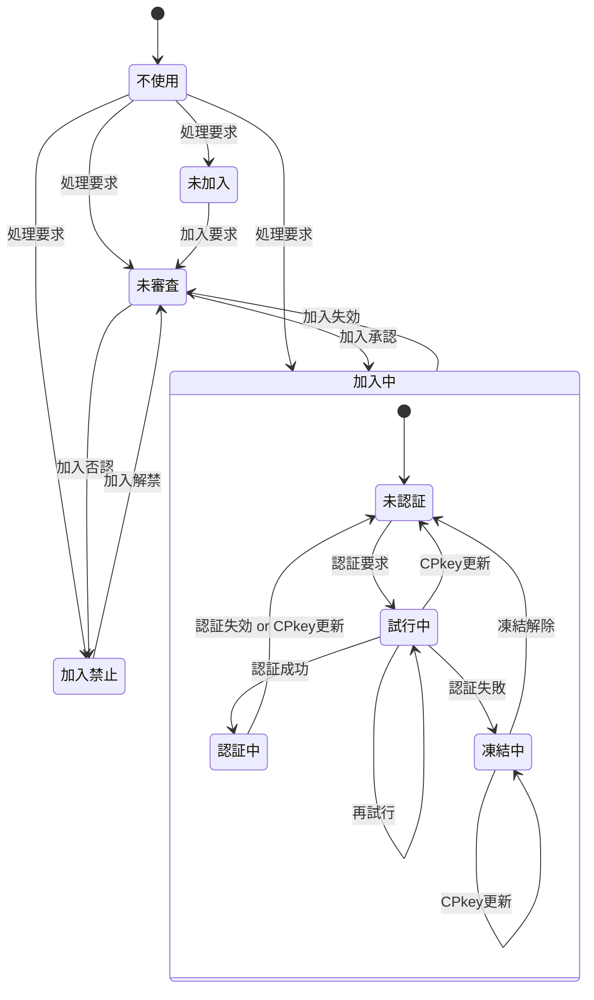

[総説](spec.md) | [authClient](authClient.md) | [authServer](authServer.md) | [クラス一覧](classes.md#list) | [JSLib](JSLib.md)

# Member クラス仕様書

## 🧭 概要

メンバ単位の管理情報

メンバ一覧(アカウント管理表)シート上のメンバ単位の管理情報
### 設計方針

#### 状態遷移図

| No | 状態 | 説明 | SPkey | CPkey | memberId/メンバ名 | 無権限関数 | 要権限関数 |
| --: | :-- | :-- | :-- | :-- | :-- | :-- | :-- |
| 1 | 不使用 | Auth不使用のコンテンツのみ表示 | 未取得 | 未生成(※1) | 未登録(※1) | 実行不可 | 実行不可 |
| 2 | 未加入 | memberListにUUIDのmemberId/メンバ名で仮登録 | 取得済 | 生成済 | 仮登録(UUID) | 実行可 | 実行不可 |
| 3 | 未審査 | memberListに本来のmemberId/メンバ名で登録済だが管理者による加入認否が未決定 | 取得済 | 生成済 | 本登録 | 実行可 | 実行不可 |
| 4 | 加入中 | 管理者により加入が承認された状態 | 取得済 | 生成済 | 本登録 | 実行可 | 実行不可 |
| 4.1 | 未認証 | 未認証(未ログイン)で権限が必要な処理は行えない状態 | 取得済 | 生成済 | 本登録 | 実行可 | 実行不可 |
| 4.2 | 試行中 | パスコードによる認証を試行している状態 | 取得済 | 生成済 | 本登録 | 実行可 | 実行不可 |
| 4.3 | 認証中 | 認証が通り、ログインして認証が必要な処理も行える状態 | 取得済 | 生成済 | 本登録 | 実行可 | 実行可 |
| 4.4 | 凍結中 | 規定の試行回数連続して認証に失敗し、再認証要求が禁止された状態 | 取得済 | 生成済 | 本登録 | 実行可 | 実行不可 |
| 5 | 加入禁止 | 管理者により加入が否認された状態 | 取得済 | 生成済 | 本登録 | 実行可 | 実行不可 |

- [クラス図](classes.md#member_classdiagram)

### 🧩 内部構成

🔢 Member メンバ一覧

| 項目名 | 任意 | データ型 | 既定値 | 説明 | 備考 |
| :-- | :-- | :-- | :-- | :-- | :-- |
| memberId | ⭕ | string | UUID | メンバの識別子 | メールアドレス | 
| name | ⭕ | string | "dummy" | メンバの氏名 |  | 
| status | ⭕ | string | "未加入" | メンバの状態 | 未加入,未審査,審査済,加入中,加入禁止 | 
| log | ⭕ | [MemberLog](MemberLog.md#memberlog_internal) | new MemberLog() | メンバの履歴情報 | シート上はJSON文字列 | 
| profile | ⭕ | [MemberProfile](MemberProfile.md#memberprofile_internal) | new MemberProfile() | メンバの属性情報 | シート上はJSON文字列 | 
| device | ⭕ | MemberDevice[] | 空配列 | デバイス情報 | マルチデバイス対応のため配列。シート上はJSON文字列 | 
| note | ⭕ | string | 空文字列 | 当該メンバに対する備考 |  | 

🧱 Member メソッド一覧

| メソッド名 | 型 | 内容 |
| :-- | :-- | :-- |
| [constructor](#member_constructor) | private | コンストラクタ |
| [getMember](#member_getmember) | public | 指定メンバの情報をmemberListシートから取得 |

## 🧱 <a href="#member_method">Member.constructor()</a>

コンストラクタ

### 📥 引数

| 項目名 | 任意 | データ型 | 既定値 | 説明 |
| :-- | :--: | :-- | :-- | :-- |
| config | ❌ | [authServerConfig](authServerConfig.md#authserverconfig_internal) | — | ユーザ指定の設定値 | 

### 📤 戻り値

- [Member](Member.md#internal): メンバ単位の管理情報
  | 項目名 | データ型 | 生成時 | 正常終了 |
  | :-- | :-- | :-- | :-- |
  | memberId | string | UUID | — |
  | name | string | "dummy" | — |
  | status | string | "未加入" | — |
  | log | MemberLog | new MemberLog() | — |
  | profile | MemberProfile | new MemberProfile() | — |
  | device | MemberDevice[] | 空配列 | — |
  | note | string | 空文字列 | — |

### 🧾 処理手順

- [authServerConfig.memberList](authServerConfig.md#internal)シートが存在しなければシートを新規作成
  - シート上の項目名はMemberクラスのメンバ名
  - 各項目の「説明」を項目名セルのメモとしてセット
- this.log = new [MemberLog()](MemberLog.md#memberlog_constructor)
- this.profile = new [MemberProfile()](MemberProfile.md#memberprofile_constructor)

## 🧱 <a href="#member_method">Member.getMember()</a>

指定メンバの情報をmemberListシートから取得

### 📥 引数

| 項目名 | 任意 | データ型 | 既定値 | 説明 |
| :-- | :--: | :-- | :-- | :-- |
| memberId | ❌ | string | — | ユーザ識別子(メールアドレス) | 

### 📤 戻り値

- [authResponse](authResponse.md#internal): メンバ単位の管理情報
  | 項目名 | データ型 | 生成時 | 登録済 | 未登録 |
  | :-- | :-- | :-- | :-- | :-- |
  | timestamp | number | Date.now() | — | — |
  | result | string | normal | **"normal"** | **"fatal"** |
  | message | string | [任意] | — | **not exists** |
  | request | authRequest | [任意] | {memberId:引数のmemberId} | {memberId:引数のmemberId} |
  | response | any | [任意] | **memberListシートのMemberインスタンス** | — |

### 🧾 処理手順

- JSON文字列の項目はオブジェクト化(Member.log, Member.profile, Member.device)
- memberIdがmemberListシート登録済なら「登録済」、未登録なら「未登録」パターンを返す