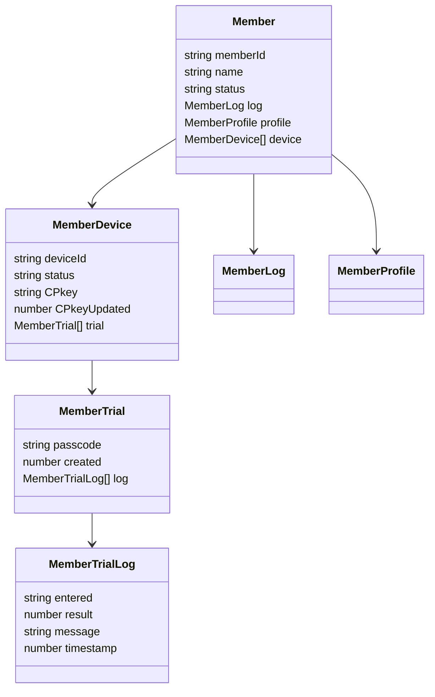
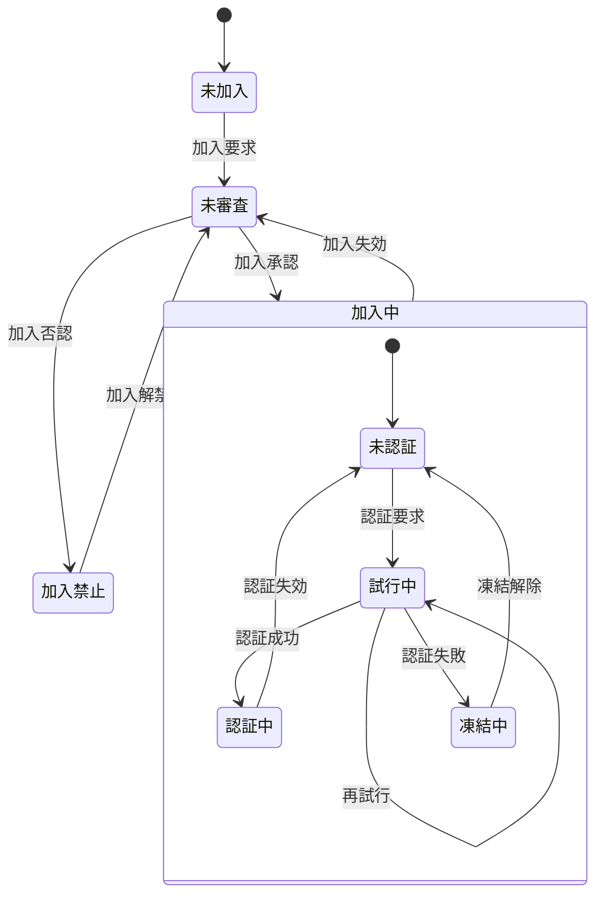

# Member クラス 仕様書

## 🧭 概要

- 'Member'はGoogle SpreadSheet上でメンバ(アカウント)情報・状態を一元的に管理するためのクラスです。
- 加入・ログイン・パスコード試行・デバイス別公開鍵(CPkey)管理などの状態を統一的に扱います。
- マルチデバイス利用を前提とし、memberListスプレッドシートの1行を1メンバとして管理します。
- 日時は全てUNIX時刻(number型)。比較も全てミリ秒単位で行う

## 🧩 内部構成(クラス変数)



### Member

<a name="Member"></a>

メンバ一覧(アカウント管理表)上のメンバ単位の管理情報

| No | 項目名 | 任意 | データ型 | 既定値 | 説明 |
| --: | :-- | :--: | :-- | :-- | :-- |
| 1 | memberId | ❌ | string |  | メンバの識別子(=メールアドレス) |
| 2 | name | ❌ | string |  | メンバの氏名 |
| 3 | status | ❌ | string |  | メンバの状態。未加入,未審査,審査済,加入中,加入禁止 |
| 4 | log | ❌ | string |  | メンバの履歴情報(MemberLog)を保持するJSON文字列 |
| 5 | profile | ❌ | string |  | メンバの属性情報(MemberProfile)を保持するJSON文字列 |
| 6 | device | ❌ | string |  | マルチデバイス対応のためのデバイス情報(MemberDevice[])を保持するJSON文字列 |
| 7 | note | ⭕ | string |  | 当該メンバに対する備考 |

### MemberLog

<a name="MemberLog"></a>

メンバの各種要求・状態変化の時刻

| No | 項目名 | 任意 | データ型 | 既定値 | 説明 |
| --: | :-- | :--: | :-- | :-- | :-- |
| 1 | joiningRequest | ⭕ | number | 0 | 加入要求日時。加入要求をサーバ側で受信した日時 |
| 2 | approval | ⭕ | number | 0 | 加入承認日時。管理者がmemberList上で加入承認処理を行った日時。値設定は加入否認日時と択一 |
| 3 | denial | ⭕ | number | 0 | 加入否認日時。管理者がmemberList上で加入否認処理を行った日時。値設定は加入承認日時と択一 |
| 4 | loginRequest | ⭕ | number | 0 | 認証要求日時。未認証メンバからの処理要求をサーバ側で受信した日時 |
| 5 | loginSuccess | ⭕ | number | 0 | 認証成功日時。未認証メンバの認証要求が成功した最新日時 |
| 6 | loginExpiration | ⭕ | number | 0 | 認証有効期限。認証成功日時＋認証有効時間 |
| 7 | loginFailure | ⭕ | number | 0 | 認証失敗日時。未認証メンバの認証要求失敗が確定した最新日時 |
| 8 | unfreezeLogin | ⭕ | number | 0 | 認証無効期限。認証失敗日時＋認証凍結時間 |
| 9 | joiningExpiration | ⭕ | number | 0 | 加入有効期限。加入承認日時＋加入有効期間 |
| 10 | unfreezeDenial | ⭕ | number | 0 | 加入禁止期限。加入否認日時＋加入禁止期間 |

### MemberProfile

<a name="MemberProfile"></a>

メンバの属性情報(Member.profile)

| No | 項目名 | 任意 | データ型 | 既定値 | 説明 |
| --: | :-- | :--: | :-- | :-- | :-- |
| 1 | authority | ⭕ | string | 0 | メンバの持つ権限。authServerConfig.func.authorityとの論理積>0なら当該関数実行権限ありと看做す |

### MemberDevice

<a name="MemberDevice"></a>

メンバが使用する通信機器の情報(マルチデバイス対応)

| No | 項目名 | 任意 | データ型 | 既定値 | 説明 |
| --: | :-- | :--: | :-- | :-- | :-- |
| 1 | deviceId | ❌ | string |  | デバイスの識別子。UUID |
| 2 | status | ❌ | string |  | デバイスの状態。未認証,認証中,試行中,凍結中 |
| 3 | CPkey | ❌ | string |  | メンバの公開鍵 |
| 4 | CPkeyUpdated | ❌ | number |  | 最新のCPkeyが登録された日時 |
| 5 | trial | ❌ | string |  | ログイン試行関連情報オブジェクト(MemberTrial[])のJSON文字列 |

### MemberTrial

<a name="MemberTrial"></a>

ログイン試行単位の試行情報(Member.trial)

| No | 項目名 | 任意 | データ型 | 既定値 | 説明 |
| --: | :-- | :--: | :-- | :-- | :-- |
| 1 | passcode | ⭕ | string |  | 設定されているパスコード。最初の認証試行で作成 |
| 2 | created | ❌ | number |  | パスコード生成日時(≒パスコード通知メール発信日時) |
| 3 | log | ⭕ | MemberTrialLog[] |  | 試行履歴。常に最新が先頭(unshift()使用) |

### MemberTrialLog

<a name="MemberTrialLog"></a>

MemberTrial.logに記載される、パスコード入力単位の試行記録

| No | 項目名 | 任意 | データ型 | 既定値 | 説明 |
| --: | :-- | :--: | :-- | :-- | :-- |
| 1 | entered | ❌ | string |  | 入力されたパスコード |
| 2 | result | ❌ | number |  | -1:恒久的エラー(再試行不可), 0:要リトライ(再試行可), 1:成功(パスコード一致) |
| 3 | message | ❌ | string |  | エラーメッセージ |
| 4 | timestamp | ❌ | number |  | 判定処理日時 |

## 🧱 constructor()

- 引数は`authServerConfig`
- `authServerConfig.memberList`シートが存在しなければシートを新規作成
  - 項目名はMemberクラスのメンバ名
  - 各項目の「説明」を項目名セルのメモとしてセット

#### authConfig

<a name="authConfig"></a>

- authClient/authServer共通で使用される設定値。
- authClientConfig, authServerConfigの親クラス

| No | 項目名 | 任意 | データ型 | 既定値 | 説明 |
| --: | :-- | :--: | :-- | :-- | :-- |
| 1 | systemName | ⭕ | string | auth | システム名 |
| 2 | adminMail | ❌ | string |  | 管理者のメールアドレス |
| 3 | adminName | ❌ | string |  | 管理者名 |
| 4 | allowableTimeDifference | ⭕ | string | 120000 | クライアント・サーバ間通信時の許容時差。既定値は2分 |
| 5 | RSAbits | ⭕ | string | 2048 | 鍵ペアの鍵長 |

#### authServerConfig

<a name="authServerConfig"></a>

authConfigを継承した、authServerでのみ使用する設定値

| No | 項目名 | 任意 | データ型 | 既定値 | 説明 |
| --: | :-- | :--: | :-- | :-- | :-- |
| 1 | memberList | ⭕ | string | memberList | memberListシート名 |
| 2 | defaultAuthority | ⭕ | number | 0 | 新規加入メンバの権限の既定値 |
| 3 | memberLifeTime | ⭕ | number | 31536000000 | 加入有効期間(=メンバ加入承認後の有効期間)。既定値は1年 |
| 4 | prohibitedToJoin | ⭕ | number | 259200000 | 加入禁止期間(=管理者による加入否認後、再加入申請が自動的に却下される期間)。既定値は3日 |
| 5 | loginLifeTime | ⭕ | number | 86400000 | 認証有効時間(=ログイン成功後の有効期間、CPkeyの有効期間)。既定値は1日 |
| 6 | loginFreeze | ⭕ | number | 600000 | 認証凍結時間(=認証失敗後、再認証要求が禁止される期間)。既定値は10分 |
| 7 | requestIdRetention | ⭕ | number | 300000 | 重複リクエスト拒否となる時間。既定値は5分 |
| 8 | func | ❌ | Object.<string,Object> |  | サーバ側の関数マップ<br>例：{registerMember:{authority:0b001,do:m=>register(m)},approveMember:{authority:0b100,do:m=>approve(m)}} |
| 9 | func.authority | ❌ | number |  | 当該関数実行のために必要となるユーザ権限,`Member.profile.authority & authServerConfig.func.authrity > 0`なら実行可とする。 |
| 10 | func.do | ❌ | Function |  | 実行するサーバ側関数 |
| 11 | trial | ❌ | Object |  | ログイン試行関係の設定値 |
| 12 | trial.passcodeLength | ⭕ | number | 6 | パスコードの桁数 |
| 13 | trial.maxTrial | ⭕ | number | 3 | パスコード入力の最大試行回数 |
| 14 | trial.passcodeLifeTime | ⭕ | number | 600000 | パスコードの有効期間。既定値は10分 |
| 15 | trial.generationMax | ⭕ | number | 5 | ログイン試行履歴(MemberTrial)の最大保持数。既定値は5世代 |

## 🧱 getMember()

指定メンバ・デバイス情報をmemberListシートから取得

```js
/**
 * @param {string} memberId
 * @param {string} [deviceId]
 * @returns {Member}
 */
```

- 指定されたmemberIdのインスタンスを返す
- JSON文字列の項目はオブジェクト化(Member.log, Member.profile, Member.device)
- deviceIdの指定が有った場合、Member.deviceは当該MemberDeviceとする

## 🧱 judgeStatus()

- 後述「状態遷移」に基づき、引数で指定されたメンバ・デバイスの状態を判断
- 事前にgetMemberメソッドで、メンバ・デバイスは特定済の前提

```js
/**
 * @param {Member} arg
 * @returns {string} Member.deviceが空ならメンバの、空で無ければデバイスのstatus
 */
```

### 状態遷移

- メンバの状態遷移
- 下表内の変数名は`MemberLog`のメンバ名



No | 状態 | 説明
:-- | :-- | :--
1 | 未加入 | memberList未登録
2 | 未審査 | memberList登録済だが、管理者による加入認否が未決定
3 | 加入中 | 管理者により加入が承認された状態
3.1 | 未認証 | 認証(ログイン)不要の処理しか行えない状態
3.2 | 試行中 | パスコードによる認証を試行している状態
3.3 | 認証中 | 認証が通り、ログインして認証が必要な処理も行える状態
3.4 | 凍結中 | 規定の試行回数連続して認証に失敗し、再認証要求が禁止された状態
4 | 加入禁止 | 管理者により加入が否認された状態

<!--
No | 状態 | 説明
:-- | :-- | :--
1 | 未加入 | memberList未登録
2 | 未審査 | memberList登録済だが、管理者による加入認否が未決定
3 | 審査済 | 管理者による加入認否が決定済
4 | 加入中 | 管理者により加入が承認された状態
4.1 | 未認証 | 認証(ログイン)不要の処理しか行えない状態
4.2 | 試行中 | パスコードによる認証を試行している状態
4.3 | 認証中 | 認証が通り、ログインして認証が必要な処理も行える状態
4.4 | 凍結中 | 規定の試行回数連続して認証に失敗し、再認証要求が禁止された状態
5 | 加入禁止 | 管理者により加入が否認された状態
-->

状態 | 判定式
:-- | :--
未加入 | 加入要求をしたことが無い、または加入期限切れ<br>joiningRequest === 0 || 0 < joiningExpiration && joiningExpiration < Date.now()
加入禁止 | 加入禁止されている<br>joiningRequest < 0 && Date.now() <= unfreezeDenial
未審査 | 管理者の認否が未決定<br>approval === 0 && denial === 0
認証中 | 加入承認済かつ認証有効期限内<br>0 < approval && Date.now() ≦ loginExpiration
凍結中 | 加入承認済かつ凍結期間内<br>0 < approval && loginFailure < Date.now() && Date.now() <= unfreezeLogin
未認証 | 加入承認後認証要求されたことが無い<br>0 < approval && loginRequest === 0
試行中 | 加入承認済かつ認証要求済(かつ認証中でも凍結中でもない)<br>0 < approval && 0 < loginRequest

- 上から順に判定する(下順位の状態は上順位の何れにも該当しない)

## 🧱 setMember()

指定メンバ・デバイス情報をmemberListシートに保存

- arg.deviceが配列だった場合
  - arg.deviceをMemberに設定(Member.device=arg.device)
- arg.deviceが配列では無い場合
  - memberList.deviceにarg.device.deviceIdが存在する場合<br>
    => memberList.device内のdevice.deviceIdをarg.deviceで置換
  - memberList.deviceにarg.device.deviceIdが存在しない場合<br>
    => memberList.deviceにarg.deviceを追加
- JSON文字列の項目は文字列化(Member.log, Member.profile, Member.device)

```js
/**
 * @param {Member} arg
 * @returns {null|Error} 成功時はnull、失敗時はErrorオブジェクト
 */
```

<!--
## 🧱 proto()

### 概要

### 📤 入力項目

### 📥 出力項目
-->
