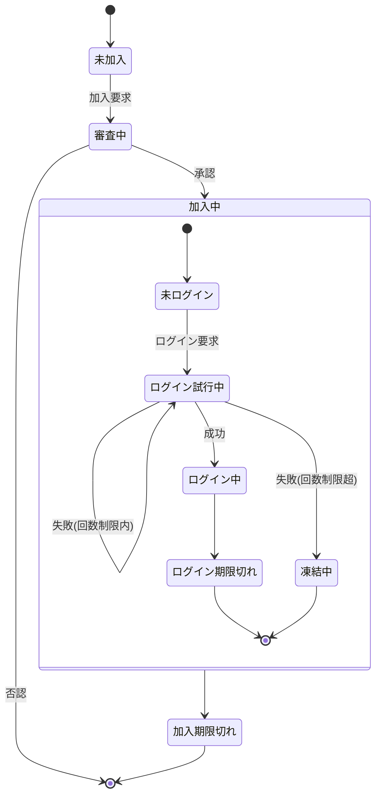

# Member クラス 仕様書

## 概要

- Member は サーバ側 でメンバ情報を一元的に管理するクラスです。
- 加入・ログイン・パスコード試行・デバイス別CPkey管理などの状態を統一的に扱います。
- マルチデバイス利用を前提とし、memberListスプレッドシートの1行を1メンバとして管理します。

## 状態遷移

| No | 状態 | 説明・判定方法 |
| --: | :-- | :-- |
| 1 | 未加入 | memberListに存在しない memberList.memberIdに無い |
| 2 | 審査中 | 管理者承認待ち !memberList.accepted && !memberList.reportResult |
| 3 | 加入中 | 有効メンバ。期限内であれば認証可能 0 < memberList.accepted && Date.now() < memberList.expire |
| 4 | &emsp;未ログイン | 当該デバイスでは有効なCPkeyが未発行、または期限切れの状態 （他デバイスではログイン中であってもよい） memberId[deviceId].CPkeyUpdated+authConfig.loginLifeTime < Date.now() |
| 5 | &emsp;ログイン試行中 | 認証用パスコードを発行済みで、結果が未確定 Date.now() < memberList.memberId[deviceId].trial[0].created + authConfig.passcodeLifeTime |
| 6 | &emsp;ログイン中 | 認証が成功し、権限が必要な処理も要求できる状態 Date.now() <= memberList.memberId[deviceId].CPkeyUpdated+authConfig.loginLifeTime |
| 7 | &emsp;ログイン期限切れ | CPキーの有効期限が切れて再作成が必要な状態 memberList.memberId[deviceId].CPkeyUpdated+authConfig.loginLifeTime < Date.now() |
| 8 | &emsp;凍結中 | 制限回数内に認証が成功せず、試行できない状態 Date.now() < memberList.memberId[deviceId].trial[0].freezingUntil |
| 9 | 加入期限切れ | メンバ加入承認後の有効期間が切れた状態 memberList.expire < Date.now() |

## 状態遷移時にセットすべき変数

| 状態 | 更新されるプロパティ | 更新内容 |
| :-- | :-- | :-- |
| 審査中 → 加入中 | accepted, expire | 承認日時、承認後の有効期限を設定 |
| 加入中 → 未ログイン | device[].trial | 認証試行履歴を初期化（空配列） |
| 未ログイン → ログイン試行中 | device[].trial[0].passcode, created | 新しいパスコードを生成し記録 |
| ログイン試行中 → ログイン中 | device[].CPkey, CPkeyUpdated | クライアントから送信されたCPkeyを登録 |
| ログイン中 → ログイン期限切れ | device[].CPkeyUpdated | 期限切れ判定により更新なし。再生成を要求 |
| ログイン試行中 → 凍結中 | device[].trial[0].freezingUntil | 現在時刻＋freezingをセット |
| 加入中 → 加入期限切れ | expire | 判定のみ。更新なし |

## データ型定義

### Member

メンバ一覧(アカウント管理表)上のメンバ単位の管理情報

| No | 項目名 | 任意 | データ型 | 既定値 | 説明 |
| --: | :-- | :--: | :-- | :-- | :-- |
| 1 | memberId | ❌ | string | — | メンバの識別子(=メールアドレス) |
| 2 | name | ❌ | string | — | メンバの氏名 |
| 3 | accepted | ❌ | string | — | 加入が承認されたメンバには承認日時を設定 |
| 4 | reportResult | ❌ | string | — | 「加入登録」処理中で結果連絡メールを送信した日時 |
| 5 | expire | ❌ | string | — | 加入承認の有効期間が切れる日時 |
| 6 | profile | ❌ | string | — | メンバの属性情報(MemberProfile)を保持するJSON文字列 |
| 7 | device | ❌ | string | — | マルチデバイス対応のためのデバイス情報(MemberDevice[])を保持するJSON文字列 |
| 8 | note | ⭕ | string | — | 当該メンバに対する備考 |

### MemberProfile

メンバの属性情報(Member.profile)

| No | 項目名 | 任意 | データ型 | 既定値 | 説明 |
| --: | :-- | :--: | :-- | :-- | :-- |
| 1 |  | ❌ | string | — |  |

### MemberDevice

メンバが使用する通信機器の情報(マルチデバイス対応)

| No | 項目名 | 任意 | データ型 | 既定値 | 説明 |
| --: | :-- | :--: | :-- | :-- | :-- |
| 1 | deviceId | ❌ | string | — | デバイスの識別子。UUID |
| 2 | CPkey | ❌ | string | — | メンバの公開鍵 |
| 3 | CPkeyUpdated | ❌ | string | — | 最新のCPkeyが登録された日時 |
| 4 | trial | ❌ | string | — | ログイン試行関連情報オブジェクト(MemberTrial[])のJSON文字列 |

### MemberTrial

ログイン試行単位の試行情報(Member.trial)

| No | 項目名 | 任意 | データ型 | 既定値 | 説明 |
| --: | :-- | :--: | :-- | :-- | :-- |
| 1 | passcode | ❌ | string | — | 設定されているパスコード |
| 2 | created | ❌ | number | — | パスコード生成日時(≒パスコード通知メール発信日時) |
| 3 | freezingUntil | ❌ | number | — | 凍結解除日時。最大試行回数を超えたら現在日時を設定 |
| 4 | CPkeyUpdateUntil | ❌ | number | — | CPkey更新処理中の場合、更新期限をUNIX時刻でセット |
| 5 | log | ⭕ | MemberTrialLog[] |  | 試行履歴。常に最新が先頭(unshift()使用) |

### MemberTrialLog

MemberTrial.logに記載される、パスコード入力単位の試行記録

| No | 項目名 | 任意 | データ型 | 既定値 | 説明 |
| --: | :-- | :--: | :-- | :-- | :-- |
| 1 | entered | ❌ | string | — | 入力されたパスコード |
| 2 | result | ❌ | number | — | -1:恒久的エラー, 0:要リトライ, 1:パスコード一致 |
| 3 | message | ❌ | string | — | エラーメッセージ |
| 4 | timestamp | ❌ | number | — | 判定処理日時 |
