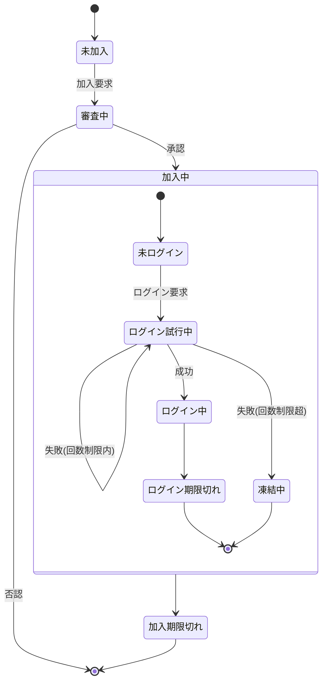

# Member クラス 仕様書

## 概要

- Member は サーバ側 でメンバ情報を一元的に管理するクラスです。
- 加入・ログイン・パスコード試行・デバイス別CPkey管理などの状態を統一的に扱います。
- マルチデバイス利用を前提とし、memberListスプレッドシートの1行を1メンバとして管理します。

## 状態遷移



| No | 状態 | 説明・判定方法 |
| --: | :-- | :-- |
| 1 | 未加入 | memberListに存在しない<br>memberList.memberIdに無い |
| 2 | 審査中 | 管理者承認待ち<br>!memberList.accepted && !memberList.reportResult |
| 3 | 加入中 | 有効メンバ。期限内であれば認証可能<br>0 < memberList.accepted && Date.now() < memberList.expire |
| 4 | &emsp;未ログイン | 当該デバイスでは有効なCPkeyが未発行、または期限切れの状態<br>（他デバイスではログイン中であってもよい）<br>memberId[deviceId].CPkeyUpdated+authConfig.loginLifeTime < Date.now() |
| 5 | &emsp;ログイン試行中 | 認証用パスコードを発行済みで、結果が未確定<br>Date.now() < memberList.memberId[deviceId].trial[0].created + authConfig.passcodeLifeTime |
| 6 | &emsp;ログイン中 | 認証が成功し、権限が必要な処理も要求できる状態<br>Date.now() <= memberList.memberId[deviceId].CPkeyUpdated+authConfig.loginLifeTime |
| 7 | &emsp;ログイン期限切れ | CPキーの有効期限が切れて再作成が必要な状態<br>memberList.memberId[deviceId].CPkeyUpdated+authConfig.loginLifeTime < Date.now() |
| 8 | &emsp;凍結中 | 制限回数内に認証が成功せず、試行できない状態<br>Date.now() < memberList.memberId[deviceId].trial[0].freezingUntil |
| 9 | 加入期限切れ | メンバ加入承認後の有効期間が切れた状態<br>memberList.expire < Date.now() |

## 状態遷移時にセットすべき変数

| 状態 | 更新されるプロパティ | 更新内容 |
| :-- | :-- | :-- |
| 審査中 → 加入中 | accepted, expire | 承認日時、承認後の有効期限を設定 |
| 加入中 → 未ログイン | device[].trial | 認証試行履歴を初期化（空配列） |
| 未ログイン → ログイン試行中 | device[].trial[0].passcode, created | 新しいパスコードを生成し記録 |
| ログイン試行中 → ログイン中 | device[].CPkey, CPkeyUpdated | クライアントから送信されたCPkeyを登録 |
| ログイン中 → ログイン期限切れ | device[].CPkeyUpdated | 期限切れ判定により更新なし。再生成を要求 |
| ログイン試行中 → 凍結中 | device[].trial[0].freezingUntil | 現在時刻＋freezingをセット |
| 加入中 → 加入期限切れ | expire | 判定のみ。更新なし |

## データ型定義

### Member

<!--::$tmp/Member.md::-->

### authTrialLog

<!--::$tmp/MemberTrialLog.md::-->

### MemberTrial

<!--::$tmp/MemberTrial.md::-->

### MemberProfile

<!--::$tmp/MemberProfile.md::-->

### MemberDevice

<!--::$tmp/MemberDevice.md::-->

## クラス・メソッド定義

- メンバ加入承認はadminがシート上で行う

### constructor()

```js
/**
 * Member クラス
 * @class
 * @description memberListの1行をもとに、メンバ情報と状態を管理する。
 */
class Member {

  /**
   * @constructor
   * @param {Object} arg
   * @param {string} arg.sheetName - memberListのシート名
   * @param {string} arg.memberId - メンバ識別子(メールアドレス)
   * @param {Object} [opt] - オプション(authConfig)
   * @description 指定されたmemberIdの情報を取得し、状態を解析してプロパティに展開する。
   */
  constructor(arg, opt) {}
}
```

### getStatus(): メンバの現在状態を判定する

```js
/**
 * メンバの現在状態を判定する
 * @param {void}
 * @returns {string} 現在の状態を返す（例："未加入"、"ログイン中"など）
 */
```

### register(): 新規メンバを登録する

```js
/**
 * 新規メンバを登録する
 * @param {string} name - メンバ名
 * @param {string} memberId - メールアドレス
 * @param {MemberProfile} profile - 初期権限・属性情報
 * @returns {Object} 登録結果
 */
```

### createPasscode(): パスコード生成処理

```js
/**
 * パスコード生成処理
 * @param {string} deviceId
 * @returns {MemberTrial} 新しい認証試行情報
 */
```

### verifyPasscode(): 入力されたパスコードを検証する

```js
/**
 * 入力されたパスコードを検証する
 * @param {string} deviceId
 * @param {string} entered - 入力パスコード
 * @param {number} timestamp - 判定時刻
 * @returns {MemberTrialLog} 判定結果
 */
```

### updateCPkey(): CPkey更新処理（クライアント送信に基づく）

```js
  /**
   * CPkey更新処理（クライアント送信に基づく）
   * @param {string} deviceId
   * @param {string} newCPkey
   * @returns {boolean} 登録結果
   */
```

### maintenance(): 加入期限・CPkey期限などの定期チェックを行う

| 区分             | 処理内容                                                                                                   | 対象・目的                  |
| :------------- | :----------------------------------------------------------------------------------------------------- | :--------------------- |
| 🕐 **期限管理**    | - `memberList.expire` を過ぎたメンバを「加入期限切れ」にする<br>- `device[].CPkeyUpdated` が `loginLifeTime` 超過ならCPkeyを無効化 | 加入期限・CPkeyの有効期限切れの自動処理 |
| 🧊 **凍結解除**    | - `trial[].freezingUntil < Date.now()` なら凍結状態を解除                                                       | 認証試行失敗による凍結期間終了後の自動解除  |
| 🧹 **履歴整理**    | - `trial.log`の古い履歴を`generationMax`超過分だけ削除<br>- 不要デバイス（長期間非アクティブ）を削除                                    | データ肥大化防止、整合性維持         |
| 🧭 **整合性補正**   | - CPkeyが存在しないのに`ログイン中`判定されているデバイスを修正<br>- profile.authorityが空の場合は`authConfig.defaultAuthority`で補完      | データ不整合の自動修復            |
| ✉️ **通知系（任意）** | - 期限切れ/凍結/更新要求などが発生した場合に管理者やユーザへメール通知                                                                  | 運用支援・エラー検知             |

```js
/**
 * @method maintenance
 * @desc memberList全体をスキャンし、期限切れ・凍結解除・整合性補正などを行う。
 * @param {Object} [opt] - 実行オプション
 * @param {boolean} [opt.notify=true] - 処理結果を管理者へ通知するか
 * @param {boolean} [opt.cleanup=true] - 不要データ(旧trial,期限切れdevice)を削除するか
 * @returns {Object} - 実行結果サマリ { cleaned: number, expired: number, unfrozen: number, notified: number }
 */
```
