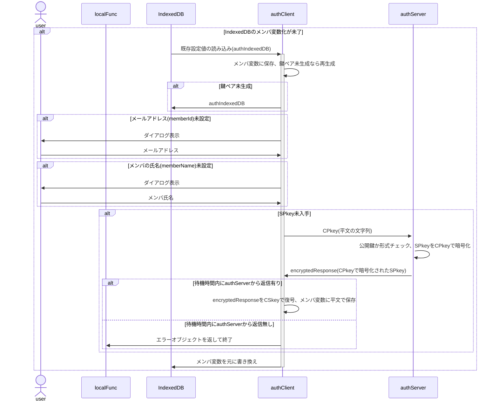

[総説](spec.md) | [authClient](authClient.md) | [authServer](authServer.md) | [クラス一覧](classes.md#list) | [JSLib](JSLib.md)

# authClient クラス仕様書

## 🧭 概要

クライアント側auth中核クラス

authClientは、ローカル関数(ブラウザ内JavaScript)からの要求を受け、
サーバ側(authServer)への暗号化通信リクエストを署名・暗号化、
サーバ側処理を経てローカル側に戻された結果を復号・検証し、
処理結果に応じてクライアント側処理を適切に振り分ける中核関数です。
### 設計方針

- クロージャ関数ではなくクラスとして作成
- 内発処理はローカル関数からの処理要求に先行して行う

### 🧩 内部構成

🔢 authClient メンバ一覧

| 項目名 | 任意 | データ型 | 既定値 | 説明 | 備考 |
| :-- | :-- | :-- | :-- | :-- | :-- |
| cf | ❌ | [authClientConfig](authClientConfig.md#authclientconfig_internal) | — | 動作設定変数(config) |  | 
| crypto | ❌ | [cryptoClient](cryptoClient.md#cryptoclient_internal) | — | 暗号化・復号用インスタンス |  | 
| idb | ❌ | [authIndexedDB](authIndexedDB.md#authindexeddb_internal) | — | IndexedDB共有用 | IndexedDBの内容をauthClient内で共有 | 

🧱 authClient メソッド一覧

| メソッド名 | 型 | 内容 |
| :-- | :-- | :-- |
| [constructor](#authclient_constructor) | private | コンストラクタ |
| [checkCPkey](#authclient_checkcpkey) | private | CPkey残有効期間をチェック |
| [enterPasscode](#authclient_enterpasscode) | private | パスコード入力ダイアログを表示 |
| [exec](#authclient_exec) | public | ローカル関数からの要求受付 |
| [setupEnvironment](#authclient_setupenvironment) | private | SPkey入手等、authClient動作環境整備 |
| [showMessage](#authclient_showmessage) | private | メッセージをダイアログで表示 |

## 🧱 <a href="#authclient_method">authClient.constructor()</a>

コンストラクタ

### 📥 引数

| 項目名 | 任意 | データ型 | 既定値 | 説明 |
| :-- | :--: | :-- | :-- | :-- |
| config | ❌ | [authClientConfig](authClientConfig.md#authclientconfig_internal) | — | authClientの動作設定変数 | 

### 📤 戻り値

- [authClient](authClient.md#internal): クライアント側auth中核クラス
  | 項目名 | データ型 | 生成時 | 正常終了 |
  | :-- | :-- | :-- | :-- |
  | cf | authClientConfig | [必須] | — |
  | crypto | cryptoClient | [必須] | — |
  | idb | authIndexedDB | [必須] | — |

### 🧾 処理手順

- 本クラスのメンバとして存在する引数のメンバはauthClient内共有用の変数"cf"に保存(存在しない引数のメンバは廃棄)
- "crypto"に[cryptoClient](cryptoClient.md#cryptoclient_constructor)を生成、鍵ペアを準備
- "idb"に[authIndexedDB](authIndexedDB.md#authindexeddb_constructor)を生成、IndexedDBの内容を取得
- idb.deviceId未採番なら採番(UUID)
- idb.SPkey未取得ならサーバ側に要求
- 更新した内容はIndexedDBに書き戻す
- SPkey取得がエラーになった場合、SPkey以外は書き戻す
- IndexedDBの内容はauthClient内共有用変数"pv"に保存
- サーバ側から一定時間レスポンスが無い場合、{result:'fatal',message:'No response'}を返して終了

## 🧱 <a href="#authclient_method">authClient.checkCPkey()</a>

CPkey残有効期間をチェック

### 📥 引数

| 項目名 | 任意 | データ型 | 既定値 | 説明 |
| :-- | :--: | :-- | :-- | :-- |
| arg | ⭕ | Object | {} | ユーザ指定の設定値 | 

### 📤 戻り値

- [authResponse](authResponse.md#internal): クライアント側auth中核クラス
  | 項目名 | データ型 | 生成時 | 正常終了 |
  | :-- | :-- | :-- | :-- |
  | timestamp | number | Date.now() | — |
  | result | string | normal | — |
  | message | string | [任意] | — |
  | request | authRequest | [任意] | — |
  | response | any | [任意] | — |

### 🧾 処理手順

## 🧱 <a href="#authclient_method">authClient.enterPasscode()</a>

パスコード入力ダイアログを表示

### 📥 引数

| 項目名 | 任意 | データ型 | 既定値 | 説明 |
| :-- | :--: | :-- | :-- | :-- |
| arg | ⭕ | Object | {} | ユーザ指定の設定値 | 

### 📤 戻り値

- [authResponse](authResponse.md#internal): クライアント側auth中核クラス
  | 項目名 | データ型 | 生成時 | 正常終了 |
  | :-- | :-- | :-- | :-- |
  | timestamp | number | Date.now() | — |
  | result | string | normal | — |
  | message | string | [任意] | — |
  | request | authRequest | [任意] | — |
  | response | any | [任意] | — |

### 🧾 処理手順

## 🧱 <a href="#authclient_method">authClient.exec()</a>

ローカル関数からの要求受付

ローカル関数からの要求を受けてauthServerに問合せを行う

### 📥 引数

| 項目名 | 任意 | データ型 | 既定値 | 説明 |
| :-- | :--: | :-- | :-- | :-- |
| arg | ⭕ | Object | {} | ユーザ指定の設定値 | 

### 📤 戻り値

- [authResponse](authResponse.md#internal): クライアント側auth中核クラス
  | 項目名 | データ型 | 生成時 | 正常終了 |
  | :-- | :-- | :-- | :-- |
  | timestamp | number | Date.now() | — |
  | result | string | normal | — |
  | message | string | [任意] | — |
  | request | authRequest | [任意] | — |
  | response | any | [任意] | — |

### 🧾 処理手順

## 🧱 <a href="#authclient_method">authClient.setupEnvironment()</a>

SPkey入手等、authClient動作環境整備

### 📥 引数

| 項目名 | 任意 | データ型 | 既定値 | 説明 |
| :-- | :--: | :-- | :-- | :-- |
| arg | ⭕ | Object | {} | ユーザ指定の設定値 | 

### 📤 戻り値

- [authResponse](authResponse.md#internal): クライアント側auth中核クラス
  | 項目名 | データ型 | 生成時 | 正常終了 |
  | :-- | :-- | :-- | :-- |
  | timestamp | number | Date.now() | — |
  | result | string | normal | — |
  | message | string | [任意] | — |
  | request | authRequest | [任意] | — |
  | response | any | [任意] | — |

### 🧾 処理手順

## 🧱 <a href="#authclient_method">authClient.showMessage()</a>

メッセージをダイアログで表示

### 📥 引数

| 項目名 | 任意 | データ型 | 既定値 | 説明 |
| :-- | :--: | :-- | :-- | :-- |
| arg | ⭕ | Object | {} | ユーザ指定の設定値 | 

### 📤 戻り値

- [authResponse](authResponse.md#internal): クライアント側auth中核クラス
  | 項目名 | データ型 | 生成時 | 正常終了 |
  | :-- | :-- | :-- | :-- |
  | timestamp | number | Date.now() | — |
  | result | string | normal | — |
  | message | string | [任意] | — |
  | request | authRequest | [任意] | — |
  | response | any | [任意] | — |

### 🧾 処理手順

