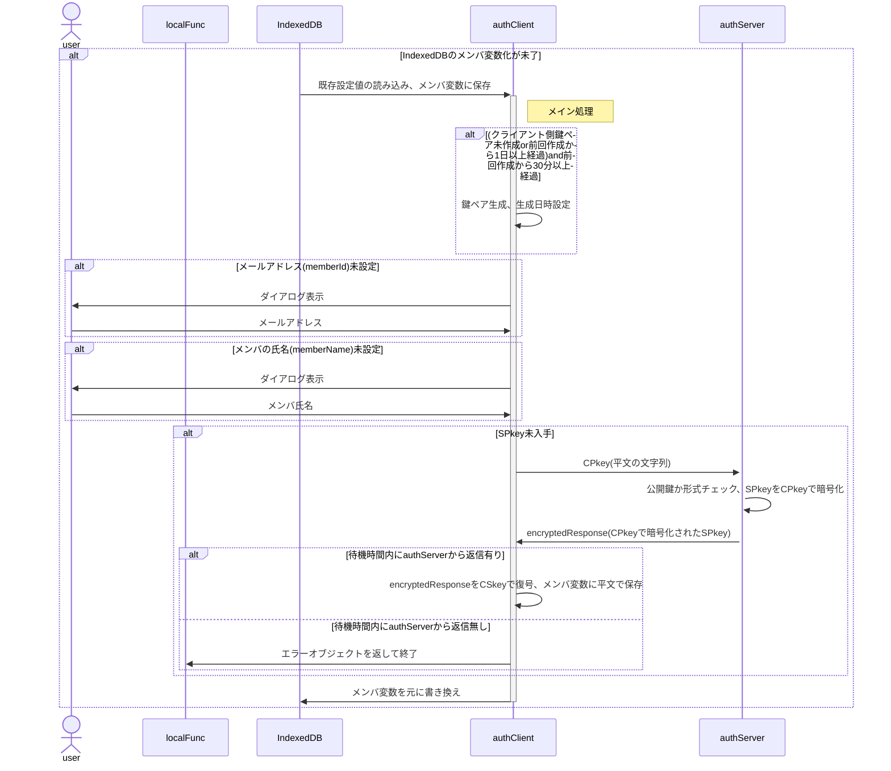
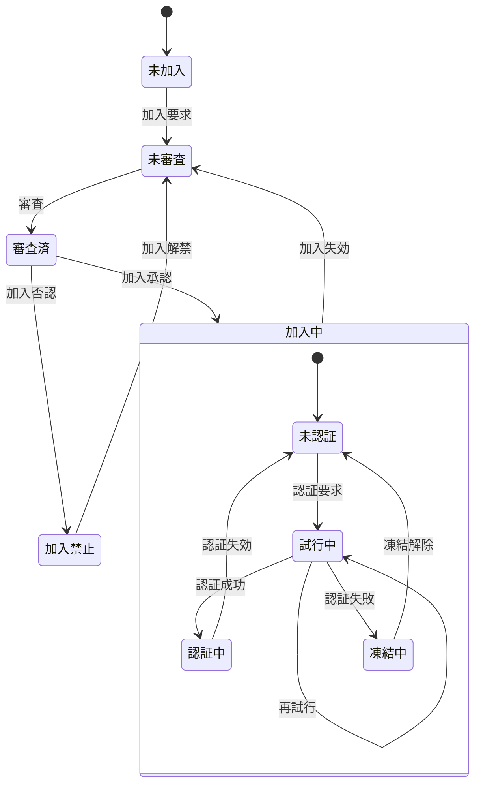

# authClient 関数 仕様書

## 🧭 概要

authClientは、ローカル関数(ブラウザ内JavaScript)からの要求を受け、
サーバ側(authServer)への暗号化通信リクエストを署名・暗号化、
サーバ側処理を経てローカル側に戻された結果を復号・検証し、
処理結果に応じてクライアント側処理を適切に振り分ける中核関数です。

## ■ 設計方針

- クロージャ関数とする

## 🧩 内部構成(クラス変数)

### authIndexedDB

- クライアントのIndexedDBに保存するオブジェクト
- IndexedDB保存時のキー名は`authConfig.system.name`から取得

| No | 項目名 | 任意 | データ型 | 既定値 | 説明 |
| --: | :-- | :--: | :-- | :-- | :-- |
| 1 | keyGeneratedDateTime | ❌ | number | — | 鍵ペア生成日時。UNIX時刻(new Date().getTime()),なおサーバ側でCPkey更新中にクライアント側で新たなCPkeyが生成されるのを避けるため、鍵ペア生成は30分以上の間隔を置く。 |
| 2 | memberId | ❌ | string | — | メンバの識別子(=メールアドレス) |
| 3 | memberName | ❌ | string | — | メンバ(ユーザ)の氏名(ex."田中　太郎")。加入要求確認時に管理者が申請者を識別する他で使用。 |
| 4 | CSkeySign | ❌ | CryptoKey | — | 署名用秘密鍵 |
| 5 | CPkeySign | ❌ | CryptoKey | — | 署名用公開鍵 |
| 6 | CSkeyEnc | ❌ | CryptoKey | — | 暗号化用秘密鍵 |
| 7 | CPkeyEnc | ❌ | CryptoKey | — | 暗号化用公開鍵 |
| 8 | SPkey | ❌ | string | — | サーバ公開鍵(Base64) |
| 9 | ApplicationForMembership | ❌ | number | — | 加入申請実行日時。未申請時は0 |
| 10 | expireAccount | ❌ | number | — | 加入承認の有効期間が切れる日時。未加入時は0 |
| 11 | expireCPkey | ❌ | number | — | CPkeyの有効期限。未ログイン時は0 |

## 🧱 メイン処理

### 概要

- classのconstructor()に相当
- 引数はauthClient内共有用の変数`pv`に保存
- `cryptoClient.constructor()`で鍵ペアの準備
- IndexedDBからメールアドレスを取得、存在しなければダイアログから入力
- IndexedDBからメンバの氏名を取得、存在しなければダイアログから入力
- deviceId未採番なら採番(UUID)
- SPkey未取得ならサーバ側に要求
- 更新した内容はIndexedDBに書き戻す
- SPkey取得がエラーになった場合、SPkey以外は書き戻す
- サーバ側から一定時間レスポンスが無い場合、`{result:'fatal',message:'No response'}`を返して終了

### 📤 入力項目

#### `authClientConfig`

authConfigを継承した、authClientでのみ使用する設定値

| No | 項目名 | 任意 | データ型 | 既定値 | 説明 |
| --: | :-- | :--: | :-- | :-- | :-- |
| 1 | x | ❌ | string | — | サーバ側WebアプリURLのID(`https://script.google.com/macros/s/(この部分)/exec`) |
| 2 | timeout | ⭕ | number | 300000 | サーバからの応答待機時間。これを超えた場合はサーバ側でfatalとなったと解釈する。既定値は5分 |

#### 参考：`authConfig`

- authClient/authServer共通で使用される設定値。
- authClientConfig, authServerConfigの親クラス

| No | 項目名 | 任意 | データ型 | 既定値 | 説明 |
| --: | :-- | :--: | :-- | :-- | :-- |
| 1 | systemName | ⭕ | string | auth | システム名 |
| 2 | adminMail | ❌ | string | — | 管理者のメールアドレス |
| 3 | adminName | ❌ | string | — | 管理者名 |
| 4 | allowableTimeDifference | ⭕ | string | 120000 | クライアント・サーバ間通信時の許容時差。既定値は2分 |
| 5 | RSAbits | ⭕ | string | 2048 | 鍵ペアの鍵長 |

### 📥 出力項目

- 利用可能なメソッドのオブジェクト

## 🧱 exec()メソッド

### 概要

ローカル関数からの要求を受けてauthServerに問合せを行い、返信された処理結果に基づき適宜メソッドを呼び出す

- cryptoClient.encryptを呼び出し、`encryptedRequest`を作成
- authServerへの問合せを終了するまで繰り返し
  - 待機時間内にレスポンスあり
    - レスポンスの復号、署名検証
    - 問合せ結果による分岐
  - 待機時間内にレスポンスなし
    - LocalRequestに`{result:'fatal',message:'No response'}`をセット、呼出元ローカル関数に返して終了

### 問合せ結果による分岐

問合せ結果はメンバの状態により内容が異なる。

No | 状態 | 説明
:-- | :-- | :--
1 | 未加入 | memberList未登録
2 | 未審査 | memberList登録済だが、管理者による加入認否が未決定
3 | 審査済 | 管理者による加入認否が決定済
4 | 加入中 | 管理者により加入が承認された状態
4.1 | 未認証 | 認証(ログイン)不要の処理しか行えない状態
4.2 | 試行中 | パスコードによる認証を試行している状態
4.3 | 認証中 | 認証が通り、ログインして認証が必要な処理も行える状態
4.4 | 凍結中 | 規定の試行回数連続して認証に失敗し、再認証要求が禁止された状態
5 | 加入禁止 | 管理者により加入が否認された状態

### 📤 入力項目

#### `LocalRequest`

- クライアント側関数からauthClientに渡すオブジェクト
- func,arg共、平文

| No | 項目名 | 任意 | データ型 | 既定値 | 説明 |
| --: | :-- | :--: | :-- | :-- | :-- |
| 1 | func | ❌ | string | — | サーバ側関数名 |
| 2 | arguments | ❌ | any[] | — | サーバ側関数に渡す引数の配列 |

### 📥 出力項目

#### `LocalResponse`

authClientからクライアント側関数に返される処理結果オブジェクト

| No | 項目名 | 任意 | データ型 | 既定値 | 説明 |
| --: | :-- | :--: | :-- | :-- | :-- |
| 1 | result | ❌ | string | — | 処理結果。fatal/warning/normal |
| 2 | message | ⭕ | string | — | エラーメッセージ。normal時は`undefined`。 |
| 3 | response | ⭕ | any | — | 要求された関数の戻り値。fatal/warning時は`undefined`。`JSON.parse(authResponse.response)` |

#### 参考：`authResponse`

authServerからauthClientに返される処理結果オブジェクト

| No | 項目名 | 任意 | データ型 | 既定値 | 説明 |
| --: | :-- | :--: | :-- | :-- | :-- |
| 1 | timestamp | ❌ | number | — | サーバ側処理日時。UNIX時刻 |
| 2 | result | ❌ | string | — | サーバ側処理結果。fatal/warning/normal |
| 3 | message | ⭕ | string | — | サーバ側からのエラーメッセージ。normal時は`undefined` |
| 4 | request | ❌ | authRequest | — | 処理要求オブジェクト |
| 5 | response | ⭕ | any | — | 要求されたサーバ側関数の戻り値。fatal/warning時は`undefined` |

## ⏰ メンテナンス処理

## 🔐 セキュリティ仕様

## 🧾 エラーハンドリング仕様
