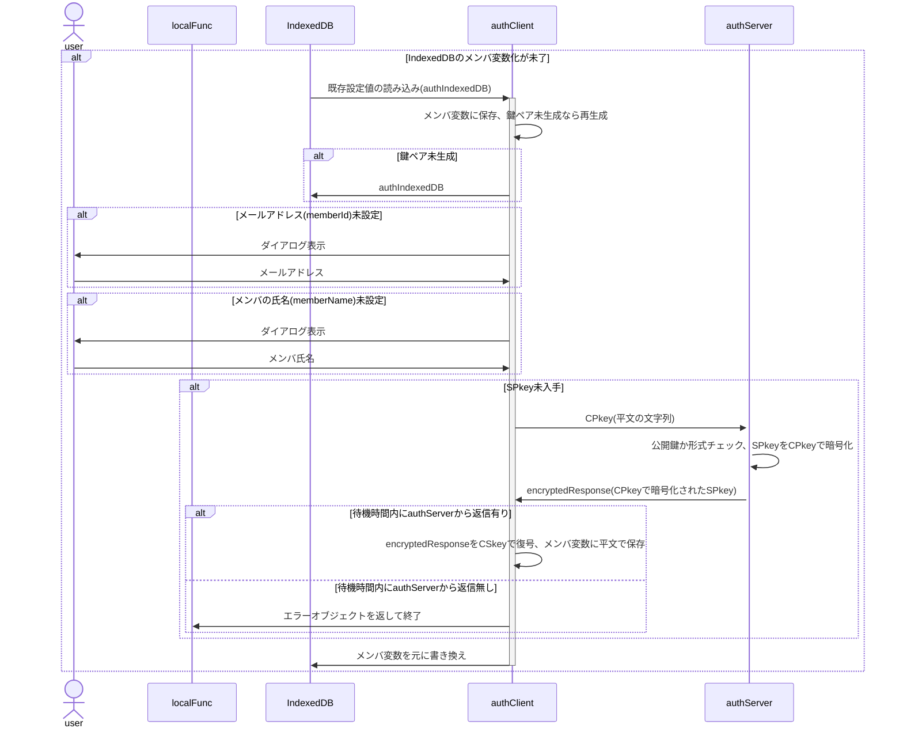
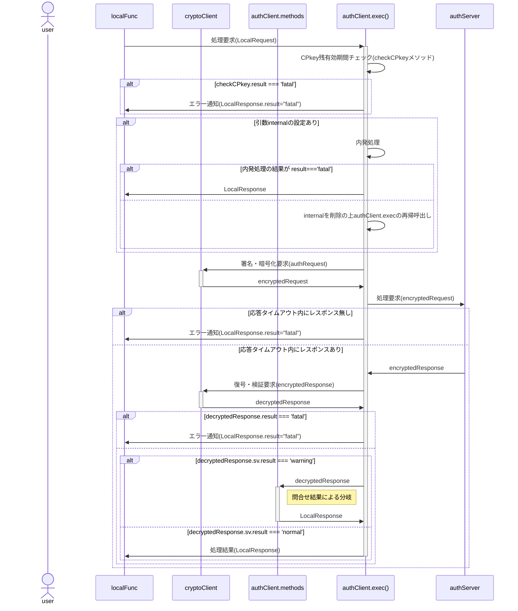
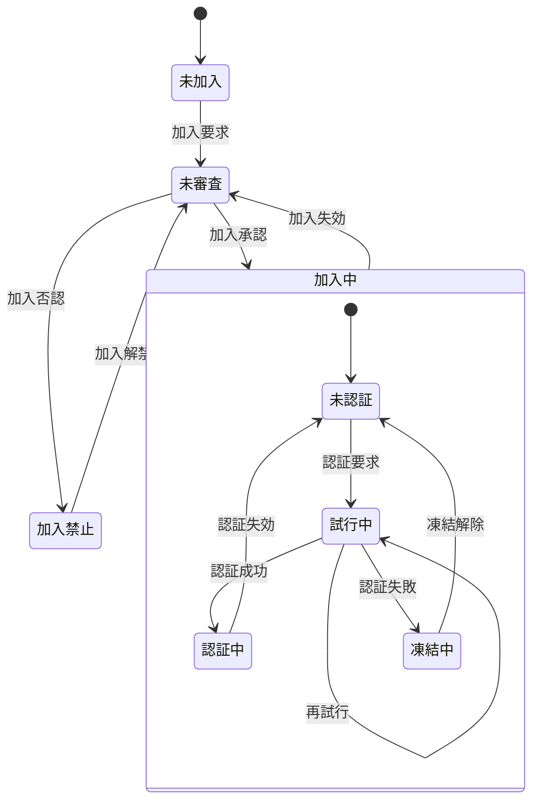

# authClient 関数 仕様書

## 🧭 概要

authClientは、ローカル関数(ブラウザ内JavaScript)からの要求を受け、
サーバ側(authServer)への暗号化通信リクエストを署名・暗号化、
サーバ側処理を経てローカル側に戻された結果を復号・検証し、
処理結果に応じてクライアント側処理を適切に振り分ける中核関数です。

## ■ 設計方針、用語定義

- クロージャ関数とする
- ローカル関数からの要求に基づかない、authClientでの処理の必要上発生するauthServerへの問合せを「内発処理」と呼称
  - CPkey更新：期限切れまたは残有効期間が短い場合のCPkey更新処理
  - パスコード突合：メンバが未認証または試行中の場合のパスコード突き合わせ処理
- 内発処理はローカル関数からの処理要求に先行して行う

## 🧩 内部構成(クラス変数)

### authIndexedDB

<a name="authIndexedDB"></a>

- クライアントのIndexedDBに保存するオブジェクト
- IndexedDB保存時のキー名は`authConfig.system.name`から取得

| No | 項目名 | 任意 | データ型 | 既定値 | 説明 |
| --: | :-- | :--: | :-- | :-- | :-- |
| 1 | keyGeneratedDateTime | ❌ | number |  | 鍵ペア生成日時。UNIX時刻(new Date().getTime()),なおサーバ側でCPkey更新中にクライアント側で新たなCPkeyが生成されるのを避けるため、鍵ペア生成は30分以上の間隔を置く。 |
| 2 | memberId | ❌ | string |  | メンバの識別子(=メールアドレス) |
| 3 | memberName | ❌ | string |  | メンバ(ユーザ)の氏名(ex."田中　太郎")。加入要求確認時に管理者が申請者を識別する他で使用。 |
| 4 | CSkeySign | ❌ | CryptoKey |  | 署名用秘密鍵 |
| 5 | CPkeySign | ❌ | CryptoKey |  | 署名用公開鍵 |
| 6 | CSkeyEnc | ❌ | CryptoKey |  | 暗号化用秘密鍵 |
| 7 | CPkeyEnc | ❌ | CryptoKey |  | 暗号化用公開鍵 |
| 8 | SPkey | ❌ | string |  | サーバ公開鍵(Base64) |
| 9 | expireCPkey | ⭕ | number | 0 | CPkeyの有効期限(無効になる日時)。未ログイン時は0 |

### authClientKeys

<a name="authClientKeys"></a>

クライアント側鍵ペア

| No | 項目名 | 任意 | データ型 | 既定値 | 説明 |
| --: | :-- | :--: | :-- | :-- | :-- |
| 1 | CSkeySign | ❌ | CryptoKey |  | 署名用秘密鍵 |
| 2 | CPkeySign | ❌ | CryptoKey |  | 署名用公開鍵 |
| 3 | CSkeyEnc | ❌ | CryptoKey |  | 暗号化用秘密鍵 |
| 4 | CPkeyEnc | ❌ | CryptoKey |  | 暗号化用公開鍵 |

## 🧱 メイン処理

### 概要

- authClientインスタンス化時の処理。classのconstructor()に相当
- 引数はauthClient内共有用の変数`pv`に保存
- `cryptoClient.constructor()`で鍵ペアの準備
- IndexedDBからメールアドレスを取得、存在しなければダイアログから入力
- IndexedDBからメンバの氏名を取得、存在しなければダイアログから入力
- deviceId未採番なら採番(UUID)
- SPkey未取得ならサーバ側に要求
- 更新した内容はIndexedDBに書き戻す
- SPkey取得がエラーになった場合、SPkey以外は書き戻す
- IndexedDBの内容はauthClient内共有用変数`pv`に保存
- サーバ側から一定時間レスポンスが無い場合、`{result:'fatal',message:'No response'}`を返して終了



- 鍵ペア(CPkey)の更新が必要な場合はexec()メソッドから行い、メイン処理では行わない。

### 📤 入力項目

#### `authClientConfig`

<a name="authClientConfig"></a>

authConfigを継承した、authClientでのみ使用する設定値

| No | 項目名 | 任意 | データ型 | 既定値 | 説明 |
| --: | :-- | :--: | :-- | :-- | :-- |
| 1 | api | ❌ | string |  | サーバ側WebアプリURLのID(`https://script.google.com/macros/s/(この部分)/exec`) |
| 2 | timeout | ⭕ | number | 300000 | サーバからの応答待機時間。これを超えた場合はサーバ側でfatalとなったと解釈する。既定値は5分 |
| 3 | CPkeyGraceTime | ⭕ | number | 600000 | CPkey期限切れまでの猶予時間。CPkey有効期間がこれを切ったら更新処理実行。既定値は10分 |

#### 参考：`authConfig`

<a name="authConfig"></a>

- authClient/authServer共通で使用される設定値。
- authClientConfig, authServerConfigの親クラス

| No | 項目名 | 任意 | データ型 | 既定値 | 説明 |
| --: | :-- | :--: | :-- | :-- | :-- |
| 1 | systemName | ⭕ | string | auth | システム名 |
| 2 | adminMail | ❌ | string |  | 管理者のメールアドレス |
| 3 | adminName | ❌ | string |  | 管理者名 |
| 4 | allowableTimeDifference | ⭕ | number | 120000 | クライアント・サーバ間通信時の許容時差。既定値は2分 |
| 5 | RSAbits | ⭕ | string | 2048 | 鍵ペアの鍵長 |

### 📥 出力項目

- 利用可能なメソッドのオブジェクト

## 🧱 exec()メソッド

### 概要

- ローカル関数からの要求を受けてauthServerに問合せを行い、返信された処理結果に基づき適宜メソッドを呼び出す

```js
/**
 * @param {LocalRequest} request - localFuncからの要求
 * @param {authRequest} [internal] - authClient内発の先行処理
 * @returns {LocalResponse}
 */
```
- CPkeyの残有効期間をチェック(checkCPkeyメソッドの実行)

- 内発処理が有った場合(`typeof internal !== 'undefined'`)は以下を実行
  - `cryptoClient.encrypt`に`internal`を渡して`encryptedRequest`を作成
  - authServerへの問合せ
  - 待機時間内にレスポンスあり
    - レスポンスの復号、署名検証
    - 結果がfatalだった場合、LocalRequestに`{result:'fatal',message:'No response'}`をセット、呼出元ローカル関数に返して終了
    - internalを外してexec()を再帰呼出(`exec(request)`)
  - 待機時間内にレスポンスなし
    - LocalRequestに`{result:'fatal',message:'No response'}`をセット、呼出元ローカル関数に返して終了
- `cryptoClient.encrypt`に`request`を渡して`encryptedRequest`を作成
- authServerへの問合せ
- 待機時間内にレスポンスあり
  - レスポンスの復号、署名検証
  - 問合せ結果による分岐
- 待機時間内にレスポンスなし
  - LocalRequestに`{result:'fatal',message:'No response'}`をセット、呼出元ローカル関数に返して終了



#### 問合せ結果による分岐

- 問合せ結果(`decryptedResponse.sv.message`)により呼出先メソッドは分岐する。

| message | 呼出先 | 処理概要 |
| :-- | :-- | :-- |
| registerd | showMessage() | authClientからの新規メンバ加入要求に対して、authServerがmemberListに登録＋管理者へメール通知を発行した場合のmessage<br>⇒ 「加入申請しました。管理者による加入認否結果は後程メールでお知らせします」表示 |
| under review | showMessage() | authClientからの加入審査状況の問合せに対するauthServerからの「現在審査中」の回答<br>⇒ 「現在審査中です。今暫くお待ちください」表示 |
| denial | showMessage() | authClientからの加入審査状況の問合せに対するauthServerからの「加入申請否認」の回答<br>⇒ 「残念ながら加入申請は否認されました」表示 |
| send passcode | enterPasscode() | authClientからの処理要求に対するauthServerからの「未認証⇒パスコード通知済」の回答<br>⇒ パスコード入力画面を表示 |
| unmatch | enterPasscode() | authClientで入力されたパスコードに対するauthServerからの「パスコード不一致(再試行可)」の回答<br>⇒ パスコード入力画面を表示 |
| freezing | showMessage() | authClientで入力されたパスコードに対するauthServerからの「試行回数上限、凍結中」の回答<br>⇒ 「パスコードが連続して不一致だったため、現在アカウントは凍結中です。時間をおいて再試行してください」表示 |

#### 参考：メンバの状態遷移



No | 状態 | 説明
:-- | :-- | :--
1 | 未加入 | memberList未登録
2 | 未審査 | memberList登録済だが、管理者による加入認否が未決定
3 | 加入中 | 管理者により加入が承認された状態
3.1 | 未認証 | 認証(ログイン)不要の処理しか行えない状態
3.2 | 試行中 | パスコードによる認証を試行している状態
3.3 | 認証中 | 認証が通り、ログインして認証が必要な処理も行える状態
3.4 | 凍結中 | 規定の試行回数連続して認証に失敗し、再認証要求が禁止された状態
4 | 加入禁止 | 管理者により加入が否認された状態

### 📤 入力項目

#### LocalRequest

<a name="LocalRequest"></a>

- クライアント側関数からauthClientに渡すオブジェクト
- func,arg共、平文

| No | 項目名 | 任意 | データ型 | 既定値 | 説明 |
| --: | :-- | :--: | :-- | :-- | :-- |
| 1 | func | ❌ | string |  | サーバ側関数名 |
| 2 | arguments | ❌ | any[] |  | サーバ側関数に渡す引数の配列 |

#### authRequest

<a name="authRequest"></a>

authClientからauthServerに送られる処理要求オブジェクト

| No | 項目名 | 任意 | データ型 | 既定値 | 説明 |
| --: | :-- | :--: | :-- | :-- | :-- |
| 1 | memberId | ❌ | string |  | メンバの識別子(=メールアドレス) |
| 2 | deviceId | ❌ | string |  | デバイスの識別子 |
| 3 | signature | ❌ | string |  | クライアント側署名 |
| 4 | requestId | ❌ | string |  | 要求の識別子。UUID |
| 5 | timestamp | ❌ | number |  | 要求日時。UNIX時刻 |
| 6 | func | ❌ | string |  | サーバ側関数名 |
| 7 | arguments | ❌ | any[] |  | サーバ側関数に渡す引数の配列 |

### 📥 出力項目

#### LocalResponse

<a name="LocalResponse"></a>

authClientからクライアント側関数に返される処理結果オブジェクト

| No | 項目名 | 任意 | データ型 | 既定値 | 説明 |
| --: | :-- | :--: | :-- | :-- | :-- |
| 1 | result | ❌ | string |  | 処理結果。fatal/warning/normal |
| 2 | message | ⭕ | string |  | エラーメッセージ。normal時は`undefined`。 |
| 3 | response | ⭕ | any |  | 要求された関数の戻り値。fatal/warning時は`undefined`。`JSON.parse(authResponse.response)` |

#### 参考：authResponse

<a name="authResponse"></a>

authServerからauthClientに返される処理結果オブジェクト

| No | 項目名 | 任意 | データ型 | 既定値 | 説明 |
| --: | :-- | :--: | :-- | :-- | :-- |
| 1 | timestamp | ❌ | number |  | サーバ側処理日時。UNIX時刻 |
| 2 | result | ❌ | string |  | サーバ側処理結果。fatal/warning/normal |
| 3 | message | ⭕ | string |  | サーバ側からのエラーメッセージ。normal時は`undefined` |
| 4 | request | ❌ | authRequest |  | 処理要求オブジェクト |
| 5 | response | ⭕ | any |  | 要求されたサーバ側関数の戻り値。fatal/warning時は`undefined` |

## 🧱 showMessage()メソッド

- execメソッドから呼ばれる関数
- 引数は`decryptedResponse`
- 戻り値は`LocalResponse(={result:'fatal',message:decryptedResponse.sv.message,response:undefind})`
- `decryptedResponse.sv.message`の値に基づき、メッセージをダイアログで表示
  | message | メッセージ |
  | :-- | :-- |
  | registerd | 加入申請しました。管理者による加入認否結果は後程メールでお知らせします |
  | under review | 現在審査中です。今暫くお待ちください |
  | denial | 残念ながら加入申請は否認されました |
  | freezing | パスコードが連続して不一致だったため、現在アカウントは凍結中です。時間をおいて再試行してください |

## 🧱 enterPasscode()メソッド

- execメソッドから呼ばれる関数
- パスコードを入力するダイアログを表示
- ダイアログに表示するメッセージは`decryptedResponse.sv.message`の値に基づき変更
  | message | メッセージ |
  | :-- | :-- |
  | send passcode | パスコード通知メールを送信しました。記載されたパスコードを入力してください |
  | unmatch | 入力されたパスコードが一致しません。再入力してください |
- `authRequest(={func:'::passcode::',arguments:[入力されたパスコード]})`を作成
- 作成したauthRequestをinternalとしてexecメソッドを再帰呼出
- 再帰呼出先のexecの戻り値を自身の戻り値とする

## 🧱 checkCPkey()メソッド

- 引数は無し、戻り値は`authResponse`
- CPkey残有効期間をチェック、期限切れまたは猶予時間未満になってないか計算<br>
  `authIndexedDB.expireCPkey - Date.now() < authClientConfig.CPkeyGraceTime`
- 残有効期間が十分な場合、`authResponse(={result:'normal'})`を返して終了
- 残有効期間が不十分な場合
  - 新しい鍵ペアを作成(`cryptoClient.generateKeys()`)
  - `authRequest(={func:'::updateCPkey::',signature:更新後CPkey})`を作成
  - 作成したauthRequestをinternalとしてexecメソッドを再帰呼出<br>
    ※ この時点では古い鍵ペアで署名・暗号化される
  - 再帰呼出先のexecが`result === 'normal'`ならIndexedDBも更新(`cryptoClient.updateKeys`)

## ⏰ メンテナンス処理

## 🔐 セキュリティ仕様

## 🧾 エラーハンドリング仕様
