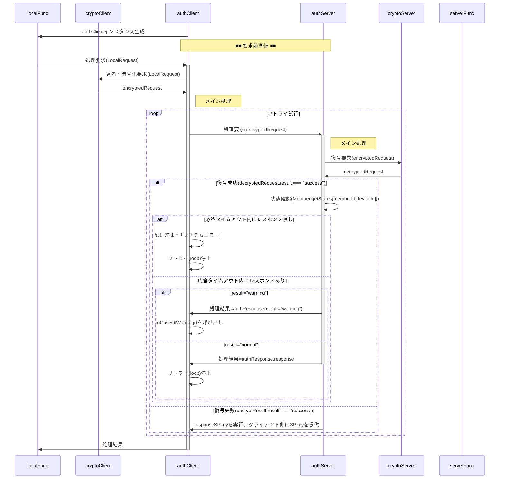

# authServer 関数 仕様書

## 概要

authServerは、クライアント（authClient）からの暗号化通信リクエストを復号・検証し、
メンバ状態と要求内容に応じてサーバ側処理を適切に振り分ける中核関数です。

## メイン処理

■ 入力 : encryptedRequest

- authClientからauthServerに渡す暗号化された処理要求オブジェクト
- ciphertextはauthRequestをJSON化、RSA-OAEP暗号化＋署名付与した文字列
- memberId,deviceIdは平文

| No | 項目名 | 任意 | データ型 | 既定値 | 説明 |
| --: | :-- | :--: | :-- | :-- | :-- |
| 1 | memberId | ❌ | string | — | メンバの識別子(=メールアドレス) |
| 2 | deviceId | ❌ | string | — | デバイスの識別子 |
| 3 | ciphertext | ❌ | string | — | 暗号化した文字列 |

■ 出力 : encryptedResponse

- authServerからauthClientに返す暗号化された処理結果オブジェクト
- ciphertextはauthResponseをJSON化、RSA-OAEP暗号化＋署名付与した文字列

| No | 項目名 | 任意 | データ型 | 既定値 | 説明 |
| --: | :-- | :--: | :-- | :-- | :-- |
| 1 | ciphertext | ❌ | string | — | 暗号化した文字列 |

■ ScriptProperties

キー名は`authConfig.system.name`、データは以下のオブジェクトをJSON化した文字列。

| No | 項目名 | 任意 | データ型 | 既定値 | 説明 |
| --: | :-- | :--: | :-- | :-- | :-- |
| 1 | keyGeneratedDateTime | ❌ | number | — | UNIX時刻 |
| 2 | SPkey | ❌ | string | — | PEM形式の公開鍵文字列 |
| 3 | SSkey | ❌ | string | — | PEM形式の秘密鍵文字列（暗号化済み） |

■ `memberList`シート

メンバ一覧(アカウント管理表)上のメンバ単位の管理情報

| No | 項目名 | 任意 | データ型 | 既定値 | 説明 |
| --: | :-- | :--: | :-- | :-- | :-- |
| 1 | memberId | ❌ | string | — | メンバの識別子(=メールアドレス) |
| 2 | name | ❌ | string | — | メンバの氏名 |
| 3 | accepted | ❌ | string | — | 加入が承認されたメンバには承認日時を設定 |
| 4 | reportResult | ❌ | string | — | 「加入登録」処理中で結果連絡メールを送信した日時 |
| 5 | expire | ❌ | string | — | 加入承認の有効期間が切れる日時 |
| 6 | profile | ❌ | string | — | メンバの属性情報(MemberProfile)を保持するJSON文字列 |
| 7 | device | ❌ | string | — | マルチデバイス対応のためのデバイス情報(MemberDevice[])を保持するJSON文字列 |
| 8 | note | ⭕ | string | — | 当該メンバに対する備考 |

## responseSPkey(arg)
- クライアントから送られた文字列がCPkeyと推定される場合に、SPkeyを暗号化して返却。

## セキュリティ制約

## エラーハンドリング
