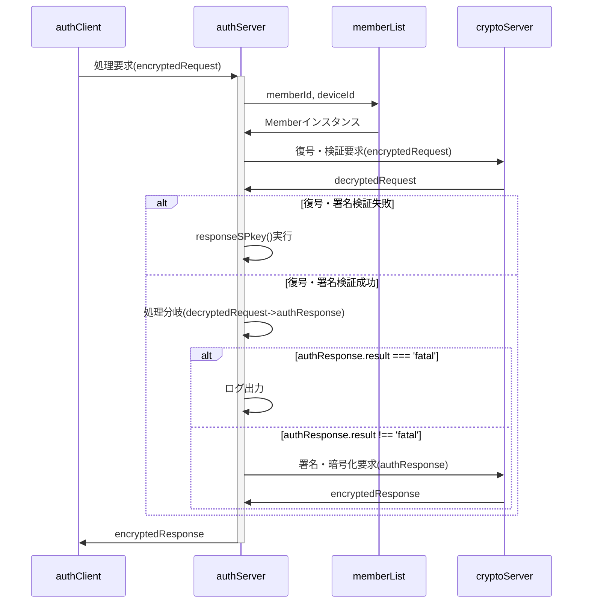
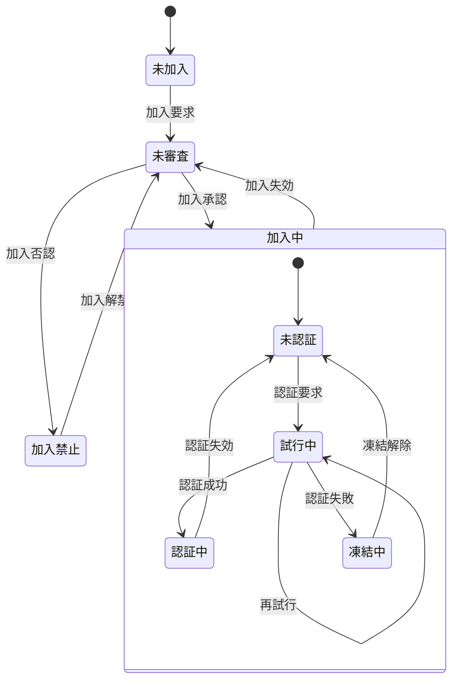

# authServer 関数 仕様書

## 🧭 概要

authServerは、クライアント（authClient）からの暗号化通信リクエストを復号・検証し、
メンバ状態と要求内容に応じてサーバ側処理を適切に振り分ける中核関数です。

## ■ 設計方針

- クロージャ関数とする

## 🧩 内部構成(クラス変数)

### authScriptProperties

キー名は`authConfig.system.name`、データは以下のオブジェクトをJSON化した文字列。

| No | 項目名 | 任意 | データ型 | 既定値 | 説明 |
| --: | :-- | :--: | :-- | :-- | :-- |
| 1 | keyGeneratedDateTime | ❌ | number |  | UNIX時刻 |
| 2 | SPkey | ❌ | string |  | PEM形式の公開鍵文字列 |
| 3 | SSkey | ❌ | string |  | PEM形式の秘密鍵文字列（暗号化済み） |
| 4 | oldSPkey | ❌ | string |  | cryptoServer.reset実行前にバックアップした公開鍵 |
| 5 | oldSSkey | ❌ | string |  | cryptoServer.reset実行前にバックアップした秘密鍵 |
| 6 | requestLog | ⭕ | authRequestLog[] |  | 重複チェック用のリクエスト履歴 |

### `memberList`シート

メンバ一覧(アカウント管理表)上のメンバ単位の管理情報

| No | 項目名 | 任意 | データ型 | 既定値 | 説明 |
| --: | :-- | :--: | :-- | :-- | :-- |
| 1 | memberId | ❌ | string |  | メンバの識別子(=メールアドレス) |
| 2 | name | ❌ | string |  | メンバの氏名 |
| 3 | status | ⭕ | string | 未加入 | メンバの状態。未加入,未審査,審査済,加入中,加入禁止 |
| 4 | log | ❌ | string |  | メンバの履歴情報(MemberLog)を保持するJSON文字列 |
| 5 | profile | ❌ | string |  | メンバの属性情報(MemberProfile)を保持するJSON文字列 |
| 6 | device | ❌ | string |  | マルチデバイス対応のためのデバイス情報(MemberDevice[])を保持するJSON文字列 |
| 7 | note | ⭕ | string |  | 当該メンバに対する備考 |

## 🧱 メイン処理

### 概要

- classのconstructor()に相当
- 引数はauthServer内共有用の変数`pv`に保存

#### 処理分岐

- 重複リクエストチェック。 
  authScriptProperties.requestLogに重複したリクエストが存在しないかチェック、存在すればthrow。 
  同時にauthServerConfig.requestIdRetention以上経過したリクエスト履歴は削除。
- cryptoServer.decryptでの復号・署名検証失敗
  - `responseSPkey()`メソッドを呼び出し
- cryptoServer.decryptでの復号・署名検証成功
  - `decryptedResponse.request.func`がauthClient内発処理か判定(`func.match(/::(.+)::/)`)
  - 内発処理の場合、文字列(`$1`の部分)に従ってメソッドを呼び出し
    | 文字列 | 呼び出すメソッド |
    | :-- | :-- |
    | updateCPkey | updateCPkey() |
    | passcode | loginTrial() |
  - 内発処理では無い場合
    - 当該メンバの状態を確認(`Member.getStatus()`)
    - 以下の表に従って処理分岐

      No | 状態 | 動作(①処理、②Member設定変更、③戻り値)
      :-- | :-- | :--
      1 | 未加入 | memberList未登録 ⇒ `membershipRequest()`メソッドを呼び出し
      2 | 未審査 | memberList登録済だが、管理者による加入認否が未決定(=加入審査状況の問合せ) ⇒ `notifyAcceptance()`メソッドを呼び出し
      3 | 審査済 | 管理者による加入認否が決定済 ⇒ `notifyAcceptance()`メソッドを呼び出し
      4.1 | 未認証 | 認証(ログイン)不要の処理しか行えない状態。 無権限で行える処理 ⇒ `callFunction()`メソッドを呼び出し 無権限では行えない処理 ⇒ `loginTrial()`メソッドを呼び出し
      4.2 | 試行中 | パスコードによる認証を試行している状態 ⇒ `loginTrial()`メソッドを呼び出し
      4.3 | 認証中 | 認証が通り、ログインして認証が必要な処理も行える状態 ⇒ `callFunction()`メソッドを呼び出し
      4.4 | 凍結中 | 規定の試行回数連続して認証に失敗し、再認証要求が禁止された状態 ⇒ `loginTrial()`メソッドを呼び出し
      5 | 加入禁止 | 管理者により加入が否認された状態 ⇒ `notifyAcceptance()`メソッドを呼び出し

#### 参考：メンバの状態遷移

No | 状態 | 説明
:-- | :-- | :--
1 | 未加入 | memberList未登録
2 | 未審査 | memberList登録済だが、管理者による加入認否が未決定
3 | 加入中 | 管理者により加入が承認された状態
3.1 | 未認証 | 認証(ログイン)不要の処理しか行えない状態
3.2 | 試行中 | パスコードによる認証を試行している状態
3.3 | 認証中 | 認証が通り、ログインして認証が必要な処理も行える状態
3.4 | 凍結中 | 規定の試行回数連続して認証に失敗し、再認証要求が禁止された状態
4 | 加入禁止 | 管理者により加入が否認された状態

### 📤 入力項目

#### encryptedRequest

- authClientからauthServerに渡す暗号化された処理要求オブジェクト
- ciphertextはauthRequestをJSON化、RSA-OAEP暗号化＋署名付与した文字列
- memberId,deviceIdは平文

| No | 項目名 | 任意 | データ型 | 既定値 | 説明 |
| --: | :-- | :--: | :-- | :-- | :-- |
| 1 | memberId | ❌ | string |  | メンバの識別子(=メールアドレス) |
| 2 | deviceId | ❌ | string |  | デバイスの識別子 |
| 3 | ciphertext | ❌ | string |  | 暗号化した文字列 |

### 📥 出力項目

#### encryptedResponse

- authServerからauthClientに返す暗号化された処理結果オブジェクト
- ciphertextはauthResponseをJSON化、RSA-OAEP暗号化＋署名付与した文字列

| No | 項目名 | 任意 | データ型 | 既定値 | 説明 |
| --: | :-- | :--: | :-- | :-- | :-- |
| 1 | ciphertext | ❌ | string |  | 暗号化した文字列 |

## メイン処理の処理分岐から呼ばれるメソッド群

- 引数はいずれも`authRequest`型、戻り値は`authResponse`型のオブジェクト

### 🧱 membershipRequest()

- 新規メンバ加入要求を登録。管理者へメール通知。
- 戻り値は`{result:'warning',message:'registerd'}` 
  ⇒ authClientでメンバに「加入申請しました。管理者による加入認否結果は後程メールでお知らせします」表示

### 🧱 notifyAcceptance()

- 加入審査状況の問合せへの回答
- 審査結果が未決定の場合(Member.log.approval/denialが両方0)、戻り値は`{result:'warning',message:'under review'}` 
  ⇒ authClientでメンバに「現在審査中です。今暫くお待ちください」表示
- 審査の結果加入不可の場合(Member.log.denial>0)、戻り値は`{result:'warning',message:'denial'}` 
  ⇒ authClientでメンバに「残念ながら加入申請は否認されました」表示

※ 審査結果が「加入OK」となっていた場合、Member.getStatus==='未認証'となるので、このメソッドは呼ばれない

### 🧱 loginTrial()

ログイン要求を処理し、試行結果をMemberTrialに記録する

- メンバが「未認証」の場合(=新たなログイン試行の場合)
  - 認証要求日時を設定(`Member.log.loginRequest = Date.now()`)
  - `Member.trial.log`の先頭に試行ログ(MemberTrialLogオブジェクト)を追加
  - パスコード通知メールをメンバに送信
  - 戻り値は`{result:'warning',message:'send passcode'}` ⇒ authClientはこれを受けパスコード再入力画面を表示
- メンバが「試行中」の場合、入力されたパスコードが正しいか検証
  - 正しかった場合
    - 認証成功日時を設定(`Member.log.loginSuccess = Date.now()`)
    - 認証有効期限を設定(`Member.log.loginExpiration = Date.now() + authServerConfig.loginLifeTime`)
  - 正しくなかった場合
    - 試行回数上限(authServerConfig.maxTrial)以下の場合
      - 戻り値は`{result:'warning',message:'unmatch'}` ⇒ authClientはこれを受けパスコード再入力画面を表示
    - 試行回数が上限に達した場合は「凍結中」に遷移
      - 認証失敗日時を設定(`Member.log.loginFailure = Date.now()`)
      - 認証無効期限を設定(`Member.log.unfreezeLogin = Date.now() + authServerConfig.loginFreeze`)
      - 戻り値は`{result:'warning',message:'freezing'}` ⇒ authClientはこれを受け「パスコードが連続して不一致だったため、現在アカウントは凍結中です。時間をおいて再試行してください」表示

### 🧱 callFunction()

- authServerConfig.funcを参照し、該当関数を実行。

### 🧱 updateCPkey()

- memberList上の該当するmemberId/deviceIdのCPkeyをauthRequest.signatureの値で更新する 
- 未更新のMember.CPkeyでencryptedResonseを作成し、authClientに返す 
- authClientはencryptedResonse受信時点では旧CPkeyで復号・署名検証を行い、サーバ側更新成功を受けてIndexedDBの更新を行う

<!-- Review: CPkey更新時に同時アクセスを防止するロック管理を追加検討。
⇒ ロック管理手順が複雑になりそうなこと、また運用上必要性が高いとは考えにくいことから見送り。
-->

## その他のメソッド群

### 🧱 responseSPkey(arg)

- クライアントから送られた文字列がCPkeyと推定される場合に、SPkeyを暗号化して返却。
- 公開鍵として不適切な文字列の場合、`{status:'fatal'}`を返す

### 🧱 setupEnvironment()

- 初期環境の整備を行う。GAS初回実行時の権限確認処理も含む。
- クラスで`static`で定義した関数のように、`authServer.setupEnvironment()`形式での実行を想定
- ScriptProperties未設定なら設定
- memberListへのアクセス(ダミー)
- admin宛テストメールの送信

### 🧱 resetSPkey()

- 緊急時用。authServerの鍵ペアを更新する
- クラスで`static`で定義した関数のように、`authServer.resetSPkey()`形式での実行を想定
- 引数・戻り値共に無し

### 🧱 listNotYetDecided()

- シートのメニューから呼び出す
- 加入否認が未定のメンバをリストアップ、順次認否入力のダイアログを表示
- 入力された認否をmemberListに記入(Member.log.approval/denial)
- 認否が確定したメンバに対して結果通知メールを発行

## ⏰ メンテナンス処理

## 🔐 セキュリティ仕様

## 🧾 エラーハンドリング仕様
