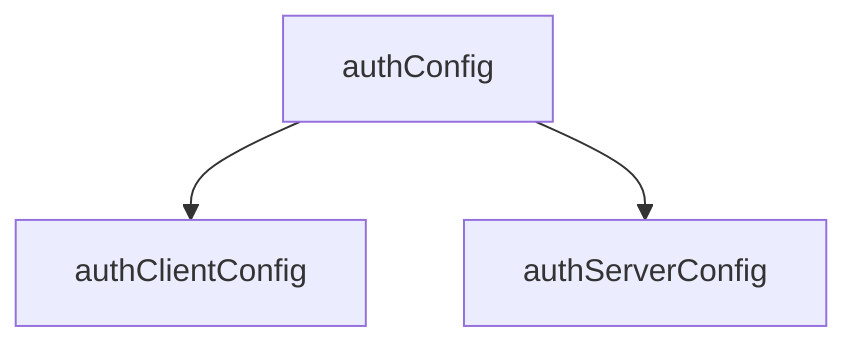
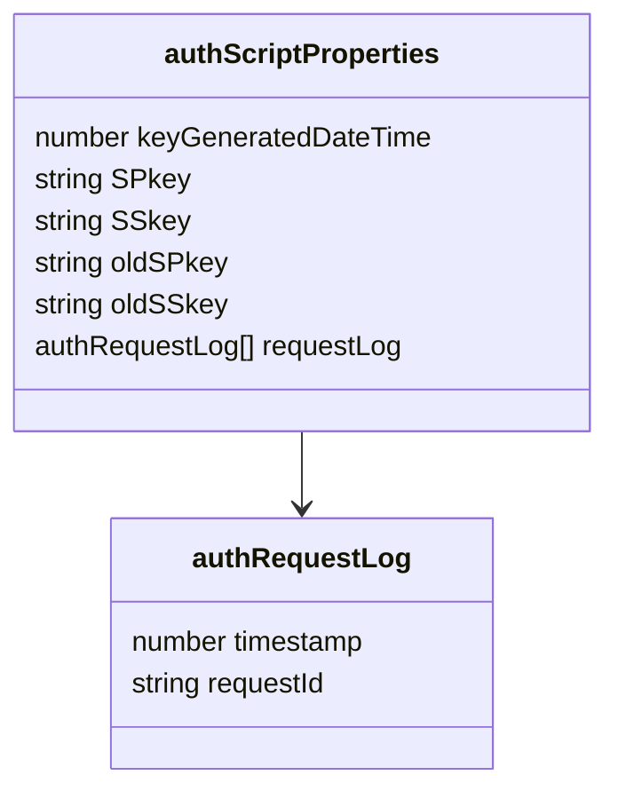
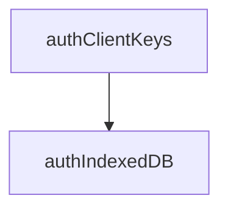
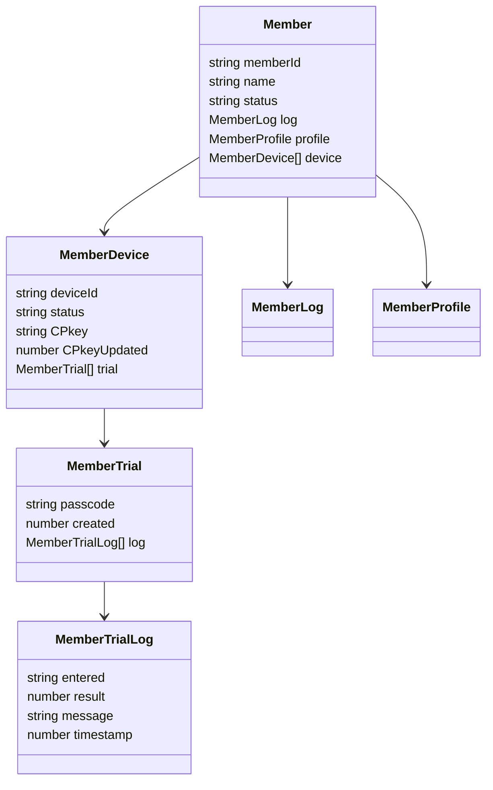

<div style="text-align: right;">

[総説](spec.md) | [authClient](authClient.md) | [cryptoClient](cryptoClient.md) | [authServer](authServer.md) |  [cryptoServer](cryptoServer.md) |  [Member](Member.md) | [クラス一覧](classes.md#list) | [JSLib](JSLib.md)

</div>

# auth関係 データ型定義

[クラス一覧](#list) | [動作環境設定系](#config) | [鍵ペア他の格納](storage) | [通信・暗号化系](#crypto) | [メンバ管理系](#member) | [監査・エラーログ系](#log)

## ドキュメントの目的

各クラス・データ型の定義を一覧化し、仕様の整合性を確保すること。

## 方針

- データ型命名規約
	- 例：auth* = 内部処理系, Member* = メンバ管理系, Local* = クライアント内通信系
- クラスに限らずクロージャ関数も、一覧に記載のメンバをインスタンス変数として持つ
- 全てのクラス・クロージャ関数はインスタンス生成時、起動時引数オブジェクトでインスタンス変数を上書きする
- 起動時引数オブジェクトで定義に無いメンバは廃棄する(インスタンス変数として追加しない)
- 以下のクラス定義で「クロージャ関数」と有った場合、以下のような構造を想定する。

<details><summary>例：非同期初期化を持つクラス相当のクロージャ</summary>

```js
async function Example() {
  // 非同期初期化処理
  const data = await fetch('/api/data').then(r => r.json());

  // プライベート変数。本仕様書内では「メンバ」として定義。
  let count = 0;

  // この部分を「メイン処理」と呼称、本仕様書内では"constructor"として記述

  // メソッド群（クロージャとしてプライベート変数にアクセス可能）
  return {
    getData() {
      return data;
    },
    increment() {
      count++;
      return count;
    },
    getCount() {
      return count;
    }
  };
}

// 使用例
(async () => {
  const obj = await Example(); // awaitできる！
  console.log(obj.getData());
  console.log(obj.increment()); // => 1
})();
```

</details>

## <span id="list">クラス一覧</span>

※ "constructorは省略"

| No | クラス名 | 概要 |
| --: | :-- | :-- |
| 1 | [authAuditLog](authAuditLog.md) | authServerの監査ログ |
| | <span style="padding-left:2rem"><a href="authAuditLog.md#authauditlog_log">log()</a></span> | 監査ログシートに処理要求を追記 |
| 2 | [authClient](authClient.md) | クライアント側auth中核クラス |
| | <span style="padding-left:2rem"><a href="authClient.md#authclient_checkcpkey">checkCPkey()</a></span> | CPkey残有効期間をチェック |
| | <span style="padding-left:2rem"><a href="authClient.md#authclient_enterpasscode">enterPasscode()</a></span> | パスコード入力ダイアログを表示 |
| | <span style="padding-left:2rem"><a href="authClient.md#authclient_exec">exec()</a></span> | ローカル関数からの要求受付 |
| | <span style="padding-left:2rem"><a href="authClient.md#authclient_setupenvironment">setupEnvironment()</a></span> | SPkey入手等、authClient動作環境整備 |
| | <span style="padding-left:2rem"><a href="authClient.md#authclient_showmessage">showMessage()</a></span> | メッセージをダイアログで表示 |
| 3 | [authClientConfig](authClientConfig.md) | authClient専用の設定値 |
| 4 | [authClientKeys](authClientKeys.md) | クライアント側鍵ペアの生成 |
| 5 | [authConfig](authConfig.md) | authClient/authServer共通設定値 |
| 6 | [authErrorLog](authErrorLog.md) | authServerのエラーログ |
| | <span style="padding-left:2rem"><a href="authErrorLog.md#autherrorlog_log">log()</a></span> | エラーログをシートに出力 |
| 7 | [authIndexedDB](authIndexedDB.md) | クライアントのIndexedDB |
| | <span style="padding-left:2rem"><a href="authIndexedDB.md#authindexeddb_getprop">getProp()</a></span> | IndexedDBの値を取得、インスタンス変数に格納 |
| | <span style="padding-left:2rem"><a href="authIndexedDB.md#authindexeddb_setprop">setProp()</a></span> | IndexedDBの値をインスタンス変数で更新(生成) |
| 8 | [authRequest](authRequest.md) | 暗号化前の処理要求 |
| 9 | [authRequestLog](authRequestLog.md) | 重複チェック用のリクエスト履歴 |
| 10 | [authResponse](authResponse.md) | 暗号化前の処理結果 |
| 11 | [authScriptProperties](authScriptProperties.md) | サーバ側のScriptProperties |
| | <span style="padding-left:2rem"><a href="authScriptProperties.md#authscriptproperties_checkduplicate">checkDuplicate()</a></span> | クライアントからの重複リクエストチェック |
| | <span style="padding-left:2rem"><a href="authScriptProperties.md#authscriptproperties_deleteprop">deleteProp()</a></span> | ScriptPropertiesを消去 |
| | <span style="padding-left:2rem"><a href="authScriptProperties.md#authscriptproperties_getprop">getProp()</a></span> | ScriptPropertiesをインスタンス変数に格納 |
| | <span style="padding-left:2rem"><a href="authScriptProperties.md#authscriptproperties_resetspkey">resetSPkey()</a></span> | SPkeyを更新、ScriptPropertiesに保存 |
| | <span style="padding-left:2rem"><a href="authScriptProperties.md#authscriptproperties_setprop">setProp()</a></span> | インスタンス変数をScriptPropertiesに格納 |
| 12 | [authServer](authServer.md) | サーバ側auth中核クラス |
| | <span style="padding-left:2rem"><a href="authServer.md#authserver_callfunction">callFunction()</a></span> | authServerConfig.funcを参照し、該当関数を実行 |
| | <span style="padding-left:2rem"><a href="authServer.md#authserver_exec">exec()</a></span> | doPostから呼ばれ、authClientからの要求を処理 |
| | <span style="padding-left:2rem"><a href="authServer.md#authserver_listnotyetdecided">listNotYetDecided()</a></span> | 加入認否未定メンバのリストアップと認否入力 |
| | <span style="padding-left:2rem"><a href="authServer.md#authserver_logintrial">loginTrial()</a></span> | ログイン要求を処理し、試行結果をMemberTrialに記録 |
| | <span style="padding-left:2rem"><a href="authServer.md#authserver_membershiprequest">membershipRequest()</a></span> | 新規メンバ加入要求を登録、管理者へメール通知。 |
| | <span style="padding-left:2rem"><a href="authServer.md#authserver_notifyacceptance">notifyAcceptance()</a></span> | 加入審査状況の問合せへの回答 |
| | <span style="padding-left:2rem"><a href="authServer.md#authserver_resetspkey">resetSPkey()</a></span> | 【緊急時用】authServerの鍵ペアを更新 |
| | <span style="padding-left:2rem"><a href="authServer.md#authserver_responsespkey">responseSPkey()</a></span> | クライアントからのSPkey要求への対応 |
| | <span style="padding-left:2rem"><a href="authServer.md#authserver_setupenvironment">setupEnvironment()</a></span> | GAS初回実行時の権限確認を含む初期環境の整備 |
| | <span style="padding-left:2rem"><a href="authServer.md#authserver_updatecpkey">updateCPkey()</a></span> | CPkey更新処理 |
| 13 | [authServerConfig](authServerConfig.md) | authServer専用の設定値 |
| 14 | [cryptoClient](cryptoClient.md) | クライアント側の暗号化・復号処理 |
| | <span style="padding-left:2rem"><a href="cryptoClient.md#cryptoclient_decrypt">decrypt()</a></span> | authServer->authClientのメッセージを復号＋署名検証 |
| | <span style="padding-left:2rem"><a href="cryptoClient.md#cryptoclient_encrypt">encrypt()</a></span> | authClient->authServerのメッセージを暗号化＋署名 |
| | <span style="padding-left:2rem"><a href="cryptoClient.md#cryptoclient_fetch">fetch()</a></span> | 処理要求を署名・暗号化してサーバ側に問合せ、結果を復号・署名検証 |
| | <span style="padding-left:2rem"><a href="cryptoClient.md#cryptoclient_generatekeys">generateKeys()</a></span> | 新たなクライアント側鍵ペアを作成 |
| | <span style="padding-left:2rem"><a href="cryptoClient.md#cryptoclient_updatekeys">updateKeys()</a></span> | 引数で渡された鍵ペアでIndexedDBの内容を更新 |
| 15 | [cryptoServer](cryptoServer.md) | サーバ側の暗号化・復号処理 |
| | <span style="padding-left:2rem"><a href="cryptoServer.md#cryptoserver_decrypt">decrypt()</a></span> | authClientからのメッセージを復号＋署名検証 |
| | <span style="padding-left:2rem"><a href="cryptoServer.md#cryptoserver_encrypt">encrypt()</a></span> | authClientへのメッセージを署名＋暗号化 |
| | <span style="padding-left:2rem"><a href="cryptoServer.md#cryptoserver_generatekeys">generateKeys()</a></span> | 新たなサーバ側鍵ペアを作成 |
| 16 | [decryptedRequest](decryptedRequest.md) | 復号済の処理要求 |
| 17 | [decryptedResponse](decryptedResponse.md) | 復号済の処理結果 |
| 18 | [encryptedRequest](encryptedRequest.md) | 暗号化された処理要求 |
| 19 | [encryptedResponse](encryptedResponse.md) | 暗号化された処理結果 |
| 20 | [LocalRequest](LocalRequest.md) | ローカル関数からの処理要求 |
| 21 | [LocalResponse](LocalResponse.md) | ローカル関数への処理結果 |
| 22 | [Member](Member.md) | メンバ情報、管理 |
| | <span style="padding-left:2rem"><a href="Member.md#member_addtrial">addTrial()</a></span> | 新しい試行を登録し、メンバにパスコード通知メールを発信 |
| | <span style="padding-left:2rem"><a href="Member.md#member_checkpasscode">checkPasscode()</a></span> | 認証時のパスコードチェック |
| | <span style="padding-left:2rem"><a href="Member.md#member_getmember">getMember()</a></span> | 指定メンバの情報をmemberListシートから取得 |
| | <span style="padding-left:2rem"><a href="Member.md#member_judgemember">judgeMember()</a></span> | 加入審査画面から審査結果入力＋結果通知 |
| | <span style="padding-left:2rem"><a href="Member.md#member_judgestatus">judgeStatus()</a></span> | 指定メンバ・デバイスの状態を[状態決定表](#member_policy_decisiontable)により判定 |
| | <span style="padding-left:2rem"><a href="Member.md#member_reissuepasscode">reissuePasscode()</a></span> | パスコードを再発行する |
| | <span style="padding-left:2rem"><a href="Member.md#member_removemember">removeMember()</a></span> | 登録中メンバをアカウント削除、または加入禁止にする |
| | <span style="padding-left:2rem"><a href="Member.md#member_restoremember">restoreMember()</a></span> | 加入禁止(論理削除)されているメンバを復活させる |
| | <span style="padding-left:2rem"><a href="Member.md#member_setmember">setMember()</a></span> | 指定メンバ情報をmemberListシートに保存 |
| | <span style="padding-left:2rem"><a href="Member.md#member_unfreeze">unfreeze()</a></span> | 指定されたメンバ・デバイスの「凍結中」状態を強制的に解除 |
| | <span style="padding-left:2rem"><a href="Member.md#member_updatecpkey">updateCPkey()</a></span> | 対象メンバ・デバイスの公開鍵を更新する |
| 23 | [MemberDevice](MemberDevice.md) | メンバのデバイス情報 |
| 24 | [MemberLog](MemberLog.md) | メンバの各種要求・状態変化の時刻 |
| | <span style="padding-left:2rem"><a href="MemberLog.md#memberlog_prohibitjoining">prohibitJoining()</a></span> | 「加入禁止」状態に変更する |
| 25 | [MemberProfile](MemberProfile.md) | メンバの属性情報 |
| 26 | [MemberTrial](MemberTrial.md) | ログイン試行情報の管理・判定 |
| | <span style="padding-left:2rem"><a href="MemberTrial.md#membertrial_loginattempt">loginAttempt()</a></span> | 入力されたパスコードの判定 |
| 27 | [MemberTrialLog](MemberTrialLog.md) | パスコード入力単位の試行記録 |

## <span id="config">1 動作環境設定系</span>



| No | クラス名 | 概要 |
| --: | :-- | :-- |
| 5 | [authConfig](authConfig.md) | authClient/authServer共通設定値 |
| 3 | [authClientConfig](authClientConfig.md) | authClient専用の設定値 |
| 13 | [authServerConfig](authServerConfig.md) | authServer専用の設定値 |

## <span id="storage">2 鍵ペア他の格納</span>



| No | クラス名 | 概要 |
| --: | :-- | :-- |
| 11 | [authScriptProperties](authScriptProperties.md) | サーバ側のScriptProperties |
| 9 | [authRequestLog](authRequestLog.md) | 重複チェック用のリクエスト履歴 |



| No | クラス名 | 概要 |
| --: | :-- | :-- |
| 4 | [authClientKeys](authClientKeys.md) | クライアント側鍵ペア |
| 7 | [authIndexedDB](authIndexedDB.md) | クライアントのIndexedDB |


## <span id="crypto">3 通信・暗号化系</span>

| No | クラス名 | 概要 |
| --: | :-- | :-- |
| 20 | [LocalRequest](LocalRequest.md) | ローカル関数からの処理要求 |
| 8 | [authRequest](authRequest.md) | 暗号化前の処理要求 |
| 14 | [cryptoClient](cryptoClient.md) | クライアント側の暗号化・復号処理 |
| 18 | [encryptedRequest](encryptedRequest.md) | 暗号化された処理要求 |
| 15 | [cryptoServer](cryptoServer.md) | サーバ側の暗号化・復号処理 |
| 16 | [decryptedRequest](decryptedRequest.md) | 復号済の処理要求 |
| 10 | [authResponse](authResponse.md) | 暗号化前の処理結果 |
| 19 | [encryptedResponse](encryptedResponse.md) | 暗号化された処理結果 |
| 17 | [decryptedResponse](decryptedResponse.md) | 復号済の処理結果 |
| 21 | [LocalResponse](LocalResponse.md) | ローカル関数への処理結果 |

※ [cryptoServer.decryptの処理結果](cryptoServer.md#decrypt-returns)

## <span id="member">4 メンバ管理系</span>

<span id="member_classdiagram">クラス図</span>



| No | クラス名 | 概要 |
| --: | :-- | :-- |
| 22 | [Member](Member.md) | メンバ単位の管理情報 |
| 23 | [MemberDevice](MemberDevice.md) | メンバのデバイス情報 |
| 24 | [MemberLog](MemberLog.md) | メンバの各種要求・状態変化の時刻 |
| 25 | [MemberProfile](MemberProfile.md) | メンバの属性情報 |
| 26 | [MemberTrial](MemberTrial.md) | ログイン試行情報の管理・判定 |
| 27 | [MemberTrialLog](MemberTrialLog.md) | パスコード入力単位の試行記録 |

## <span id="log">5 監査・エラーログ系</span>

| No | クラス名 | 概要 |
| --: | :-- | :-- |
| 1 | [authAuditLog](authAuditLog.md) | authServerの監査ログ |
| 6 | [authErrorLog](authErrorLog.md) | authServerのエラーログ |
