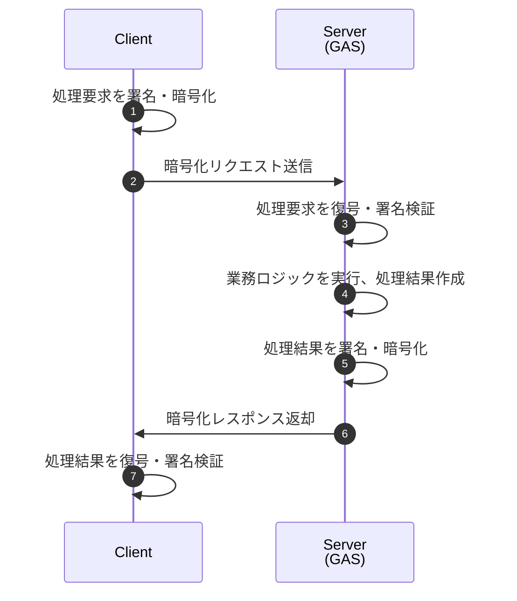

<style> /* 仕様書用共通スタイル定義 */
  .l1 { /* トップレベル(level.1)のタイトル */
    padding: 1rem 2rem;
    border-left: 5px solid #000;
    background: #f4f4f4;
    font-size: 2.4rem;
    font-weight: 900;
  }
  .source { /* 出典元のソースファイル名(リンクは無し) */
    text-align:right; font-size:0.8rem;}
  .submenu {  /* MD内のサブメニュー。右寄せ＋文字サイズ小 */
    text-align: right;
    font-size: 0.8rem;
  }
  .nowrap td {white-space:nowrap;} /* 横長な表を横スクロール */
  .nowrap b {background:yellow;}

  .popup {color:#084} /* titleに文字列を設定した項目 */
  td {white-space:nowrap;}
</style>
<div style="text-align: right;">

[総説](readme.md) | [CL/SV共通](common/index.md) | [CL側](client/index.md) | [SV側](server/index.md) | [暗号化](crypto.md) | [メンバ](Member.md) | [開発](dev.md)

</div>

<p id="top" class="l1">暗号化・署名方式</p>

1. [目的と前提](#perpose)
1. [用語と略称](#term)
1. [設計方針](#policy)
1. [パラメータ・初期値](#parameter)
1. [署名・暗号化対象JSON](#JSON)
1. [NonceとReplay防止](#nonce)
1. [署名・検証の順序](#order)
1. [互換性と拡張性の提案](#compatibility)

■ 概要



- ①処理要求を署名・暗号化
  1. authRequest を JSON 正規化
  2. 正規化JSONに署名（RSA-PSS, クライアント秘密鍵）
  3. authRequest + signature を AES-256-GCM で暗号化
  4. AES共通鍵を RSA-OAEP（サーバ公開鍵）で暗号化
- ③処理要求を復号・署名検証
  1. RSA-OAEPでAES鍵を復号（サーバ秘密鍵）
  2. AES-256-GCMでauthRequestを復号
  3. 署名検証（RSA-PSS, クライアント公開鍵）
- ⑤処理結果を署名・暗号化
  1. 応答データを署名
  1. 応答を暗号化
- ⑦処理結果を復号・署名検証
  1. レスポンスを復号
  1. 署名検証

## <span id="perpose"><a href="#top">目的と前提</a></span>

本項はAuth プロジェクトにおける**暗号化・署名の最終仕様**を一箇所にまとめたものである。他のAuth関係仕様書で本項と矛盾する記述が有った場合、本項が優先する。

**前提**
- 実装は RSA + AES-256-GCM のハイブリッド暗号方式を用いる。
  - ペイロード本体は AES-256-GCM で暗号化
  - AES鍵（共通鍵）のみを RSA-OAEP で暗号化
- `authConfig.md` の `RSAbits`(既定値 2048)で鍵長を指定する。
- 環境はブラウザ（WebCrypto）クライアントと Google Apps Script（サーバ）を想定。GAS の制約（永続ストレージ・実行時間）に配慮する。

## <span id="term"><a href="#top">用語と略称</a></span>

- RSA-OAEP: RSA Encryption with OAEP padding（暗号化用）
- RSA-PSS: RSA Probabilistic Signature Scheme（署名用）
- RSAbits: RSA 鍵長（例: 2048）
- nonce: 一意なリクエスト識別子（UUID v4 等）
- requestTime: クライアント生成 UNIX ms（例: Date.now()）
- replay cache: サーバで管理する最近利用された nonce の履歴([authScriptProperties.requestLog](authScriptProperties.md#authscriptproperties_members)でTTL管理)

## <span id="policy"><a href="#top">設計方針</a></span>

1. **機密性**:
   - authRequest / authResponse 全体を AES-256-GCM で暗号化する
   - AES鍵（共通鍵）は RSA-OAEP で暗号化し、envelope に格納する
2. **完全性/認証**:
   - 署名は RSA-PSS（SHA-256）で行う
   - 署名対象は「暗号化前の authRequest / authResponse（正規化JSON）」とする
3. **リプレイ対策**: `nonce` + `requestTime` の組合せを必須にする。サーバは nonce の一意性を検査し、同一 nonce は拒否する。
4. **可搬性**: 暗号パラメータは `authConfig.md` の `RSAbits` を参照する。
5. **可観測性**: 失敗時は詳細な内部メッセージをログ（authErrorLog / authAuditLog）に残すが、クライアントには汎用的なエラーメッセージを返す。

## <span id="parameter"><a href="#top">パラメータ・初期値</a></span>

- RSA 鍵長: **2048**（`RSAbits` のデフォルト）
- ハッシュ: **SHA-256**
- 署名方式: **RSA-PSS（saltLength = auto）**
- 暗号化方式: **RSA-OAEP（SHA-256）**
- nonce 型: **UUID v4**（文字列）
- 許容誤差: **±2分（120,000 ms）** authConfig.[allowableTimeDifference](sv/authConfig.md#authconfig_members)で規定。

## <span id="JSON"><a href="#top">署名・暗号化対象JSON</a></span>

クライアントが署名・暗号化する対象は**JSONリクエスト構造ではなく authRequest インスタンスそのもの**とする。

**署名対象**: `header` + `payload` の両方を canonicalize（キー順ソート、UTF-8）した文字列に対して `RSA-PSS(SHA-256)` で署名し、署名値を `signature` フィールドとして追加する。

**最終送信フォーマット**:

- 処理要求 : [encryptedRequest](cl/encryptedRequest.md#encryptedrequest_members)
- 処理結果 : [encryptedResponse](sv/encryptedResponse.md#encryptedresponse_members)

※ encryptedResponse（サーバ→クライアント）は同一構造を持ち、暗号化対象が authResponse、署名鍵がサーバ鍵になる点のみが異なる。

■ 最終送信フォーマットの例

```json
{
  "envelope": {
    "cipher": "<base64 AES-256-GCM で暗号化された JSON>",
    "encryptedKey": "<base64 RSA-OAEP で暗号化された AES 共通鍵>",
    "iv": "<base64 AES-GCM IV>",
    "tag": "<base64 AES-GCM 認証タグ>"
  },
  "signature": "<base64 RSA-PSS signature over canonical JSON>",
  "meta": {
    "rsabits": 2048,
    "sym": "AES-256-GCM"
  }
}
```

## <span id="nonce"><a href="#top">NonceとReplay防止</a></span>

- サーバは `requestTime` と `nonce` の両方を検査する。リプレイ閾値を満たす場合でも `nonce` が既に使われていれば拒否する。
- replay cacheの実装では、ScriptPropertiesにJSONバッファを持たせ、短時間のTTLとする

### サーバ側検査アルゴリズム

1. 受信 → `header.requestTime` が現在時刻と比較して許容誤差内か確認
2. `header.nonce` が既に replay cache に存在するか確認
   - 存在する → 拒否（リプレイ）
   - 存在しない → 登録（TTL を設定）
3. 署名検証（RSA-PSS）
4. 復号（該当する場合）
5. 正常処理後、nonce の TTL 更新は行わない（使い捨て）

## <span id="order"><a href="#top">署名・検証の順序</a></span>

1. クライアントは canonical JSON を署名（RSA-PSS）
2. クライアントは署名済みの JSON を暗号化（RSA-OAEP）して `envelope.cipher` に格納（暗号化する場合）
3. サーバは受信 → 復号 → canonical JSON の署名検証 → requestTime/nonce チェック → 業務ロジック

> 注: 署名を暗号化の後に検証するケースや、暗号化後に署名（外側）を行うケースもあるが、上記の順序は「署名の透明性」と「復号の後で署名検証」が保証され、安全です。

### canonical JSON 仕様

署名対象となる canonical JSON は、以下の条件を満たすものとする。

1. JSON オブジェクトのキー順は **辞書順（Unicode code point 昇順）**
2. 数値は変換せず、そのままの数値表現を用いる
3. 文字列は UTF-8 とし、エスケープは JSON 標準に従う
4. 不要な空白・改行は含めない（minified JSON）
5. undefined / function / Symbol 等は含めない

この canonical JSON 文字列に対して RSA-PSS(SHA-256) 署名を行う。

## <span id="compatibility"><a href="#top">互換性と拡張性の提案</a></span>

- `meta.rsabits` を送ることでクライアントとサーバが鍵長を協調できる
- `meta.sym` により共通鍵方式の将来的な差し替えが可能

