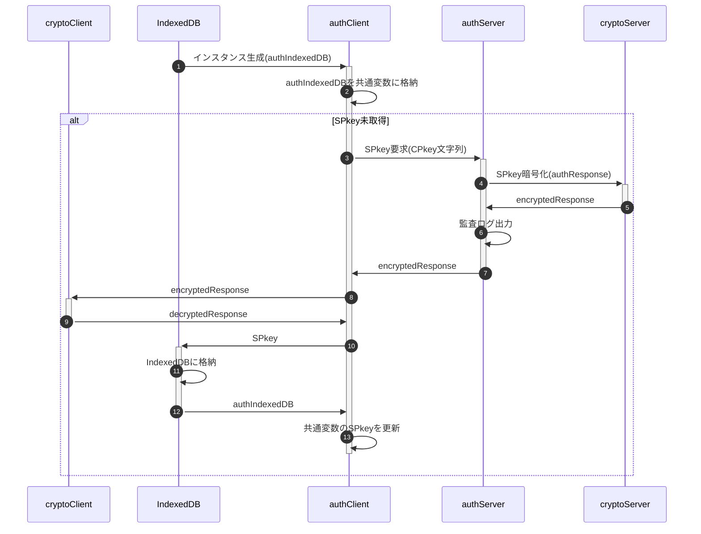
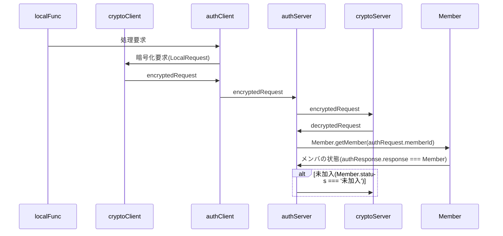
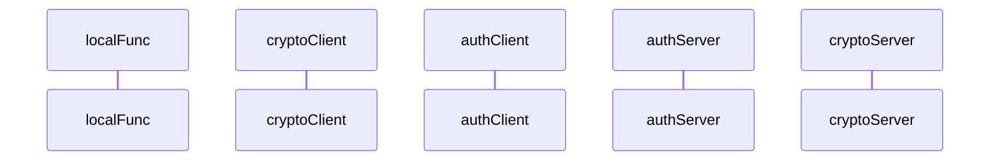

[総説](spec.md) | [authClient](authClient.md) | [authServer](authServer.md) | [cryptoClient](cryptoClient.md) | [cryptoServer](cryptoServer.md) | [Member](Member.md) | [データ型](typedef.md) | [内発処理](internalProcessing.md)

# authClient 内発処理

## SPkey要求

クライアント側にSPkeyが無い場合、authIndexedDBインスタンス生成時に取得

- エラー発生時はauthServerからauthClientへの返信は行わない

### ⑤authResponse設定値

| No | 項目名 | 設定値 |
| --: | :-- | :-- |
| 1 | timestamp | サーバ側処理時刻 |
| 2 | result | normal |
| 3 | message | — |
| 4 | request | — |
| 5 | response | SPkey |

## 新規登録要求

処理要求可能なメンバとして申請、管理者に承認されたらmemberListに新規登録

## CPkey更新

## パスコード入力

## パスコード再発行

