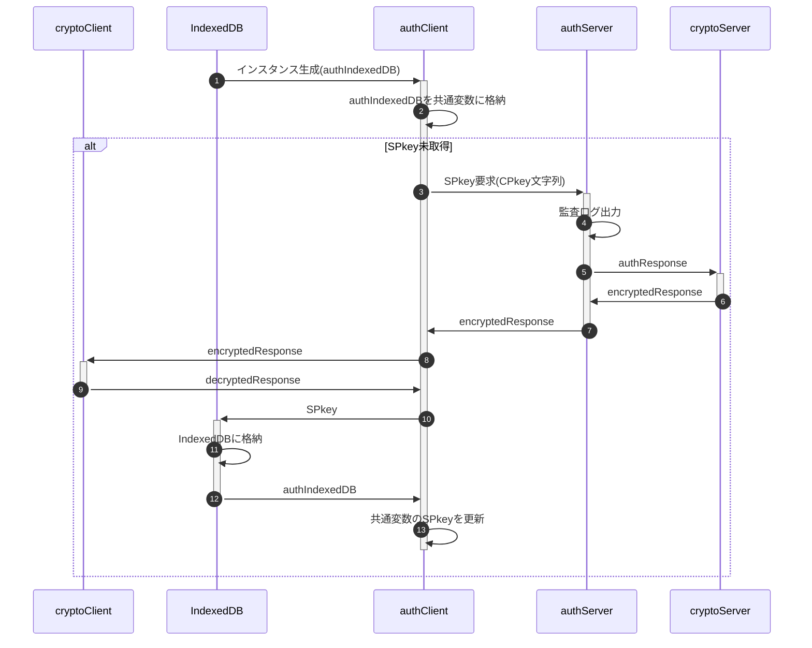
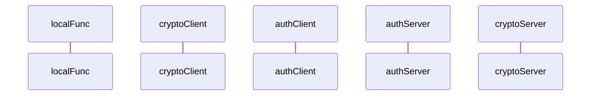

[総説](spec.md) | [authClient](authClient.md) | [authServer](authServer.md) | [cryptoClient](cryptoClient.md) | [cryptoServer](cryptoServer.md) | [Member](Member.md) | [データ型](typedef.md) | [内発処理](internalProcessing.md)

# authClient 内発処理

## SPkey要求

クライアント側にSPkeyが無い場合、authIndexedDBインスタンス生成時に取得

## 新規登録要求

