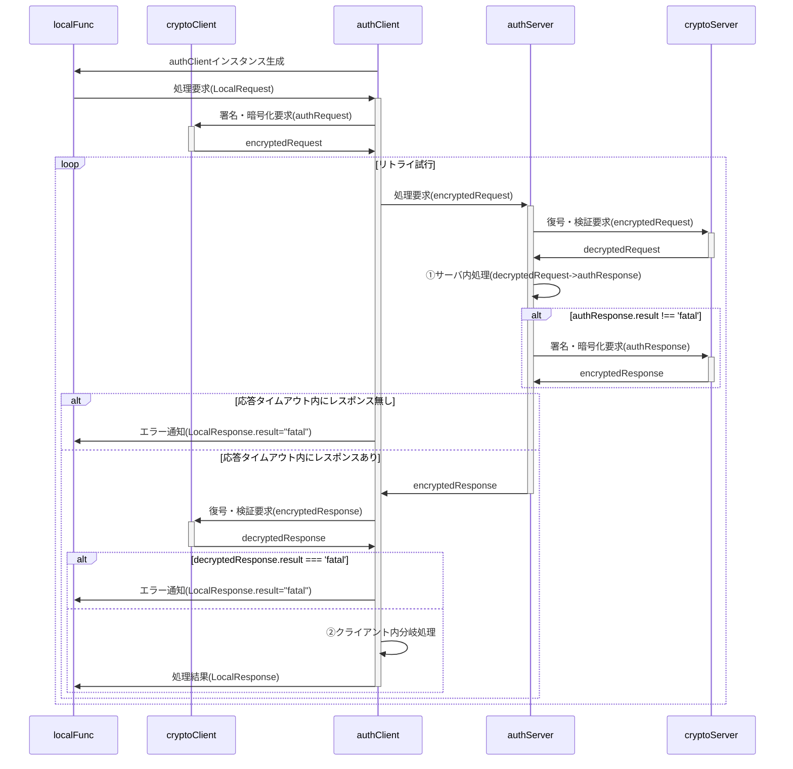

[総説](spec.md) | [authClient](authClient.md) | [authServer](authServer.md) | [cryptoClient](cryptoClient.md) | [cryptoServer](cryptoServer.md) | [Member](Member.md) | [データ型](typedef.md) | [内発処理](internalProcessing.md)

# "auth"総説

ブラウザ(クライアント)とGAS(サーバ)の間で認証された通信を行う。

## 要求仕様

- 本システムは限られた人数のサークルや小学校のイベント等での利用を想定する。 
  よってセキュリティ上の脅威は極力排除するが、恒久性・安全性より導入時の容易さ・技術的ハードルの低さ、運用の簡便性を重視する。
- サーバ側(以下authServer)はスプレッドシートのコンテナバインドスクリプト、クライアント側(以下authClient)はHTMLのJavaScript
- サーバ側・クライアント側とも鍵ペアを使用
- 原則として通信は受信側公開鍵で暗号化＋発信側秘密鍵で署名
- クライアントの識別(ID)はメールアドレスで行う

## 用語

- SPkey, SSkey：サーバ側の公開鍵(Server side Public key)と秘密鍵(Server side Secret key)
- CPkey, CSkey：クライアント側の公開鍵(Client side Public key)と秘密鍵(Client side Secret key)
- パスフレーズ：クライアント側鍵ペア作成時のキー文字列。JavaScriptで自動的に生成
- パスワード：運用時、クライアント(人間)がブラウザ上で入力する本人確認用の文字列
- パスコード：二段階認証実行時、サーバからクライアントに送られる6桁※の数字 
  ※既定値。実際の桁数はauthConfig.trial.passcodeLengthで規定

## 暗号化・署名方式、運用

- 署名方式 : RSA-PSS
- 暗号化方式 : RSA-OAEP
- ハッシュ関数 : SHA-256以上
- 許容時差±120秒※以内
  ※既定値。実際の桁数はauthConfig.cryptoServer.allowableTimeDifferenceで規定
- 順序は「暗号化->署名」ではなく「署名->暗号化」で行う
  1. クライアントがデータをJSON化
  2. 自身の秘密鍵で署名(署名→暗号化)
  3. サーバの公開鍵で暗号化
  4. サーバは復号後、クライアント公開鍵(memberList.CPkey)で署名を検証
- パスワードの生成は「ライブラリ > createPassword」を使用
- パスコードのメール送信は「ライブラリ > sendMail」を使用
- CPkeyの有効期限が切れた場合、以下の手順で更新する
  1. クライアント側から古いCPkeyで署名された要求を受信
  2. サーバ側で署名検証の結果、期限切れを確認
    - memberList.trial[0].CPkeyUpdateUntilに「現在日時＋authConfig.cryptoServer.loginLifeTime」をセット
    - クライアント側に通知
  3. クライアント側でCPkeyを更新、新CPkeyで再度リクエスト
  4. サーバ側でauthConfig.cryptoServer.loginLifeTimeを確認、期限内ならmemberList.CPkeyを書き換え。期限切れなら加入処理同様、adminによる個別承認を必要とする。
  5. 以降は未ログイン状態で要求が来た場合として処理を継続

# 処理手順

## localFuncからの処理要求時

- `localFunc`とは、クライアント側(ブラウザ)内で動作するJavaScriptの関数を指す
- ①サーバ内処理：decryptedRequestを入力としてメイン処理またはメソッドを実行
- ②クライアント内分岐処理：decryptedResponse.sv.resultに基づきメイン処理またはメソッドを実行
- 「リトライ試行」は以下の場合にループを抜ける
  - 応答タイムアウト内にauthServerからレスポンスが来なかった場合 
    ※`fetch timeout`を使用。許容時間は`authConfig.allowableTimeDifference`
  - ②クライアント内分岐処理の結果が'fatal'だった場合

# データ格納方法と形式

- 日時は特段の注記が無い限り、UNIX時刻でミリ秒単位で記録する(new Date().getTime())
- スプレッドシート(memberList)については[Memberクラス仕様書](Member.md)参照

# 動作設定変数(config)

## authConfig

- authClient/authServer共通で使用される設定値。
- authClientConfig, authServerConfigの親クラス

| No | 項目名 | 任意 | データ型 | 既定値 | 説明 |
| --: | :-- | :--: | :-- | :-- | :-- |
| 1 | systemName | ⭕ | string | auth | システム名 |
| 2 | adminMail | ❌ | string |  | 管理者のメールアドレス |
| 3 | adminName | ❌ | string |  | 管理者名 |
| 4 | allowableTimeDifference | ⭕ | number | 120000 | クライアント・サーバ間通信時の許容時差。既定値は2分 |
| 5 | RSAbits | ⭕ | string | 2048 | 鍵ペアの鍵長 |
| 6 | underDev | ❌ | Object |  | テスト時の設定 |
| 7 | underDev.isTest | ⭕ | boolean | false | 開発モードならtrue |

## authServerConfig

authConfigを継承した、authServerでのみ使用する設定値

| No | 項目名 | 任意 | データ型 | 既定値 | 説明 |
| --: | :-- | :--: | :-- | :-- | :-- |
| 1 | memberList | ⭕ | string | memberList | memberListシート名 |
| 2 | defaultAuthority | ⭕ | number | 1 | 新規加入メンバの権限の既定値 |
| 3 | memberLifeTime | ⭕ | number | 31536000000 | 加入有効期間(=メンバ加入承認後の有効期間)。既定値は1年 |
| 4 | prohibitedToJoin | ⭕ | number | 259200000 | 加入禁止期間(=管理者による加入否認後、再加入申請が自動的に却下される期間)。既定値は3日 |
| 5 | loginLifeTime | ⭕ | number | 86400000 | 認証有効時間(=ログイン成功後の有効期間、CPkeyの有効期間)。既定値は1日 |
| 6 | loginFreeze | ⭕ | number | 600000 | 認証凍結時間(=認証失敗後、再認証要求が禁止される期間)。既定値は10分 |
| 7 | requestIdRetention | ⭕ | number | 300000 | 重複リクエスト拒否となる時間。既定値は5分 |
| 8 | errorLog | ⭕ | string | errorLog | エラーログのシート名 |
| 9 | storageDaysOfErrorLog | ⭕ | number | 604800000 | 監査ログの保存日数。単位はミリ秒。既定値は7日分 |
| 10 | auditLog | ⭕ | string | auditLog | 監査ログのシート名 |
| 11 | storageDaysOfAuditLog | ⭕ | number | 604800000 | 監査ログの保存日数。単位はミリ秒。既定値は7日分 |
| 12 | func | ❌ | Object.<string,Object> |  | サーバ側の関数マップ 例：{registerMember:{authority:0b001,do:m=>register(m)},approveMember:{authority:0b100,do:m=>approve(m)}} |
| 13 | func.authority | ⭕ | number | 0 | サーバ側関数毎に設定される当該関数実行のために必要となるユーザ権限,`authServerConfig.func.authority === 0 || (Member.profile.authority & authServerConfig.func.authority > 0)`なら実行可とする。 |
| 14 | func.do | ❌ | Function |  | 実行するサーバ側関数 |
| 15 | trial | ❌ | Object |  | ログイン試行関係の設定値 |
| 16 | trial.passcodeLength | ⭕ | number | 6 | パスコードの桁数 |
| 17 | trial.maxTrial | ⭕ | number | 3 | パスコード入力の最大試行回数 |
| 18 | trial.passcodeLifeTime | ⭕ | number | 600000 | パスコードの有効期間。既定値は10分 |
| 19 | trial.generationMax | ⭕ | number | 5 | ログイン試行履歴(MemberTrial)の最大保持数。既定値は5世代 |
| 20 | underDev.sendPasscode | ⭕ | boolean | false | 開発中、パスコード通知メール送信を抑止するならtrue |
| 21 | underDev.sendInvitation | ⭕ | boolean | false | 開発中、加入承認通知メール送信を抑止するならtrue |

## authClientConfig

authConfigを継承した、authClientでのみ使用する設定値

| No | 項目名 | 任意 | データ型 | 既定値 | 説明 |
| --: | :-- | :--: | :-- | :-- | :-- |
| 1 | api | ❌ | string |  | サーバ側WebアプリURLのID(`https://script.google.com/macros/s/(この部分)/exec`) |
| 2 | timeout | ⭕ | number | 300000 | サーバからの応答待機時間。これを超えた場合はサーバ側でfatalとなったと解釈する。既定値は5分 |
| 3 | CPkeyGraceTime | ⭕ | number | 600000 | CPkey期限切れまでの猶予時間。CPkey有効期間がこれを切ったら更新処理実行。既定値は10分 |

# データ型(typedef)

## LocalRequest

- クライアント側関数からauthClientに渡すオブジェクト
- func,arg共、平文

| No | 項目名 | 任意 | データ型 | 既定値 | 説明 |
| --: | :-- | :--: | :-- | :-- | :-- |
| 1 | func | ❌ | string |  | サーバ側関数名 |
| 2 | arguments | ❌ | any[] |  | サーバ側関数に渡す引数の配列 |

## authRequest

authClientからauthServerに送られる、暗号化前の処理要求オブジェクト

| No | 項目名 | 任意 | データ型 | 既定値 | 説明 |
| --: | :-- | :--: | :-- | :-- | :-- |
| 1 | memberId | ❌ | string |  | メンバの識別子(=メールアドレス) |
| 2 | deviceId | ❌ | string |  | デバイスの識別子 |
| 3 | signature | ❌ | string |  | クライアント側署名 |
| 4 | requestId | ❌ | string |  | 要求の識別子。UUID |
| 5 | timestamp | ❌ | number |  | 要求日時。UNIX時刻 |
| 6 | func | ❌ | string |  | サーバ側関数名 |
| 7 | arguments | ❌ | any[] |  | サーバ側関数に渡す引数の配列 |

## encryptedRequest

- authClientからauthServerに送られる、暗号化された処理要求オブジェクト
- ciphertextはauthRequestをJSON化、RSA-OAEP暗号化＋署名付与した文字列
- memberId,deviceIdは平文

| No | 項目名 | 任意 | データ型 | 既定値 | 説明 |
| --: | :-- | :--: | :-- | :-- | :-- |
| 1 | memberId | ❌ | string |  | メンバの識別子(=メールアドレス) |
| 2 | deviceId | ❌ | string |  | デバイスの識別子 |
| 3 | ciphertext | ❌ | string |  | 暗号化した文字列 |

## decryptedRequest

encryptedRequestをcryptoServerで復号した処理要求オブジェクト

| No | 項目名 | 任意 | データ型 | 既定値 | 説明 |
| --: | :-- | :--: | :-- | :-- | :-- |
| 1 | result | ❌ | string |  | 処理結果。"fatal"(後続処理不要なエラー), "warning"(後続処理が必要なエラー), "normal" |
| 2 | message | ⭕ | string |  | エラーメッセージ。result="normal"の場合`undefined` |
| 3 | request | ❌ | authRequest |  | ユーザから渡された処理要求 |
| 4 | timestamp | ❌ | number |  | 復号処理実施日時 |
| 5 | status | ❌ | string |  | Member.deviceが空ならメンバの、空で無ければデバイスのstatus |

## authResponse

authServerからauthClientに返される、暗号化前の処理結果オブジェクト

| No | 項目名 | 任意 | データ型 | 既定値 | 説明 |
| --: | :-- | :--: | :-- | :-- | :-- |
| 1 | timestamp | ⭕ | number | Date.now() | サーバ側処理日時。UNIX時刻 |
| 2 | result | ⭕ | string | normal | サーバ側処理結果。fatal/warning/normal |
| 3 | message | ⭕ | string |  | サーバ側からの(エラー)メッセージ |
| 4 | request | ⭕ | authRequest |  | 処理要求オブジェクト |
| 5 | response | ⭕ | any |  | 要求されたサーバ側関数の戻り値。fatal/warning時は`undefined` |

## encryptedResponse

- authServerからauthClientに返される、暗号化された処理結果オブジェクト
- ciphertextはauthResponseをJSON化、RSA-OAEP暗号化＋署名付与した文字列

| No | 項目名 | 任意 | データ型 | 既定値 | 説明 |
| --: | :-- | :--: | :-- | :-- | :-- |
| 1 | ciphertext | ❌ | string |  | 暗号化した文字列 |

## decryptedResponse

encryptedResponseをcryptoClientで復号した処理結果オブジェクト

| No | 項目名 | 任意 | データ型 | 既定値 | 説明 |
| --: | :-- | :--: | :-- | :-- | :-- |
| 1 | timestamp | ❌ | number |  | cryptoClient処理日時。UNIX時刻 |
| 2 | result | ❌ | string |  | cryptoClient処理結果。fatal/warning/normal |
| 3 | message | ⭕ | string |  | cryptoClientからのエラーメッセージ。normal時は`undefined` |
| 4 | request | ❌ | authRequest |  | 処理要求オブジェクト(authResponse.request) |
| 5 | response | ⭕ | any |  | 要求されたサーバ側関数の戻り値(authResponse.response)。fatal/warning時は`undefined` |
| 6 | sv | ❌ | Object |  |  |
| 7 | sv.timestamp | ❌ | number |  | サーバ側処理日時。UNIX時刻 |
| 8 | sv.result | ❌ | string |  | サーバ側処理結果。fatal/warning/normal |
| 9 | sv.message | ⭕ | string |  | サーバ側からのエラーメッセージ。normal時は`undefined` |

## LocalResponse

authClientからクライアント側関数に返される処理結果オブジェクト

| No | 項目名 | 任意 | データ型 | 既定値 | 説明 |
| --: | :-- | :--: | :-- | :-- | :-- |
| 1 | result | ❌ | string |  | 処理結果。fatal/warning/normal |
| 2 | message | ⭕ | string |  | エラーメッセージ。normal時は`undefined`。 |
| 3 | response | ⭕ | any |  | 要求された関数の戻り値。fatal/warning時は`undefined`。`JSON.parse(authResponse.response)` |

# クラス・関数定義

- [authClient](authClient.md) 関数 仕様書
- [authServer](authServer.md) 関数 仕様書
- [Member](Member.md) クラス 仕様書
- [cryptoServer](cryptoServer.md) 関数 仕様書
- [cryptoClient](cryptoClient.md) 関数 仕様書
