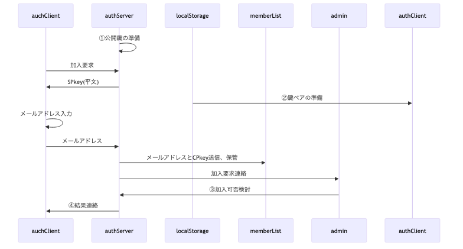

# 総説

ブラウザ(クライアント)とGAS(サーバ)の間で認証された通信を行う。

## 要求仕様

- 本システムは限られた人数のサークルや小学校のイベント等での利用を想定する。<br>
  よって恒久性・安全性よりは導入時の容易さ・技術的ハードルの低さ、運用の簡便性を重視する。
- サーバ側(以下authServer)はスプレッドシートのコンテナバインドスクリプト、クライアント側(以下authClient)はHTMLのJavaScript
- サーバ側・クライアント側とも鍵ペアを使用
- 原則として通信は受信側公開鍵で暗号化＋発信側秘密鍵で署名
- クライアントの識別(ID)はメールアドレスで行う

## 用語

- SPkey, SSkey：サーバ側の公開鍵(Server side Public key)と秘密鍵(Server side Secret key)
- CPkey, CSkey：クライアント側の公開鍵(Client side Public key)と秘密鍵(Client side Secret key)
- パスフレーズ：クライアント側鍵ペア作成時のキー文字列。JavaScriptで自動的に生成
- パスワード：運用時、クライアント(人間)がブラウザ上で入力する本人確認用の文字列
- パスコード：二段階認証実行時、サーバからクライアントに送られる6桁※の数字<br>
  ※既定値。実際の桁数はauthConfig.trial.passcodeLengthで規定

## 暗号化・署名方式、運用

- 署名方式 : RSA-PSS
- 暗号化方式 : RSA-OAEP
- ハッシュ関数 : SHA-256以上
- 許容時差±120秒※以内
  ※既定値。実際の桁数はauthConfig.decryptRequest.allowableTimeDifferenceで規定
- 順序は「暗号化->署名」ではなく「署名->暗号化」で行う
  1. クライアントがデータをJSON化
  2. 自身の秘密鍵で署名（署名→暗号化）
  3. サーバの公開鍵で暗号化
  4. サーバは復号後、クライアント公開鍵(memberList.CPkey)で署名を検証
- パスワードの生成は「ライブラリ > createPassword」を使用
- パスコードのメール送信は「ライブラリ > sendMail」を使用
- CPkeyの有効期限が切れた場合、以下の手順で更新する
  1. クライアント側から古いCPkeyで署名された要求を受信
  2. サーバ側で署名検証の結果、期限切れを確認
    - memberList.trial[0].CPkeyUpdateUntilに「現在日時＋authConfig.decryptRequest.loginLifeTime」をセット
    - クライアント側に通知
  3. クライアント側でCPkeyを更新、新CPkeyで再度リクエスト
  4. サーバ側でauthConfig.decryptRequest.loginLifeTimeを確認、期限内ならmemberList.CPkeyを書き換え。期限切れなら加入処理同様、adminによる個別承認を必要とする。
  5. 以降は未ログイン状態で要求が来た場合として処理を継続

# 処理手順

## 概要


<details><summary>source</summary>

```mermaid
<!--::$doc/summary.mermaid::-->
```

</details>

- ①authClientインスタンス生成：この時点でIndexedDBに鍵ペア・メールアドレスを準備
- ②処理要求：authClient側でIndexedDBの内容を取得

- ③アカウント有効期限切れ：「処理要求中 and アカウント有効期限切れ」なら真。<br>
  ⇒ `処理要求中フラグ === true && IndexedDB.expireAccount < Date.now()`<br>
  ※authServer.memberListが原本だが、クライアント側でも事前にチェックする
- ④加入未申請：`IndexedDB.ApplicationForMembership < 0`なら真
- ⑤加入要求：加入審査は人間系なので到着日時未定。この時点で一度処理を中断するため、authClientは以下の処理を行う
  - IndexedDBに加入申請日時を記録
  - 処理要求中フラグ=false

- ⑥加入審査結果：memberListの検索結果(存在or不存在)、アカウント・CPkey期限(既存メンバは現在の設定値)
- ⑦アカウント・CPkey期限更新：加入審査結果がNGだった場合、IndexedDB.expireAccount/expireCPkey共にnullを設定
- ⑧リトライ意思確認：ダイアログでリトライするか確認。リトライしない場合、処理要求中フラグ=falseを設定

- ⑨未ログイン：「処理要求中 and アカウント有効期限内 and CPkey有効期限切れ」なら真。<br>
  ⇒ `処理要求中フラグ === true && Date.now() < IndexedDB.expireAccount && IndexedDB.expireCPkey < Date.now()`
- ⑩result==='fatal'：authClientは以下の処理を行う
  - IndexedDB.expireAccount/expireCPkeyをクリア(-1をセット)
  - 処理要求中フラグ=false
- ⑪ログイン時処理：authClientは以下の処理を行う
  - IndexedDB.expireCPkeyを更新
  - 処理要求中フラグ=false
  - ログイン試行中フラグ=false

- ⑫ログイン済：「処理要求中 and アカウント有効期限内 and CPkey有効期限内」なら真。<br>
  ⇒ `処理要求中フラグ === true && Date.now() < IndexedDB.expireAccount && Date.now() < IndexedDB.expireCPkey`

## authClient 要求前準備


<details><summary>source</summary>

```mermaid
<!--::$doc/initAuthClient.mermaid::-->
```

</details>

## 加入要求



<details><summary>source</summary>

```mermaid
<!--::$doc/joining.mermaid::-->
```

</details>

- ③アカウント有効期限切れ：「処理要求中 and アカウント有効期限切れ」なら真。<br>
  ⇒ `処理要求中フラグ === true && IndexedDB.expireAccount < Date.now()`
  authServer.memberListが原本だが、クライアント側でも事前にチェックする
- ④加入未申請：`IndexedDB.ApplicationForMembership < 0`なら真
- ⑤加入要求：加入審査は人間系なので到着日時未定。この時点で一度処理を中断するため、authClientは以下の処理を行う
  - IndexedDBに加入申請日時を記録
  - 処理要求中フラグ=false

- ⑥加入審査結果：memberListの検索結果(存在or不存在)、アカウント・CPkey期限(既存メンバは現在の設定値)
- ⑦アカウント・CPkey期限更新：加入審査結果がNGだった場合、IndexedDB.expireAccount/expireCPkey共にnullを設定
- ⑧リトライ意思確認：ダイアログでリトライするか確認。リトライしない場合、処理要求中フラグ=falseを設定

- ⑨未ログイン：「処理要求中 and アカウント有効期限内 and CPkey有効期限切れ」なら真。<br>
  ⇒ `処理要求中フラグ === true && Date.now() < IndexedDB.expireAccount && IndexedDB.expireCPkey < Date.now()`
- ⑩result==='fatal'：authClientは以下の処理を行う
  - IndexedDB.expireAccount/expireCPkeyをクリア(-1をセット)
  - 処理要求中フラグ=false
- ⑪ログイン時処理：authClientは以下の処理を行う
  - IndexedDB.expireCPkeyを更新
  - 処理要求中フラグ=false
  - ログイン試行中フラグ=false

- ⑫ログイン済：「処理要求中 and アカウント有効期限内 and CPkey有効期限内」なら真。<br>
  ⇒ `処理要求中フラグ === true && Date.now() < IndexedDB.expireAccount && Date.now() < IndexedDB.expireCPkey`


- ①公開鍵の準備：ScriptPropertiesから公開鍵を取得。鍵ペア未生成なら生成して保存
- ②鍵ペアの準備：IndexedDBから鍵ペアを取得、authClientのメンバ変数に格納。<br>
  IndexedDBに鍵ペアが無い場合は新たに生成し、生成時刻と共に保存
- ③加入可否検討：加入可ならmemberList.acceptedに記入(不可なら空欄のまま)。<br>
- ④結果連絡：スプレッドシートのメニューから「結果連絡」処理を呼び出し、
  memberList.reportResultが空欄のメンバに対して加入可否検討結果をメールで送信

## 処理要求手順


<details><summary>source</summary>

```mermaid
<!--::$doc/authenticate.mermaid::-->
```

</details>

# データ格納方法と形式

- スプレッドシート以外で日時を文字列として記録する場合はISO8601拡張形式の文字列(`yyyy-MM-ddThh:mm:ss.nnn+09:00`)
- 日時を数値として記録する場合はUNIX時刻(new Date().getTime())

## ScriptProperties

キー名は`authConfig.system.name`、データは以下のオブジェクトをJSON化した文字列。

※生成AIへ：鍵ペアをどのような形で格納するのか、仕様書とサンプルソースの提示をお願いします。

- typeof {Object} authScriptProperties - サーバのScriptPropertiesに保存するオブジェクト
- prop {number} keyGeneratedDateTime - 鍵ペア生成日時。UNIX時刻(new Date().getTime())

## IndexedDB

キー名は`authConfig.system.name`から取得

※生成AIへ：鍵ペアをどのような形で格納するのか、仕様書とサンプルソースの提示をお願いします。

- typeof {Object} authIndexedDB - クライアントのIndexedDBに保存するオブジェクト
- prop {number} keyGeneratedDateTime - 鍵ペア生成日時。UNIX時刻(new Date().getTime())
- prop {string} memberId - メンバの識別子(=メールアドレス)
- prop {string} SPkey - サーバ側の公開鍵
- prop {number} [ApplicationForMembership=-1] - 加入申請実行日時。未申請時は-1
- prop {string} [expireAccount=-1] - 加入承認の有効期間が切れる日時。未加入時は-1
- prop {string} [expireCPkey=-1] - CPkeyの有効期限。未ログイン時は-1

## memberList(スプレッドシート)

- typedef {Object} memberList
- prop {string} memberId - メンバの識別子(=メールアドレス)
- prop {string} CPkey - メンバの公開鍵
- prop {string} CPkeyUpdated - 最新のCPkeyが登録された日時
- prop {string} accepted - 加入が承認されたメンバには承認日時を設定
- prop {string} reportResult - 「加入登録」処理中で結果連絡メールを送信した日時
- prop {string} expire - 加入承認の有効期間が切れる日時
- prop {string} profile - メンバの属性情報を保持するJSON文字列。サーバ側処理時のユーザ毎の実行権限等での利用を想定。
- prop {string} trial - ログイン試行関連情報オブジェクト(authTrial[])のJSON文字列

# データ型(typedef)

- クラスとして定義
- 時間・期間の単位はミリ秒

## authConfig

authClient/authServer共通で使用される設定値

※ 実装時はクラス化を想定。その場合、サーバ側のみ・クライアント側のみで使用するパラメータはauthConfigを継承する別クラスで定義することも検討する。

- typedef {Object} authConfig
- prop {Object} system
- prop {string} [system.name='auth'] - システム名
- prop {string} [system.adminMail=''] - 管理者のメールアドレス
- prop {string} [system.adminName=''] - 管理者名

- prop {Object} RSA - 署名・暗号化関係の設定値
- prop {number} [RSA.bits=2048] - 鍵ペアの鍵長

## authServerConfig

authConfigを継承した、authServerで使用する設定値

- typedef {Object} authServerConfig
- prop {string} [system.memberList='memberList'] - memberListシート名
- prop {Object.<string,Function|Arrow>} func - サーバ側の関数マップ。{関数名：関数}形式

- prop {Object} decryptRequest - decryptRequest関係の設定値
- prop {number} [decryptRequest.memberLifeTime=31536000000] - メンバ加入承認後の有効期間。既定値：1年
- prop {number} [decryptRequest.loginLifeTime=86400000] - ログイン成功後の有効期間(=CPkeyの有効期間)。既定値：1日
- prop {number} [decryptRequest.allowableTimeDifference=120000] - クライアント・サーバ間通信時の許容時差。既定値：2分

- prop {Object} trial - ログイン試行関係の設定値
- prop {number} [trial.passcodeLength=6] - パスコードの桁数
- prop {number} [trial.freezing=3600000] - 連続失敗した場合の凍結期間。既定値：1時間
- prop {number} [trial.maxTrial=3] パスコード入力の最大試行回数
- prop {number} [trial.passcodeLifeTime=600000] - パスコードの有効期間。既定値：10分
- prop {number} [trial.generationMax=5] - ログイン試行履歴(authTrial)の最大保持数。既定値：5世代

## authClientConfig

authConfigを継承した、authClientで使用する設定値

- typedef {Object} authClientConfig
- prop {string} x - サーバ側WebアプリURLのID(`https://script.google.com/macros/s/(この部分)/exec`)
  
## authTrialLog

- typedef {Object} authTrialLog
- prop {string} enterd - 入力されたパスコード
- prop {number} result - -1:恒久的エラー, 0:要リトライ, 1:パスコード一致
- prop {string} message - エラーメッセージ
- prop {number} timestamp - 判定処理日時

## authTrial

- [authTrial](doc/class.authTrial.md)参照

## authRequest

authClientからauthServerに送られる処理要求オブジェクト

- typedef {Object} authRequest
- prop {string} memberId - メンバの識別子(=メールアドレス)
- prop {string} requestId - 要求の識別子。UUID
- prop {number} timestamp - 要求日時。UNIX時刻
- prop {string} func - サーバ側関数名
- prop {any[]} arguments - サーバ側関数に渡す引数
- prop {string} signature - クライアント側署名

## decryptedRequest

decryptRequestで復号された処理要求オブジェクト

- typedef {Object} decryptedRequest
- prop {string} result - 処理結果。"fatal"(後続処理不要なエラー), "warning"(後続処理が必要なエラー), "success"
- prop {string} message - エラーメッセージ
- prop {string|Object} detail - 詳細情報。ログイン試行した場合、その結果
- prop {authRequest} request - ユーザから渡された処理要求
- prop {string} timestamp - 復号処理実施日時。メール・ログでの閲覧が容易になるよう、文字列で保存

## authResponse

authServerからauthClientに送られる処理結果オブジェクト

- typedef {Object} authResponse
- prop {string} requestId - 要求の識別子。UUID
- prop {number} timestamp - 処理日時。UNIX時刻
- prop {string} result - 処理結果。decryptRequst.result
- prop {string} message - エラーメッセージ。decryptRequest.message
- prop {string} response - 要求された関数の戻り値をJSON化した文字列

# 関数群

## authClient

### 要求前準備(メイン処理)

- 鍵ペアの準備：IndexedDBから鍵ペアを取得、authClientのメンバ変数に格納。<br>
  IndexedDBに鍵ペアが無い場合は新たに生成し、生成時刻と共に保存
- IndexedDBからメールアドレスを取得、存在しなければダイアログから入力

### joining() : 加入要求

- 加入要求としてメールアドレス・CPkeyをサーバ側に送信する

### request() : 処理要求

### inCaseOfWarning() : authResponse.result==warningだった場合の処理

authResponse.messageに従い、accountExpired/updateCPkey/loginに処理分岐

### accountExpired() : アカウント有効性確認(アカウント有効期限切れ対応)

### updateCPkey() : 署名有効期限確認(CPkey有効期限切れ対応)

1. 鍵ペアを再作成し、改めて送信
2. CPkey再登録・ログイン終了後、改めて要求を送信

### login() : セッション状態確認(未ログイン)

1. ダイアログを表示、authServerからのパスコード通知メールを待って入力
2. パスコードをauthServerに送信

### reset() : IndexedDBに格納されている情報を再作成

メールアドレス入力ミスの場合を想定。

- 鍵ペアの再作成
- ダイアログからメールアドレス入力。入力済のメールアドレスがあれば、流用も許容

## authServer

- authRequest.requestId を短期間保存して重複拒否
- 引数が復号できない文字列の場合、SPkey要求の可能性があるので

### メイン処理

- decryptRequestで復号
- 復号できた場合、authRequest.funcの値で分岐
  - func.match(/::([a-zA-Z0-9+])::/) ⇒ authServer自体への処理要求<br>
    ※下表の"func"は上記正規表現の$1の部分
    | No | 要求名 | func | arguments | response | 備考 |
    | --: | :-- | :-- | :-- | :-- | :-- |
    | 1 | 加入要求 | membershipRequest | {CPkey} |  |  |
    | 2 | 加入審査結果問合せ | examinationResultInquiry |  |  |  |
    | 3 | ログイン要求 | logInRequest |  |  |  |
    | 4 | パスコード | passcodeCheck |  |  |  |
    | 5 | 処理要求 | 上記以外 |  |  |  |
  - アンマッチ ⇒ サーバ側関数への処理要求。但しauthConfig.funcに含まれない場合はエラー
- 復号できなかった場合はCPkeyと推定、公開鍵の形式チェックの上、OKならSPkeyを返す

### membershipRequest() : 加入要求時処理

### notifyAcceptance() : 加入要求の結果連絡

スプレッドシートのメニューから「加入登録」処理を呼び出し、
  memberList.reportResultが空欄のメンバに対して加入可否検討結果をメールで送信

### inCaseOfWarning() : 復号時warningだった場合の処理

| **⑧ アカウント有効性確認** | 承認済・有効期間内か | 期限切れ → `warning` |
| **⑨ 署名有効期限確認** | `CPkey` の有効期限をチェック | 切れ → `warning` + 更新誘導 |
| **⑩ セッション状態確認** | ログイン済みか・有効期間内か確認 | 未ログイン → `authTrial()` 実行 |

### examinationResultInquiry() : 加入審査結果問合せへの回答


## decryptRequest

- [decryptRequest 関数 仕様書](doc/decryptRequest.md)参照

## encryptRequest

- [encryptRequest 関数 仕様書](doc/encryptRequest.md)参照
