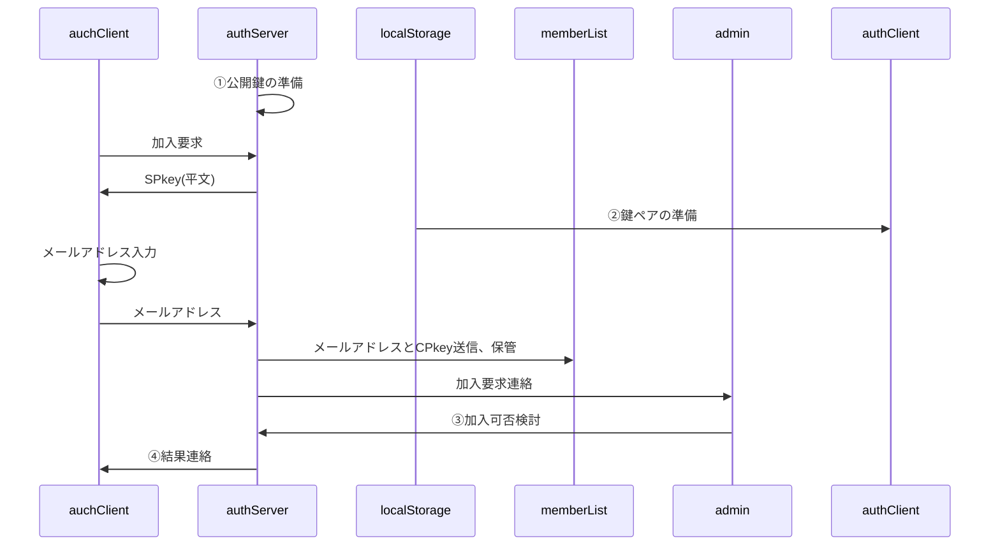

# 総説

## 生成AIへ

- 以下の使用に基づき、ブラウザ側JavaScript関数"authClient"とGAS関数"authServer"を作成してください。
- 以降、Markdownの画像へのリンク(``)は無視してください。
- 開発スピード・安定稼働を重視し多少のリスクは許容しますが、重大なセキュリティホールは指摘してください。

## 要求仕様

ブラウザとGASの間で認証された通信を行う。

- authServerはスプレッドシートのコンテナバインドスクリプト、authClientはHTMLのJavaScript
- サーバ側(以下authServer)・クライアント側(以下authClient)とも鍵ペアを使用
- 原則として通信は発信側秘密鍵で暗号化＋受信側公開鍵で署名する
- クライアントの識別(ID)はメールアドレスで行う

## 用語

- SPkey, SSkey：サーバ側の公開鍵(Server side Public key)と秘密鍵(Server side Secret key)
- CPkey, CSkey：クライアント側の公開鍵(Client side Public key)と秘密鍵(Client side Secret key)
- パスフレーズ：クライアント側鍵ペア作成時のキー文字列。JavaScriptで自動的に生成
- パスワード：運用時、クライアント(人間)がブラウザ上で入力する本人確認用の文字列
- パスコード：二段階認証実行時、サーバからクライアントに送られる6桁の数字

# 処理手順

## 加入手順

source

- ①公開鍵の準備：DocumentPropertiesから公開鍵を取得。鍵ペア未生成なら生成して保存
- ②鍵ペアの準備：localStorageからパスフレーズを取得、CPkey/CSkeyを生成 
  localStorageにパスフレーズが無い場合は新たに生成し、localStorageに生成時刻と共に保存
- ③加入可否検討：加入可ならmemberList.acceptedに記入(不可なら空欄のまま)。処理後、スプレッドシートのメニューから「加入登録」処理を呼び出し
- ④結果連絡：memberList.reportResultが空欄のメンバに対して加入可否検討結果をメールで送信

## 運用時通信手順

# データ格納方法と形式

## DocumentProperties

キー名は`authConfig.system.name`、データは以下のオブジェクトをJSON化した文字列。

- typeof {Object} authDocumentProperties - サーバのDocumentPropertiesに保存するオブジェクト
- prop {string} SPkey - サーバ側の公開鍵

## localStorage

キー名は`authConfig.system.name`、データは以下のオブジェクトをJSON化した文字列。

- typeof {Object} authLocalStorage - クライアントのlocalStorageに保存するオブジェクト
- prop {string} passPhrase - クライアント側鍵ペア生成用パスフレーズ
- prop {number} keyGeneratedDateTime - パスフレーズ生成日時。UNIX時刻(new Date().getTime())

## memberList(スプレッドシート)

- typedef {Object} memberList
- prop {string} memberId - メンバの識別子(=メールアドレス)
- prop {string} accepted - ISO8601拡張形式の文字列。加入が承認されたメンバには承認日時を設定
- prop {string} reportResult - ISO8601拡張形式の文字列。「加入登録」処理中で結果連絡メールを送信した日時

# データ型(typedef)

## authConfig

authClient/authServer共通で使用される設定値

- typedef {Object} authConfig
- prop {Object} system
- prop {string} [system.name='auth'] - システム名
