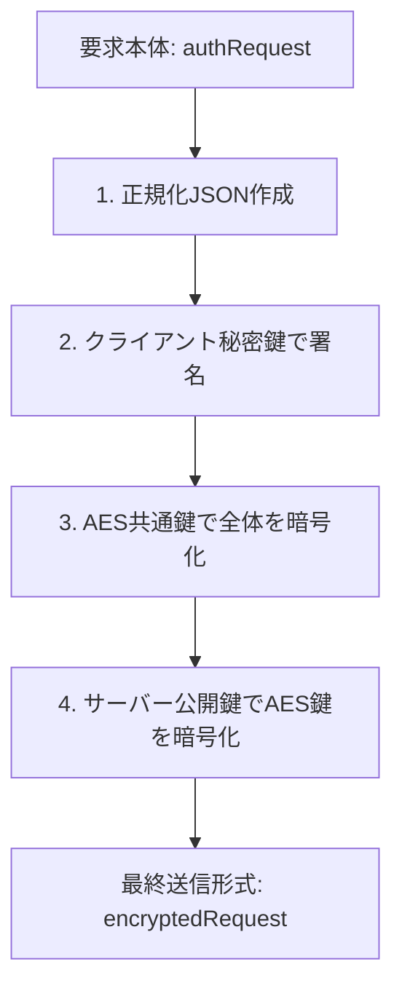

# "auth" システム総説

## 1. 解決すべき課題
本システムは、小規模な集まりや行事の運営において、**「高度な専門知識がなくても、安全に利用者を管理し、特定の機能を保護する」**ことを目的としています [1]。

*   **既存の障壁**: 一般的な認証基盤は導入の技術的ハードルが高く、一方で簡易的な合言葉（パスワード）管理では盗聴や端末の紛失に対して脆弱です [1]。
*   **解決策**: Google Apps Script (GAS) とスプレッドシートを基盤とし、WebCrypto APIによる強力な暗号化を「設定ファイル一つ」で制御できる、運用の簡便さと安全性を両立した仕組みを提供します [2, 3]。

## 2. 設計思想
システムの根幹には、以下の原則があります。

1.  **鍵による相互認証**: 利用者のブラウザ（クライアント）とサーバーの双方が持つ「鍵」を用いて通信の正当性を証明します [2]。
2.  **多重の防護**: 
    *   **署名**: RSA-PSS (SHA-256) 方式を用い、送信者が本人であることとデータの無改ざんを証明します [4, 5]。
    *   **暗号化**: 情報を AES-256-GCM 方式で秘匿し、第三者による盗聴を無効化します [4, 5]。
    *   **再送攻撃の防止**: 一意の識別番号（nonce）と有効期限（requestTime）を組み合わせ、過去の通信を再利用する攻撃を拒否します [6, 7]。
3.  **情報の単一源 (Single Source of Truth)**: すべてのデータ定義は `authConfig.js` に集約し、プログラムと仕様書が常に一致する自動生成の仕組みを採用します [3, 8]。

## 3. システムの構造と通信
利用者のブラウザ（クライアント）とサーバー（GAS）の間で、以下の構造でデータをやり取りします [9]。

### 基盤構造
| 役割 | 構成要素 | 保存場所 |
| :--- | :--- | :--- |
| **利用者側 (authClient)** | 暗号化・通信制御 | **IndexedDB**: 利用者固有の鍵と識別情報を保存 [2] |
| **サーバー側 (authServer)** | 認可・業務実行 | **ScriptProperties**: サーバーの鍵を保存 [2] **スプレッドシート**: 利用者一覧と履歴を保存 [10] |

### 通信データの変換フロー
利用者の要求は、以下の手順で秘匿化されます [11, 12]。

## 4. 利用開始と運用の流れ
システムの運用は、大きく3つの段階に分かれます。

### 段階 1：鍵の共有と仮登録（初回読み込み時）
利用者が初めてブラウザでシステムを開いた際、自動的に鍵ペアが作成されます。
• サーバーの公開鍵を取得し、利用者の公開鍵（CPkey）をサーバーに届けます。
• この時点では「仮登録」として識別されます。

### 段階 2：加入審査と本人確認
1. 申請: 利用者が氏名と連絡先（メールアドレス）を入力して申請します。
2. 審査: 管理者がスプレッドシート上で内容を確認し、加入の可否を決定します。
3. 確認: 承認後、本人確認用の6桁の数字（パスコード）がメールで届きます。

### 段階 3：通常の業務通信
本人確認が完了すると、暗号化された安全な通信路を通じて、権限に応じた機能（serverFunc）を実行できるようになります。

## 5. 状態管理の定義
システムは、利用者の「加入状況」と端末の「認証状況」を厳格に管理します。

### 利用者の加入状態
• 仮登録 (TR): 鍵の交換のみ完了し、審査を待っている状態。
• 未審査 (NE): 基本情報の登録が終わり、管理者の確認を待っている状態。
• 加入中 (CJ): 審査を通過し、利用を許可された状態。
• 加入禁止 (PJ): 管理者により利用を差し止められた状態。

### 端末の認証状態
• 未認証 (UC): その端末での本人確認が済んでいない状態。
• 試行中 (TR): パスコードによる本人確認を行っている最中の状態。
• 認証中 (LI): 確認が完了し、安全な業務通信が行える状態。
• 凍結中 (FR): 確認に連続して失敗し、一時的に利用を制限された状態。

## 6. 開発者向けの手引き
詳細な仕様を確認する場合は、以下の動線をたどってください。
• データ構造の正解: すべての型定義と初期値は authConfig.js（authConfig クラス）に記載されています。
• 通信項目の詳細: 各状態での I/O 項目対応表は、通信手順の詳細セクション を参照してください。
• 自動生成: build.sh を実行することで、最新のソースコードから詳細仕様書が再出力されます。

### 補足事項
*   **図表の扱い**: 上記 Markdown ブロック内に Mermaid 形式の図表を組み込んでいます。
*   **ファイル名**: セパレータとして `<!-- file:specification.md -->` を行頭に配置しました。
*   **動線の確保**: 第6項に「次に何を見れば良いか」の動線を配置しています。
