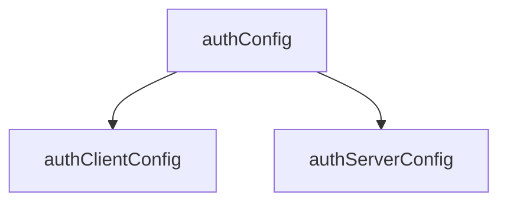
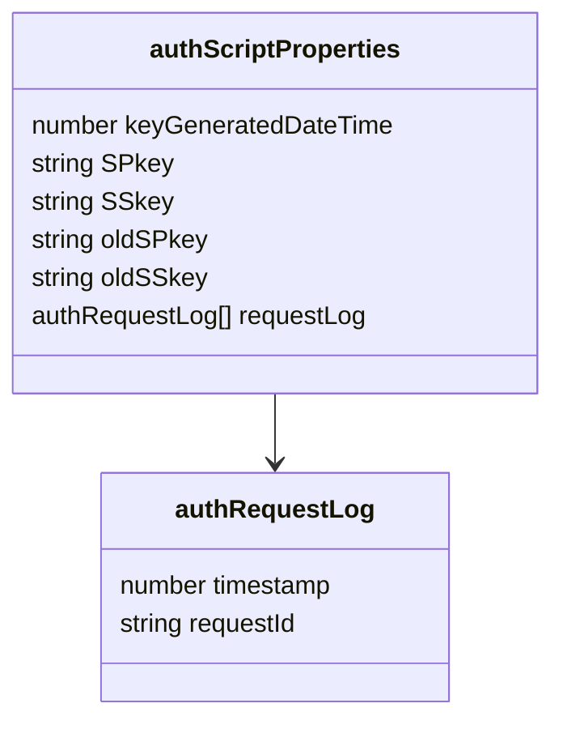
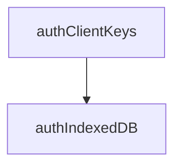
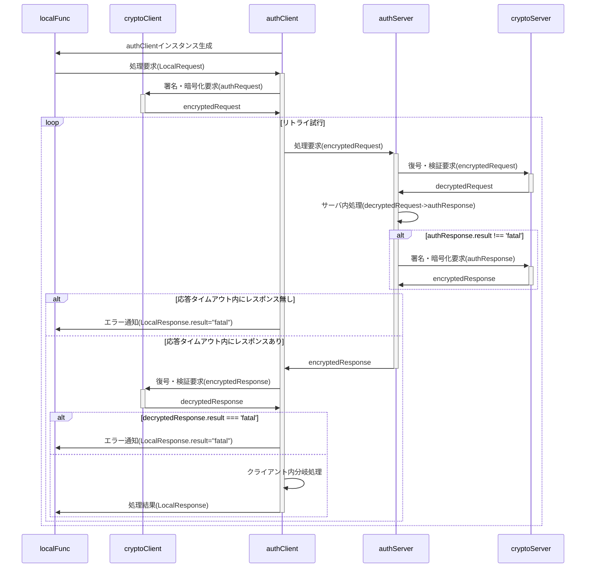
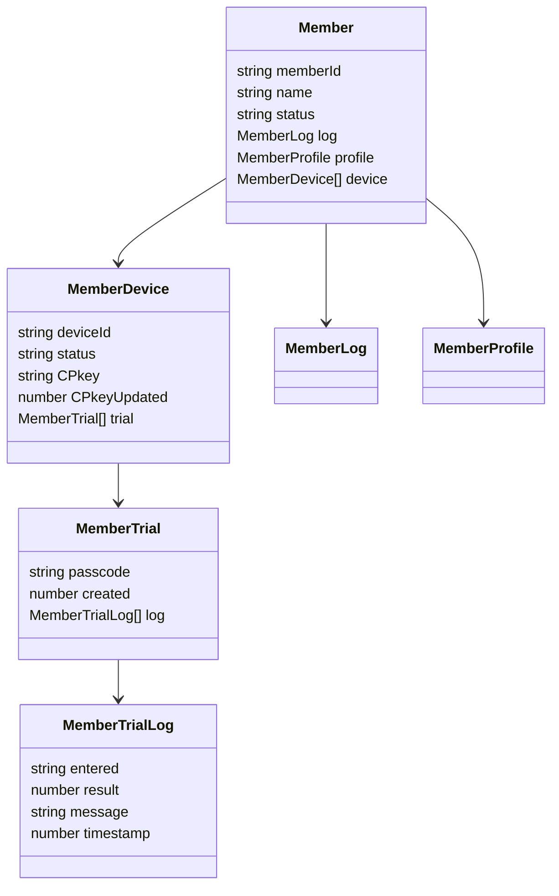
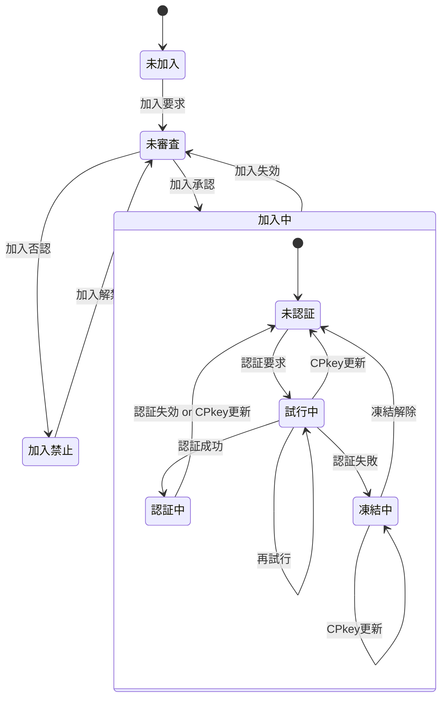

<!--
備忘。ChatGPTから作成提案があったが、時間がかかるので凍結。以下は提案のプロトタイプ
-->

# 第1章. 概要

- ドキュメントの目的
	- 各クラス・データ型の定義を一覧化し、仕様の整合性を確保すること。
- ファイル構成方針
	- 状態遷移(stateTransition.md)などの補助文書との参照関係も記載。
- データ型命名規約
	- 例：auth* = 認証系, Member* = メンバ管理系, Local* = クライアント内通信系 など。
- 依存関係図(Mermaid UMLで可視化)

<!--
# 第2章. データ型一覧(索引)

区分	データ型名	概要	出力ファイル
認証共通	authConfig
	認証系共通設定値	authConfig.js
認証クライアント	authClientConfig
	クライアント専用設定	authClientConfig.js
認証サーバ	authServerConfig
	サーバ専用設定	authServerConfig.js
メンバ管理	Member
	メンバの基本情報	Member.js
メンバ管理	MemberDevice
	デバイス情報	MemberDevice.js
メンバ管理	MemberTrial
	パスコード試行情報	MemberTrial.js
メンバ管理	MemberTrialLog
	試行履歴	MemberTrialLog.js
...	...	...	...

※ 実際のテーブルはtypedefオブジェクトから自動生成可能(章冒頭に生成スクリプト記載)
-->

# 第3章. データ型定義

## 3.1 動作環境設定

### authConfig

- authClient/authServer共通で使用される設定値。
- authClientConfig, authServerConfigの親クラス

| No | 項目名 | 任意 | データ型 | 既定値 | 説明 |
| --: | :-- | :--: | :-- | :-- | :-- |
| 1 | systemName | ⭕ | string | auth | システム名 |
| 2 | adminMail | ❌ | string |  | 管理者のメールアドレス |
| 3 | adminName | ❌ | string |  | 管理者名 |
| 4 | allowableTimeDifference | ⭕ | number | 120000 | クライアント・サーバ間通信時の許容時差。既定値は2分 |
| 5 | RSAbits | ⭕ | string | 2048 | 鍵ペアの鍵長 |
| 6 | underDev | ❌ | Object |  | テスト時の設定 |
| 7 | underDev.isTest | ⭕ | boolean | false | 開発モードならtrue |

### authClientConfig

authConfigを継承した、authClientでのみ使用する設定値

| No | 項目名 | 任意 | データ型 | 既定値 | 説明 |
| --: | :-- | :--: | :-- | :-- | :-- |
| 1 | api | ❌ | string |  | サーバ側WebアプリURLのID(`https://script.google.com/macros/s/(この部分)/exec`) |
| 2 | timeout | ⭕ | number | 300000 | サーバからの応答待機時間。これを超えた場合はサーバ側でfatalとなったと解釈する。既定値は5分 |
| 3 | CPkeyGraceTime | ⭕ | number | 600000 | CPkey期限切れまでの猶予時間。CPkey有効期間がこれを切ったら更新処理実行。既定値は10分 |

### authServerConfig

authConfigを継承した、authServerでのみ使用する設定値

| No | 項目名 | 任意 | データ型 | 既定値 | 説明 |
| --: | :-- | :--: | :-- | :-- | :-- |
| 1 | memberList | ⭕ | string | memberList | memberListシート名 |
| 2 | defaultAuthority | ⭕ | number | 1 | 新規加入メンバの権限の既定値 |
| 3 | memberLifeTime | ⭕ | number | 31536000000 | 加入有効期間(=メンバ加入承認後の有効期間)。既定値は1年 |
| 4 | prohibitedToJoin | ⭕ | number | 259200000 | 加入禁止期間(=管理者による加入否認後、再加入申請が自動的に却下される期間)。既定値は3日 |
| 5 | loginLifeTime | ⭕ | number | 86400000 | 認証有効時間(=ログイン成功後の有効期間、CPkeyの有効期間)。既定値は1日 |
| 6 | loginFreeze | ⭕ | number | 600000 | 認証凍結時間(=認証失敗後、再認証要求が禁止される期間)。既定値は10分 |
| 7 | requestIdRetention | ⭕ | number | 300000 | 重複リクエスト拒否となる時間。既定値は5分 |
| 8 | errorLog | ⭕ | string | errorLog | エラーログのシート名 |
| 9 | storageDaysOfErrorLog | ⭕ | number | 604800000 | 監査ログの保存日数。単位はミリ秒。既定値は7日分 |
| 10 | auditLog | ⭕ | string | auditLog | 監査ログのシート名 |
| 11 | storageDaysOfAuditLog | ⭕ | number | 604800000 | 監査ログの保存日数。単位はミリ秒。既定値は7日分 |
| 12 | func | ❌ | Object.<string,Object> |  | サーバ側の関数マップ 例：{registerMember:{authority:0b001,do:m=>register(m)},approveMember:{authority:0b100,do:m=>approve(m)}} |
| 13 | func.authority | ⭕ | number | 0 | サーバ側関数毎に設定される当該関数実行のために必要となるユーザ権限,`authServerConfig.func.authority === 0 || (Member.profile.authority & authServerConfig.func.authority > 0)`なら実行可とする。 |
| 14 | func.do | ❌ | Function |  | 実行するサーバ側関数 |
| 15 | trial | ❌ | Object |  | ログイン試行関係の設定値 |
| 16 | trial.passcodeLength | ⭕ | number | 6 | パスコードの桁数 |
| 17 | trial.maxTrial | ⭕ | number | 3 | パスコード入力の最大試行回数 |
| 18 | trial.passcodeLifeTime | ⭕ | number | 600000 | パスコードの有効期間。既定値は10分 |
| 19 | trial.generationMax | ⭕ | number | 5 | ログイン試行履歴(MemberTrial)の最大保持数。既定値は5世代 |
| 20 | underDev.sendPasscode | ⭕ | boolean | false | 開発中、パスコード通知メール送信を抑止するならtrue |
| 21 | underDev.sendInvitation | ⭕ | boolean | false | 開発中、加入承認通知メール送信を抑止するならtrue |

## 3.2 鍵ペア他の格納

### authScriptProperties

キー名は`authConfig.system.name`、データは以下のオブジェクトをJSON化した文字列。

| No | 項目名 | 任意 | データ型 | 既定値 | 説明 |
| --: | :-- | :--: | :-- | :-- | :-- |
| 1 | keyGeneratedDateTime | ❌ | number |  | UNIX時刻 |
| 2 | SPkey | ❌ | string |  | PEM形式の公開鍵文字列 |
| 3 | SSkey | ❌ | string |  | PEM形式の秘密鍵文字列(暗号化済み) |
| 4 | oldSPkey | ❌ | string |  | cryptoServer.reset実行前にバックアップした公開鍵 |
| 5 | oldSSkey | ❌ | string |  | cryptoServer.reset実行前にバックアップした秘密鍵 |
| 6 | requestLog | ⭕ | authRequestLog[] |  | 重複チェック用のリクエスト履歴 |

### authRequestLog

重複チェック用のリクエスト履歴。ScriptPropertiesに保存

| No | 項目名 | 任意 | データ型 | 既定値 | 説明 |
| --: | :-- | :--: | :-- | :-- | :-- |
| 1 | timestamp | ⭕ | number | Date.now() | リクエストを受けたサーバ側日時 |
| 2 | requestId | ❌ | string |  | クライアント側で採番されたリクエスト識別子。UUID |

### authIndexedDB

- authClientKeysを継承した、クライアントのIndexedDBに保存するオブジェクト
- IndexedDB保存時のキー名は`authConfig.system.name`から取得

| No | 項目名 | 任意 | データ型 | 既定値 | 説明 |
| --: | :-- | :--: | :-- | :-- | :-- |
| 1 | keyGeneratedDateTime | ❌ | number |  | 鍵ペア生成日時。UNIX時刻(new Date().getTime()),なおサーバ側でCPkey更新中にクライアント側で新たなCPkeyが生成されるのを避けるため、鍵ペア生成は30分以上の間隔を置く。 |
| 2 | memberId | ❌ | string |  | メンバの識別子(=メールアドレス) |
| 3 | memberName | ❌ | string |  | メンバ(ユーザ)の氏名(ex."田中　太郎")。加入要求確認時に管理者が申請者を識別する他で使用。 |
| 4 | SPkey | ❌ | string |  | サーバ公開鍵(Base64) |
| 5 | expireCPkey | ⭕ | number | 0 | CPkeyの有効期限(無効になる日時)。未ログイン時は0 |

### authClientKeys

クライアント側鍵ペア

| No | 項目名 | 任意 | データ型 | 既定値 | 説明 |
| --: | :-- | :--: | :-- | :-- | :-- |
| 1 | CSkeySign | ❌ | CryptoKey |  | 署名用秘密鍵 |
| 2 | CPkeySign | ❌ | CryptoKey |  | 署名用公開鍵 |
| 3 | CSkeyEnc | ❌ | CryptoKey |  | 暗号化用秘密鍵 |
| 4 | CPkeyEnc | ❌ | CryptoKey |  | 暗号化用公開鍵 |

## 3.3 通信・暗号化

### LocalRequest

- クライアント側関数からauthClientに渡すオブジェクト
- func,arg共、平文

| No | 項目名 | 任意 | データ型 | 既定値 | 説明 |
| --: | :-- | :--: | :-- | :-- | :-- |
| 1 | func | ❌ | string |  | サーバ側関数名 |
| 2 | arguments | ❌ | any[] |  | サーバ側関数に渡す引数の配列 |

### authRequest

authClientからauthServerに送られる、暗号化前の処理要求オブジェクト

| No | 項目名 | 任意 | データ型 | 既定値 | 説明 |
| --: | :-- | :--: | :-- | :-- | :-- |
| 1 | memberId | ❌ | string |  | メンバの識別子(=メールアドレス) |
| 2 | deviceId | ❌ | string |  | デバイスの識別子 |
| 3 | signature | ❌ | string |  | クライアント側署名 |
| 4 | requestId | ❌ | string |  | 要求の識別子。UUID |
| 5 | timestamp | ❌ | number |  | 要求日時。UNIX時刻 |
| 6 | func | ❌ | string |  | サーバ側関数名 |
| 7 | arguments | ❌ | any[] |  | サーバ側関数に渡す引数の配列 |

### encryptedRequest

- authClientからauthServerに送られる、暗号化された処理要求オブジェクト
- ciphertextはauthRequestをJSON化、RSA-OAEP暗号化＋署名付与した文字列
- memberId,deviceIdは平文

| No | 項目名 | 任意 | データ型 | 既定値 | 説明 |
| --: | :-- | :--: | :-- | :-- | :-- |
| 1 | memberId | ❌ | string |  | メンバの識別子(=メールアドレス) |
| 2 | deviceId | ❌ | string |  | デバイスの識別子 |
| 3 | ciphertext | ❌ | string |  | 暗号化した文字列 |

### decryptedRequest

encryptedRequestをcryptoServerで復号した処理要求オブジェクト

| No | 項目名 | 任意 | データ型 | 既定値 | 説明 |
| --: | :-- | :--: | :-- | :-- | :-- |
| 1 | result | ❌ | string |  | 処理結果。"fatal"(後続処理不要なエラー), "warning"(後続処理が必要なエラー), "normal" |
| 2 | message | ⭕ | string |  | エラーメッセージ。result="normal"の場合`undefined` |
| 3 | request | ❌ | authRequest |  | ユーザから渡された処理要求 |
| 4 | timestamp | ❌ | number |  | 復号処理実施日時 |
| 5 | status | ❌ | string |  | Member.deviceが空ならメンバの、空で無ければデバイスのstatus |

### authResponse

authServerからauthClientに返される、暗号化前の処理結果オブジェクト

| No | 項目名 | 任意 | データ型 | 既定値 | 説明 |
| --: | :-- | :--: | :-- | :-- | :-- |
| 1 | timestamp | ⭕ | number | Date.now() | サーバ側処理日時。UNIX時刻 |
| 2 | result | ⭕ | string | normal | サーバ側処理結果。fatal/warning/normal |
| 3 | message | ⭕ | string |  | サーバ側からの(エラー)メッセージ |
| 4 | request | ⭕ | authRequest |  | 処理要求オブジェクト |
| 5 | response | ⭕ | any |  | 要求されたサーバ側関数の戻り値。fatal/warning時は`undefined` |

### encryptedResponse

- authServerからauthClientに返される、暗号化された処理結果オブジェクト
- ciphertextはauthResponseをJSON化、RSA-OAEP暗号化＋署名付与した文字列

| No | 項目名 | 任意 | データ型 | 既定値 | 説明 |
| --: | :-- | :--: | :-- | :-- | :-- |
| 1 | ciphertext | ❌ | string |  | 暗号化した文字列 |

### decryptedResponse

encryptedResponseをcryptoClientで復号した処理結果オブジェクト

| No | 項目名 | 任意 | データ型 | 既定値 | 説明 |
| --: | :-- | :--: | :-- | :-- | :-- |
| 1 | timestamp | ❌ | number |  | cryptoClient処理日時。UNIX時刻 |
| 2 | result | ❌ | string |  | cryptoClient処理結果。fatal/warning/normal |
| 3 | message | ⭕ | string |  | cryptoClientからのエラーメッセージ。normal時は`undefined` |
| 4 | request | ❌ | authRequest |  | 処理要求オブジェクト(authResponse.request) |
| 5 | response | ⭕ | any |  | 要求されたサーバ側関数の戻り値(authResponse.response)。fatal/warning時は`undefined` |
| 6 | sv | ❌ | Object |  |  |
| 7 | sv.timestamp | ❌ | number |  | サーバ側処理日時。UNIX時刻 |
| 8 | sv.result | ❌ | string |  | サーバ側処理結果。fatal/warning/normal |
| 9 | sv.message | ⭕ | string |  | サーバ側からのエラーメッセージ。normal時は`undefined` |

### LocalResponse

authClientからクライアント側関数に返される処理結果オブジェクト

| No | 項目名 | 任意 | データ型 | 既定値 | 説明 |
| --: | :-- | :--: | :-- | :-- | :-- |
| 1 | result | ❌ | string |  | 処理結果。fatal/warning/normal |
| 2 | message | ⭕ | string |  | エラーメッセージ。normal時は`undefined`。 |
| 3 | response | ⭕ | any |  | 要求された関数の戻り値。fatal/warning時は`undefined`。`JSON.parse(authResponse.response)` |

## 3.4 メンバ管理

### Member

メンバ一覧(アカウント管理表)上のメンバ単位の管理情報

| No | 項目名 | 任意 | データ型 | 既定値 | 説明 |
| --: | :-- | :--: | :-- | :-- | :-- |
| 1 | memberId | ❌ | string |  | メンバの識別子(=メールアドレス) |
| 2 | name | ❌ | string |  | メンバの氏名 |
| 3 | status | ⭕ | string | 未加入 | メンバの状態。未加入,未審査,審査済,加入中,加入禁止 |
| 4 | log | ⭕ | string | new MemberLog() | メンバの履歴情報(MemberLog)を保持するJSON文字列 |
| 5 | profile | ⭕ | string | new MemberProfile() | メンバの属性情報(MemberProfile)を保持するJSON文字列 |
| 6 | device | ❌ | string |  | マルチデバイス対応のためのデバイス情報(MemberDevice[])を保持するJSON文字列 |
| 7 | note | ⭕ | string |  | 当該メンバに対する備考 |

### MemberDevice

メンバが使用する通信機器の情報(マルチデバイス対応)

| No | 項目名 | 任意 | データ型 | 既定値 | 説明 |
| --: | :-- | :--: | :-- | :-- | :-- |
| 1 | deviceId | ❌ | string |  | デバイスの識別子。UUID |
| 2 | status | ⭕ | string | 未認証 | デバイスの状態。未認証,認証中,試行中,凍結中 |
| 3 | CPkey | ❌ | string |  | メンバの公開鍵 |
| 4 | CPkeyUpdated | ⭕ | number | Date.now() | 最新のCPkeyが登録された日時 |
| 5 | trial | ⭕ | string |  | ログイン試行関連情報オブジェクト(MemberTrial[])。シート保存時はJSON文字列 |

### MemberLog

メンバの各種要求・状態変化の時刻

| No | 項目名 | 任意 | データ型 | 既定値 | 説明 |
| --: | :-- | :--: | :-- | :-- | :-- |
| 1 | joiningRequest | ⭕ | number | 0 | 加入要求日時。加入要求をサーバ側で受信した日時 |
| 2 | approval | ⭕ | number | 0 | 加入承認日時。管理者がmemberList上で加入承認処理を行った日時。値設定は加入否認日時と択一 |
| 3 | denial | ⭕ | number | 0 | 加入否認日時。管理者がmemberList上で加入否認処理を行った日時。値設定は加入承認日時と択一 |
| 4 | loginRequest | ⭕ | number | 0 | 認証要求日時。未認証メンバからの処理要求をサーバ側で受信した日時 |
| 5 | loginSuccess | ⭕ | number | 0 | 認証成功日時。未認証メンバの認証要求が成功した最新日時 |
| 6 | loginExpiration | ⭕ | number | 0 | 認証有効期限。認証成功日時＋認証有効時間 |
| 7 | loginFailure | ⭕ | number | 0 | 認証失敗日時。未認証メンバの認証要求失敗が確定した最新日時 |
| 8 | unfreezeLogin | ⭕ | number | 0 | 認証無効期限。認証失敗日時＋認証凍結時間 |
| 9 | joiningExpiration | ⭕ | number | 0 | 加入有効期限。加入承認日時＋加入有効期間 |
| 10 | unfreezeDenial | ⭕ | number | 0 | 加入禁止期限。加入否認日時＋加入禁止期間 |

### MemberProfile

メンバの属性情報(Member.profile)

| No | 項目名 | 任意 | データ型 | 既定値 | 説明 |
| --: | :-- | :--: | :-- | :-- | :-- |
| 1 | authority | ⭕ | number | 0 | メンバの持つ権限。authServerConfig.func.authorityとの論理積>0なら当該関数実行権限ありと看做す |

### MemberTrial

ログイン試行単位の試行情報(Member.trial)

| No | 項目名 | 任意 | データ型 | 既定値 | 説明 |
| --: | :-- | :--: | :-- | :-- | :-- |
| 1 | passcode | ⭕ | string |  | 設定されているパスコード。最初の認証試行で作成 |
| 2 | created | ⭕ | number | Date.now() | パスコード生成日時(≒パスコード通知メール発信日時) |
| 3 | log | ⭕ | MemberTrialLog[] |  | 試行履歴。常に最新が先頭(unshift()使用)。保持上限はauthServerConfig.trial.generationMaxに従い、上限超過時は末尾から削除する。 |

### MemberTrialLog

MemberTrial.logに記載される、パスコード入力単位の試行記録

| No | 項目名 | 任意 | データ型 | 既定値 | 説明 |
| --: | :-- | :--: | :-- | :-- | :-- |
| 1 | entered | ❌ | string |  | 入力されたパスコード |
| 2 | result | ❌ | number |  | -1:恒久的エラー(再試行不可), 0:要リトライ(再試行可), 1:成功(パスコード一致) |
| 3 | message | ❌ | string |  | エラーメッセージ |
| 4 | timestamp | ❌ | number |  | 判定処理日時 |

## 3.5 監査・エラーログ

### authAuditLog

authServerの監査ログ

| No | 項目名 | 任意 | データ型 | 既定値 | 説明 |
| --: | :-- | :--: | :-- | :-- | :-- |
| 1 | timestamp | ⭕ | string | Date.now() | 要求日時。ISO8601拡張形式の文字列 |
| 2 | duration | ❌ | number |  | 処理時間。ミリ秒単位 |
| 3 | memberId | ❌ | string |  | メンバの識別子(=メールアドレス) |
| 4 | deviceId | ⭕ | string |  | デバイスの識別子 |
| 5 | func | ⭕ | string |  | サーバ側関数名 |
| 6 | result | ⭕ | string |  | サーバ側処理結果。fatal/warning/normal |
| 7 | note | ❌ | string |  | 備考 |

### authErrorLog

authServerのエラーログ

| No | 項目名 | 任意 | データ型 | 既定値 | 説明 |
| --: | :-- | :--: | :-- | :-- | :-- |
| 1 | timestamp | ❌ | string |  | 要求日時。ISO8601拡張形式の文字列 |
| 2 | memberId | ❌ | string |  | メンバの識別子(=メールアドレス) |
| 3 | deviceId | ⭕ | string |  | デバイスの識別子 |
| 4 | result | ⭕ | string |  | サーバ側処理結果。fatal/warning/normal |
| 5 | message | ⭕ | string |  | サーバ側からのエラーメッセージ。normal時は`undefined` |
| 6 | stackTrace | ⭕ | string |  | エラー発生時のスタックトレース。本項目は管理者への通知メール等、シート以外には出力不可 |

# 第4章. メンバの状態と遷移

No | 状態 | 説明
:-- | :-- | :--
1 | 未加入 | memberList未登録
2 | 未審査 | memberList登録済だが、管理者による加入認否が未決定
3 | 加入中 | 管理者により加入が承認された状態
3.1 | 未認証 | 認証(ログイン)不要の処理しか行えない状態
3.2 | 試行中 | パスコードによる認証を試行している状態
3.3 | 認証中 | 認証が通り、ログインして認証が必要な処理も行える状態
3.4 | 凍結中 | 規定の試行回数連続して認証に失敗し、再認証要求が禁止された状態
4 | 加入禁止 | 管理者により加入が否認された状態

<!--
4.1 メンバ状態遷移(Member.status)

状態一覧：未加入 → 未審査 → 審査済 → 加入中 → 加入禁止

トリガーイベント：register(), approve(), deny(), expire()

対応クラス：Member, MemberLog

4.2 デバイス状態遷移(MemberDevice.status)

状態一覧：未認証 → 認証中 → 試行中 → 凍結中

トリガーイベント：loginRequest, loginSuccess, loginFailure, unfreezeLogin

# 第5章. 参照関係と依存構造

型間参照を一覧表で整理(自動抽出推奨)

呼び出し元	参照先	関係
Member	MemberProfile	JSON文字列で保持
Member	MemberDevice[]	デバイス配列
MemberDevice	MemberTrial[]	ログイン試行履歴
MemberTrial	MemberTrialLog[]	試行履歴(子配列)
authServerConfig	MemberTrial	最大保持数制御
第6章. 補足仕様

キー生成ポリシー

各種キー(SPkey, CPkey, CSkey)の生成・更新条件

時刻管理

UNIX時刻／ISO8601変換ルール

クライアント・サーバ時差許容(allowableTimeDifference)

セキュリティ制約

StackTraceの非出力ルール

RequestId重複拒否(authRequestLog)

第7章. 生成スクリプト仕様

typedef.js の仕様

入力: typedefオブジェクト

出力: <name>.md, <name>.js

引数例: node typedef.js -o:./docs/types

Markdown出力仕様

項目定義表の列構成と表記ルール

JSDoc出力仕様

@typedef / @prop の出力形式

既定値付きプロパティの書式

第8章. 変更履歴
日付	改訂	対応内容
2025-10-18	0.9	初版構成案
2025-10-19	1.0	MemberTrial/MemberTrialLog追加
2025-10-20	1.1	stateTransition分離

-->
