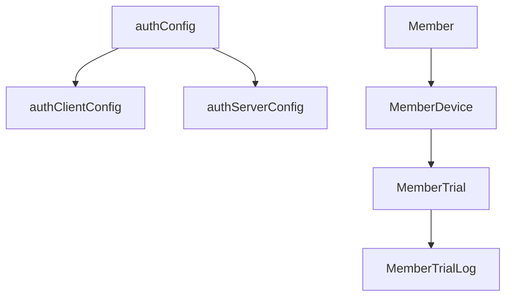
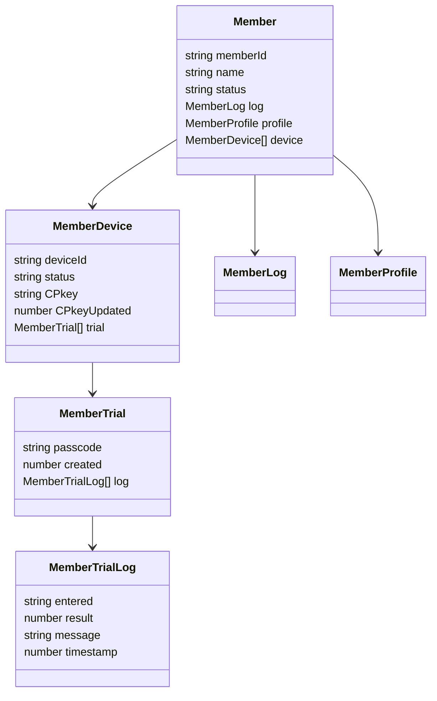
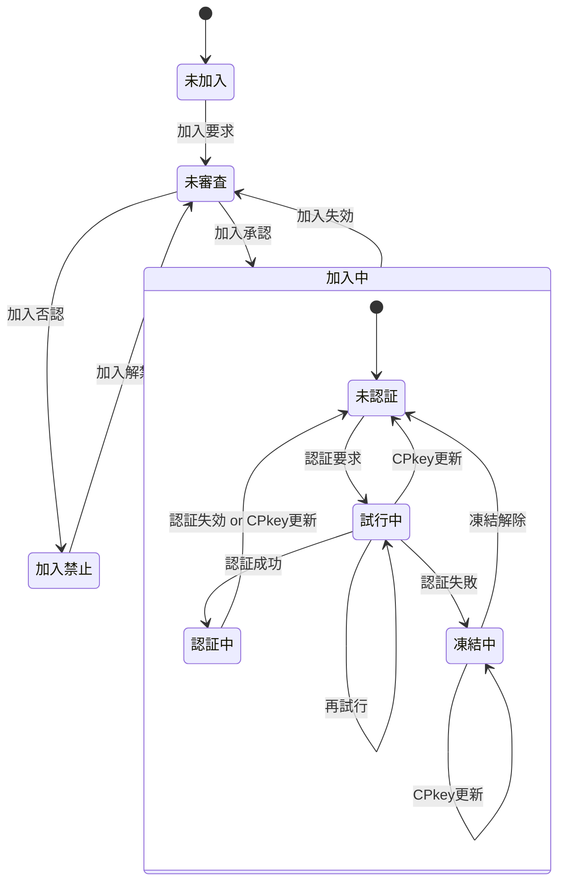

<!--
備忘。ChatGPTから作成提案があったが、時間がかかるので凍結。以下は提案のプロトタイプ
-->

# 第1章. 概要

- ドキュメントの目的
	- 各クラス・データ型の定義を一覧化し、仕様の整合性を確保すること。
- ファイル構成方針
	- 状態遷移(stateTransition.md)などの補助文書との参照関係も記載。
- データ型命名規約
	- 例：auth* = 認証系, Member* = メンバ管理系, Local* = クライアント内通信系 など。
- 依存関係図(Mermaid UMLで可視化)

# 第2章. データ型一覧(索引)

<!--
区分	データ型名	概要	出力ファイル
認証共通	authConfig
	認証系共通設定値	authConfig.js
認証クライアント	authClientConfig
	クライアント専用設定	authClientConfig.js
認証サーバ	authServerConfig
	サーバ専用設定	authServerConfig.js
メンバ管理	Member
	メンバの基本情報	Member.js
メンバ管理	MemberDevice
	デバイス情報	MemberDevice.js
メンバ管理	MemberTrial
	パスコード試行情報	MemberTrial.js
メンバ管理	MemberTrialLog
	試行履歴	MemberTrialLog.js
...	...	...	...

※ 実際のテーブルはtypedefオブジェクトから自動生成可能(章冒頭に生成スクリプト記載)
-->

# 第3章. 型定義(詳細)

各ファイル(例：authRequest.md)をインクルードまたは埋め込み。

## 3.1 認証系

### authRequest

authClientからauthServerに送られる処理要求オブジェクト

| No | 項目名 | 任意 | データ型 | 既定値 | 説明 |
| --: | :-- | :--: | :-- | :-- | :-- |
| 1 | memberId | ❌ | string |  | メンバの識別子(=メールアドレス) |
| 2 | deviceId | ❌ | string |  | デバイスの識別子 |
| 3 | signature | ❌ | string |  | クライアント側署名 |
| 4 | requestId | ❌ | string |  | 要求の識別子。UUID |
| 5 | timestamp | ❌ | number |  | 要求日時。UNIX時刻 |
| 6 | func | ❌ | string |  | サーバ側関数名 |
| 7 | arguments | ❌ | any[] |  | サーバ側関数に渡す引数の配列 |

### authResponse

authServerからauthClientに返される処理結果オブジェクト

| No | 項目名 | 任意 | データ型 | 既定値 | 説明 |
| --: | :-- | :--: | :-- | :-- | :-- |
| 1 | timestamp | ⭕ | number | Date.now() | サーバ側処理日時。UNIX時刻 |
| 2 | result | ⭕ | string | normal | サーバ側処理結果。fatal/warning/normal |
| 3 | message | ⭕ | string |  | サーバ側からの(エラー)メッセージ |
| 4 | request | ⭕ | authRequest |  | 処理要求オブジェクト |
| 5 | response | ⭕ | any |  | 要求されたサーバ側関数の戻り値。fatal/warning時は`undefined` |

### authClientKeys

クライアント側鍵ペア

| No | 項目名 | 任意 | データ型 | 既定値 | 説明 |
| --: | :-- | :--: | :-- | :-- | :-- |
| 1 | CSkeySign | ❌ | CryptoKey |  | 署名用秘密鍵 |
| 2 | CPkeySign | ❌ | CryptoKey |  | 署名用公開鍵 |
| 3 | CSkeyEnc | ❌ | CryptoKey |  | 暗号化用秘密鍵 |
| 4 | CPkeyEnc | ❌ | CryptoKey |  | 暗号化用公開鍵 |

authAuditLog

authErrorLog

authScriptProperties

## 3.2 メンバ管理系

Member

MemberDevice

MemberProfile

MemberLog

MemberTrial

MemberTrialLog

## 3.3 通信・暗号化系

encryptedRequest

encryptedResponse

decryptedRequest

decryptedResponse

## 3.4 クライアントローカル通信

LocalRequest

LocalResponse

# 第4章. 状態遷移図

No | 状態 | 説明
:-- | :-- | :--
1 | 未加入 | memberList未登録
2 | 未審査 | memberList登録済だが、管理者による加入認否が未決定
3 | 加入中 | 管理者により加入が承認された状態
3.1 | 未認証 | 認証(ログイン)不要の処理しか行えない状態
3.2 | 試行中 | パスコードによる認証を試行している状態
3.3 | 認証中 | 認証が通り、ログインして認証が必要な処理も行える状態
3.4 | 凍結中 | 規定の試行回数連続して認証に失敗し、再認証要求が禁止された状態
4 | 加入禁止 | 管理者により加入が否認された状態

<!--
4.1 メンバ状態遷移(Member.status)

状態一覧：未加入 → 未審査 → 審査済 → 加入中 → 加入禁止

トリガーイベント：register(), approve(), deny(), expire()

対応クラス：Member, MemberLog

4.2 デバイス状態遷移(MemberDevice.status)

状態一覧：未認証 → 認証中 → 試行中 → 凍結中

トリガーイベント：loginRequest, loginSuccess, loginFailure, unfreezeLogin

# 第5章. 参照関係と依存構造

型間参照を一覧表で整理(自動抽出推奨)

呼び出し元	参照先	関係
Member	MemberProfile	JSON文字列で保持
Member	MemberDevice[]	デバイス配列
MemberDevice	MemberTrial[]	ログイン試行履歴
MemberTrial	MemberTrialLog[]	試行履歴(子配列)
authServerConfig	MemberTrial	最大保持数制御
第6章. 補足仕様

キー生成ポリシー

各種キー(SPkey, CPkey, CSkey)の生成・更新条件

時刻管理

UNIX時刻／ISO8601変換ルール

クライアント・サーバ時差許容(allowableTimeDifference)

セキュリティ制約

StackTraceの非出力ルール

RequestId重複拒否(authRequestLog)

第7章. 生成スクリプト仕様

typedef.js の仕様

入力: typedefオブジェクト

出力: <name>.md, <name>.js

引数例: node typedef.js -o:./docs/types

Markdown出力仕様

項目定義表の列構成と表記ルール

JSDoc出力仕様

@typedef / @prop の出力形式

既定値付きプロパティの書式

第8章. 変更履歴
日付	改訂	対応内容
2025-10-18	0.9	初版構成案
2025-10-19	1.0	MemberTrial/MemberTrialLog追加
2025-10-20	1.1	stateTransition分離

-->
