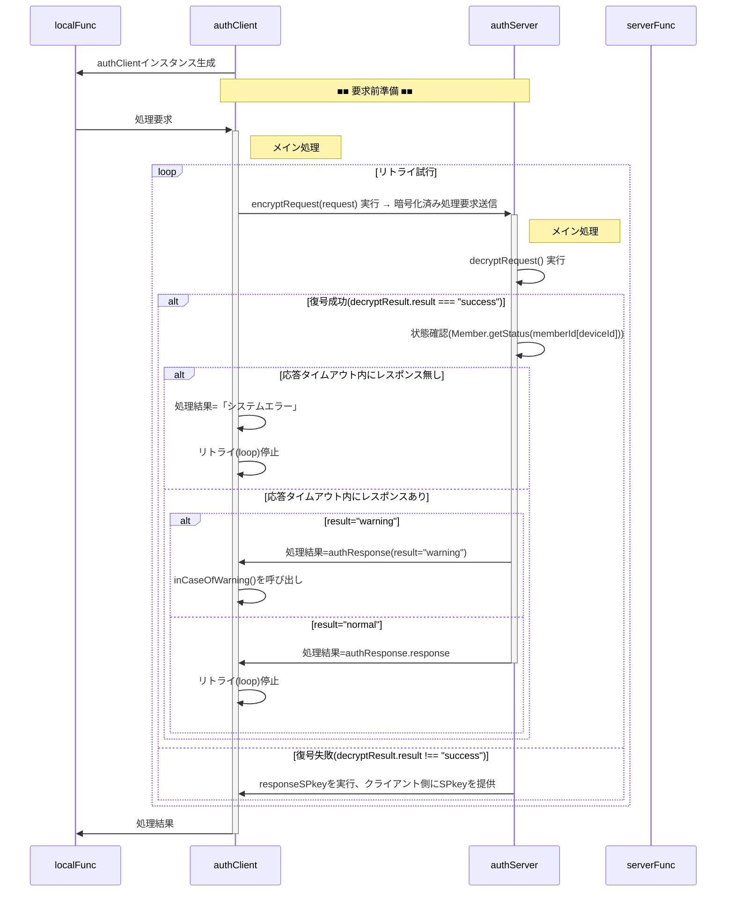
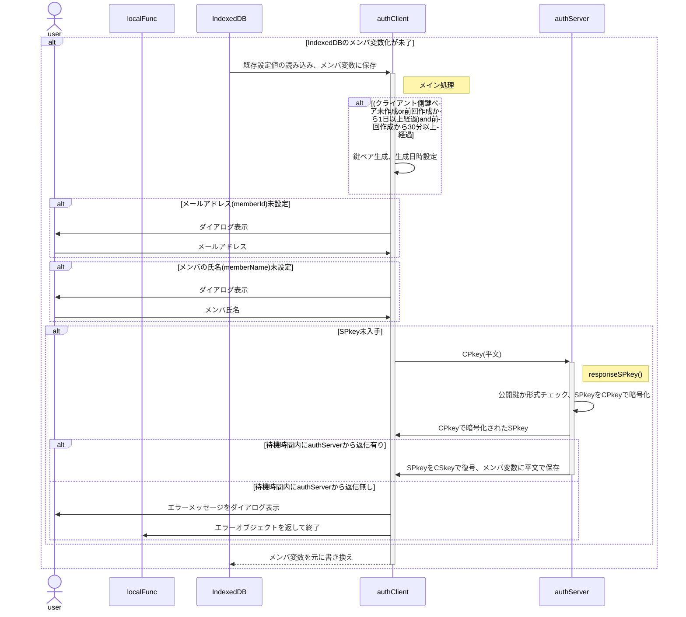
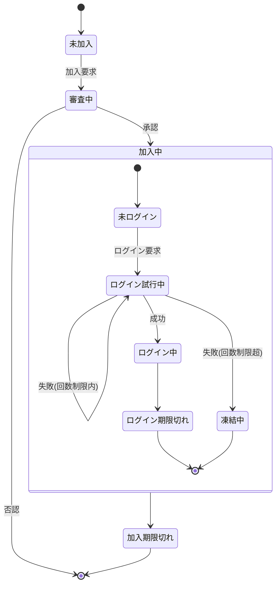

ご指摘いただいた点を修正しました。一部認識の齟齬があったようなので、敢えて修正していない点もありますが、再レビュー願います。
あと、回答IDが抜けてました。Ans-YYYYMMDD-NN形式でお願いします(前回10/8に見えましたが、時差？)。

<!-- 以下は既述のため割愛
- 本文書はMarkdownで書かれています。画像へのリンク(``)は無視してください。
- 以下の仕様に基づき、「関数群」「添付書類」にある関数を作成する予定ですが、今回は本仕様のレビューをお願いします。記述が無い・論理矛盾・不足している点や使用するツールの推薦をお願いします。
- 開発スピード・安定稼働を重視し多少のリスクは許容しますが、重大なセキュリティホールは指摘してください。
- GASライブラリは使えなくなる場合も有るため、CDNのように「ダウンロードして埋め込む」という選択肢がとれる範囲でお願いします。
- 「ライブラリ」欄に記載された機能は過去に使用実績があるため、特に問題無ければそれを流用します。
-->

<!-- 以下は次回以降にお願いします。今回だけで指摘事項は結構あると思うので。
- 関数・メソッドについて概要・入出力が未記載または不適切な場合、指摘の上作成願います
- 時間経過と共に仕様が一部変わっています。不適切な部分があれば指摘願います
-->

---

総説

ブラウザ(クライアント)とGAS(サーバ)の間で認証された通信を行う。

 要求仕様

- 本システムは限られた人数のサークルや小学校のイベント等での利用を想定する。<br>
  よって恒久性・安全性よりは導入時の容易さ・技術的ハードルの低さ、運用の簡便性を重視する。
- サーバ側(以下authServer)はスプレッドシートのコンテナバインドスクリプト、クライアント側(以下authClient)はHTMLのJavaScript
- サーバ側・クライアント側とも鍵ペアを使用
- 原則として通信は受信側公開鍵で暗号化＋発信側秘密鍵で署名
- クライアントの識別(ID)はメールアドレスで行う

 用語

- SPkey, SSkey：サーバ側の公開鍵(Server side Public key)と秘密鍵(Server side Secret key)
- CPkey, CSkey：クライアント側の公開鍵(Client side Public key)と秘密鍵(Client side Secret key)
- パスフレーズ：クライアント側鍵ペア作成時のキー文字列。JavaScriptで自動的に生成
- パスワード：運用時、クライアント(人間)がブラウザ上で入力する本人確認用の文字列
- パスコード：二段階認証実行時、サーバからクライアントに送られる6桁※の数字<br>
  ※既定値。実際の桁数はauthConfig.trial.passcodeLengthで規定

 暗号化・署名方式、運用

- 署名方式 : RSA-PSS
- 暗号化方式 : RSA-OAEP
- ハッシュ関数 : SHA-256以上
- 許容時差±120秒※以内
  ※既定値。実際の桁数はauthConfig.decryptRequest.allowableTimeDifferenceで規定
- 順序は「暗号化->署名」ではなく「署名->暗号化」で行う
  1. クライアントがデータをJSON化
  2. 自身の秘密鍵で署名（署名→暗号化）
  3. サーバの公開鍵で暗号化
  4. サーバは復号後、クライアント公開鍵(memberList.CPkey)で署名を検証
- パスワードの生成は「ライブラリ > createPassword」を使用
- パスコードのメール送信は「ライブラリ > sendMail」を使用
- CPkeyの有効期限が切れた場合、以下の手順で更新する
  1. クライアント側から古いCPkeyで署名された要求を受信
  2. サーバ側で署名検証の結果、期限切れを確認
    - memberList.trial[0].CPkeyUpdateUntilに「現在日時＋authConfig.decryptRequest.loginLifeTime」をセット
    - クライアント側に通知
  3. クライアント側でCPkeyを更新、新CPkeyで再度リクエスト
  4. サーバ側でauthConfig.decryptRequest.loginLifeTimeを確認、期限内ならmemberList.CPkeyを書き換え。期限切れなら加入処理同様、adminによる個別承認を必要とする。
  5. 以降は未ログイン状態で要求が来た場合として処理を継続

 処理手順

 概要

- 「■■　〜　■■」は別項で詳説
- authClient, authServer 横の「xxx()」ラベルはそれぞれのメソッド名


<details><summary>source</summary>



</details>

 要求前準備


<details><summary>source</summary>



</details>

 データ格納方法と形式

- スプレッドシート以外で日時を文字列として記録する場合はISO8601拡張形式の文字列(`yyyy-MM-ddThh:mm:ss.nnn+09:00`)
- 日時を数値として記録する場合はUNIX時刻(new Date().getTime())
- スプレッドシート(memberList)については[Memberクラス仕様書](Member.md)参照

 ScriptProperties

キー名は`authConfig.system.name`、データは以下のオブジェクトをJSON化した文字列。

※生成AIへ：鍵ペアをどのような形で格納するのか、仕様書とサンプルソースの提示をお願いします。

- typeof {Object} authScriptProperties - サーバのScriptPropertiesに保存するオブジェクト
- prop {number} keyGeneratedDateTime - 鍵ペア生成日時。UNIX時刻(new Date().getTime())

 IndexedDB

キー名は`authConfig.system.name`から取得

※生成AIへ：鍵ペアをどのような形で格納するのか、仕様書とサンプルソースの提示をお願いします。

- typeof {Object} authIndexedDB - クライアントのIndexedDBに保存するオブジェクト
- prop {number} keyGeneratedDateTime - 鍵ペア生成日時。UNIX時刻(new Date().getTime())<br>
  なおサーバ側でCPkey更新中に異なるCPkeyを生成し、更なる更新要求が出てしまうのを割けるため、鍵ペア生成は30分以上の間隔を置くものとする。
- prop {string} memberId - メンバの識別子(=メールアドレス)
- prop {Object} profile - メンバの属性
- prop {string} profile.memberName - メンバ(ユーザ)の氏名(ex."田中　太郎")。加入要求確認時に管理者が申請者を識別する他で使用。
- prop {string} SPkey - サーバ側の公開鍵
- prop {number} [ApplicationForMembership=-1] - 加入申請実行日時。未申請時は-1
- prop {string} [expireAccount=-1] - 加入承認の有効期間が切れる日時。未加入時は-1
- prop {string} [expireCPkey=-1] - CPkeyの有効期限。未ログイン時は-1

 データ型(typedef)

- クラスとして定義
- 時間・期間の単位はミリ秒

 authConfig

authClient/authServer共通で使用される設定値

※ 実装時はクラス化を想定。その場合、サーバ側のみ・クライアント側のみで使用するパラメータはauthConfigを継承する別クラスで定義することも検討する。

```js
/**
 * @typedef {Object} authConfig
 * @prop {string} [systemName='auth'] - システム名
 * @prop {string} [adminMail=''] - 管理者のメールアドレス
 * @prop {string} [adminName=''] - 管理者名
 * @prop {number} [allowableTimeDifference=120000] - クライアント・サーバ間通信時の許容時差。既定値：2分
 *
 * @prop {Object} RSA - 署名・暗号化関係の設定値
 * @prop {number} [RSA.bits=2048] - 鍵ペアの鍵長
 */
```

 authServerConfig

authConfigを継承した、authServerで使用する設定値

```js
/**
 * @typedef {Object} authServerConfig
 * @prop {string} [memberList='memberList'] - memberListシート名
 * @prop {number} [defaultAuthority=0] - 新規加入メンバの権限の既定値
 * @prop {number} [memberLifeTime=31536000000] - メンバ加入承認後の有効期間。既定値：1年
 * @prop {number} [loginLifeTime=86400000] - ログイン成功後の有効期間(=CPkeyの有効期間)。既定値：1
 *
 * @prop {Object.<string,Object>} func - サーバ側の関数マップ
 * @prop {number} func.authority - 当該関数実行のために必要となるユーザ権限<br>
  `memberList.profile.authority & authServerConfig.func.authrity > 0`なら実行可能とする。
 * @prop {Function|Arrow} func.do - 実行するサーバ側関数
 *
 * @prop {Object} trial - ログイン試行関係の設定値
 * @prop {number} [trial.passcodeLength=6] - パスコードの桁数
 * @prop {number} [trial.freezing=3600000] - 連続失敗した場合の凍結期間。既定値：1時間
 * @prop {number} [trial.maxTrial=3] パスコード入力の最大試行回数
 * @prop {number} [trial.passcodeLifeTime=600000] - パスコードの有効期間。既定値：10分
 * @prop {number} [trial.generationMax=5] - ログイン試行履歴(authTrial)の最大保持数。既定値：5世代
 */
```

 authClientConfig

authConfigを継承した、authClientで使用する設定値

```js
/**
 * @typedef {Object} authClientConfig
 * @prop {string} x - サーバ側WebアプリURLのID(`https://script.google.com/macros/s/(この部分)/exec`)
 */
```

 authRequest

authClientからauthServerに送られる処理要求オブジェクト

```js
/**
 * @typedef {Object} authRequest
 * @prop {string} memberId - メンバの識別子(=メールアドレス)
 * @prop {string} deviceId - デバイスの識別子
 * @prop {string} requestId - 要求の識別子。UUID
 * @prop {number} timestamp - 要求日時。UNIX時刻
 * @prop {string} func - サーバ側関数名
 * @prop {any[]} arguments - サーバ側関数に渡す引数
 * @prop {string} signature - クライアント側署名
 */
```

 decryptedRequest

decryptRequestで復号された処理要求オブジェクト

```js
/**
 * @typedef {Object} decryptedRequest
 * @prop {string} result - 処理結果。"fatal"(後続処理不要なエラー), "warning"(後続処理が必要なエラー), "success"
 * @prop {string} message - エラーメッセージ
 * @prop {string|Object} detail - 詳細情報。ログイン試行した場合、その結果
 * @prop {authRequest} request - ユーザから渡された処理要求
 * @prop {string} timestamp - 復号処理実施日時。メール・ログでの閲覧が容易になるよう、文字列で保存
 */
```

 authResponse

authServerからauthClientに送られる処理結果オブジェクト

```js
/**
 * @typedef {Object} authResponse
 * @prop {string} requestId - 要求の識別子。UUID
 * @prop {number} timestamp - 処理日時。UNIX時刻
 * @prop {string} result - 処理結果。decryptRequst.result
 * @prop {string} message - エラーメッセージ。decryptRequest.message
 * @prop {string} response - 要求された関数の戻り値をJSON化した文字列
 */
```

 クラス・関数定義

- [authClient](doc/authClient.md) 関数 仕様書
- [authServer](doc/authServer.md) 関数 仕様書
- [Member](doc/Member.md) クラス 仕様書
- [decryptRequest](doc/decryptRequest.md) 関数 仕様書
- [encryptRequest](doc/encryptRequest.md) 関数 仕様書

# 添付書類

以下は別ファイル(Markdown)として作成済みの仕様書。

---
**encryptRequest.md**
---

### 概要

本仕様書は、クライアント側でサーバへ安全に処理要求を送信するための関数
`encryptRequest` の設計および関連構成について記述する。\
サーバ側仕様書（decryptRequest）と対になる設計であり、署名・暗号化・鍵管理を統一方針で運用する。

------------------------------------------------------------------------

### 1. 基本方針

-   暗号化・署名には **Web Crypto API** を使用。
-   鍵ペアは **署名用（RSA-PSS）** と **暗号化用（RSA-OAEP）**
    の2種類を生成し、それぞれ非エクスポータブル（`exportable: false`）として
    **IndexedDB** に保存。
-   IndexedDB の store 名および keyPath は `authConfig.system.name`
    に基づく。
-   クライアント側公開鍵（CPkey）は
    `authConfig.loginLifeTime`（既定：1日）で有効期限管理。
-   暗号化・署名時に利用するハッシュ関数は **SHA-256** 以上を使用。

------------------------------------------------------------------------

### 2. 鍵ペア管理仕様

#### 2.1 鍵種別と用途

  鍵名        | アルゴリズム   | 用途    | 保存先
  :-- | :-- | :-- | :--
  CPkey-sign | RSA-PSS      | 署名    | IndexedDB
  CPkey-enc  | RSA-OAEP     | 暗号化  | IndexedDB

#### 2.2 鍵生成時パラメータ

``` js
{
  name: "RSA-PSS",
  modulusLength: authConfig.RSA.bits,
  publicExponent: new Uint8Array([0x01, 0x00, 0x01]),
  hash: "SHA-256",
  extractable: false,
  keyUsages: ["sign", "verify"]
}
```

暗号化鍵は `name: "RSA-OAEP"`、`keyUsages: ["encrypt", "decrypt"]`
とする。

#### 2.3 有効期限管理

-   IndexedDB に保存された鍵のメタ情報に作成日時・有効期限を保持。
-   有効期限が切れた場合は自動再生成。
-   サーバ側で署名検証時に期限切れが検知された場合、`updateCPkey`
    が呼ばれ更新処理を行う。

------------------------------------------------------------------------

### 3. 関数仕様

#### 3.1 encryptRequest

``` js
/**
 * @function encryptRequest
 * @desc クライアント側関数からサーバへの処理要求を暗号化・署名し、結果を返す。
 * @param {authRequest} request - サーバへの処理要求オブジェクト
 * @returns {Promise<Object>} 暗号化済み要求オブジェクト（envelope形式）
 */
```

#### 3.2 内部構造

  メソッド          役割
  ----------------- -----------------------------------------------------
  `init()`          鍵ペアの存在確認。なければ生成してIndexedDBに格納。
  `updateCPkey()`   サーバ要求による公開鍵更新処理。
  `exec()`          ローカル関数からの処理要求受付。署名＋暗号化実施。

------------------------------------------------------------------------

### 4. 処理フロー

1.  **初期化 (`init`)**
    -   IndexedDB を開く。鍵ペアが存在しない場合、RSA-PSS と RSA-OAEP
        を生成。
    -   生成した鍵をメンバ変数に保持し、IndexedDB に保存。
2.  **署名 (`sign`)**
    -   `request`
        オブジェクト（authRequest型）をJSON化し、RSA-PSS署名を付与。
3.  **暗号化 (`encrypt`)**
    -   署名付きペイロードを RSA-OAEP により暗号化。
    -   暗号文は Base64 エンコードし、以下のような構造で送信：

``` json
{
  "envelope": {
    "memberId": "user@example.com",
    "ciphertext": "BASE64_ENCRYPTED_PAYLOAD"
  }
}
```

4.  **公開鍵更新 (`updateCPkey`)**
    -   サーバから「期限切れ通知」を受信した場合、CPkey を再生成。
    -   新CPkey は再署名されサーバに登録依頼を送信。

------------------------------------------------------------------------

### 5. 暗号・署名パラメータ

  区分     アルゴリズム   ハッシュ   鍵長                  備考
  -------- -------------- ---------- --------------------- -----------------
  署名     RSA-PSS        SHA-256    authConfig.RSA.bits   鍵用途: sign
  暗号化   RSA-OAEP       SHA-256    authConfig.RSA.bits   鍵用途: encrypt

------------------------------------------------------------------------

### 6. 関連型定義

#### 6.1 authRequest

  プロパティ   型        内容
  ------------ --------- --------------------------------
  memberId     string    メンバ識別子（メールアドレス）
  requestId    string    要求識別子（UUID）
  timestamp    number    要求日時（UNIX時刻）
  func         string    サーバ側関数名
  arguments    any\[\]   関数引数
  signature    string    クライアント署名

#### 6.2 authResponse

  プロパティ   型       内容
  ------------ -------- --------------------------
  requestId    string   要求識別子（UUID）
  timestamp    number   処理日時（UNIX時刻）
  status       string   処理結果（null＝成功）
  response     string   関数の戻り値(JSON文字列)

------------------------------------------------------------------------

### 7. 補助関数

#### createPassword()

長さ・文字種指定に基づき、ランダムなパスワードを生成。

``` js
function createPassword(len=16,opt={lower:true,upper:true,symbol:true,numeric:true}){ ... }
```

------------------------------------------------------------------------

### 8. 懸念点・今後の検討

-   Web Crypto API
    の鍵管理は非同期であるため、IndexedDB操作のラッパ関数化が望ましい。\
-   鍵用途を明確化するため、署名鍵・暗号化鍵を分離して管理。\
-   CPkey
    の自動更新フローは、`authTrial.updateCPkey()`と統一設計が必要。\
-   `authConfig` のRSA設定はサーバ・クライアント共通クラス化を検討。

------------------------------------------------------------------------

© 2025 Authentication System Design Draft

---
**decryptRequest.md**
---

### ■ 概要
認証サーバ (`authServer`) から独立した復号・署名検証処理モジュール。
クライアントから送信された暗号文を安全に復号・検証し、結果を構造化オブジェクトとして返す。
暗号化ライブラリは `jsrsasign` を使用。

---

### ■ 設計方針
- 他システムでも利用可能な汎用API関数とする
- 署名→暗号化（Sign-then-Encrypt）方式に準拠
- 鍵ペアは `ScriptProperties` に保存（`SSkey`, `SPkey`）
- 鍵の更新は `refresh()` メソッドで実施（緊急対応のみ）
- 復号処理は副作用のない純関数構造を目指す（stateを持たない）

---

### ■ 関数定義
```js
/**
 * @function decryptRequest
 * @description クライアントからの暗号化要求を復号・署名検証し、結果を返す。
 * @param {Object} arg - 復号要求パラメータ
 * @param {string} arg.memberId - メンバ識別子（平文）
 * @param {string} arg.ciphertext - Base64エンコードされた暗号化JSON文字列
 * @returns {Object} result - 処理結果
 */
```

---

### ■ 戻り値構造
```js
{
  timestamp: "2025/10/08 22:45:00",
  result: "success" | "warning" | "fatal",
  message: "詳細メッセージ",
  request?: { ... }, // 復号済みJSON（成功時）
  detail?: { ... }   // 補足情報・再試行データ
}
```

---

### ■ 処理手順

| 手順 | 処理内容 | 結果・対応 |
|------|-----------|-------------|
| **① 入力検証** | `memberId`, `ciphertext` が存在し、文字列型であり、Base64形式か確認 | 不正入力 → `fatal` |
| **② メンバ存在確認** | `memberList` に該当メンバが存在するか | 不存在 → `fatal` + 管理者通知 |
| **③ 復号処理** | `SSkey` により `ciphertext` を復号 | 失敗 → `fatal` + 管理者通知 |
| **④ JSON構造検証** | 復号結果がJSONで、`timestamp`, `signature`, `func`, `requestId` 等を含むか確認 | 欠損 → `fatal` |
| **⑤ タイムスタンプ検証** | サーバ時刻との差が `authConfig.allowableSkew` を超過しないか | 超過 → `fatal` |
| **⑥ リプレイ検知** | `requestId` がキャッシュ済みか確認 | 重複 → `fatal` |
| **⑦ 署名検証** | `memberList[memberId].CPkey` で署名を検証 | 失敗 → `fatal` |
| **⑧ アカウント有効性確認** | 承認済・有効期間内か | 期限切れ → `warning` |
| **⑨ 署名有効期限確認** | `CPkey` の有効期限をチェック | 切れ → `warning` + 更新誘導 |
| **⑩ セッション状態確認** | ログイン済みか・有効期間内か確認 | 未ログイン → `authTrial()` 実行 |
| **⑪ 正常処理** | 全て通過 | `result = "success"` |

---

### ■ 例外・共通処理

| 対象 | 処理 | 備考 |
|------|------|------|
| **全 fatal ケース** | `adminMail` 宛に通知（スロットリング付き） | 同一memberId連続通知は抑止 |
| **ログ出力** | `memberId`, `result`, `message`, `timestamp` のみ | 機密情報（平文・署名）は除外 |
| **環境情報収集** | `IP`, `UserAgent` 等を匿名化して `rv.detail` に格納 | |
| **再試行誘導** | `warning` の場合は `detail.nextAction` に再試行手順を付与 | |

---

### ■ 関連設定項目

| 設定名 | 意味 | 例 |
|--------|------|----|
| `authConfig.allowableSkew` | タイムスタンプ許容差(ms) | `5 * 60 * 1000` |
| `authConfig.loginLifeTime` | ログイン有効期間(ms) | `60 * 60 * 1000` |
| `authConfig.replayCacheTTL` | リプレイ検知キャッシュ保持(ms) | `10 * 60 * 1000` |
| `authConfig.mailThrottle` | 管理者通知抑止時間(ms) | `60 * 1000` |
| `memberList.trial.CPkeyUpdateUntil` | クライアント鍵更新期限 | `Date(ms)` |

---

### ■ 想定戻り値例

#### ✅ 正常ケース
```js
{
  timestamp: "2025/10/08 22:45:00",
  result: "success",
  message: "Decryption and verification passed",
  request: { func: "getData", args: [123], requestId: "abc123", timestamp: 1696789200000 }
}
```

#### ⚠️ 署名期限切れ（CPkey更新誘導）
```js
{
  result: "warning",
  message: "CPkey expired",
  detail: { nextAction: "requestKeyUpdate", retryAfter: "2025-10-09T00:00:00Z" }
}
```

#### ❌ リプレイ検出
```js
{
  result: "fatal",
  message: "Duplicate requestId detected",
  detail: { requestId: "abc123" }
}
```

---

### ■ セキュリティ設計ポイント

| 項目 | 対策 |
|------|------|
| **リプレイ攻撃** | requestIdキャッシュ（TTL付き）で検出・拒否 |
| **タイミング攻撃** | 定数時間比較（署名・ハッシュ照合）を採用 |
| **ログ漏えい防止** | 復号データは一切記録しない |
| **エラー通知スパム** | メンバ単位で送信間隔を制御 |
| **鍵管理** | `SSkey`/`SPkey` は ScriptProperties に格納し、Apps Script内でのみ参照可 |

---

### ■ 改良点まとめ（前版との差分）

| 区分 | 改良内容 |
|------|-----------|
| **入力検証強化** | Base64・JSON構造検証を追加 |
| **リプレイ検知** | `requestId` キャッシュを導入 |
| **ログ管理** | 機密データ除外・匿名化強化 |
| **メール通知制御** | スパム防止のスロットリング追加 |
| **関数純化** | グローバル依存を減らし関数単体テスト可能化 |

---

### ■ 今後の拡張案
- RSA→ECCへの切替対応（パフォーマンス・鍵サイズ改善）
- AES-GCM等による改ざん検知付き共通鍵暗号化併用
- memberListを外部KVS化（セキュア・スケーラブル運用）

---

© 2025 Auth System Design Team

---
**Member.md**
---

### 概要

- Member は サーバ側 でメンバ情報を一元的に管理するクラスです。
- 加入・ログイン・パスコード試行・デバイス別CPkey管理などの状態を統一的に扱います。
- マルチデバイス利用を前提とし、memberListスプレッドシートの1行を1メンバとして管理します。

### 状態遷移



| No | 状態 | 説明・判定方法 |
| --: | :-- | :-- |
| 1 | 未加入 | memberListに存在しない<br>memberList.memberIdに無い |
| 2 | 審査中 | 管理者承認待ち<br>!memberList.accepted && !memberList.reportResult |
| 3 | 加入中 | 有効メンバ。期限内であれば認証可能<br>0 < memberList.accepted && Date.now() < memberList.expire |
| 4 | &emsp;未ログイン | 当該デバイスでは有効なCPkeyが未発行、または期限切れの状態<br>（他デバイスではログイン中であってもよい）<br>memberId[deviceId].CPkeyUpdated+authConfig.loginLifeTime < Date.now() |
| 5 | &emsp;ログイン試行中 | 認証用パスコードを発行済みで、結果が未確定<br>Date.now() < memberList.memberId[deviceId].trial[0].created + authConfig.passcodeLifeTime |
| 6 | &emsp;ログイン中 | 認証が成功し、権限が必要な処理も要求できる状態<br>Date.now() <= memberList.memberId[deviceId].CPkeyUpdated+authConfig.loginLifeTime |
| 7 | &emsp;ログイン期限切れ | CPキーの有効期限が切れて再作成が必要な状態<br>memberList.memberId[deviceId].CPkeyUpdated+authConfig.loginLifeTime < Date.now() |
| 8 | &emsp;凍結中 | 制限回数内に認証が成功せず、試行できない状態<br>Date.now() < memberList.memberId[deviceId].trial[0].freezingUntil |
| 9 | 加入期限切れ | メンバ加入承認後の有効期間が切れた状態<br>memberList.expire < Date.now() |

### 状態遷移時にセットすべき変数

| 状態 | 更新されるプロパティ | 更新内容 |
| :-- | :-- | :-- |
| 審査中 → 加入中 | accepted, expire | 承認日時、承認後の有効期限を設定 |
| 加入中 → 未ログイン | device[].trial | 認証試行履歴を初期化（空配列） |
| 未ログイン → ログイン試行中 | device[].trial[0].passcode, created | 新しいパスコードを生成し記録 |
| ログイン試行中 → ログイン中 | device[].CPkey, CPkeyUpdated | クライアントから送信されたCPkeyを登録 |
| ログイン中 → ログイン期限切れ | device[].CPkeyUpdated | 期限切れ判定により更新なし。再生成を要求 |
| ログイン試行中 → 凍結中 | device[].trial[0].freezingUntil | 現在時刻＋freezingをセット |
| 加入中 → 加入期限切れ | expire | 判定のみ。更新なし |

### データ型定義

```js
/**
 * @typedef {Object} authTrialLog
 * @prop {string} enterd - 入力されたパスコード
 * @prop {number} result - -1:恒久的エラー, 0:要リトライ, 1:パスコード一致
 * @prop {string} message - エラーメッセージ
 * @prop {number} timestamp - 判定処理日時
 */
/**
 * @typedef {Object} authTrial
 * @prop {string} passcode - 設定されているパスコード
 * @prop {number} created - パスコード生成日時(≒パスコード通知メール発信日時)
 * @prop {number} [freezingUntil=0] - 凍結解除日時。最大試行回数を超えたら現在日時を設定
 * @prop {number} [CPkeyUpdateUntil=0] - CPkey更新処理中の場合、更新期限をUNIX時刻でセット
 * @prop {authTrialLog[]} [log=[]] - 試行履歴。常に最新が先頭(unshift()使用)
 */
/**
 * @typedef {Object} MemberProfile
 * @prop {number} authority - メンバのサーバ側処理時の実行権限
 */
/**
 * @typedef {Object} Device
 * @prop {string} deviceId - デバイスの識別子。UUID
 * @prop {string} CPkey - メンバの公開鍵
 * @prop {string} CPkeyUpdated - 最新のCPkeyが登録された日時
 * @prop {string} trial - ログイン試行関連情報オブジェクト(authTrial[])のJSON文字列
 */
/**
 * @typedef {Object} memberList
 * @prop {string} memberId - メンバの識別子(=メールアドレス)
 * @prop {string} name - メンバの氏名
 * @prop {string} accepted - 加入が承認されたメンバには承認日時を設定
 * @prop {string} reportResult - 「加入登録」処理中で結果連絡メールを送信した日時
 * @prop {string} expire - 加入承認の有効期間が切れる日時
 * @prop {string} profile - メンバの属性情報(MemberProfile)を保持するJSON文字列
 * @prop {string} device - マルチデバイス対応のためのデバイス情報(Device)を保持するJSON文字列
 * @prop {string} [note] - 当該メンバに対する備考
 */
```

### クラス・メソッド定義

- メンバ加入承認はadminがシート上で行う

#### constructor()

```js
/**
 * Member クラス
 * @class
 * @description memberListの1行をもとに、メンバ情報と状態を管理する。
 */
class Member {

  /**
   * @constructor
   * @param {Object} arg
   * @param {string} arg.sheetName - memberListのシート名
   * @param {string} arg.memberId - メンバ識別子(メールアドレス)
   * @param {Object} [opt] - オプション(authConfig)
   * @description 指定されたmemberIdの情報を取得し、状態を解析してプロパティに展開する。
   */
  constructor(arg, opt) {}
}
```

#### getStatus(): メンバの現在状態を判定する

```js
/**
 * メンバの現在状態を判定する
 * @param {void}
 * @returns {string} 現在の状態を返す（例："未加入"、"ログイン中"など）
 */
```

#### register(): 新規メンバを登録する

```js
/**
 * 新規メンバを登録する
 * @param {string} name - メンバ名
 * @param {string} memberId - メールアドレス
 * @param {MemberProfile} profile - 初期権限・属性情報
 * @returns {Object} 登録結果
 */
```

#### createPasscode(): パスコード生成処理

```js
/**
 * パスコード生成処理
 * @param {string} deviceId
 * @returns {authTrial} 新しい認証試行情報
 */
```

#### verifyPasscode(): 入力されたパスコードを検証する

```js
/**
 * 入力されたパスコードを検証する
 * @param {string} deviceId
 * @param {string} enterd - 入力パスコード
 * @param {number} timestamp - 判定時刻
 * @returns {authTrialLog} 判定結果
 */
```

#### updateCPkey(): CPkey更新処理（クライアント送信に基づく）

```js
  /**
   * CPkey更新処理（クライアント送信に基づく）
   * @param {string} deviceId
   * @param {string} newCPkey
   * @returns {boolean} 登録結果
   */
```

#### maintenance(): 加入期限・CPkey期限などの定期チェックを行う

| 区分             | 処理内容                                                                                                   | 対象・目的                  |
| :------------- | :----------------------------------------------------------------------------------------------------- | :--------------------- |
| 🕐 **期限管理**    | - `memberList.expire` を過ぎたメンバを「加入期限切れ」にする<br>- `device[].CPkeyUpdated` が `loginLifeTime` 超過ならCPkeyを無効化 | 加入期限・CPkeyの有効期限切れの自動処理 |
| 🧊 **凍結解除**    | - `trial[].freezingUntil < Date.now()` なら凍結状態を解除                                                       | 認証試行失敗による凍結期間終了後の自動解除  |
| 🧹 **履歴整理**    | - `trial.log`の古い履歴を`generationMax`超過分だけ削除<br>- 不要デバイス（長期間非アクティブ）を削除                                    | データ肥大化防止、整合性維持         |
| 🧭 **整合性補正**   | - CPkeyが存在しないのに`ログイン中`判定されているデバイスを修正<br>- profile.authorityが空の場合は`authConfig.defaultAuthority`で補完      | データ不整合の自動修復            |
| ✉️ **通知系（任意）** | - 期限切れ/凍結/更新要求などが発生した場合に管理者やユーザへメール通知                                                                  | 運用支援・エラー検知             |

```js
/**
 * @method maintenance
 * @desc memberList全体をスキャンし、期限切れ・凍結解除・整合性補正などを行う。
 * @param {Object} [opt] - 実行オプション
 * @param {boolean} [opt.notify=true] - 処理結果を管理者へ通知するか
 * @param {boolean} [opt.cleanup=true] - 不要データ(旧trial,期限切れdevice)を削除するか
 * @returns {Object} - 実行結果サマリ { cleaned: number, expired: number, unfrozen: number, notified: number }
 */
```

---
**authClient.md**
---

- クロージャ関数として定義

### 概要

### メイン処理

- classのconstructor()に相当するメイン処理部分
- 鍵ペアの準備：IndexedDBから鍵ペアを取得、authClientのメンバ変数に格納。<br>
  IndexedDBに鍵ペアが無い場合は新たに生成し、生成時刻と共に保存
- IndexedDBからメールアドレスを取得、存在しなければダイアログから入力
- IndexedDBからメンバの氏名を取得、存在しなければダイアログから入力
- SPkey未取得ならサーバ側に要求
- 更新した内容はIndexedDBに書き戻す
- SPkey取得がエラーになった場合、SPkey以外は書き戻す

```js
/**
 * @param {void}
 * @returns {Object.<string,Function>} 使用可能なメソッド
 */
```

### joining() : 加入要求

- 加入申請済かどうかで、以下の①②に分岐<br>
  `IndexedDB.ApplicationForMembership < 0 ⇒ 未申請`
- 加入未申請だった場合
  - 加入要求(`func="membershipRequest"`)としてCPkeyとmemberId(メールアドレス)をSPkeyで暗号化してサーバ側に送信する
  - 待機時間を超えたらError
  - IndexedDBに加入申請日時を記録
  - 処理要求中フラグ=false
- 加入申請済だった場合
  - 加入審査結果問合せ(`func="examinationResultInquiry"`)をサーバ側に送信
  - 加入可否に関わらずIndexedDB・メンバ変数のアカウント有効期限・CPkey有効期限をサーバ側の戻り値で更新
  - 加入NGだった場合はリトライするかダイアログで意思確認

```js
/**
 * @param {void}
 * @returns {null|Error}
 */
```

### requestLogin() : ログイン要求

- authServer.loginTrialに`{func:"loginRequest"}`を送信


<!-- 以降、未チェック -->

### request() : 処理要求

### inCaseOfWarning() : authResponse.result==warningだった場合の処理

authResponse.messageに従い、accountExpired/updateCPkey/loginに処理分岐

### accountExpired() : アカウント有効性確認(アカウント有効期限切れ対応)

### updateCPkey() : 署名有効期限確認(CPkey有効期限切れ対応)

1. 鍵ペアを再作成し、改めて送信
2. CPkey再登録・ログイン終了後、改めて要求を送信

### login() : セッション状態確認(未ログイン)

1. ダイアログを表示、authServerからのパスコード通知メールを待って入力
2. パスコードをauthServerに送信

### reset() : IndexedDBに格納されている情報を再作成

メールアドレス入力ミスの場合を想定。

- 鍵ペアの再作成
- ダイアログからメールアドレス入力。入力済のメールアドレスがあれば、流用も許容

---
**authServer.md**
---

### 概要

- authRequest.requestId を短期間保存して重複拒否

### メイン処理

- 引数無しの場合はsetupEnvironmentを呼び出して環境整備
- decryptRequestで復号
- 復号できた場合、memberId[deviceId]を元に状態取得、以下のように分岐
	| No | 状態 | 要求内容 | 呼出先 |
  | --: | :-- | :-- | :-- |
	| 1 | 未加入 | 加入要求 | membershipRequest() |
	| 2 | 審査中 | 加入審査結果問合せ | examinationResultInquiry() |
	| 3 | 加入中 | — | — |
	| 4 | 未ログイン | ログイン要求 | logInRequest() |
	| 5 | ログイン試行中 | 入力されたパスコードの通知 | loginTrial() |
	| 6 | ログイン中 | サーバ側関数の呼び出し | callFunction() |
	| 7 | ログイン期限切れ | ログイン要求 | logInRequest() |
	| 8 | 凍結中 | 呼出先関数が無権限実行可なら呼び出し、それ以外は不可 | — |
	| 9 | 加入期限切れ | 呼出先関数が無権限実行可なら呼び出し、それ以外は不可 | — |
- 復号できなかった場合はCPkeyと推定、公開鍵の形式チェックの上、OKならCPkeyで暗号化したSPkeyを返す
- authServerのメソッド・サーバ側関数共、戻り値としてErrorが帰ってきた場合は何も返さない
- 呼出先からの戻り値がError以外の場合、authResponse形式に変換してauthClientに返す

### setupEnvironment() : 実行環境整備

- memberListが無ければシートを作成
- ScriptPropertiesの作成
- sendMailやシートへのアクセス等、GASでの権限承認が必要な処理をダミーで動かし、必要な権限を一括承認

### responseSPkey() : クライアント側にSPkeyを提供

- 引数argはdecryptRequestで復号できなかった、authClientから渡された文字列
- CPkeyと推定して公開鍵の形式を満たすかチェック

```js
/**
 * @param {string} arg
 * @returns {string|Error} チェックOKならCPkeyで暗号化されたSPkey、NGならErrorを返す
 */
```

### membershipRequest() : 加入要求時処理

- クライアント側からの加入要求を受け、memberListにmemberId,CPkeyを記録
- 加入要求があったことをadminに連絡するため、メール送信

```js
/**
 * @param {string} memberId
 * @param {string} CPkey
 * @returns {null|Error}
 */
```

### notifyAcceptance() : 加入要求の結果連絡

- スプレッドシートのメニュー「加入登録の結果連絡」として使用
- memberList.reportResultが空欄のメンバに対して加入可否検討結果をメールで送信

### examinationResultInquiry() : 加入審査結果問合せへの回答

- 戻り値はアカウント有効期限・CPkey有効期限
  ```js
  authResponse.response = `{
    expireAccount: memberList.CPkeyUpdated + authConfig.decryptRequest.loginLifeTime,
    expireCPkey: memberList.expire,
  }
  ```

```js
/**
 * @param {string} memberId
 * @returns {Object|Error}
 */
```

### loginTrial() : クライアントからのログイン要求に基づくログイン可否判断

- memberIdを元にmemberListから当該メンバの情報を取得
- trial欄の

- memberIdを元に[authTrialクラス](class.authTrial.md)をインスタンス化(仮に`const atObj = new authTrial({memberId:memberId})`とする)。
-


```js
/**
 * @param {string} memberId
 */
```

### inCaseOfWarning() : 復号時warningだった場合の処理

| **⑧ アカウント有効性確認** | 承認済・有効期間内か | 期限切れ → `warning` |
| **⑨ 署名有効期限確認** | `CPkey` の有効期限をチェック | 切れ → `warning` + 更新誘導 |
| **⑩ セッション状態確認** | ログイン済みか・有効期間内か確認 | 未ログイン → `authTrial()` 実行 |

### callFunction() : サーバ側関数の呼び出し
