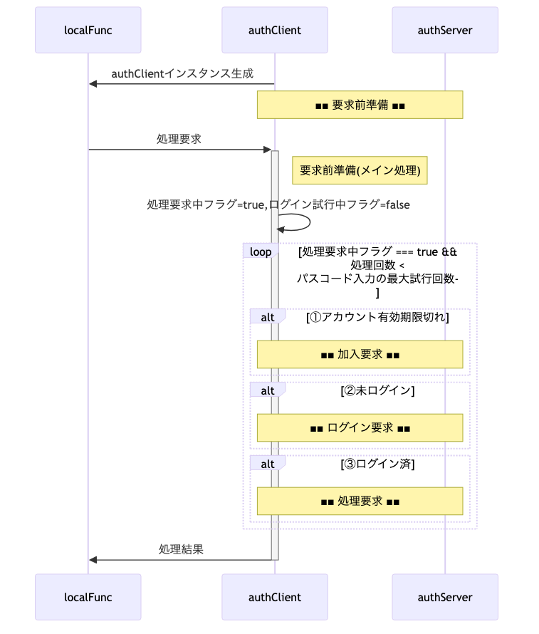
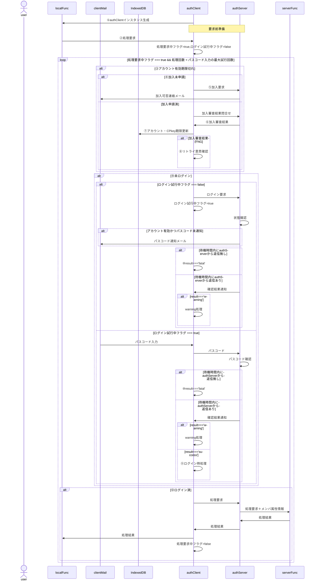
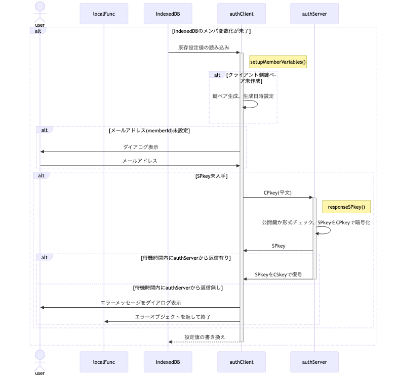
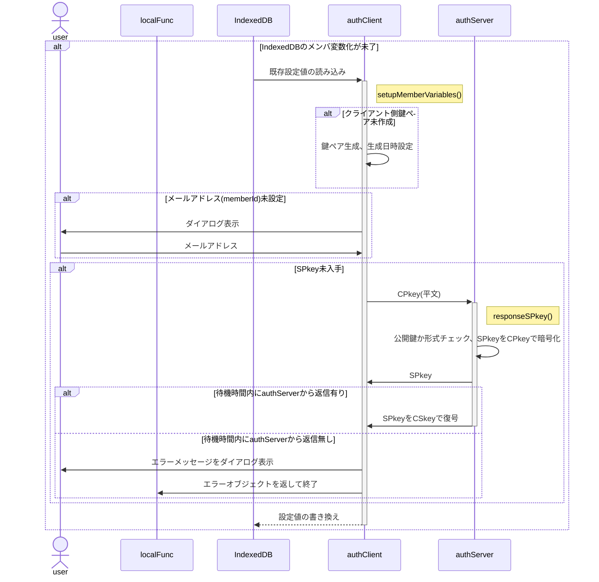
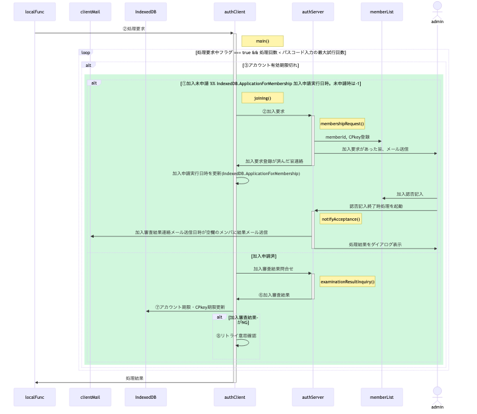
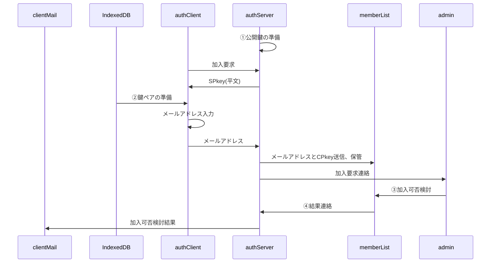
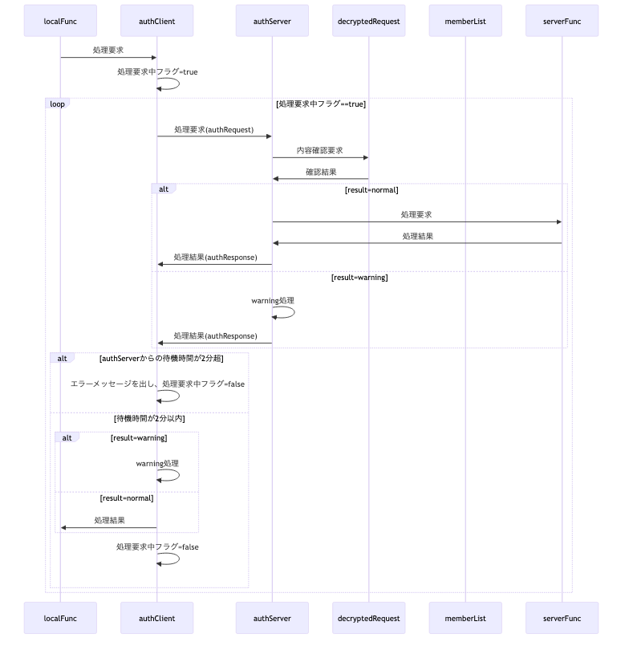
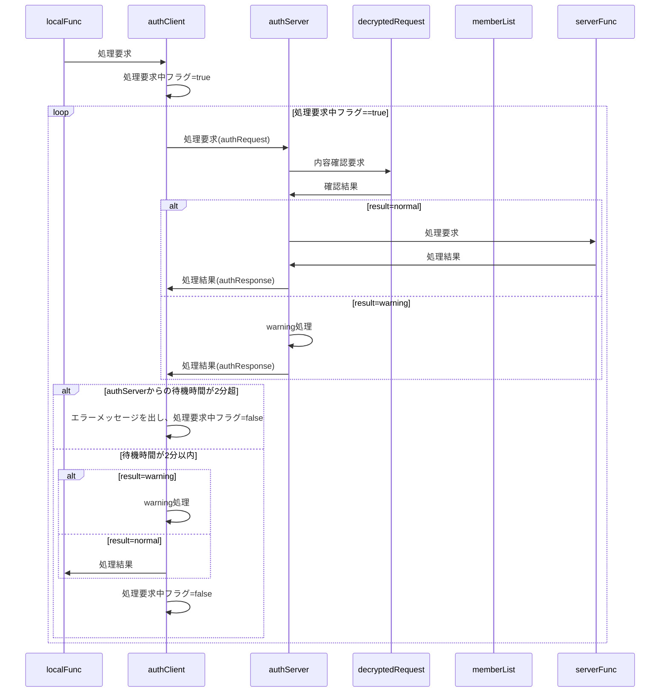

- 本文書はMarkdownで書かれています。画像へのリンク(``)は無視してください。
- 以下の仕様に基づき、「関数群」「添付書類」にある関数を作成する予定ですが、今回は本仕様のレビューをお願いします。記述が無い・論理矛盾・不足している点や使用するツールの推薦をお願いします。
- 開発スピード・安定稼働を重視し多少のリスクは許容しますが、重大なセキュリティホールは指摘してください。
- GASライブラリは使えなくなる場合も有るため、CDNのように「ダウンロードして埋め込む」という選択肢がとれる範囲でお願いします。
- 「ライブラリ」欄に記載された機能は過去に使用実績があるため、特に問題無ければそれを流用します。

---

総説

ブラウザ(クライアント)とGAS(サーバ)の間で認証された通信を行う。

 要求仕様

- 本システムは限られた人数のサークルや小学校のイベント等での利用を想定する。<br>
  よって恒久性・安全性よりは導入時の容易さ・技術的ハードルの低さ、運用の簡便性を重視する。
- サーバ側(以下authServer)はスプレッドシートのコンテナバインドスクリプト、クライアント側(以下authClient)はHTMLのJavaScript
- サーバ側・クライアント側とも鍵ペアを使用
- 原則として通信は受信側公開鍵で暗号化＋発信側秘密鍵で署名
- クライアントの識別(ID)はメールアドレスで行う

 用語

- SPkey, SSkey：サーバ側の公開鍵(Server side Public key)と秘密鍵(Server side Secret key)
- CPkey, CSkey：クライアント側の公開鍵(Client side Public key)と秘密鍵(Client side Secret key)
- パスフレーズ：クライアント側鍵ペア作成時のキー文字列。JavaScriptで自動的に生成
- パスワード：運用時、クライアント(人間)がブラウザ上で入力する本人確認用の文字列
- パスコード：二段階認証実行時、サーバからクライアントに送られる6桁※の数字<br>
  ※既定値。実際の桁数はauthConfig.trial.passcodeLengthで規定

 暗号化・署名方式、運用

- 署名方式 : RSA-PSS
- 暗号化方式 : RSA-OAEP
- ハッシュ関数 : SHA-256以上
- 許容時差±120秒※以内
  ※既定値。実際の桁数はauthConfig.decryptRequest.allowableTimeDifferenceで規定
- 順序は「暗号化->署名」ではなく「署名->暗号化」で行う
  1. クライアントがデータをJSON化
  2. 自身の秘密鍵で署名（署名→暗号化）
  3. サーバの公開鍵で暗号化
  4. サーバは復号後、クライアント公開鍵(memberList.CPkey)で署名を検証
- パスワードの生成は「ライブラリ > createPassword」を使用
- パスコードのメール送信は「ライブラリ > sendMail」を使用
- CPkeyの有効期限が切れた場合、以下の手順で更新する
  1. クライアント側から古いCPkeyで署名された要求を受信
  2. サーバ側で署名検証の結果、期限切れを確認
    - memberList.trial[0].CPkeyUpdateUntilに「現在日時＋authConfig.decryptRequest.loginLifeTime」をセット
    - クライアント側に通知
  3. クライアント側でCPkeyを更新、新CPkeyで再度リクエスト
  4. サーバ側でauthConfig.decryptRequest.loginLifeTimeを確認、期限内ならmemberList.CPkeyを書き換え。期限切れなら加入処理同様、adminによる個別承認を必要とする。
  5. 以降は未ログイン状態で要求が来た場合として処理を継続

 処理手順

 概要



<details><summary>source</summary>



- ①authClientインスタンス生成：この時点でIndexedDBに鍵ペア・メールアドレスを準備
- ②処理要求：authClient側でIndexedDBの内容を取得

- ③アカウント有効期限切れ：「処理要求中 and アカウント有効期限切れ」なら真。<br>
  ⇒ `処理要求中フラグ === true && IndexedDB.expireAccount < Date.now()`
  authServer.memberListが原本だが、クライアント側でも事前にチェックする
- ④加入未申請：`IndexedDB.ApplicationForMembership < 0`なら真
- ⑤加入要求：加入審査は人間系なので到着日時未定。この時点で一度処理を中断するため、authClientは以下の処理を行う
  - IndexedDBに加入申請日時を記録
  - 処理要求中フラグ=false

- ⑥加入審査結果：memberListの検索結果(存在or不存在)、アカウント・CPkey期限(既存メンバは現在の設定値)
- ⑦アカウント・CPkey期限更新：加入審査結果がNGだった場合、IndexedDB.expireAccount/expireCPkey共にnullを設定
- ⑧リトライ意思確認：ダイアログでリトライするか確認。リトライしない場合、処理要求中フラグ=falseを設定

- ⑨未ログイン：「処理要求中 and アカウント有効期限内 and CPkey有効期限切れ」なら真。<br>
  ⇒ `処理要求中フラグ === true && Date.now() < IndexedDB.expireAccount && IndexedDB.expireCPkey < Date.now()`
- ⑩result==='fatal'：authClientは以下の処理を行う
  - IndexedDB.expireAccount/expireCPkeyをクリア(-1をセット)
  - 処理要求中フラグ=false
- ⑪ログイン時処理：authClientは以下の処理を行う
  - IndexedDB.expireCPkeyを更新
  - 処理要求中フラグ=false
  - ログイン試行中フラグ=false

- ⑫ログイン済：「処理要求中 and アカウント有効期限内 and CPkey有効期限内」なら真。<br>
  ⇒ `処理要求中フラグ === true && Date.now() < IndexedDB.expireAccount && Date.now() < IndexedDB.expireCPkey`

</details>

 authClient 要求前準備



<details><summary>source</summary>



 加入手順



<details><summary>source</summary>



</details>

- ①公開鍵の準備：ScriptPropertiesから公開鍵を取得。鍵ペア未生成なら生成して保存
- ②鍵ペアの準備：IndexedDBから鍵ペアを取得、authClientのメンバ変数に格納。<br>
  IndexedDBに鍵ペアが無い場合は新たに生成し、生成時刻と共に保存
- ③加入可否検討：加入可ならmemberList.acceptedに記入(不可なら空欄のまま)。<br>
- ④結果連絡：スプレッドシートのメニューから「結果連絡」処理を呼び出し、
  memberList.reportResultが空欄のメンバに対して加入可否検討結果をメールで送信

 処理要求手順



<details><summary>source</summary>



</details>

 データ格納方法と形式

- スプレッドシート以外で日時を文字列として記録する場合はISO8601拡張形式の文字列(`yyyy-MM-ddThh:mm:ss.nnn+09:00`)
- 日時を数値として記録する場合はUNIX時刻(new Date().getTime())

 ScriptProperties

キー名は`authConfig.system.name`、データは以下のオブジェクトをJSON化した文字列。

※生成AIへ：鍵ペアをどのような形で格納するのか、仕様書とサンプルソースの提示をお願いします。

- typeof {Object} authScriptProperties - サーバのScriptPropertiesに保存するオブジェクト
- prop {number} keyGeneratedDateTime - 鍵ペア生成日時。UNIX時刻(new Date().getTime())

 IndexedDB

キー名は`authConfig.system.name`から取得

※生成AIへ：鍵ペアをどのような形で格納するのか、仕様書とサンプルソースの提示をお願いします。

- typeof {Object} authIndexedDB - クライアントのIndexedDBに保存するオブジェクト
- prop {number} keyGeneratedDateTime - 鍵ペア生成日時。UNIX時刻(new Date().getTime())
- prop {string} memberId - メンバの識別子(=メールアドレス)
- prop {string} SPkey - サーバ側の公開鍵
- prop {number} [ApplicationForMembership=-1] - 加入申請実行日時。未申請時は-1
- prop {string} [expireAccount=-1] - 加入承認の有効期間が切れる日時。未加入時は-1
- prop {string} [expireCPkey=-1] - CPkeyの有効期限。未ログイン時は-1

 memberList(スプレッドシート)

- typedef {Object} memberList
- prop {string} memberId - メンバの識別子(=メールアドレス)
- prop {string} CPkey - メンバの公開鍵
- prop {string} CPkeyUpdated - 最新のCPkeyが登録された日時
- prop {string} accepted - 加入が承認されたメンバには承認日時を設定
- prop {string} reportResult - 「加入登録」処理中で結果連絡メールを送信した日時
- prop {string} expire - 加入承認の有効期間が切れる日時
- prop {string} profile - メンバの属性情報を保持するJSON文字列。サーバ側処理時のユーザ毎の実行権限等での利用を想定。
- prop {string} trial - ログイン試行関連情報オブジェクト(authTrial[])のJSON文字列

 データ型(typedef)

- クラスとして定義
- 時間・期間の単位はミリ秒

 authConfig

authClient/authServer共通で使用される設定値

※ 実装時はクラス化を想定。その場合、サーバ側のみ・クライアント側のみで使用するパラメータはauthConfigを継承する別クラスで定義することも検討する。

- typedef {Object} authConfig
- prop {Object} system
- prop {string} [system.name='auth'] - システム名
- prop {string} [system.adminMail=''] - 管理者のメールアドレス
- prop {string} [system.adminName=''] - 管理者名

- prop {Object} RSA - 署名・暗号化関係の設定値
- prop {number} [RSA.bits=2048] - 鍵ペアの鍵長

 authServerConfig

authConfigを継承した、authServerで使用する設定値

- typedef {Object} authServerConfig
- prop {string} [system.memberList='memberList'] - memberListシート名
- prop {Object.<string,Function|Arrow>} func - サーバ側の関数マップ。{関数名：関数}形式

- prop {Object} decryptRequest - decryptRequest関係の設定値
- prop {number} [decryptRequest.memberLifeTime=31536000000] - メンバ加入承認後の有効期間。既定値：1年
- prop {number} [decryptRequest.loginLifeTime=86400000] - ログイン成功後の有効期間(=CPkeyの有効期間)。既定値：1日
- prop {number} [decryptRequest.allowableTimeDifference=120000] - クライアント・サーバ間通信時の許容時差。既定値：2分

- prop {Object} trial - ログイン試行関係の設定値
- prop {number} [trial.passcodeLength=6] - パスコードの桁数
- prop {number} [trial.freezing=3600000] - 連続失敗した場合の凍結期間。既定値：1時間
- prop {number} [trial.maxTrial=3] パスコード入力の最大試行回数
- prop {number} [trial.passcodeLifeTime=600000] - パスコードの有効期間。既定値：10分
- prop {number} [trial.generationMax=5] - ログイン試行履歴(authTrial)の最大保持数。既定値：5世代

 authClientConfig

authConfigを継承した、authClientで使用する設定値

- typedef {Object} authClientConfig
- prop {string} x - サーバ側WebアプリURLのID(`https://script.google.com/macros/s/(この部分)/exec`)

 authTrialLog

- typedef {Object} authTrialLog
- prop {string} enterd - 入力されたパスコード
- prop {number} result - -1:恒久的エラー, 0:要リトライ, 1:パスコード一致
- prop {string} message - エラーメッセージ
- prop {number} timestamp - 判定処理日時

 authTrial

- [authTrial](doc/class.authTrial.md)参照

 authRequest

authClientからauthServerに送られる処理要求オブジェクト

- typedef {Object} authRequest
- prop {string} memberId - メンバの識別子(=メールアドレス)
- prop {string} requestId - 要求の識別子。UUID
- prop {number} timestamp - 要求日時。UNIX時刻
- prop {string} func - サーバ側関数名
- prop {any[]} arguments - サーバ側関数に渡す引数
- prop {string} signature - クライアント側署名

 decryptedRequest

decryptRequestで復号された処理要求オブジェクト

- typedef {Object} decryptedRequest
- prop {string} result - 処理結果。"fatal"(後続処理不要なエラー), "warning"(後続処理が必要なエラー), "success"
- prop {string} message - エラーメッセージ
- prop {string|Object} detail - 詳細情報。ログイン試行した場合、その結果
- prop {authRequest} request - ユーザから渡された処理要求
- prop {string} timestamp - 復号処理実施日時。メール・ログでの閲覧が容易になるよう、文字列で保存

 authResponse

authServerからauthClientに送られる処理結果オブジェクト

- typedef {Object} authResponse
- prop {string} requestId - 要求の識別子。UUID
- prop {number} timestamp - 処理日時。UNIX時刻
- prop {string} result - 処理結果。decryptRequst.result
- prop {string} message - エラーメッセージ。decryptRequest.message
- prop {string} response - 要求された関数の戻り値をJSON化した文字列

 関数群

 authClient

 初期化処理(メイン処理)

- 鍵ペアの準備：IndexedDBから鍵ペアを取得、authClientのメンバ変数に格納。<br>
  IndexedDBに鍵ペアが無い場合は新たに生成し、生成時刻と共に保存

 joining() : 加入要求

- IndexedDBからメールアドレスを取得、存在しなければダイアログから入力
- 加入要求としてメールアドレス・CPkeyをサーバ側に送信する

 request() : 処理要求

 inCaseOfWarning() : authResponse.result==warningだった場合の処理

authResponse.messageに従い、accountExpired/updateCPkey/loginに処理分岐

 accountExpired() : アカウント有効性確認(アカウント有効期限切れ対応)

 updateCPkey() : 署名有効期限確認(CPkey有効期限切れ対応)

1. 鍵ペアを再作成し、改めて送信
2. CPkey再登録・ログイン終了後、改めて要求を送信

 login() : セッション状態確認(未ログイン)

1. ダイアログを表示、authServerからのパスコード通知メールを待って入力
2. パスコードをauthServerに送信

 reset() : IndexedDBに格納されている情報を再作成

メールアドレス入力ミスの場合を想定。

- 鍵ペアの再作成
- ダイアログからメールアドレス入力。入力済のメールアドレスがあれば、流用も許容

 authServer

- authRequest.requestId を短期間保存して重複拒否

 notifyAcceptance() : 加入要求の結果連絡

スプレッドシートのメニューから「加入登録」処理を呼び出し、
  memberList.reportResultが空欄のメンバに対して加入可否検討結果をメールで送信

 inCaseOfWarning() : 復号時warningだった場合の処理

| **⑧ アカウント有効性確認** | 承認済・有効期間内か | 期限切れ → `warning` |
| **⑨ 署名有効期限確認** | `CPkey` の有効期限をチェック | 切れ → `warning` + 更新誘導 |
| **⑩ セッション状態確認** | ログイン済みか・有効期間内か確認 | 未ログイン → `authTrial()` 実行 |


 decryptRequest

- [decryptRequest 関数 仕様書](doc/decryptRequest.md)参照

 encryptRequest

- [encryptRequest 関数 仕様書](doc/encryptRequest.md)参照

# 添付書類

以下は別ファイル(Markdown)として作成済みの仕様書。

---

### 概要

本仕様書は、クライアント側でサーバへ安全に処理要求を送信するための関数
`encryptRequest` の設計および関連構成について記述する。\
サーバ側仕様書（decryptRequest）と対になる設計であり、署名・暗号化・鍵管理を統一方針で運用する。

------------------------------------------------------------------------

### 1. 基本方針

-   暗号化・署名には **Web Crypto API** を使用。
-   鍵ペアは **署名用（RSA-PSS）** と **暗号化用（RSA-OAEP）**
    の2種類を生成し、それぞれ非エクスポータブル（`exportable: false`）として
    **IndexedDB** に保存。
-   IndexedDB の store 名および keyPath は `authConfig.system.name`
    に基づく。
-   クライアント側公開鍵（CPkey）は
    `authConfig.loginLifeTime`（既定：1日）で有効期限管理。
-   暗号化・署名時に利用するハッシュ関数は **SHA-256** 以上を使用。

------------------------------------------------------------------------

### 2. 鍵ペア管理仕様

#### 2.1 鍵種別と用途

  鍵名        | アルゴリズム   | 用途    | 保存先
  :-- | :-- | :-- | :--
  CPkey-sign | RSA-PSS      | 署名    | IndexedDB
  CPkey-enc  | RSA-OAEP     | 暗号化  | IndexedDB

#### 2.2 鍵生成時パラメータ

``` js
{
  name: "RSA-PSS",
  modulusLength: authConfig.RSA.bits,
  publicExponent: new Uint8Array([0x01, 0x00, 0x01]),
  hash: "SHA-256",
  extractable: false,
  keyUsages: ["sign", "verify"]
}
```

暗号化鍵は `name: "RSA-OAEP"`、`keyUsages: ["encrypt", "decrypt"]`
とする。

#### 2.3 有効期限管理

-   IndexedDB に保存された鍵のメタ情報に作成日時・有効期限を保持。
-   有効期限が切れた場合は自動再生成。
-   サーバ側で署名検証時に期限切れが検知された場合、`updateCPkey`
    が呼ばれ更新処理を行う。

------------------------------------------------------------------------

### 3. 関数仕様

#### 3.1 encryptRequest

``` js
/**
 * @function encryptRequest
 * @desc クライアント側関数からサーバへの処理要求を暗号化・署名し、結果を返す。
 * @param {authRequest} request - サーバへの処理要求オブジェクト
 * @returns {Promise<Object>} 暗号化済み要求オブジェクト（envelope形式）
 */
```

#### 3.2 内部構造

  メソッド          役割
  ----------------- -----------------------------------------------------
  `init()`          鍵ペアの存在確認。なければ生成してIndexedDBに格納。
  `updateCPkey()`   サーバ要求による公開鍵更新処理。
  `exec()`          ローカル関数からの処理要求受付。署名＋暗号化実施。

------------------------------------------------------------------------

### 4. 処理フロー

1.  **初期化 (`init`)**
    -   IndexedDB を開く。鍵ペアが存在しない場合、RSA-PSS と RSA-OAEP
        を生成。
    -   生成した鍵をメンバ変数に保持し、IndexedDB に保存。
2.  **署名 (`sign`)**
    -   `request`
        オブジェクト（authRequest型）をJSON化し、RSA-PSS署名を付与。
3.  **暗号化 (`encrypt`)**
    -   署名付きペイロードを RSA-OAEP により暗号化。
    -   暗号文は Base64 エンコードし、以下のような構造で送信：

``` json
{
  "envelope": {
    "memberId": "user@example.com",
    "ciphertext": "BASE64_ENCRYPTED_PAYLOAD"
  }
}
```

4.  **公開鍵更新 (`updateCPkey`)**
    -   サーバから「期限切れ通知」を受信した場合、CPkey を再生成。
    -   新CPkey は再署名されサーバに登録依頼を送信。

------------------------------------------------------------------------

### 5. 暗号・署名パラメータ

  区分     アルゴリズム   ハッシュ   鍵長                  備考
  -------- -------------- ---------- --------------------- -----------------
  署名     RSA-PSS        SHA-256    authConfig.RSA.bits   鍵用途: sign
  暗号化   RSA-OAEP       SHA-256    authConfig.RSA.bits   鍵用途: encrypt

------------------------------------------------------------------------

### 6. 関連型定義

#### 6.1 authRequest

  プロパティ   型        内容
  ------------ --------- --------------------------------
  memberId     string    メンバ識別子（メールアドレス）
  requestId    string    要求識別子（UUID）
  timestamp    number    要求日時（UNIX時刻）
  func         string    サーバ側関数名
  arguments    any\[\]   関数引数
  signature    string    クライアント署名

#### 6.2 authResponse

  プロパティ   型       内容
  ------------ -------- --------------------------
  requestId    string   要求識別子（UUID）
  timestamp    number   処理日時（UNIX時刻）
  status       string   処理結果（null＝成功）
  response     string   関数の戻り値(JSON文字列)

------------------------------------------------------------------------

### 7. 補助関数

#### createPassword()

長さ・文字種指定に基づき、ランダムなパスワードを生成。

``` js
function createPassword(len=16,opt={lower:true,upper:true,symbol:true,numeric:true}){ ... }
```

------------------------------------------------------------------------

### 8. 懸念点・今後の検討

-   Web Crypto API
    の鍵管理は非同期であるため、IndexedDB操作のラッパ関数化が望ましい。\
-   鍵用途を明確化するため、署名鍵・暗号化鍵を分離して管理。\
-   CPkey
    の自動更新フローは、`authTrial.updateCPkey()`と統一設計が必要。\
-   `authConfig` のRSA設定はサーバ・クライアント共通クラス化を検討。

------------------------------------------------------------------------

© 2025 Authentication System Design Draft

### ■ 概要
認証サーバ (`authServer`) から独立した復号・署名検証処理モジュール。
クライアントから送信された暗号文を安全に復号・検証し、結果を構造化オブジェクトとして返す。
暗号化ライブラリは `jsrsasign` を使用。

---

### ■ 設計方針
- 他システムでも利用可能な汎用API関数とする
- 署名→暗号化（Sign-then-Encrypt）方式に準拠
- 鍵ペアは `ScriptProperties` に保存（`SSkey`, `SPkey`）
- 鍵の更新は `refresh()` メソッドで実施（緊急対応のみ）
- 復号処理は副作用のない純関数構造を目指す（stateを持たない）

---

### ■ 関数定義
```js
/**
 * @function decryptRequest
 * @description クライアントからの暗号化要求を復号・署名検証し、結果を返す。
 * @param {Object} arg - 復号要求パラメータ
 * @param {string} arg.memberId - メンバ識別子（平文）
 * @param {string} arg.ciphertext - Base64エンコードされた暗号化JSON文字列
 * @returns {Object} result - 処理結果
 */
```

---

### ■ 戻り値構造
```js
{
  timestamp: "2025/10/08 22:45:00",
  result: "success" | "warning" | "fatal",
  message: "詳細メッセージ",
  request?: { ... }, // 復号済みJSON（成功時）
  detail?: { ... }   // 補足情報・再試行データ
}
```

---

### ■ 処理手順

| 手順 | 処理内容 | 結果・対応 |
|------|-----------|-------------|
| **① 入力検証** | `memberId`, `ciphertext` が存在し、文字列型であり、Base64形式か確認 | 不正入力 → `fatal` |
| **② メンバ存在確認** | `memberList` に該当メンバが存在するか | 不存在 → `fatal` + 管理者通知 |
| **③ 復号処理** | `SSkey` により `ciphertext` を復号 | 失敗 → `fatal` + 管理者通知 |
| **④ JSON構造検証** | 復号結果がJSONで、`timestamp`, `signature`, `func`, `requestId` 等を含むか確認 | 欠損 → `fatal` |
| **⑤ タイムスタンプ検証** | サーバ時刻との差が `authConfig.allowableSkew` を超過しないか | 超過 → `fatal` |
| **⑥ リプレイ検知** | `requestId` がキャッシュ済みか確認 | 重複 → `fatal` |
| **⑦ 署名検証** | `memberList[memberId].CPkey` で署名を検証 | 失敗 → `fatal` |
| **⑧ アカウント有効性確認** | 承認済・有効期間内か | 期限切れ → `warning` |
| **⑨ 署名有効期限確認** | `CPkey` の有効期限をチェック | 切れ → `warning` + 更新誘導 |
| **⑩ セッション状態確認** | ログイン済みか・有効期間内か確認 | 未ログイン → `authTrial()` 実行 |
| **⑪ 正常処理** | 全て通過 | `result = "success"` |

---

### ■ 例外・共通処理

| 対象 | 処理 | 備考 |
|------|------|------|
| **全 fatal ケース** | `adminMail` 宛に通知（スロットリング付き） | 同一memberId連続通知は抑止 |
| **ログ出力** | `memberId`, `result`, `message`, `timestamp` のみ | 機密情報（平文・署名）は除外 |
| **環境情報収集** | `IP`, `UserAgent` 等を匿名化して `rv.detail` に格納 | |
| **再試行誘導** | `warning` の場合は `detail.nextAction` に再試行手順を付与 | |

---

### ■ 関連設定項目

| 設定名 | 意味 | 例 |
|--------|------|----|
| `authConfig.allowableSkew` | タイムスタンプ許容差(ms) | `5 * 60 * 1000` |
| `authConfig.loginLifeTime` | ログイン有効期間(ms) | `60 * 60 * 1000` |
| `authConfig.replayCacheTTL` | リプレイ検知キャッシュ保持(ms) | `10 * 60 * 1000` |
| `authConfig.mailThrottle` | 管理者通知抑止時間(ms) | `60 * 1000` |
| `memberList.trial.CPkeyUpdateUntil` | クライアント鍵更新期限 | `Date(ms)` |

---

### ■ 想定戻り値例

#### ✅ 正常ケース
```js
{
  timestamp: "2025/10/08 22:45:00",
  result: "success",
  message: "Decryption and verification passed",
  request: { func: "getData", args: [123], requestId: "abc123", timestamp: 1696789200000 }
}
```

#### ⚠️ 署名期限切れ（CPkey更新誘導）
```js
{
  result: "warning",
  message: "CPkey expired",
  detail: { nextAction: "requestKeyUpdate", retryAfter: "2025-10-09T00:00:00Z" }
}
```

#### ❌ リプレイ検出
```js
{
  result: "fatal",
  message: "Duplicate requestId detected",
  detail: { requestId: "abc123" }
}
```

---

### ■ セキュリティ設計ポイント

| 項目 | 対策 |
|------|------|
| **リプレイ攻撃** | requestIdキャッシュ（TTL付き）で検出・拒否 |
| **タイミング攻撃** | 定数時間比較（署名・ハッシュ照合）を採用 |
| **ログ漏えい防止** | 復号データは一切記録しない |
| **エラー通知スパム** | メンバ単位で送信間隔を制御 |
| **鍵管理** | `SSkey`/`SPkey` は ScriptProperties に格納し、Apps Script内でのみ参照可 |

---

### ■ 改良点まとめ（前版との差分）

| 区分 | 改良内容 |
|------|-----------|
| **入力検証強化** | Base64・JSON構造検証を追加 |
| **リプレイ検知** | `requestId` キャッシュを導入 |
| **ログ管理** | 機密データ除外・匿名化強化 |
| **メール通知制御** | スパム防止のスロットリング追加 |
| **関数純化** | グローバル依存を減らし関数単体テスト可能化 |

---

### ■ 今後の拡張案
- RSA→ECCへの切替対応（パフォーマンス・鍵サイズ改善）
- AES-GCM等による改ざん検知付き共通鍵暗号化併用
- memberListを外部KVS化（セキュア・スケーラブル運用）

---

© 2025 Auth System Design Team

# ライブラリ

以下はソースまで作成済、稼働実績のある自作関数。

## createPassword

```js
/** 長さ・文字種指定に基づき、パスワードを生成
 *
 * @param {number} [len=16] - パスワードの長さ
 * @param {Object} opt
 * @param {boolean} [opt.lower=true] - 英小文字を使うならtrue
 * @param {boolean} [opt.upper=true] - 英大文字を使うならtrue
 * @param {boolean} [opt.symbol=true] - 記号を使うならtrue
 * @param {boolean} [opt.numeric=true] - 数字を使うならtrue
 * @returns {string}
 */
function createPassword(len=16,opt={lower:true,upper:true,symbol:true,numeric:true}){
  const v = {
    whois: 'createPassword',
    lower: 'abcdefghijklmnopqrstuvwxyz',
    upper: 'ABCDEFGHIJKLMNOPQRSTUVWXYZ',
    symbol: '!#$%&()=~|@[];:+-*<>?_>.,',
    numeric: '0123456789',
    base: '',
    rv: '',
  }
  try {
    Object.keys(opt).forEach(x => {
      if( opt[x] ) v.base += v[x];
    });
    for( v.i=0 ; v.i<len ; v.i++ ){
      v.rv += v.base.charAt(Math.floor(Math.random() * v.base.length));
    }
  } catch(e) {
    console.error(v.whois+' abnormal end.\n'+e.stack+'\n'+JSON.stringify(v));
    v.rv = e;
  } finally {
    return v.rv;
  }
}
```

## sendMail

```js
/** GASからメールを発信する
 * 実行に当たっては権限の承認を必要とする。
 *
 * - [Google App Script メモ（メール送信制限 回避術）](https://zenn.dev/tatsuya_okzk/articles/259203cc416328)
 * - GAS公式[createDraft](https://developers.google.com/apps-script/reference/gmail/gmail-app?hl=ja#createdraftrecipient,-subject,-body,-options)
 *
 * @param {String} recipient - 受信者のアドレス
 * @param {String} subject - 件名
 * @param {String} body - メールの本文
 * @param {Object} options - 詳細パラメータを指定する JavaScript オブジェクト（下記を参照）
 * @param {BlobSource[]} options.attachments - メールと一緒に送信するファイルの配列
 * @param {String} options.bcc - Bcc で送信するメールアドレスのカンマ区切りのリスト
 * @param {String} options.cc - Cc に含めるメールアドレスのカンマ区切りのリスト
 * @param {String} options.from - メールの送信元アドレス。getAliases() によって返される値のいずれかにする必要があります。
 * @param {String} options.htmlBody - 設定すると、HTML をレンダリングできるデバイスは、必須の本文引数の代わりにそれを使用します。メール用にインライン画像を用意する場合は、HTML 本文にオプションの inlineImages フィールドを追加できます。
 * @param {Object} options.inlineImages - 画像キー（String）から画像データ（BlobSource）へのマッピングを含む JavaScript オブジェクト。これは、htmlBody パラメータが使用され、 形式でこれらの画像への参照が含まれていることを前提としています。
 * @param {String} options.name - メールの送信者の名前（デフォルト: ユーザー名）
 * @param {String} options.replyTo - デフォルトの返信先アドレスとして使用するメールアドレス（デフォルト: ユーザーのメールアドレス）
 * @returns {null|Error}
 */
function sendmail(recipient,subject,body,options){
  const v = {whois:'sendmail',rv:null,step:0};
  console.log(`${v.whois} start.`);
  try {

    v.draft = GmailApp.createDraft(recipient,subject,body,options);
    v.draftId = v.draft.getId();
    GmailApp.getDraft(v.draftId).send();

    console.log('Mail Remaining Daily Quota:'+MailApp.getRemainingDailyQuota());

    v.step = 9; // 終了処理
    console.log(`${v.whois} normal end.`);
    return v.rv;

  } catch(e) {
    e.message = `\n${v.whois} abnormal end at step.${v.step}`
    + `\n${e.message}`
    + `\nrecipient=${recipient}`
    + `\nsubject=${subject}`
    + `\nbody=${body}`
    + `\n=options=${JSON.stringify(options)}`;  // 引数
    console.error(`${e.message}\nv=${JSON.stringify(v)}`);
    return e;
  }
}
```
