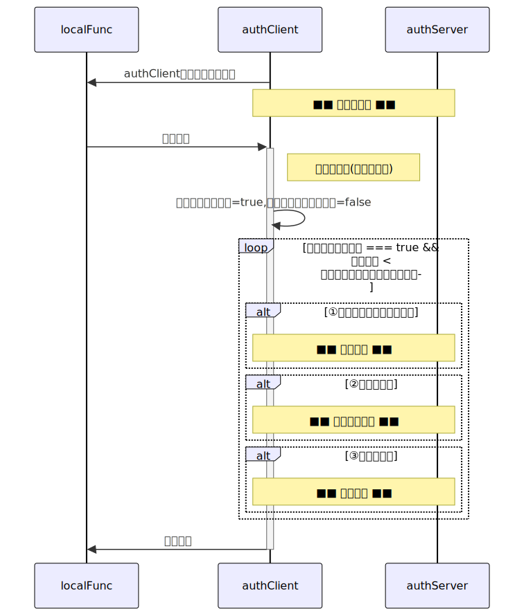
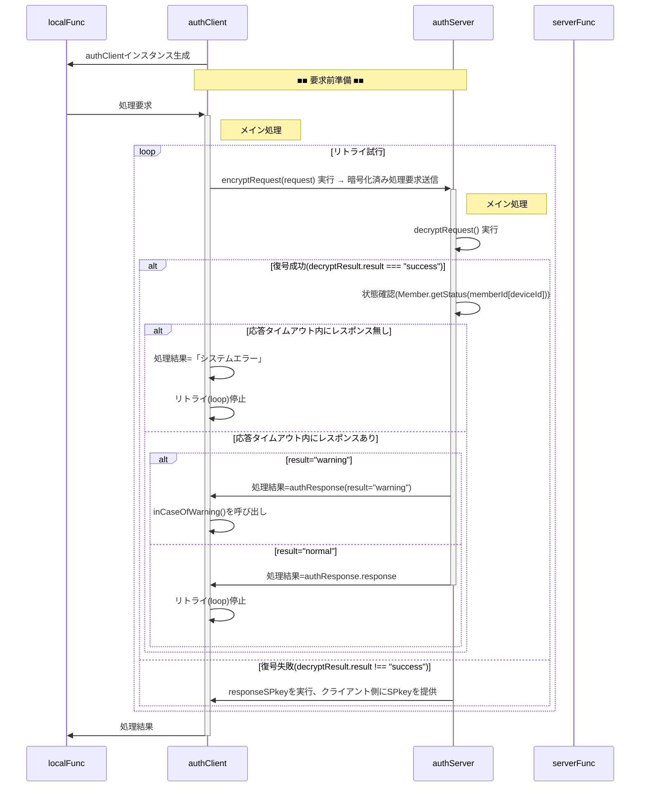
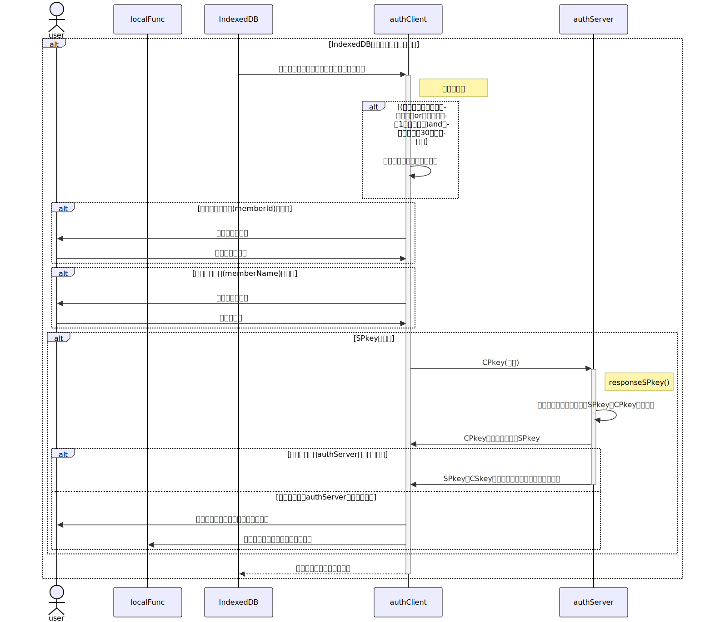
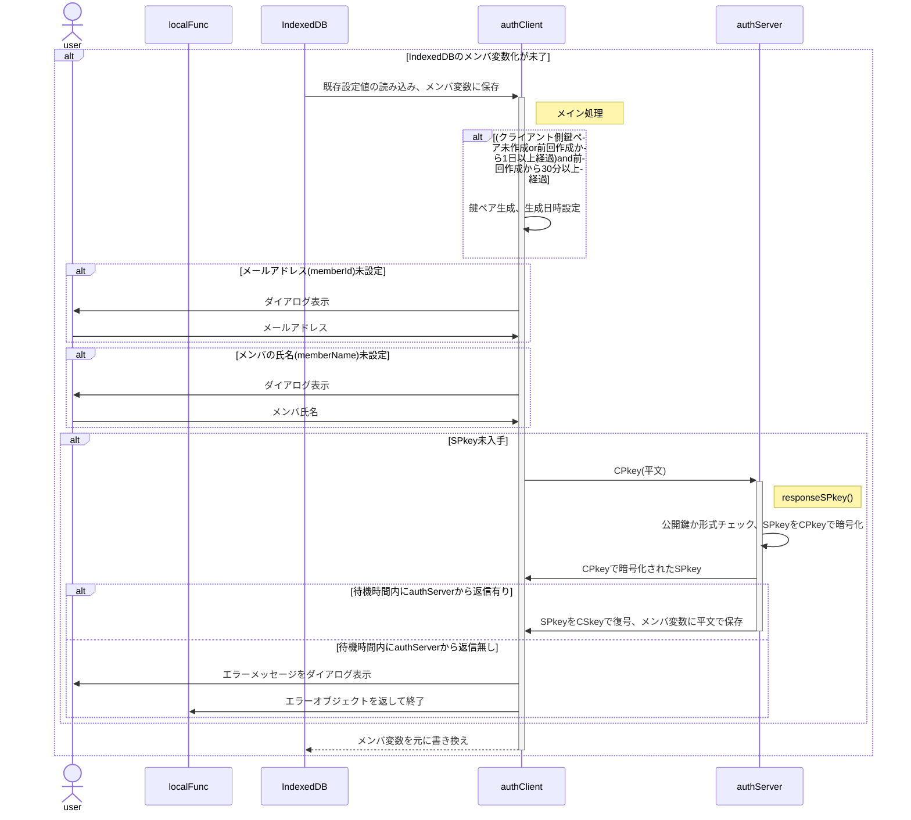
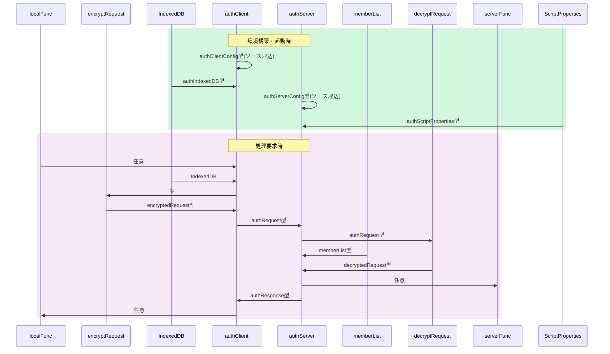

# 総説

ブラウザ(クライアント)とGAS(サーバ)の間で認証された通信を行う。

## 要求仕様

- 本システムは限られた人数のサークルや小学校のイベント等での利用を想定する。<br>
  よってセキュリティ上の脅威は極力排除するが、恒久性・安全性より導入時の容易さ・技術的ハードルの低さ、運用の簡便性を重視する。
- サーバ側(以下authServer)はスプレッドシートのコンテナバインドスクリプト、クライアント側(以下authClient)はHTMLのJavaScript
- サーバ側・クライアント側とも鍵ペアを使用
- 原則として通信は受信側公開鍵で暗号化＋発信側秘密鍵で署名
- クライアントの識別(ID)はメールアドレスで行う

## 用語

- SPkey, SSkey：サーバ側の公開鍵(Server side Public key)と秘密鍵(Server side Secret key)
- CPkey, CSkey：クライアント側の公開鍵(Client side Public key)と秘密鍵(Client side Secret key)
- パスフレーズ：クライアント側鍵ペア作成時のキー文字列。JavaScriptで自動的に生成
- パスワード：運用時、クライアント(人間)がブラウザ上で入力する本人確認用の文字列
- パスコード：二段階認証実行時、サーバからクライアントに送られる6桁※の数字<br>
  ※既定値。実際の桁数はauthConfig.trial.passcodeLengthで規定

## 暗号化・署名方式、運用

- 署名方式 : RSA-PSS
- 暗号化方式 : RSA-OAEP
- ハッシュ関数 : SHA-256以上
- 許容時差±120秒※以内
  ※既定値。実際の桁数はauthConfig.decryptRequest.allowableTimeDifferenceで規定
- 順序は「暗号化->署名」ではなく「署名->暗号化」で行う
  1. クライアントがデータをJSON化
  2. 自身の秘密鍵で署名（署名→暗号化）
  3. サーバの公開鍵で暗号化
  4. サーバは復号後、クライアント公開鍵(memberList.CPkey)で署名を検証
- パスワードの生成は「ライブラリ > createPassword」を使用
- パスコードのメール送信は「ライブラリ > sendMail」を使用
- CPkeyの有効期限が切れた場合、以下の手順で更新する
  1. クライアント側から古いCPkeyで署名された要求を受信
  2. サーバ側で署名検証の結果、期限切れを確認
    - memberList.trial[0].CPkeyUpdateUntilに「現在日時＋authConfig.decryptRequest.loginLifeTime」をセット
    - クライアント側に通知
  3. クライアント側でCPkeyを更新、新CPkeyで再度リクエスト
  4. サーバ側でauthConfig.decryptRequest.loginLifeTimeを確認、期限内ならmemberList.CPkeyを書き換え。期限切れなら加入処理同様、adminによる個別承認を必要とする。
  5. 以降は未ログイン状態で要求が来た場合として処理を継続

# 処理手順

## 概要

- 「■■　〜　■■」は別項で詳説
- authClient, authServer 横の「xxx()」ラベルはそれぞれのメソッド名



<details><summary>source</summary>



</details>

## 要求前準備



<details><summary>source</summary>



</details>

# データ格納方法と形式

- スプレッドシート以外で日時を文字列として記録する場合はISO8601拡張形式の文字列(`yyyy-MM-ddThh:mm:ss.nnn+09:00`)
- 日時を数値として記録する場合はUNIX時刻(new Date().getTime())
- スプレッドシート(memberList)については[Memberクラス仕様書](Member.md)参照

## ScriptProperties

キー名は`authConfig.system.name`、データは以下のオブジェクトをJSON化した文字列。


| No | 項目名 | 任意 | データ型 | 既定値 | 説明 |
| --: | :-- | :--: | :-- | :-- | :-- |
| 1 | keyGeneratedDateTime | ❌ | number | — | UNIX時刻 |
| 2 | SPkey | ❌ | string | — | PEM形式の公開鍵文字列 |
| 3 | SSkey | ❌ | string | — | PEM形式の秘密鍵文字列（暗号化済み） |

キー名は`authConfig.system.name`、データは以下のオブジェクトをJSON化した文字列。

```js
/**
 * @typedef {Object} authScriptProperties
 * @prop {number} keyGeneratedDateTime - UNIX時刻
 * @prop {string} SPkey - PEM形式の公開鍵文字列
 * @prop {string} SSkey - PEM形式の秘密鍵文字列（暗号化済み）
 */
```

## IndexedDB

キー名は`authConfig.system.name`から取得

```js
/**
 * @typedef {Object} authIndexedDB- クライアントのIndexedDBに保存するオブジェクト
 * @prop {number} keyGeneratedDateTime - 鍵ペア生成日時。UNIX時刻(new Date().getTime())<br>
 * なおサーバ側でCPkey更新中に異なるCPkeyを生成し、更なる更新要求が出てしまうのを割けるため、鍵ペア生成は30分以上の間隔を置くものとする。
 * @prop {string} memberId - メンバの識別子(=メールアドレス)
 * @prop {Object} profile - メンバの属性
 * @prop {string} profile.memberName - メンバ(ユーザ)の氏名(ex."田中　太郎")。加入要求確認時に管理者が申請者を識別する他で使用。
 * @prop {CryptoKey} CSkeySign - 署名用秘密鍵
 * @prop {CryptoKey} CPkeySign - 署名用公開鍵
 * @prop {CryptoKey} CSkeyEnc - 暗号化用秘密鍵
 * @prop {CryptoKey} CPkeyEnc - 暗号化用公開鍵
 * @prop {string} SPkey - サーバ公開鍵(Base64)
 * @prop {number} [ApplicationForMembership=-1] - 加入申請実行日時。未申請時は-1
 * @prop {number} [expireAccount=-1] - 加入承認の有効期間が切れる日時。未加入時は-1
 * @prop {number} [expireCPkey=-1] - CPkeyの有効期限。未ログイン時は-1
 */
```

<!-- 旧版。実装対象外
-->

javascriptのクロージャ関数内でクラス定義を行う場合のサンプルソース

# データ型(typedef)

- クラスとして定義
- 時間・期間の単位はミリ秒

## データの流れと型



## authConfig

authClient/authServer共通で使用される設定値

※ 実装時はクラス化を想定。その場合、サーバ側のみ・クライアント側のみで使用するパラメータはauthConfigを継承する別クラスで定義することも検討する。

```js
/**
 * @typedef {Object} authConfig
 * @prop {string} [systemName='auth'] - システム名
 * @prop {string} [adminMail=''] - 管理者のメールアドレス
 * @prop {string} [adminName=''] - 管理者名
 * @prop {number} [allowableTimeDifference=120000] - クライアント・サーバ間通信時の許容時差。既定値：2分
 *
 * @prop {Object} RSA - 署名・暗号化関係の設定値
 * @prop {number} [RSA.bits=2048] - 鍵ペアの鍵長
 */
```

## authServerConfig

authConfigを継承した、authServerで使用する設定値

```js
/**
 * @typedef {Object} authServerConfig
 * @prop {string} [memberList='memberList'] - memberListシート名
 * @prop {number} [defaultAuthority=0] - 新規加入メンバの権限の既定値
 * @prop {number} [memberLifeTime=31536000000] - メンバ加入承認後の有効期間。既定値：1年
 * @prop {number} [loginLifeTime=86400000] - ログイン成功後の有効期間(=CPkeyの有効期間)。既定値：1
 *
 * @prop {Object.<string,Object>} func - サーバ側の関数マップ
 * @prop {number} func.authority - 当該関数実行のために必要となるユーザ権限<br>
  `memberList.profile.authority & authServerConfig.func.authrity > 0`なら実行可能とする。
 * @prop {Function|Arrow} func.do - 実行するサーバ側関数
 *
 * @prop {Object} trial - ログイン試行関係の設定値
 * @prop {number} [trial.passcodeLength=6] - パスコードの桁数
 * @prop {number} [trial.freezing=3600000] - 連続失敗した場合の凍結期間。既定値：1時間
 * @prop {number} [trial.maxTrial=3] パスコード入力の最大試行回数
 * @prop {number} [trial.passcodeLifeTime=600000] - パスコードの有効期間。既定値：10分
 * @prop {number} [trial.generationMax=5] - ログイン試行履歴(authTrial)の最大保持数。既定値：5世代
 */
```

## authClientConfig

authConfigを継承した、authClientで使用する設定値

```js
/**
 * @typedef {Object} authClientConfig
 * @prop {string} x - サーバ側WebアプリURLのID(`https://script.google.com/macros/s/(この部分)/exec`)
 */
```

## authRequest

authClientからauthServerに送られる処理要求オブジェクト

```js
/**
 * @typedef {Object} authRequest
 * @prop {string} memberId - メンバの識別子(=メールアドレス)
 * @prop {string} deviceId - デバイスの識別子
 * @prop {string} requestId - 要求の識別子。UUID
 * @prop {number} timestamp - 要求日時。UNIX時刻
 * @prop {string} func - サーバ側関数名
 * @prop {any[]} arguments - サーバ側関数に渡す引数
 * @prop {string} signature - クライアント側署名
 */
```

## decryptedRequest

decryptRequestで復号された処理要求オブジェクト

```js
/**
 * @typedef {Object} decryptedRequest
 * @prop {string} result - 処理結果。"fatal"(後続処理不要なエラー), "warning"(後続処理が必要なエラー), "success"
 * @prop {string} message - エラーメッセージ
 * @prop {string|Object} detail - 詳細情報。ログイン試行した場合、その結果
 * @prop {authRequest} request - ユーザから渡された処理要求
 * @prop {string} timestamp - 復号処理実施日時。メール・ログでの閲覧が容易になるよう、文字列で保存
 */
```

## authResponse

authServerからauthClientに送られる処理結果オブジェクト

```js
/**
 * @typedef {Object} authResponse
 * @prop {string} requestId - 要求の識別子。UUID
 * @prop {number} timestamp - 処理日時。UNIX時刻
 * @prop {string} result - 処理結果。decryptRequst.result
 * @prop {string} message - エラーメッセージ。decryptRequest.message
 * @prop {string|Object} response - 要求された関数の戻り値をJSON化した文字列。適宜オブジェクトのまま返す。
 */
```

# クラス・関数定義

- [authClient](doc/authClient.md) 関数 仕様書
- [authServer](doc/authServer.md) 関数 仕様書
- [Member](doc/Member.md) クラス 仕様書
- [decryptRequest](doc/decryptRequest.md) 関数 仕様書
- [encryptRequest](doc/encryptRequest.md) 関数 仕様書
