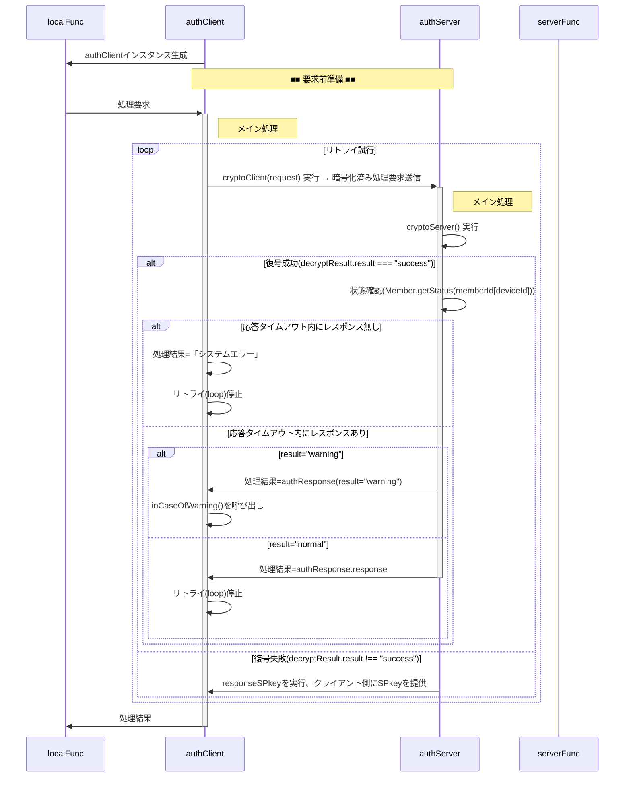

# 総説

ブラウザ(クライアント)とGAS(サーバ)の間で認証された通信を行う。

## 要求仕様

- 本システムは限られた人数のサークルや小学校のイベント等での利用を想定する。 
  よってセキュリティ上の脅威は極力排除するが、恒久性・安全性より導入時の容易さ・技術的ハードルの低さ、運用の簡便性を重視する。
- サーバ側(以下authServer)はスプレッドシートのコンテナバインドスクリプト、クライアント側(以下authClient)はHTMLのJavaScript
- サーバ側・クライアント側とも鍵ペアを使用
- 原則として通信は受信側公開鍵で暗号化＋発信側秘密鍵で署名
- クライアントの識別(ID)はメールアドレスで行う

## 用語

- SPkey, SSkey：サーバ側の公開鍵(Server side Public key)と秘密鍵(Server side Secret key)
- CPkey, CSkey：クライアント側の公開鍵(Client side Public key)と秘密鍵(Client side Secret key)
- パスフレーズ：クライアント側鍵ペア作成時のキー文字列。JavaScriptで自動的に生成
- パスワード：運用時、クライアント(人間)がブラウザ上で入力する本人確認用の文字列
- パスコード：二段階認証実行時、サーバからクライアントに送られる6桁※の数字 
  ※既定値。実際の桁数はauthConfig.trial.passcodeLengthで規定

## 暗号化・署名方式、運用

- 署名方式 : RSA-PSS
- 暗号化方式 : RSA-OAEP
- ハッシュ関数 : SHA-256以上
- 許容時差±120秒※以内
  ※既定値。実際の桁数はauthConfig.cryptoServer.allowableTimeDifferenceで規定
- 順序は「暗号化->署名」ではなく「署名->暗号化」で行う
  1. クライアントがデータをJSON化
  2. 自身の秘密鍵で署名（署名→暗号化）
  3. サーバの公開鍵で暗号化
  4. サーバは復号後、クライアント公開鍵(memberList.CPkey)で署名を検証
- パスワードの生成は「ライブラリ > createPassword」を使用
- パスコードのメール送信は「ライブラリ > sendMail」を使用
- CPkeyの有効期限が切れた場合、以下の手順で更新する
  1. クライアント側から古いCPkeyで署名された要求を受信
  2. サーバ側で署名検証の結果、期限切れを確認
    - memberList.trial[0].CPkeyUpdateUntilに「現在日時＋authConfig.cryptoServer.loginLifeTime」をセット
    - クライアント側に通知
  3. クライアント側でCPkeyを更新、新CPkeyで再度リクエスト
  4. サーバ側でauthConfig.cryptoServer.loginLifeTimeを確認、期限内ならmemberList.CPkeyを書き換え。期限切れなら加入処理同様、adminによる個別承認を必要とする。
  5. 以降は未ログイン状態で要求が来た場合として処理を継続

# 処理手順

## 概要

- 「■■　〜　■■」は別項で詳説
- authClient, authServer 横の「xxx()」ラベルはそれぞれのメソッド名

source

## 要求前準備

source

# データ格納方法と形式

- スプレッドシート以外で日時を文字列として記録する場合はISO8601拡張形式の文字列(`yyyy-MM-ddThh:mm:ss.nnn+09:00`)
- 日時を数値として記録する場合はUNIX時刻(new Date().getTime())
- スプレッドシート(memberList)については[Memberクラス仕様書](Member.md)参照

## authScriptProperties

キー名は`authConfig.system.name`、データは以下のオブジェクトをJSON化した文字列。

| No | 項目名 | 任意 | データ型 | 既定値 | 説明 |
| --: | :-- | :--: | :-- | :-- | :-- |
| 1 | keyGeneratedDateTime | ❌ | number | — | UNIX時刻 |
| 2 | SPkey | ❌ | string | — | PEM形式の公開鍵文字列 |
| 3 | SSkey | ❌ | string | — | PEM形式の秘密鍵文字列（暗号化済み） |

## authIndexedDB

- クライアントのIndexedDBに保存するオブジェクト
- IndexedDB保存時のキー名は`authConfig.system.name`から取得

| No | 項目名 | 任意 | データ型 | 既定値 | 説明 |
| --: | :-- | :--: | :-- | :-- | :-- |
| 1 | keyGeneratedDateTime | ❌ | number | — | 鍵ペア生成日時。UNIX時刻(new Date().getTime()),なおサーバ側でCPkey更新中にクライアント側で新たなCPkeyが生成されるのを避けるため、鍵ペア生成は30分以上の間隔を置く。 |
| 2 | memberId | ❌ | string | — | メンバの識別子(=メールアドレス) |
| 3 | profile | ❌ | Object | — | メンバの属性 |
| 4 | profile.memberName | ❌ | string | — | メンバ(ユーザ)の氏名(ex."田中　太郎")。加入要求確認時に管理者が申請者を識別する他で使用。 |
| 5 | CSkeySign | ❌ | CryptoKey | — | 署名用秘密鍵 |
| 6 | CPkeySign | ❌ | CryptoKey | — | 署名用公開鍵 |
| 7 | CSkeyEnc | ❌ | CryptoKey | — | 暗号化用秘密鍵 |
| 8 | CPkeyEnc | ❌ | CryptoKey | — | 暗号化用公開鍵 |
| 9 | SPkey | ❌ | string | — | サーバ公開鍵(Base64) |
| 10 | ApplicationForMembership | ⭕ | number | -1 | 加入申請実行日時。未申請時は-1 |
| 11 | expireAccount | ⭕ | number | -1 | 加入承認の有効期間が切れる日時。未加入時は-1 |
| 12 | expireCPkey | ⭕ | number | -1 | CPkeyの有効期限。未ログイン時は-1 |

## Member

メンバ一覧(アカウント管理表)上のメンバ単位の管理情報

| No | 項目名 | 任意 | データ型 | 既定値 | 説明 |
| --: | :-- | :--: | :-- | :-- | :-- |
| 1 | memberId | ❌ | string | — | メンバの識別子(=メールアドレス) |
| 2 | name | ❌ | string | — | メンバの氏名 |
| 3 | accepted | ❌ | string | — | 加入が承認されたメンバには承認日時を設定 |
| 4 | reportResult | ❌ | string | — | 「加入登録」処理中で結果連絡メールを送信した日時 |
| 5 | expire | ❌ | string | — | 加入承認の有効期間が切れる日時 |
| 6 | profile | ❌ | string | — | メンバの属性情報(MemberProfile)を保持するJSON文字列 |
| 7 | device | ❌ | string | — | マルチデバイス対応のためのデバイス情報(MemberDevice)を保持するJSON文字列 |
| 8 | note | ⭕ | string | — | 当該メンバに対する備考 |

# データ型(typedef)

- クラスとして定義
- 時間・期間の単位はミリ秒

## データの流れと型

## authConfig

- authClient/authServer共通で使用される設定値。
- authClientConfig, authServerConfigの親クラス

| No | 項目名 | 任意 | データ型 | 既定値 | 説明 |
| --: | :-- | :--: | :-- | :-- | :-- |
| 1 | systemName | ⭕ | string | auth | システム名 |
| 2 | adminMail | ❌ | string | — | 管理者のメールアドレス |
| 3 | adminName | ❌ | string | — | 管理者名 |
| 4 | allowableTimeDifference | ⭕ | string | 120000 | クライアント・サーバ間通信時の許容時差。既定値：2分 |
| 5 | RSAbits | ⭕ | string | 2048 | 鍵ペアの鍵長 |

## authServerConfig

authConfigを継承した、authServerで使用する設定値

| No | 項目名 | 任意 | データ型 | 既定値 | 説明 |
| --: | :-- | :--: | :-- | :-- | :-- |
| 1 | memberList | ⭕ | string | memberList | memberListシート名 |
| 2 | defaultAuthority | ❌ | number | — | 新規加入メンバの権限の既定値 |
| 3 | memberLifeTime | ⭕ | number | 31536000000 | メンバ加入承認後の有効期間。既定値：1年 |
| 4 | loginLifeTime | ⭕ | number | 86400000 | ログイン成功後の有効期間(=CPkeyの有効期間)。既定値：1日 |
| 5 | func | ❌ | Object.<string,Object> | — | サーバ側の関数マップ |
| 6 | func.authority | ❌ | number | — | 当該関数実行のために必要となるユーザ権限,`Member.profile.authority & authServerConfig.func.authrity > 0`なら実行可とする。 |
| 7 | func.do | ❌ | Function|Arrow | — | 実行するサーバ側関数 |
| 8 | trial | ❌ | Object | — | ログイン試行関係の設定値 |
| 9 | trial.passcodeLength | ⭕ | number | 6 | パスコードの桁数 |
| 10 | trial.freezing | ⭕ | number | 3600000 | 連続失敗した場合の凍結期間。既定値：1時間 |
| 11 | trial.maxTrial | ⭕ | number | 3 | パスコード入力の最大試行回数 |
| 12 | trial.passcodeLifeTime | ⭕ | number | 600000 | パスコードの有効期間。既定値：10分 |
| 13 | trial.generationMax | ⭕ | number | 5 | ログイン試行履歴(MemberTrial)の最大保持数。既定値：5世代 |

## authClientConfig

authConfigを継承した、authClientで使用する設定値

| No | 項目名 | 任意 | データ型 | 既定値 | 説明 |
| --: | :-- | :--: | :-- | :-- | :-- |
| 1 | x | ❌ | string | — | サーバ側WebアプリURLのID(`https://script.google.com/macros/s/(この部分)/exec`) |

## authRequest

authClientからauthServerに送られる処理要求オブジェクト

| No | 項目名 | 任意 | データ型 | 既定値 | 説明 |
| --: | :-- | :--: | :-- | :-- | :-- |
| 1 | memberId | ❌ | string | — | メンバの識別子(=メールアドレス) |
| 2 | deviceId | ❌ | string | — | デバイスの識別子 |
| 3 | requestId | ❌ | string | — | 要求の識別子。UUID |
| 4 | timestamp | ❌ | number | — | 要求日時。UNIX時刻 |
| 5 | func | ❌ | string | — | サーバ側関数名 |
| 6 | arguments | ❌ | any[] | — | サーバ側関数に渡す引数 |
| 7 | signature | ❌ | string | — | クライアント側署名 |

## decryptedRequest

cryptoServerで復号された処理要求オブジェクト

| No | 項目名 | 任意 | データ型 | 既定値 | 説明 |
| --: | :-- | :--: | :-- | :-- | :-- |
| 1 | result | ❌ | string | — | 処理結果。"fatal"(後続処理不要なエラー), "warning"(後続処理が必要なエラー), "success" |
| 2 | message | ❌ | string | — | エラーメッセージ |
| 3 | detail | ❌ | string|Object | — | 詳細情報。ログイン試行した場合、その結果 |
| 4 | request | ❌ | authRequest | — | ユーザから渡された処理要求 |
| 5 | timestamp | ❌ | string | — | 復号処理実施日時。メール・ログでの閲覧が容易になるよう、文字列で保存 |

## authResponse

authServerからauthClientに送られる処理結果オブジェクト

| No | 項目名 | 任意 | データ型 | 既定値 | 説明 |
| --: | :-- | :--: | :-- | :-- | :-- |
| 1 | requestId | ❌ | string | — | 要求の識別子。UUID |
| 2 | timestamp | ❌ | number | — | 処理日時。UNIX時刻 |
| 3 | result | ❌ | string | — | 処理結果。decryptRequst.result |
| 4 | message | ❌ | string | — | エラーメッセージ。cryptoServer.message |
| 5 | response | ❌ | string|Object | — | 要求された関数の戻り値をJSON化した文字列。適宜オブジェクトのまま返す。 |

# クラス・関数定義

- [authClient](doc/authClient.md) 関数 仕様書
- [authServer](doc/authServer.md) 関数 仕様書
- [Member](doc/Member.md) クラス 仕様書
- [cryptoServer](doc/cryptoServer.md) 関数 仕様書
- [cryptoClient](doc/cryptoClient.md) 関数 仕様書
