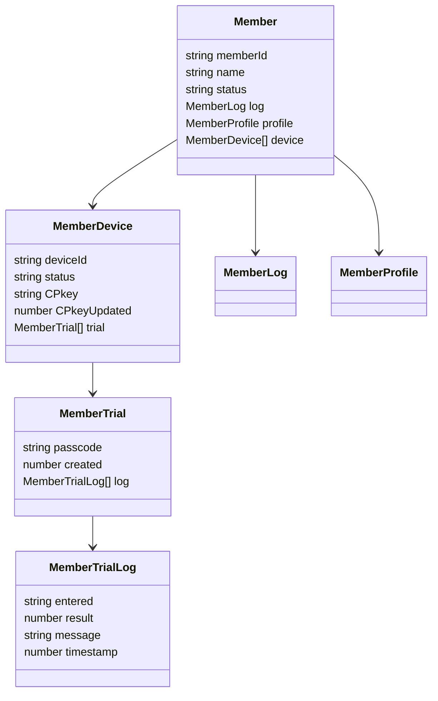

```mermaid
classDiagram
  class Member {
    string memberId
    string name
    string status
    MemberLog log
    MemberProfile profile
    MemberDevice[] device
  }

  class MemberDevice {
    string deviceId
    string status
    string CPkey
    number CPkeyUpdated
    MemberTrial[] trial
  }

  class MemberTrial {
    string passcode
    number created
    MemberTrialLog[] log
  }

  class MemberTrialLog {
    string entered
    number result
    string message
    number timestamp
  }

  Member --> MemberLog
  Member --> MemberProfile
  Member --> MemberDevice
  MemberDevice --> MemberTrial
  MemberTrial --> MemberTrialLog
```