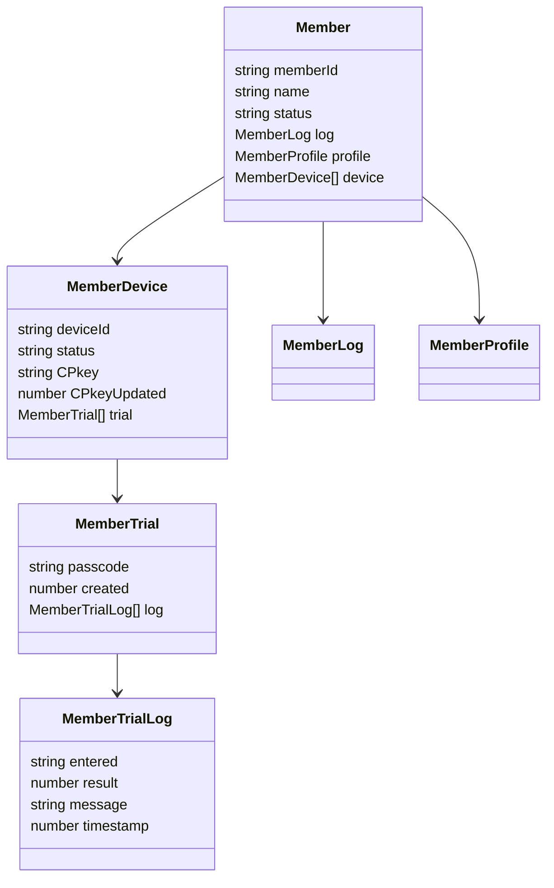

# Member クラス 仕様書

## 🧭 概要

- 'Member'はGoogle SpreadSheet上でメンバ(アカウント)情報・状態を一元的に管理するためのクラスです。
- 加入・ログイン・パスコード試行・デバイス別公開鍵(CPkey)管理などの状態を統一的に扱います。
- マルチデバイス利用を前提とし、memberListスプレッドシートの1行を1メンバとして管理します。
- 日時は全てUNIX時刻(number型)。比較も全てミリ秒単位で行う

## 🧩 内部構成(クラス変数)



### Member

<!--::$tmp/Member.md::-->

### MemberLog

<!--::$tmp/MemberLog.md::-->

### MemberProfile

<!--::$tmp/MemberProfile.md::-->

### MemberDevice

<!--::$tmp/MemberDevice.md::-->

### MemberTrial

<!--::$tmp/MemberTrial.md::-->

### MemberTrialLog

<!--::$tmp/MemberTrialLog.md::-->

## 🧱 constructor()

- 引数は`authServerConfig`
- `authServerConfig.memberList`シートが存在しなければシートを新規作成
  - 項目名はMemberクラスのメンバ名
  - 各項目の「説明」を項目名セルのメモとしてセット

#### authConfig

<!--::$tmp/authConfig.md::-->

#### authServerConfig

<!--::$tmp/authServerConfig.md::-->

## 🧱 getMember()

指定メンバ・デバイス情報をmemberListシートから取得

```js
/**
 * @param {string} memberId
 * @param {string} [deviceId]
 * @returns {Member}
 */
```

- 指定されたmemberIdのインスタンスを返す
- JSON文字列の項目はオブジェクト化(Member.log, Member.profile, Member.device)
- deviceIdの指定が有った場合、Member.deviceは当該MemberDeviceとする

## 🧱 judgeStatus()

- 後述「状態遷移」に基づき、引数で指定されたメンバ・デバイスの状態を判断
- 引数は`Member`、戻り値は`MemberJudgeStatus`
- 事前にgetMemberメソッドで、メンバ・デバイスは特定済の前提
- memberList上のstatusは judgeStatus() の評価結果を反映して自動更新

<!--::$tmp/MemberJudgeStatus.md::-->

### 状態遷移

- メンバの状態遷移
- 下表内の変数名は`MemberLog`のメンバ名

<!--::$src/Member/stateTransition.md::-->

状態 | 判定式
:-- | :--
未加入 | 加入要求をしたことが無い、または加入期限切れ(失効)<br>joiningRequest === 0 || (0 < approval &&　0 < joiningExpiration && joiningExpiration < Date.now())
加入禁止 | 加入禁止されている<br>0 < denial && Date.now() <= unfreezeDenial
未審査 | 管理者の認否が未決定<br>approval === 0 && denial === 0
認証中 | 加入承認済かつパスコード認証に成功し認証有効期間内の状態<br>0 < approval && Date.now() ≦ loginExpiration
凍結中 | 加入承認済かつ凍結期間内<br>0 < approval && 0 < loginFailure && loginFailure < Date.now() && Date.now() <= unfreezeLogin
未認証 | 加入承認後認証要求されたことが無い<br>0 < approval && loginRequest === 0
試行中 | 加入承認済かつ認証要求済(かつ認証中でも凍結中でもない)<br>0 < approval && 0 < loginRequest && !(0 < loginFailure && loginFailure < Date.now() && Date.now() <= unfreezeLogin)


- 上から順に判定する(下順位の状態は上順位の何れにも該当しない)
- 試行中は「凍結中」「認証中」いずれにも該当しない場合にのみ成立

## 🧱 setMember()

指定メンバ・デバイス情報をmemberListシートに保存

- arg.deviceが配列だった場合
  - arg.deviceをMemberに設定(Member.device=arg.device)
- arg.deviceが配列では無い場合
  - memberList.deviceにarg.device.deviceIdが存在する場合<br>
    => memberList.device内のdevice.deviceIdをarg.deviceで置換
  - memberList.deviceにarg.device.deviceIdが存在しない場合<br>
    => memberList.deviceにarg.deviceを追加
- Member.status は judgeStatus().memberStatus の結果を保存
- 各 Member.device[n].status は judgeStatus().deviceStatus の結果を個別に保存
- JSON文字列の項目は文字列化(Member.log, Member.profile, Member.device)

```js
/**
 * @param {Member} arg
 * @returns {Member|Error} 更新後のMemberインスタンスを返す。失敗時はError。
 */
```

<!--
## 🧱 proto()

### 概要

### 📤 入力項目

### 📥 出力項目
-->

## 外部ライブラリ

- ソース先頭(グローバル領域)に`const dev=devTools()`を挿入

<details><summary>devTools</summary>

```js
//::$lib/devTools/1.0.1/core.js::
```

</details>

<details><summary>toLocale</summary>

```js
//::$lib/toLocale/1.2.0/core.js::
```

</details>

<details><summary>whichType</summary>

```js
//::$lib/whichType/1.0.1/core.js::
```

</details>