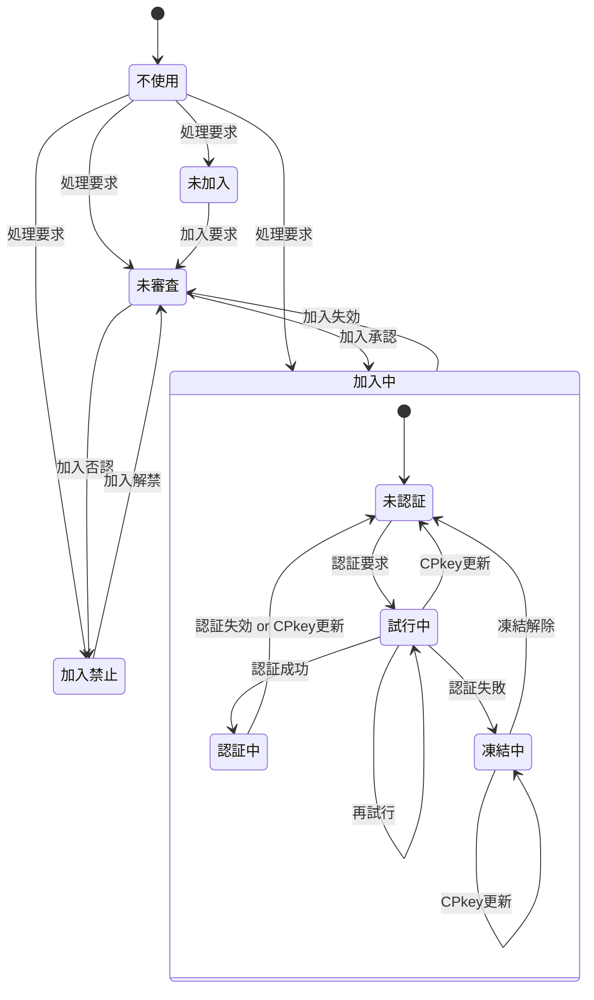

| No | 状態 | 説明 | SPkey | CPkey | memberId/メンバ名 | 無権限関数 | 要権限関数 |
| --: | :-- | :-- | :-- | :-- | :-- | :-- | :-- |
| 1 | 不使用 | Auth不使用のコンテンツのみ表示 | 未取得 | 未生成(※1) | 未登録(※1) | 実行不可 | 実行不可 |
| 2 | 未加入 | memberListにUUIDのmemberId/メンバ名で仮登録 | 取得済 | 生成済 | 仮登録(UUID) | 実行可 | 実行不可 |
| 3 | 未審査 | memberListに本来のmemberId/メンバ名で登録済だが管理者による加入認否が未決定 | 取得済 | 生成済 | 本登録 | 実行可 | 実行不可 |
| 4 | 加入中 | 管理者により加入が承認された状態 | 取得済 | 生成済 | 本登録 | 実行可 | 実行不可 |
| 4.1 | 未認証 | 未認証(未ログイン)で権限が必要な処理は行えない状態 | 取得済 | 生成済 | 本登録 | 実行可 | 実行不可 |
| 4.2 | 試行中 | パスコードによる認証を試行している状態 | 取得済 | 生成済 | 本登録 | 実行可 | 実行不可 |
| 4.3 | 認証中 | 認証が通り、ログインして認証が必要な処理も行える状態 | 取得済 | 生成済 | 本登録 | 実行可 | 実行可 |
| 4.4 | 凍結中 | 規定の試行回数連続して認証に失敗し、再認証要求が禁止された状態 | 取得済 | 生成済 | 本登録 | 実行可 | 実行不可 |
| 5 | 加入禁止 | 管理者により加入が否認された状態 | 取得済 | 生成済 | 本登録 | 実行可 | 実行不可 |

<!--

```mermaid
%% メンバ状態遷移図

stateDiagram-v2
  [*] x-> 未加入
  未加入 x-> 未審査 : 加入要求
  未審査 x-> 加入中 : 加入承認

  state 加入中 {
    [*] x-> 未認証
    未認証 x-> 試行中 : 認証要求
    試行中 x-> 未認証 : CPkey更新
    試行中 x-> 認証中 : 認証成功
    試行中 x-> 試行中 : 再試行
    認証中 x-> 未認証 : 認証失効 or CPkey更新
    試行中 x-> 凍結中 : 認証失敗
    凍結中 x-> 凍結中 : CPkey更新
    凍結中 x-> 未認証 : 凍結解除
  }
  加入中 x-> 未審査 : 加入失効
  未審査 x-> 加入禁止: 加入否認
  加入禁止 x-> 未審査 : 加入解禁
```

No | 状態 | 説明
:-- | :-- | :--
1 | 未加入 | memberList未登録
2 | 未審査 | memberList登録済だが、管理者による加入認否が未決定
3 | 加入中 | 管理者により加入が承認された状態
3.1 | 未認証 | 認証(ログイン)不要の処理しか行えない状態
3.2 | 試行中 | パスコードによる認証を試行している状態
3.3 | 認証中 | 認証が通り、ログインして認証が必要な処理も行える状態
3.4 | 凍結中 | 規定の試行回数連続して認証に失敗し、再認証要求が禁止された状態
4 | 加入禁止 | 管理者により加入が否認された状態
-->
