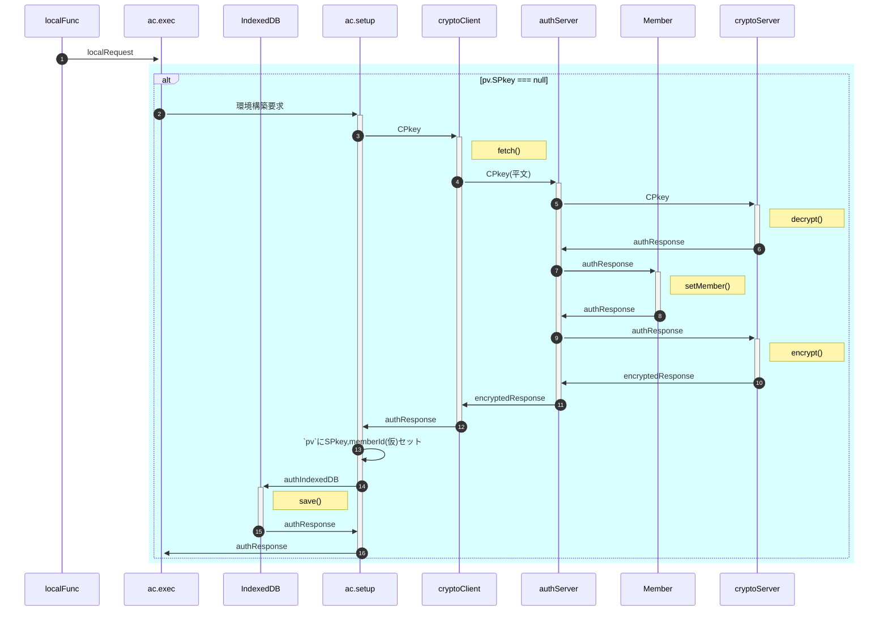

<!--
    authClient.setupEnvironment
-->

- 不要なSPkey提供・通信を回避するため「(インスタンス生成時ではなく)処理要求があって初めてサーバ側との通信環境構築(SPkey取得)」とする
- 図中"ac.setup"は`authClient.setupEnvironment`メソッドを、"ac.exec"は`authClient.exec`メソッドを指す。
- 本処理を実行することによりサーバ側では仮登録が行われ、ユーザの状態は「不使用」から「未加入」「未審査」「加入禁止」「加入中」のいずれかに変更される

- ⑥ authIndexedDB生成(=authIndexedDBの初期値)
  | No | 項目名 | 説明 | 設定値 | 備考 |
  | --: | :-- | :-- | :-- | :-- |
  | 1 | memberId | メンバの識別子 | UUID | 仮登録用 |
  | 2 | memberName | メンバ(ユーザ)の氏名 | 'dummy' | 仮登録用 |
  | 3 | deviceId | デバイスの識別子 | UUID |  |
  | 4 | CSkeySign | 署名用秘密鍵 | CryptoKey | 自動生成 |
  | 5 | CPkeySign | 署名用公開鍵 | CryptoKey | 自動生成 |
  | 6 | CSkeyEnc | 暗号化用秘密鍵 | CryptoKey | 自動生成 |
  | 7 | CPkeyEnc | 暗号化用公開鍵 | CryptoKey | 自動生成 |
  | 8 | keyGeneratedDateTime | 鍵ペア生成日時 | Date.now() |  |
  | 9 | SPkey | サーバ公開鍵 | null |  |
  | 10 | expireCPkey | CPkey有効期限 | 0 |  |

- ⑨ cryptoServer -> authServer: authResponse 
  CPkey文字列かを判定
  | No | 項目名 | 説明 | 設定値 | 備考 |
  | --: | :-- | :-- | :-- | :-- |
  | 1 | timestamp | サーバ側処理日時 | Date.now() |  |
  | 2 | result | サーバ側処理結果 | **'warning'** |  |
  | 3 | message | サーバ側からの(エラー)メッセージ | **'maybe CPkey'** |  |
  | 4 | request | 処理要求オブジェクト | — |  |
  | 5 | response | 要求されたサーバ側関数の戻り値 | — |  |

<!--
- ①サーバ内処理：decryptedRequestを入力としてメイン処理またはメソッドを実行
- ②クライアント内分岐処理：decryptedResponse.sv.resultに基づきメイン処理またはメソッドを実行
- 「リトライ試行」は以下の場合にループを抜ける
  - 応答タイムアウト内にauthServerからレスポンスが来なかった場合 
    ※`fetch timeout`を使用。許容時間は`authConfig.allowableTimeDifference`
  - ②クライアント内分岐処理の結果が'fatal'だった場合
-->

