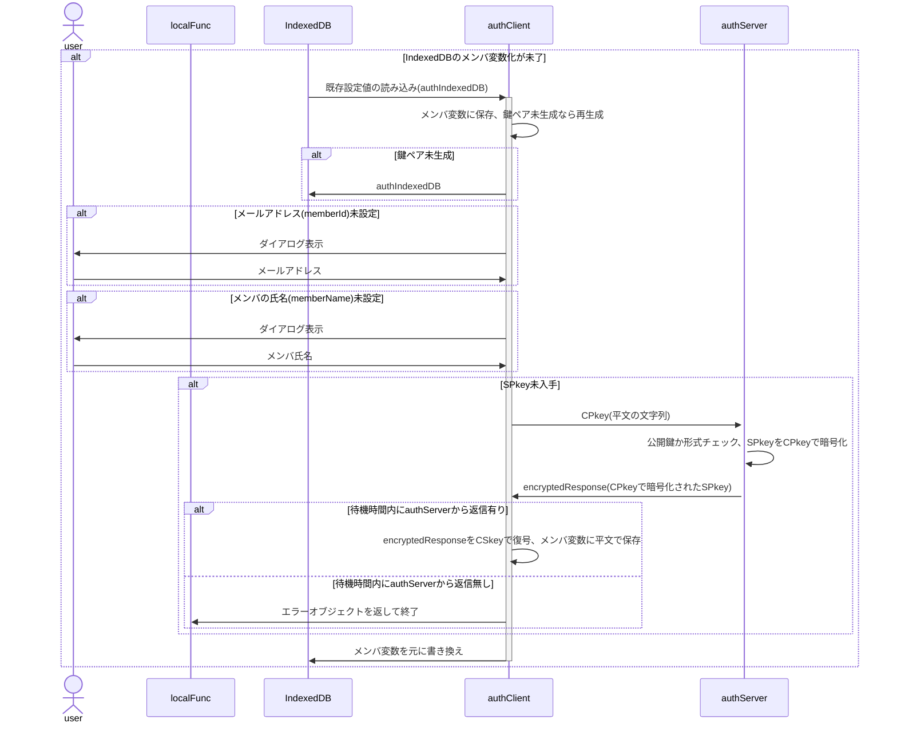
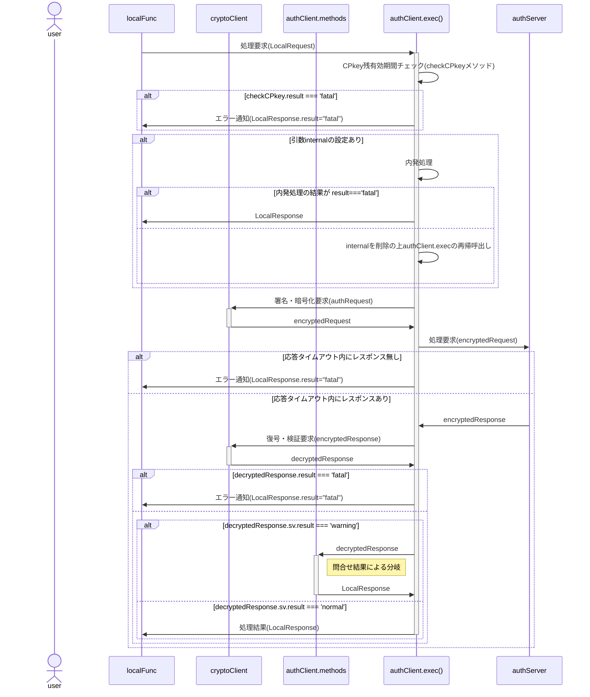
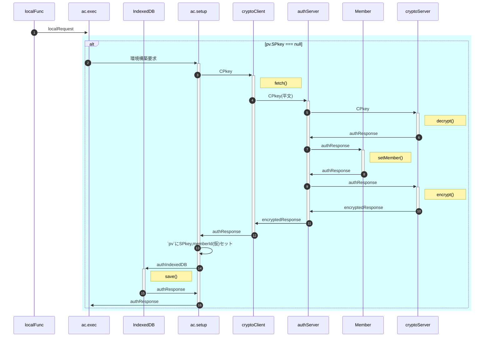

<!--::$src/common/header.md::-->

# authClient クラス仕様書

## <a name="summary">🧭 概要</a>

authClientは、ローカル関数(ブラウザ内JavaScript)からの要求を受け、
サーバ側(authServer)への暗号化通信リクエストを署名・暗号化、
サーバ側処理を経てローカル側に戻された結果を復号・検証し、
処理結果に応じてクライアント側処理を適切に振り分ける中核関数です。

### <a name="policy">設計方針</a>

- クロージャ関数ではなくクラスとして作成
- 内発処理はローカル関数からの処理要求に先行して行う

### 🧩 <a name="internal">内部構成</a>

- 項目名末尾に「()」が付いているのはメソッド 
  (static:クラスメソッド、public:外部利用可、private:内部専用)

| 項目名 | データ型 | 内容 |
| :-- | :-- | :-- |
| cf | [authClientConfig](typedef.md#authclientconfig) | 動作設定変数(config) |
| idb | [authIndexedDB](typedef.md#authindexeddb) | IndexedDBの内容をauthClient内で共有 |
| [constructor()](#constructor) | private | コンストラクタ |
| [exec()](#exec) | public | ローカル関数からの要求を受けてauthServerに問合せを行う |
| [showMessage()](#showMessage) | private | メッセージをダイアログで表示 |
| [enterPasscode()](#enterPasscode) | private | パスコードを入力するダイアログを表示 |
| [checkCPkey()](#checkCPkey) | private | CPkey残有効期間をチェック |
| [setupEnvironment()](#setupEnvironment) | private | SPkey入手等、authClient動作環境整備 |

## <a name="constructor" href="#internal">🧱 constructor()</a>

authClientインスタンス化時の処理。

### <a name="constructor-param">📥 引数</a>

| 項目名 | データ型 | 内容 |
| :-- | :-- | :-- |
| config | [authClientConfig](typedef.md#authclientconfig) | authClientの動作設定変数 |

### <a name="constructor-returns">📤 戻り値</a>

- [authClient](#internal)

### <a name="constructor-process">🧾 処理手順</a>

- 引数はauthClient内共有用の変数`cf`に保存
- `cryptoClient.constructor()`で鍵ペアの準備
- IndexedDBからメールアドレスを取得、存在しなければダイアログから入力
- IndexedDBからメンバの氏名を取得、存在しなければダイアログから入力
- deviceId未採番なら採番(UUID)
- SPkey未取得ならサーバ側に要求
- 更新した内容はIndexedDBに書き戻す
- SPkey取得がエラーになった場合、SPkey以外は書き戻す
- IndexedDBの内容はauthClient内共有用変数`pv`に保存
- サーバ側から一定時間レスポンスが無い場合、`{result:'fatal',message:'No response'}`を返して終了

## <a name="exec" href="#internal">🧱 exec()</a>

ローカル関数からの要求を受けてauthServerに問合せを行い、返信された処理結果に基づき適宜メソッドを呼び出す。

### <a name="exec-param">📥 引数</a>

| No | 項目名 | 任意 | データ型 | 既定値 | 説明 |
| --: | :-- | :--: | :-- | :-- | :-- |
| 1 | request | ❌ | [authRequest](typedef.md#authrequest)[]|[LocalRequest](typedef.md#localrequest)[] | | 処理要求(スタック) |

<!--
| No | 項目名 | 任意 | データ型 | 既定値 | 説明 |
| --: | :-- | :--: | :-- | :-- | :-- |
| 1 | request | ❌ | [LocalRequest](typedef.md#localrequest) | | ローカル関数からの処理要求 |
| 2 | internal | ⭕ | [authRequest](typedef.md#authrequest) | — | authClient内発の先行処理 |
-->

### <a name="exec-returns">📤 戻り値</a>

- [LocalResponse](typedef.md#localresponse)

### <a name="exec-process">🧾 処理手順</a>

- requestがLocalRequest型だった場合、authRequestの配列(スタック)に変換
- requestから先頭のauthRequestをpopし、処理対象とする

- CPkeyの残有効期間をチェック(checkCPkeyメソッドの実行)

- 内発処理が有った場合(`typeof internal !== 'undefined'`)は以下を実行
  - `cryptoClient.encrypt`に`internal`を渡して`encryptedRequest`を作成
  - authServerへの問合せ
  - 待機時間内にレスポンスあり
    - レスポンスの復号、署名検証
    - 結果がfatalだった場合、LocalRequestに`{result:'fatal',message:'No response'}`をセット、呼出元ローカル関数に返して終了
    - internalを外してexec()を再帰呼出(`exec(request)`)
  - 待機時間内にレスポンスなし
    - LocalRequestに`{result:'fatal',message:'No response'}`をセット、呼出元ローカル関数に返して終了
- `cryptoClient.encrypt`に`request`を渡して`encryptedRequest`を作成
- authServerへの問合せ
- 待機時間内にレスポンスあり
  - レスポンスの復号、署名検証
  - 問合せ結果による分岐
- 待機時間内にレスポンスなし
  - LocalRequestに`{result:'fatal',message:'No response'}`をセット、呼出元ローカル関数に返して終了

#### 問合せ結果による分岐

- 問合せ結果(`decryptedResponse.sv.message`)により呼出先メソッドは分岐する。

| message | 呼出先 | 処理概要 |
| :-- | :-- | :-- |
| registerd | showMessage() | authClientからの新規メンバ加入要求に対して、authServerがmemberListに登録＋管理者へメール通知を発行した場合のmessage ⇒ 「加入申請しました。管理者による加入認否結果は後程メールでお知らせします」表示 |
| under review | showMessage() | authClientからの加入審査状況の問合せに対するauthServerからの「現在審査中」の回答 ⇒ 「現在審査中です。今暫くお待ちください」表示 |
| denial | showMessage() | authClientからの加入審査状況の問合せに対するauthServerからの「加入申請否認」の回答 ⇒ 「残念ながら加入申請は否認されました」表示 |
| send passcode | enterPasscode() | authClientからの処理要求に対するauthServerからの「未認証⇒パスコード通知済」の回答 ⇒ パスコード入力画面を表示 |
| unmatch | enterPasscode() | authClientで入力されたパスコードに対するauthServerからの「パスコード不一致(再試行可)」の回答 ⇒ パスコード入力画面を表示 |
| freezing | showMessage() | authClientで入力されたパスコードに対するauthServerからの「試行回数上限、凍結中」の回答 ⇒ 「パスコードが連続して不一致だったため、現在アカウントは凍結中です。時間をおいて再試行してください」表示 |

## <a name="showMessage" href="#internal">🧱 showMessage()</a>

メッセージをダイアログで表示

### <a name="showMessage-param">📥 引数</a>

| No | 項目名 | 任意 | データ型 | 既定値 | 説明 |
| --: | :-- | :--: | :-- | :-- | :-- |
| 1 | decryptedResponse | ❌ | [decryptedResponse](typedef.md#decryptedresponse) | — |  |

### <a name="showMessage-returns">📤 戻り値</a>

- [LocalResponse](typedef.md#localresponse) 
  `={result:'fatal',message:decryptedResponse.sv.message,response:undefind}`

### <a name="showMessage-process">🧾 処理手順</a>

- `decryptedResponse.sv.message`の値に基づき、メッセージをダイアログで表示
  | message | メッセージ |
  | :-- | :-- |
  | registerd | 加入申請しました。管理者による加入認否結果は後程メールでお知らせします |
  | under review | 現在審査中です。今暫くお待ちください |
  | denial | 残念ながら加入申請は否認されました |
  | freezing | パスコードが連続して不一致だったため、現在アカウントは凍結中です。時間をおいて再試行してください |

## <a name="enterPasscode" href="#internal">🧱 enterPasscode()</a>

パスコードを入力するダイアログを表示

### <a name="enterPasscode-param">📥 引数</a>

無し

### <a name="enterPasscode-returns">📤 戻り値</a>

- 再帰呼出先の[execの戻り値](#exec-returns)(=[LocalResponse](typedef.md#localresponse))

### <a name="enterPasscode-process">🧾 処理手順</a>

- ダイアログに表示するメッセージは`decryptedResponse.sv.message`の値に基づき変更
  | message | メッセージ |
  | :-- | :-- |
  | send passcode | パスコード通知メールを送信しました。記載されたパスコードを入力してください |
  | unmatch | 入力されたパスコードが一致しません。再入力してください |
- `authRequest(={func:'::passcode::',arguments:[入力されたパスコード]})`を作成
- 作成したauthRequestをinternalとしてexecメソッドを再帰呼出
- 再帰呼出先のexecの戻り値を自身の戻り値とする

## <a name="checkCPkey" href="#internal">🧱 checkCPkey()</a>

CPkey残有効期間をチェック

### <a name="checkCPkey-param">📥 引数</a>

無し

### <a name="checkCPkey-returns">📤 戻り値</a>

- [authResponse](typedef.md#authresponse)

### <a name="checkCPkey-process">🧾 処理手順</a>

- CPkey残有効期間をチェック、期限切れまたは猶予時間未満になってないか計算 
  `authIndexedDB.expireCPkey - Date.now() < authClientConfig.CPkeyGraceTime`
- 残有効期間が十分な場合、`authResponse(={result:'normal'})`を返して終了
- 残有効期間が不十分な場合
  - 新しい鍵ペアを作成(`cryptoClient.generateKeys()`)
  - `authRequest(={func:'::updateCPkey::',signature:更新後CPkey})`を作成
  - 作成したauthRequestをinternalとしてexecメソッドを再帰呼出 
    ※ この時点では古い鍵ペアで署名・暗号化される
  - 再帰呼出先のexecが`result === 'normal'`ならIndexedDBも更新(`cryptoClient.updateKeys`)

## <a name="setupEnvironment" href="#internal">🧱 setupEnvironment()</a>

SPkey入手等、authClient動作環境整備

### <a name="setupEnvironment-param">📥 引数</a>

無し

### <a name="setupEnvironment-returns">📤 戻り値</a>

- 

### <a name="setupEnvironment-process">🧾 処理手順</a>

- 不要なSPkey提供・通信を回避するため「(インスタンス生成時ではなく)処理要求があって初めてサーバ側との通信環境構築(SPkey取得)」とする
- 図中"ac.setup"は`authClient.setupEnvironment`メソッドを、"ac.exec"は`authClient.exec`メソッドを指す。
- 本処理を実行することによりサーバ側では仮登録が行われ、ユーザの状態は「不使用」から「未加入」「未審査」「加入禁止」「加入中」のいずれかに変更される

- ⑥ authIndexedDB生成(=authIndexedDBの初期値)
  | No | 項目名 | 説明 | 設定値 | 備考 |
  | --: | :-- | :-- | :-- | :-- |
  | 1 | memberId | メンバの識別子 | UUID | 仮登録用 |
  | 2 | memberName | メンバ(ユーザ)の氏名 | 'dummy' | 仮登録用 |
  | 3 | deviceId | デバイスの識別子 | UUID |  |
  | 4 | CSkeySign | 署名用秘密鍵 | CryptoKey | 自動生成 |
  | 5 | CPkeySign | 署名用公開鍵 | CryptoKey | 自動生成 |
  | 6 | CSkeyEnc | 暗号化用秘密鍵 | CryptoKey | 自動生成 |
  | 7 | CPkeyEnc | 暗号化用公開鍵 | CryptoKey | 自動生成 |
  | 8 | keyGeneratedDateTime | 鍵ペア生成日時 | Date.now() |  |
  | 9 | SPkey | サーバ公開鍵 | null |  |
  | 10 | expireCPkey | CPkey有効期限 | 0 |  |

- ⑨ cryptoServer -> authServer: authResponse 
  CPkey文字列かを判定
  | No | 項目名 | 説明 | 設定値 | 備考 |
  | --: | :-- | :-- | :-- | :-- |
  | 1 | timestamp | サーバ側処理日時 | Date.now() |  |
  | 2 | result | サーバ側処理結果 | **'warning'** |  |
  | 3 | message | サーバ側からの(エラー)メッセージ | **'maybe CPkey'** |  |
  | 4 | request | 処理要求オブジェクト | — |  |
  | 5 | response | 要求されたサーバ側関数の戻り値 | — |  |

<!--
- ①サーバ内処理：decryptedRequestを入力としてメイン処理またはメソッドを実行
- ②クライアント内分岐処理：decryptedResponse.sv.resultに基づきメイン処理またはメソッドを実行
- 「リトライ試行」は以下の場合にループを抜ける
  - 応答タイムアウト内にauthServerからレスポンスが来なかった場合 
    ※`fetch timeout`を使用。許容時間は`authConfig.allowableTimeDifference`
  - ②クライアント内分岐処理の結果が'fatal'だった場合
-->