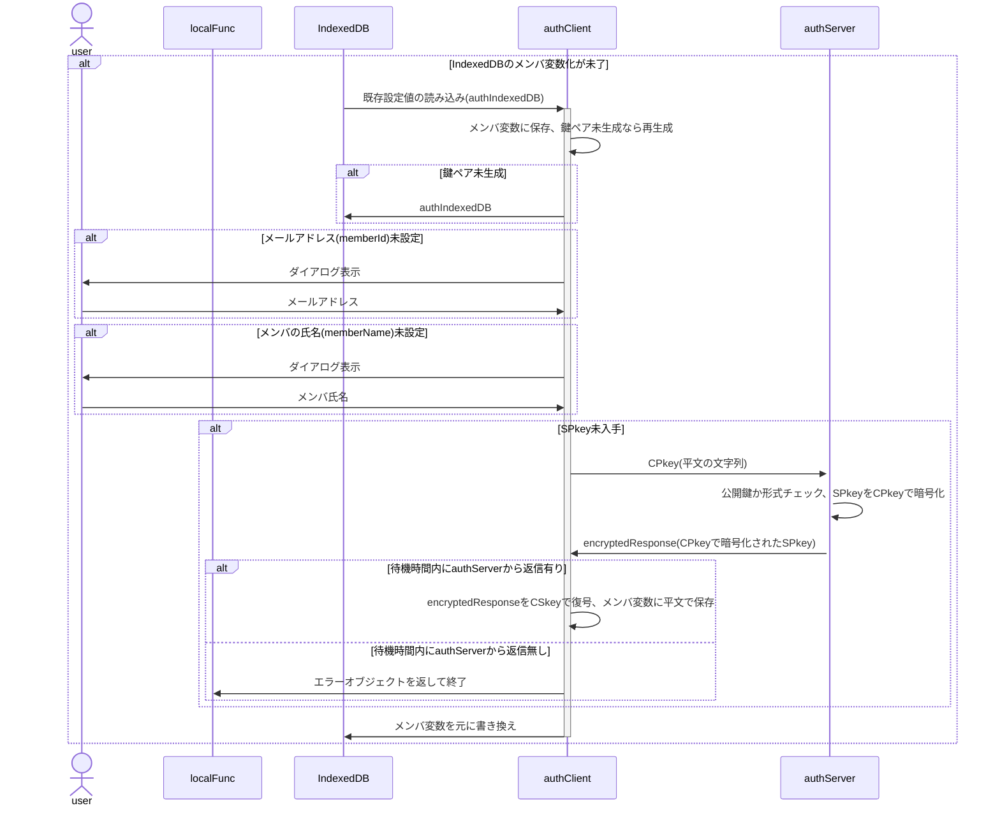
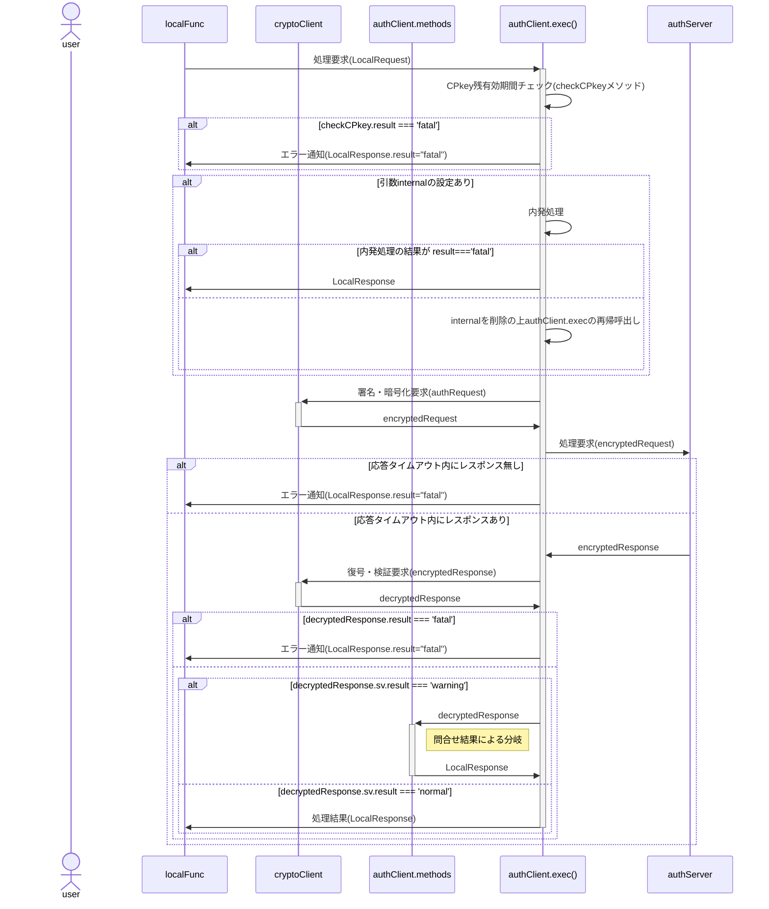

# authClient 関数 仕様書

## 🧭 概要

authClientは、ローカル関数(ブラウザ内JavaScript)からの要求を受け、
サーバ側(authServer)への暗号化通信リクエストを署名・暗号化、
サーバ側処理を経てローカル側に戻された結果を復号・検証し、
処理結果に応じてクライアント側処理を適切に振り分ける中核関数です。

## ■ 設計方針、用語定義

- クロージャ関数とする
- ローカル関数からの要求に基づかない、authClientでの処理の必要上発生するauthServerへの問合せを「内発処理」と呼称
  - CPkey更新：期限切れまたは残有効期間が短い場合のCPkey更新処理
  - パスコード突合：メンバが未認証または試行中の場合のパスコード突き合わせ処理
- 内発処理はローカル関数からの処理要求に先行して行う

## 🧩 内部構成(クラス変数)

### authIndexedDB

<!--::$tmp/authIndexedDB.md::-->

### authClientKeys

<!--::$tmp/authClientKeys.md::-->

## 🧱 メイン処理

### 概要

- authClientインスタンス化時の処理。classのconstructor()に相当
- 引数はauthClient内共有用の変数`pv`に保存
- `cryptoClient.constructor()`で鍵ペアの準備
- IndexedDBからメールアドレスを取得、存在しなければダイアログから入力
- IndexedDBからメンバの氏名を取得、存在しなければダイアログから入力
- deviceId未採番なら採番(UUID)
- SPkey未取得ならサーバ側に要求
- 更新した内容はIndexedDBに書き戻す
- SPkey取得がエラーになった場合、SPkey以外は書き戻す
- IndexedDBの内容はauthClient内共有用変数`pv`に保存
- サーバ側から一定時間レスポンスが無い場合、`{result:'fatal',message:'No response'}`を返して終了



- 鍵ペア(CPkey)の更新が必要な場合はexec()メソッドから行い、メイン処理では行わない。

### 📤 入力項目

#### `authClientConfig`

<!--::$tmp/authClientConfig.md::-->

#### 参考：`authConfig`

<!--::$tmp/authConfig.md::-->

### 📥 出力項目

- 利用可能なメソッドのオブジェクト

## 🧱 exec()メソッド

### 概要

- ローカル関数からの要求を受けてauthServerに問合せを行い、返信された処理結果に基づき適宜メソッドを呼び出す

```js
/**
 * @param {LocalRequest} request - localFuncからの要求
 * @param {authRequest} [internal] - authClient内発の先行処理
 * @returns {LocalResponse}
 */
```
- CPkeyの残有効期間をチェック(checkCPkeyメソッドの実行)

- 内発処理が有った場合(`typeof internal !== 'undefined'`)は以下を実行
  - `cryptoClient.encrypt`に`internal`を渡して`encryptedRequest`を作成
  - authServerへの問合せ
  - 待機時間内にレスポンスあり
    - レスポンスの復号、署名検証
    - 結果がfatalだった場合、LocalRequestに`{result:'fatal',message:'No response'}`をセット、呼出元ローカル関数に返して終了
    - internalを外してexec()を再帰呼出(`exec(request)`)
  - 待機時間内にレスポンスなし
    - LocalRequestに`{result:'fatal',message:'No response'}`をセット、呼出元ローカル関数に返して終了
- `cryptoClient.encrypt`に`request`を渡して`encryptedRequest`を作成
- authServerへの問合せ
- 待機時間内にレスポンスあり
  - レスポンスの復号、署名検証
  - 問合せ結果による分岐
- 待機時間内にレスポンスなし
  - LocalRequestに`{result:'fatal',message:'No response'}`をセット、呼出元ローカル関数に返して終了



#### 問合せ結果による分岐

- 問合せ結果(`decryptedResponse.sv.message`)により呼出先メソッドは分岐する。

| message | 呼出先 | 処理概要 |
| :-- | :-- | :-- |
| registerd | showMessage() | authClientからの新規メンバ加入要求に対して、authServerがmemberListに登録＋管理者へメール通知を発行した場合のmessage<br>⇒ 「加入申請しました。管理者による加入認否結果は後程メールでお知らせします」表示 |
| under review | showMessage() | authClientからの加入審査状況の問合せに対するauthServerからの「現在審査中」の回答<br>⇒ 「現在審査中です。今暫くお待ちください」表示 |
| denial | showMessage() | authClientからの加入審査状況の問合せに対するauthServerからの「加入申請否認」の回答<br>⇒ 「残念ながら加入申請は否認されました」表示 |
| send passcode | enterPasscode() | authClientからの処理要求に対するauthServerからの「未認証⇒パスコード通知済」の回答<br>⇒ パスコード入力画面を表示 |
| unmatch | enterPasscode() | authClientで入力されたパスコードに対するauthServerからの「パスコード不一致(再試行可)」の回答<br>⇒ パスコード入力画面を表示 |
| freezing | showMessage() | authClientで入力されたパスコードに対するauthServerからの「試行回数上限、凍結中」の回答<br>⇒ 「パスコードが連続して不一致だったため、現在アカウントは凍結中です。時間をおいて再試行してください」表示 |

#### 参考：メンバの状態遷移

<!--::$src/Member/stateTransition.md::-->

### 📤 入力項目

#### LocalRequest

<!--::$tmp/LocalRequest.md::-->

#### authRequest

<!--::$tmp/authRequest.md::-->

### 📥 出力項目

#### LocalResponse

<!--::$tmp/LocalResponse.md::-->

#### 参考：authResponse

<!--::$tmp/authResponse.md::-->

## 🧱 showMessage()メソッド

- execメソッドから呼ばれる関数
- 引数は`decryptedResponse`
- 戻り値は`LocalResponse(={result:'fatal',message:decryptedResponse.sv.message,response:undefind})`
- `decryptedResponse.sv.message`の値に基づき、メッセージをダイアログで表示
  | message | メッセージ |
  | :-- | :-- |
  | registerd | 加入申請しました。管理者による加入認否結果は後程メールでお知らせします |
  | under review | 現在審査中です。今暫くお待ちください |
  | denial | 残念ながら加入申請は否認されました |
  | freezing | パスコードが連続して不一致だったため、現在アカウントは凍結中です。時間をおいて再試行してください |

## 🧱 enterPasscode()メソッド

- execメソッドから呼ばれる関数
- パスコードを入力するダイアログを表示
- ダイアログに表示するメッセージは`decryptedResponse.sv.message`の値に基づき変更
  | message | メッセージ |
  | :-- | :-- |
  | send passcode | パスコード通知メールを送信しました。記載されたパスコードを入力してください |
  | unmatch | 入力されたパスコードが一致しません。再入力してください |
- `authRequest(={func:'::passcode::',arguments:[入力されたパスコード]})`を作成
- 作成したauthRequestをinternalとしてexecメソッドを再帰呼出
- 再帰呼出先のexecの戻り値を自身の戻り値とする

## 🧱 checkCPkey()メソッド

- 引数は無し、戻り値は`authResponse`
- CPkey残有効期間をチェック、期限切れまたは猶予時間未満になってないか計算<br>
  `authIndexedDB.expireCPkey - Date.now() < authClientConfig.CPkeyGraceTime`
- 残有効期間が十分な場合、`authResponse(={result:'normal'})`を返して終了
- 残有効期間が不十分な場合
  - 新しい鍵ペアを作成(`cryptoClient.generateKeys()`)
  - `authRequest(={func:'::updateCPkey::',signature:更新後CPkey})`を作成
  - 作成したauthRequestをinternalとしてexecメソッドを再帰呼出<br>
    ※ この時点では古い鍵ペアで署名・暗号化される
  - 再帰呼出先のexecが`result === 'normal'`ならIndexedDBも更新(`cryptoClient.updateKeys`)

## ⏰ メンテナンス処理

## 🔐 セキュリティ仕様

## 🧾 エラーハンドリング仕様
