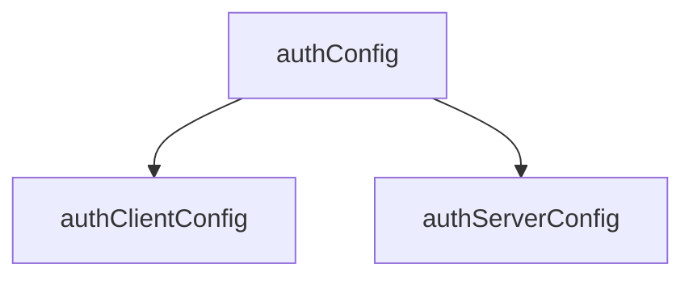
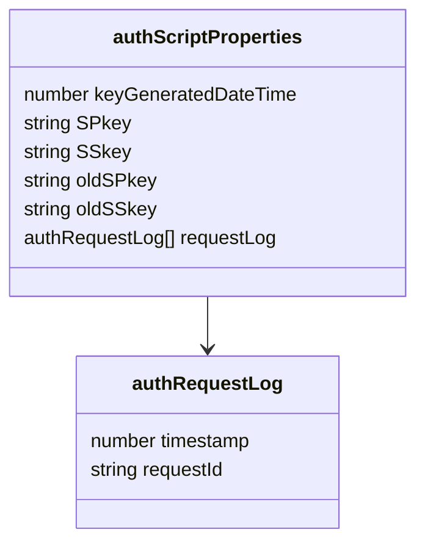
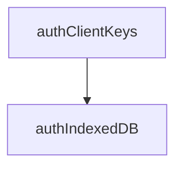
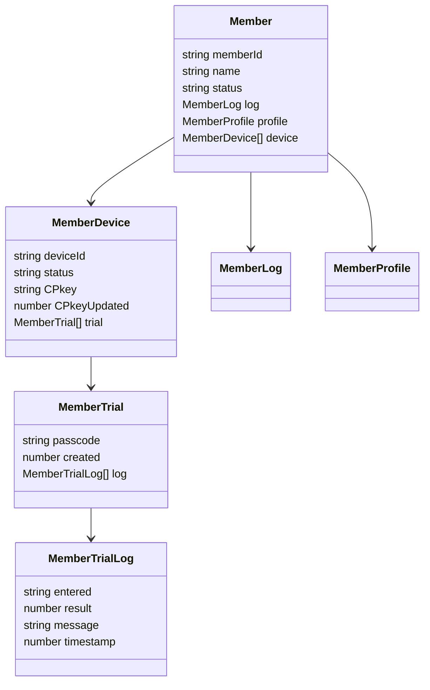

<!--::$src/common/header.md::-->

# auth関係 データ型定義

[クラス一覧](#list) | [動作環境設定系](#config) | [鍵ペア他の格納](storage) | [通信・暗号化系](#crypto) | [メンバ管理系](#member) | [監査・エラーログ系](#log)

## ドキュメントの目的

各クラス・データ型の定義を一覧化し、仕様の整合性を確保すること。

## 方針

- データ型命名規約
	- 例：auth* = 内部処理系, Member* = メンバ管理系, Local* = クライアント内通信系
- クラスに限らずクロージャ関数も、一覧に記載のメンバをインスタンス変数として持つ
- 全てのクラス・クロージャ関数はインスタンス生成時、起動時引数オブジェクトでインスタンス変数を上書きする
- 起動時引数オブジェクトで定義に無いメンバは廃棄する(インスタンス変数として追加しない)
- 以下のクラス定義で「クロージャ関数」と有った場合、以下のような構造を想定する。

<details><summary>例：非同期初期化を持つクラス相当のクロージャ</summary>

```js
async function Example() {
  // 非同期初期化処理
  const data = await fetch('/api/data').then(r => r.json());

  // プライベート変数。本仕様書内では「メンバ」として定義。
  let count = 0;

  // この部分を「メイン処理」と呼称、本仕様書内では"constructor"として記述

  // メソッド群（クロージャとしてプライベート変数にアクセス可能）
  return {
    getData() {
      return data;
    },
    increment() {
      count++;
      return count;
    },
    getCount() {
      return count;
    }
  };
}

// 使用例
(async () => {
  const obj = await Example(); // awaitできる！
  console.log(obj.getData());
  console.log(obj.increment()); // => 1
})();
```

</details>

## <span id="list">クラス一覧</span>

<!--::$tmp/classList.md::-->

## <span id="config">1 動作環境設定系</span>



| No | クラス名 | 概要 |
| --: | :-- | :-- |
| 5 | [authConfig](authConfig.md) | authClient/authServer共通設定値 |
| 3 | [authClientConfig](authClientConfig.md) | authClient専用の設定値 |
| 13 | [authServerConfig](authServerConfig.md) | authServer専用の設定値 |

## <span id="storage">2 鍵ペア他の格納</span>



| No | クラス名 | 概要 |
| --: | :-- | :-- |
| 11 | [authScriptProperties](authScriptProperties.md) | サーバ側のScriptProperties |
| 9 | [authRequestLog](authRequestLog.md) | 重複チェック用のリクエスト履歴 |



| No | クラス名 | 概要 |
| --: | :-- | :-- |
| 4 | [authClientKeys](authClientKeys.md) | クライアント側鍵ペア |
| 7 | [authIndexedDB](authIndexedDB.md) | クライアントのIndexedDB |


## <span id="crypto">3 通信・暗号化系</span>

| No | クラス名 | 概要 |
| --: | :-- | :-- |
| 20 | [LocalRequest](LocalRequest.md) | ローカル関数からの処理要求 |
| 8 | [authRequest](authRequest.md) | 暗号化前の処理要求 |
| 14 | [cryptoClient](cryptoClient.md) | クライアント側の暗号化・復号処理 |
| 18 | [encryptedRequest](encryptedRequest.md) | 暗号化された処理要求 |
| 15 | [cryptoServer](cryptoServer.md) | サーバ側の暗号化・復号処理 |
| 16 | [decryptedRequest](decryptedRequest.md) | 復号済の処理要求 |
| 10 | [authResponse](authResponse.md) | 暗号化前の処理結果 |
| 19 | [encryptedResponse](encryptedResponse.md) | 暗号化された処理結果 |
| 17 | [decryptedResponse](decryptedResponse.md) | 復号済の処理結果 |
| 21 | [LocalResponse](LocalResponse.md) | ローカル関数への処理結果 |

※ [cryptoServer.decryptの処理結果](cryptoServer.md#decrypt-returns)

## <span id="member">4 メンバ管理系</span>

<span id="member_classdiagram">クラス図</span>



| No | クラス名 | 概要 |
| --: | :-- | :-- |
| 22 | [Member](Member.md) | メンバ単位の管理情報 |
| 23 | [MemberDevice](MemberDevice.md) | メンバのデバイス情報 |
| 24 | [MemberLog](MemberLog.md) | メンバの各種要求・状態変化の時刻 |
| 25 | [MemberProfile](MemberProfile.md) | メンバの属性情報 |
| 26 | [MemberTrial](MemberTrial.md) | ログイン試行情報の管理・判定 |
| 27 | [MemberTrialLog](MemberTrialLog.md) | パスコード入力単位の試行記録 |

## <span id="log">5 監査・エラーログ系</span>

| No | クラス名 | 概要 |
| --: | :-- | :-- |
| 1 | [authAuditLog](authAuditLog.md) | authServerの監査ログ |
| 6 | [authErrorLog](authErrorLog.md) | authServerのエラーログ |
