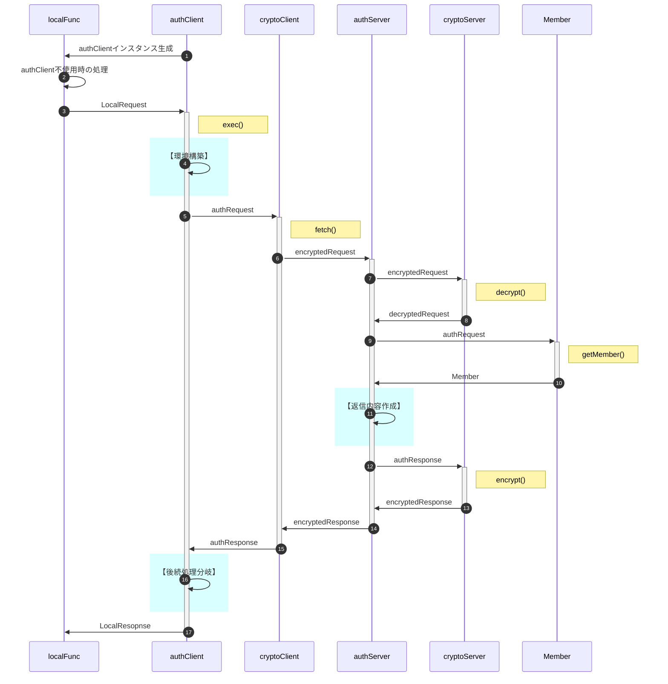

# "auth"総説

ブラウザ(クライアント)とGAS(サーバ)の間で認証された通信を行う。

## 要求仕様

- 本システムは限られた人数のサークルや小学校のイベント等での利用を想定する。 
  よってセキュリティ上の脅威は極力排除するが、一定水準の安全性・恒久性を確保した上で導入時の容易さ・技術的ハードルの低さ、運用の簡便性を重視する。
- サーバ側(以下authServer)はスプレッドシートのコンテナバインドスクリプト、クライアント側(以下authClient)はHTMLのJavaScript
- サーバ側・クライアント側とも鍵ペアを使用
- サーバ側の動作環境設定・鍵ペアは[ScriptProperties](typedef.md#authscriptproperties)、クライアント側は[IndexedDB](typedef.md#authindexeddb)に保存
- 原則として通信は受信側公開鍵で暗号化＋発信側秘密鍵で署名
- クライアントの識別(ID)はメールアドレスで行う
- 日時は特段の注記が無い限り、UNIX時刻でミリ秒単位で記録(`new Date().getTime()`)
- メンバ情報は[スプレッドシート](typedef.md#member)に保存
- 定義したクラスのインスタンス変数は、セキュリティ強度向上のため特段の記述がない限りprivateとする
- 日時は特段の指定が無い限り全てUNIX時刻(number型)。比較も全てミリ秒単位で行う

## 用語

- SPkey, SSkey：サーバ側の公開鍵(Server side Public key)と秘密鍵(Server side Secret key)
- CPkey, CSkey：クライアント側の公開鍵(Client side Public key)と秘密鍵(Client side Secret key)
- パスフレーズ：クライアント側鍵ペア作成時のキー文字列。JavaScriptで自動的に生成
- パスワード：運用時、クライアント(人間)がブラウザ上で入力する本人確認用の文字列
- パスコード：二段階認証実行時、サーバからクライアントに送られる6桁※の数字 
  ※既定値。実際の桁数はauthConfig.trial.passcodeLengthで規定
- 内発処理：ローカル関数からの要求に基づかない、authClientでの処理の必要上発生するauthServerへの問合せ

## 暗号化・署名方式、運用

- 署名方式 : RSA-PSS
- 暗号化方式 : RSA-OAEP
- ハッシュ関数 : SHA-256以上
- 許容時差±120秒※以内
  ※既定値。実際の桁数はauthConfig.cryptoServer.allowableTimeDifferenceで規定
- 順序は「暗号化->署名」ではなく「署名->暗号化」で行う
  1. クライアントがデータをJSON化
  2. 自身の秘密鍵で署名(署名→暗号化)
  3. サーバの公開鍵で暗号化
  4. サーバは復号後、クライアント公開鍵(memberList.CPkey)で署名を検証
- パスワードの生成は「ライブラリ > createPassword」を使用
- パスコードのメール送信は「ライブラリ > sendMail」を使用
- CPkeyの有効期限が切れた場合、以下の手順で更新する
  1. クライアント側から古いCPkeyで署名された要求を受信
  2. サーバ側で署名検証の結果、期限切れを確認
    - memberList.trial[0].CPkeyUpdateUntilに「現在日時＋authConfig.cryptoServer.loginLifeTime」をセット
    - クライアント側に通知
  3. クライアント側でCPkeyを更新、新CPkeyで再度リクエスト
  4. サーバ側でauthConfig.cryptoServer.loginLifeTimeを確認、期限内ならmemberList.CPkeyを書き換え。期限切れなら加入処理同様、adminによる個別承認を必要とする。
  5. 以降は未ログイン状態で要求が来た場合として処理を継続

## クライアント・サーバ間の通信手順

- 以下は正常系のみ記載
- `localFunc`とは、クライアント側(ブラウザ)内で動作するJavaScriptの関数

- ①：onLoad時、authClientインスタンス生成
- ②：サーバ側との通信が不要な処理(メンバの状態は「不使用」)
- ③：サーバ側との通信が必要になった場合、処理要求を発行
- ④：【環境構築】として`authClient.setupEnvironment`を実行、SPkey入手等を行う 
  詳細はauthClient.[setupEnvironment](authClient.md#setupenvironment)参照
- ⑤：`authClient.exec`でauthRequest型オブジェクトに変換
- ⑥：`cryptoClient.fetch`内部でencryptメソッドを呼び出し、暗号化＋署名
- ⑦：`cryptoServer.decrypt`で署名検証＋復号
- ⑨：要求者(メンバ)の状態をシートから取得
- ⑪：【返信内容作成】メンバの状態を判断、適宜サーバ側関数の呼び出し 
  詳細は[]
