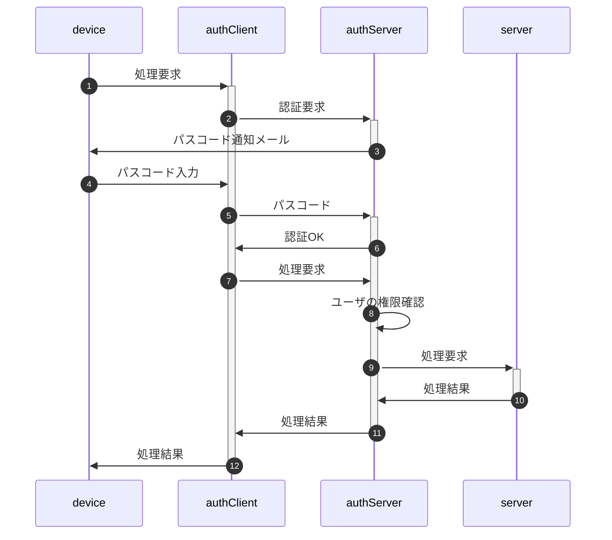
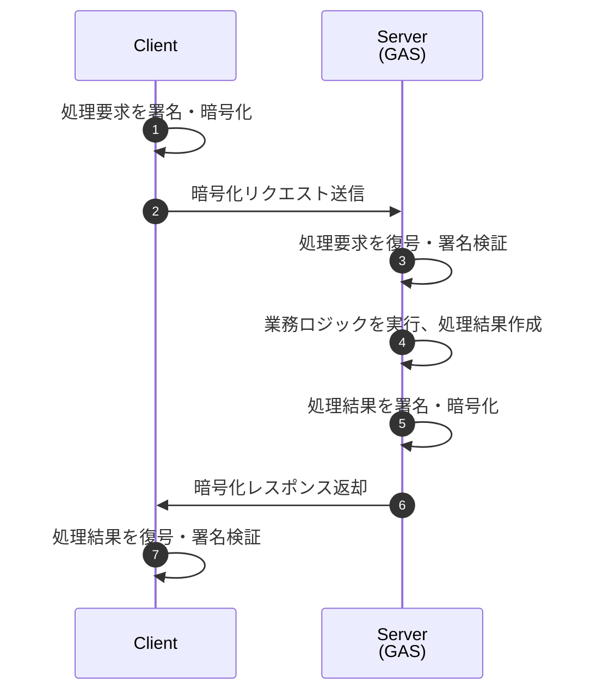
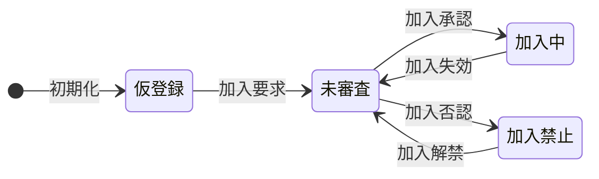
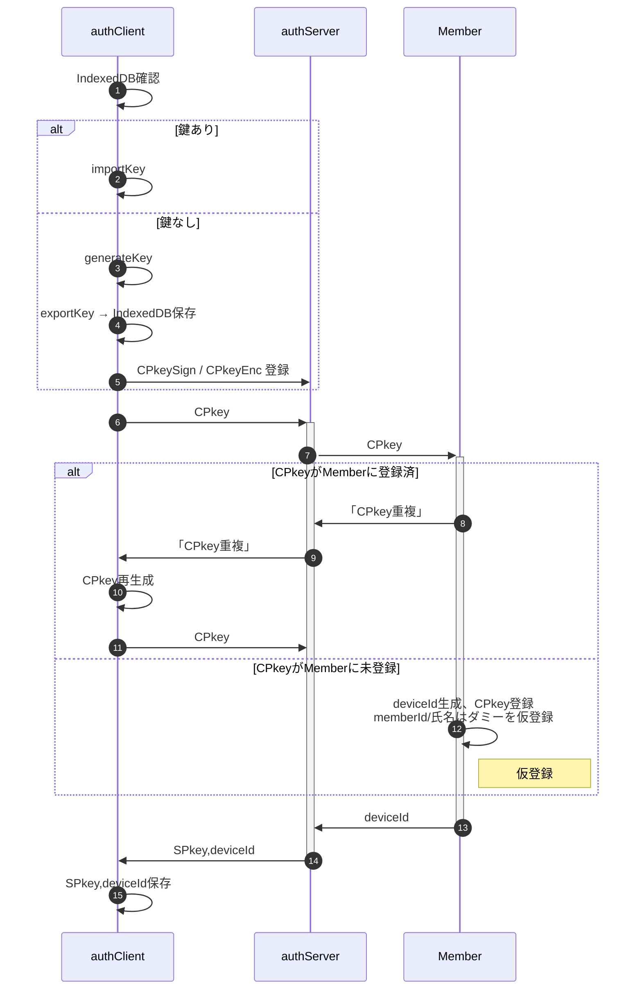
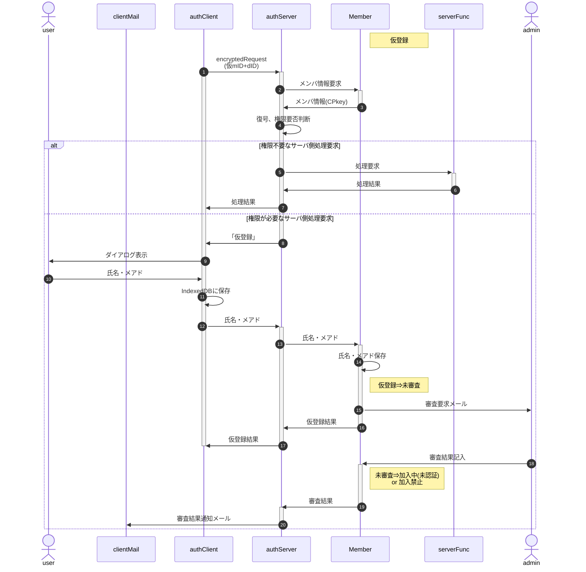
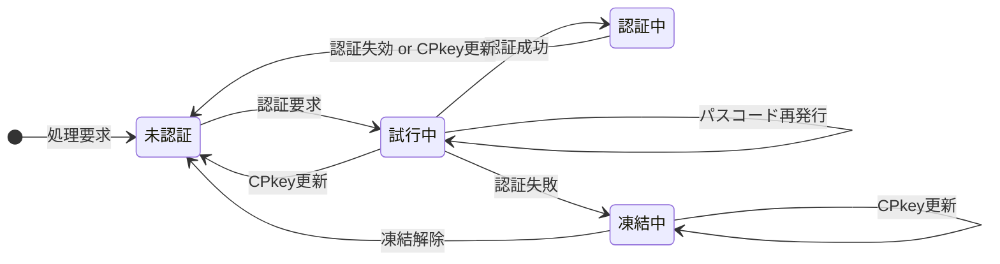
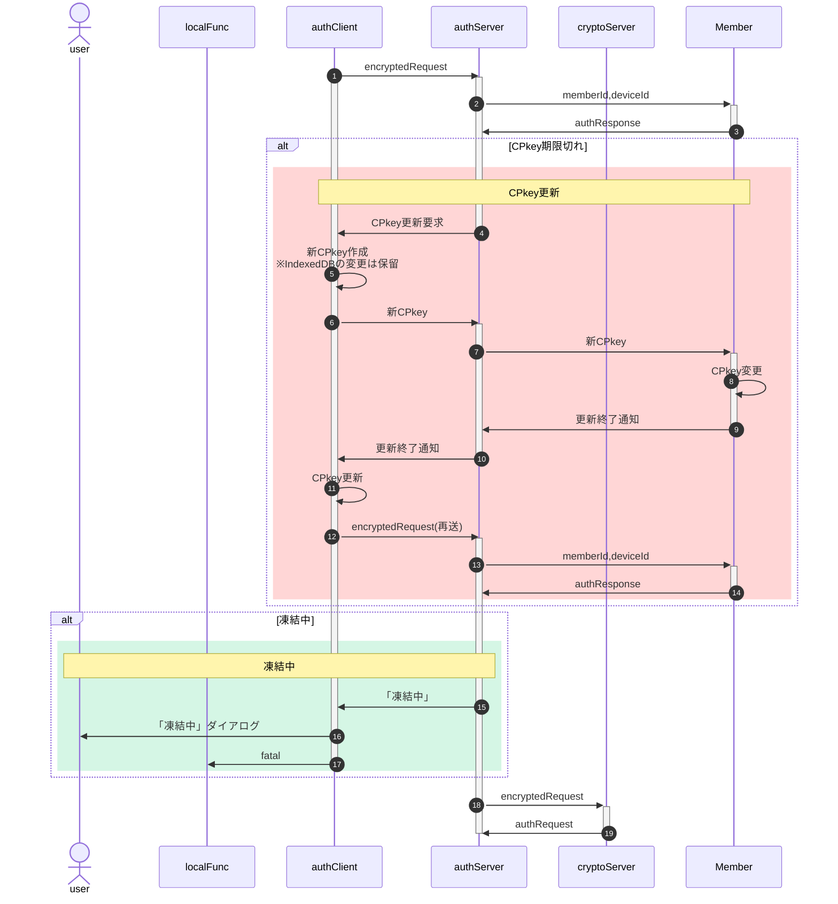
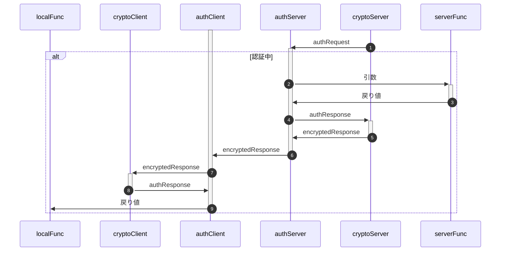
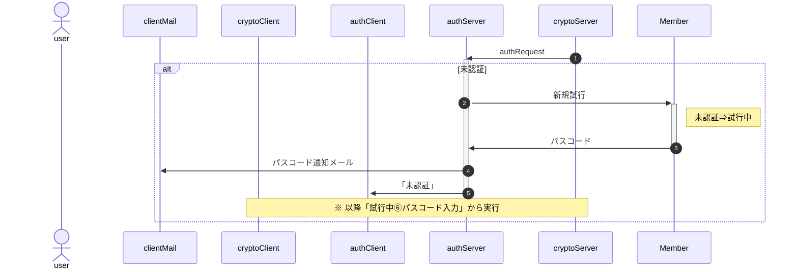
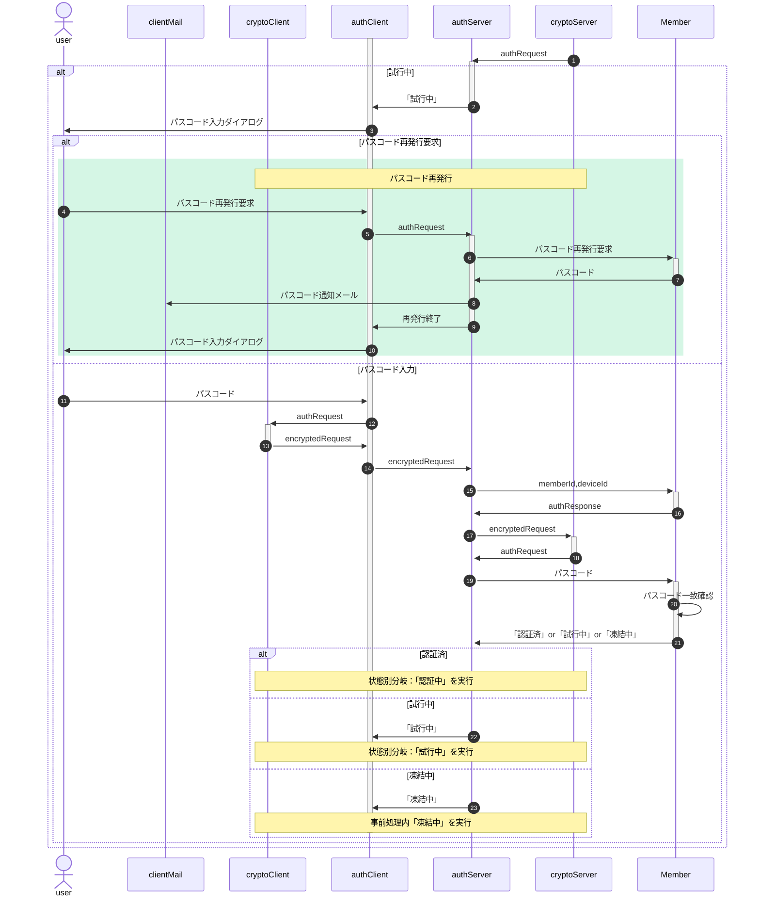

# <span id="top">"auth"総説</span>

<div class="submenu">

[要求仕様](#require) | [用語](#dictionary) | [暗号化・署名方式](#crypto) | [実装方針](#policy) | [状態及び通信手順](#protocol)

</div>

"Auth"とは利用者(メンバ)がブラウザからサーバ側処理要求を発行、サーバ側は二要素認証を行ってメンバの権限を確認の上サーバ側の処理結果を返す、クライアント・サーバにまたがるシステムである。



なおメンバがserverのどの機能を使用可能か(権限)は、管理者が事前にメンバ一覧(Google Spread)上で設定を行う。

## <span id="require"><a href="#top">要求仕様</a></span>

- 本システムは限られた人数のサークルや小学校のイベント等での利用を想定する。<br>
  よってセキュリティ上の脅威は極力排除するが、一定水準の安全性・恒久性を確保した上で導入時の容易さ・技術的ハードルの低さ、運用の簡便性を重視する。
- 「セキュリティ上の脅威」として以下を想定、対策する。逆に想定外の攻撃は対策対象としない。
  - 想定する攻撃：盗聴、中間者攻撃、端末紛失、リプレイ、誤設定
  - 想定外の攻撃：高度持続的攻撃（APT）、大規模DoS、root化端末での攻撃、端末・サーバへの物理侵入
- サーバ側(以下authServer)はスプレッドシートのコンテナバインドスクリプト、クライアント側(以下authClient)はHTMLのJavaScript
- サーバ側・クライアント側とも鍵ペアを使用
- サーバ側の動作環境設定・鍵ペアはScriptProperties、クライアント側はIndexedDBに保存
- 原則として通信は受信側公開鍵で暗号化＋発信側秘密鍵で署名
- クライアントの識別(ID)はメールアドレスで行う
- 日時は特段の注記が無い限り、UNIX時刻でミリ秒単位で記録(`new Date().getTime()`)
- [メンバ情報](sv/Member.md#member_members)はスプレッドシートに保存
- 定義したクラスのインスタンス変数は、セキュリティ強度向上のため特段の記述がない限りprivateとする
- 日時は特段の指定が無い限り全てUNIX時刻(number型)。比較も全てミリ秒単位で行う

## <span id="dictionary"><a href="#top">用語</a></span>

- メンバ、デバイス：「メンバ」とは利用者を、「デバイス」とは利用者が使用する端末を指す。マルチデバイス対応のためメンバ：デバイスは"1:n"対応となる。<br>
  メンバはメールアドレスで識別し、デバイスはauthClient呼出時に自動設定されるUUIDで識別する。
- SPkey, SSkey：サーバ側の公開鍵(Server side Public key)と秘密鍵(Server side Secret key)
- CPkey, CSkey：クライアント側の公開鍵(Client side Public key)と秘密鍵(Client side Secret key)
- パスフレーズ：クライアント側鍵ペア作成時のキー文字列。JavaScriptで自動的に生成
- パスワード：運用時、クライアント(人間)がブラウザ上で入力する本人確認用の文字列
- パスコード：二段階認証実行時、サーバからクライアントに送られる6桁※の数字<br>
  ※既定値。実際の桁数はauthConfig.trial.passcodeLengthで規定
- 内発処理：ローカル関数からの要求に基づかない、authClientでの処理の必要上発生するauthServerへの問合せ

## <span id="crypto"><a href="#top">暗号化・署名方式</a></span>

■ 概要



- ①処理要求を署名・暗号化
  1. authRequest を JSON 正規化
  2. 正規化JSONに署名（RSA-PSS, クライアント秘密鍵）
  3. authRequest + signature を AES-256-GCM で暗号化
  4. AES共通鍵を RSA-OAEP（サーバ公開鍵）で暗号化
- ③処理要求を復号・署名検証
  1. RSA-OAEPでAES鍵を復号（サーバ秘密鍵）
  2. AES-256-GCMでauthRequestを復号
  3. 署名検証（RSA-PSS, クライアント公開鍵）
- ⑤処理結果を署名・暗号化
  1. 応答データを署名
  1. 応答を暗号化
- ⑦処理結果を復号・署名検証
  1. レスポンスを復号
  1. 署名検証

### 目的と前提

本項はAuth プロジェクトにおける**暗号化・署名の最終仕様**を一箇所にまとめたものである。他のAuth関係仕様書で本項と矛盾する記述が有った場合、本項が優先する。

**前提**
- 実装は RSA + AES-256-GCM のハイブリッド暗号方式を用いる。
  - ペイロード本体は AES-256-GCM で暗号化
  - AES鍵（共通鍵）のみを RSA-OAEP で暗号化
- `authConfig.md` の `RSAbits`(既定値 2048)で鍵長を指定する。
- 環境はブラウザ（WebCrypto）クライアントと Google Apps Script（サーバ）を想定。GAS の制約（永続ストレージ・実行時間）に配慮する。

### 用語と略称

- RSA-OAEP: RSA Encryption with OAEP padding（暗号化用）
- RSA-PSS: RSA Probabilistic Signature Scheme（署名用）
- RSAbits: RSA 鍵長（例: 2048）
- nonce: 一意なリクエスト識別子（UUID v4 等）
- requestTime: クライアント生成 UNIX ms（例: Date.now()）
- replay cache: サーバで管理する最近利用された nonce の履歴([authScriptProperties.requestLog](authScriptProperties.md#authscriptproperties_members)でTTL管理)

### 設計方針

1. **機密性**:
   - authRequest / authResponse 全体を AES-256-GCM で暗号化する
   - AES鍵（共通鍵）は RSA-OAEP で暗号化し、envelope に格納する
2. **完全性/認証**:
   - 署名は RSA-PSS（SHA-256）で行う
   - 署名対象は「暗号化前の authRequest / authResponse（正規化JSON）」とする
3. **リプレイ対策**: `nonce` + `requestTime` の組合せを必須にする。サーバは nonce の一意性を検査し、同一 nonce は拒否する。
4. **可搬性**: 暗号パラメータは `authConfig.md` の `RSAbits` を参照する。
5. **可観測性**: 失敗時は詳細な内部メッセージをログ（authErrorLog / authAuditLog）に残すが、クライアントには汎用的なエラーメッセージを返す。

### パラメータ・初期値

- RSA 鍵長: **2048**（`RSAbits` のデフォルト）
- ハッシュ: **SHA-256**
- 署名方式: **RSA-PSS（saltLength = auto）**
- 暗号化方式: **RSA-OAEP（SHA-256）**
- nonce 型: **UUID v4**（文字列）
- 許容誤差: **±2分（120,000 ms）** authConfig.[allowableTimeDifference](sv/authConfig.md#authconfig_members)で規定。

### 署名・暗号化対象JSON

クライアントが署名・暗号化する対象は**JSONリクエスト構造ではなく authRequest インスタンスそのもの**とする。

**署名対象**: `header` + `payload` の両方を canonicalize（キー順ソート、UTF-8）した文字列に対して `RSA-PSS(SHA-256)` で署名し、署名値を `signature` フィールドとして追加する。

**最終送信フォーマット**:

- 処理要求 : [encryptedRequest](cl/encryptedRequest.md#encryptedrequest_members)
- 処理結果 : [encryptedResponse](sv/encryptedResponse.md#encryptedresponse_members)

※ encryptedResponse（サーバ→クライアント）は同一構造を持ち、暗号化対象が authResponse、署名鍵がサーバ鍵になる点のみが異なる。

■ 最終送信フォーマットの例

```json
{
  "envelope": {
    "cipher": "<base64 AES-256-GCM で暗号化された JSON>",
    "encryptedKey": "<base64 RSA-OAEP で暗号化された AES 共通鍵>",
    "iv": "<base64 AES-GCM IV>",
    "tag": "<base64 AES-GCM 認証タグ>"
  },
  "signature": "<base64 RSA-PSS signature over canonical JSON>",
  "meta": {
    "rsabits": 2048,
    "sym": "AES-256-GCM"
  }
}
```

### Nonce と Replay 防止

- サーバは `requestTime` と `nonce` の両方を検査する。リプレイ閾値を満たす場合でも `nonce` が既に使われていれば拒否する。
- replay cacheの実装では、ScriptPropertiesにJSONバッファを持たせ、短時間のTTLとする

#### サーバ側検査アルゴリズム

1. 受信 → `header.requestTime` が現在時刻と比較して許容誤差内か確認
2. `header.nonce` が既に replay cache に存在するか確認
   - 存在する → 拒否（リプレイ）
   - 存在しない → 登録（TTL を設定）
3. 署名検証（RSA-PSS）
4. 復号（該当する場合）
5. 正常処理後、nonce の TTL 更新は行わない（使い捨て）

### 署名・検証の順序

1. クライアントは canonical JSON を署名（RSA-PSS）
2. クライアントは署名済みの JSON を暗号化（RSA-OAEP）して `envelope.cipher` に格納（暗号化する場合）
3. サーバは受信 → 復号 → canonical JSON の署名検証 → requestTime/nonce チェック → 業務ロジック

> 注: 署名を暗号化の後に検証するケースや、暗号化後に署名（外側）を行うケースもあるが、上記の順序は「署名の透明性」と「復号の後で署名検証」が保証され、安全です。

#### canonical JSON 仕様

署名対象となる canonical JSON は、以下の条件を満たすものとする。

1. JSON オブジェクトのキー順は **辞書順（Unicode code point 昇順）**
2. 数値は変換せず、そのままの数値表現を用いる
3. 文字列は UTF-8 とし、エスケープは JSON 標準に従う
4. 不要な空白・改行は含めない（minified JSON）
5. undefined / function / Symbol 等は含めない

この canonical JSON 文字列に対して RSA-PSS(SHA-256) 署名を行う。

### 互換性と拡張性の提案

- `meta.rsabits` を送ることでクライアントとサーバが鍵長を協調できる
- `meta.sym` により共通鍵方式の将来的な差し替えが可能

## <span id="policy"><a href="#top">実装上の方針</a></span>

- サーバ・クライアント共に進捗・エラー管理に[devTools](JSLib.md#devtools)を使用
- 関数・メソッドは原則として`try 〜 catch`で囲み、予期せぬエラーが発生した場合はErrorオブジェクトを返す。
- 呼出側は原則Errorオブジェクトが返されたら処理を中断(`if( v.rv instanceof Error ) throw v.rv;`)

## <span id="protocol"><a href="#top">状態及び通信手順</a></span>

<div class="submenu">

[I/O項目対応](#io) | [メンバ状態遷移](#member) | [初回ロード](#onLoad) | [初回要求](#onRequest) | [デバイス状態遷移](#device) | [事前処理](#preparation) | [認証中](#login) | [未認証](#unauthenticated) | [試行中](#tring) | [内発処理](#internalProcessing)

</div>

例えば認証済のデバイスからの処理要求は受け付けるが未認証なら先に認証に必要なパスコードを通知する等、クライアント側(メンバ・デバイス)の状態によりサーバ側の処理が異なる。このため、まずメンバ・デバイスの状態および状態毎の通信手順を以下に整理する。

なお「メンバ：デバイス = 1:n」のため、最初にクライアント・サーバ間通信に使用されるI/O項目(クラス)を整理した上で、メンバとデバイスを分けて記述する。

### <span id="io"><a href="#protocol">I/O項目対応表</a></span>

※ <span class="popup">緑文字</span>はカーソルを合わせると補足説明をポップアップ

※ 背景色黄色は暗号化対象項目。例：
- `encryptedRequest = {memberId,deviceId,cypherText}`
- `cypherText = encrypt(JSON.stringify(memberName〜nonce))`

<div style="overflow-x: auto;" class="nowrap">

| No | メンバ名 | データ型 | 説明 | LocalRequest | authRequest<br>encryptedRequest | authResponse<br>encryptedResponse | LocalResponse |
| --: | :-- | :-- | :-- | :-- | :-- | :-- | :-- |
| 1 | memberId | number | メンバ識別子(メールアドレス) |  | memberId | <b>memberId</b> |  |
| 2 | deviceId | string | デバイス識別子(UUID) |  | deviceId | <b>deviceId</b> |  |
| 3 | memberName | string | メンバの氏名 |  | <b>memberName</b> | <b>memberName</b> |  |
| 4 | CPkey | string | クライアント側公開鍵 |  | <b>CPkey</b> | <b>CPkey</b> |  |
| 5 | requestTime | number | クライアント側の処理要求受付日時 |  | <b>requestTime</b> | <b>requestTime</b> |  |
| 6 | func | string | サーバ側関数名 | func | <b>func</b> | <b>func</b> |  |
| 7 | arguments | any[] | サーバ側関数に渡す引数の配列 | arguments | <b>arguments</b> | <b>arguments</b> |  |
| 8 | nonce | string | 処理要求のUUID |  | <b>nonce</b> | <b>nonce</b> |  |
| 9 | SPkey | string | サーバ側公開鍵 |  |  | <b>SPkey</b> |  |
| 10 | response | any | <span class="popup" title="Errorオブジェクトを含む">サーバ側関数の処理結果(戻り値)</span> |  |  | <b>response</b> | response |
| 11 | receptTime | number | サーバ側の処理要求受付日時 |  |  | <b>receptTime</b> |  |
| 12 | responseTime | number | 処理終了日時 |  |  | <b>responseTime</b> |  |
| 13 | status | string\|authError | <span class="popup" title="正常終了時は'success'(文字列)、警告終了の場合はエラーメッセージ、致命的エラーの場合はErrorオブジェクト">authServer他、サーバ側Auth処理結果</span> |  |  | status | status |
| 14 | message | string | メッセージ(statusの補足) |  |  | message |  |
| 15 | decrypt | string | <span class="popup" title="正常に復号されたら'normal'、異常ならエラーメッセージ">クライアント側での復号結果</span> |  |  | decrypt |  |

</div>

- ⑬status：status は「アプリケーションステータス」であり HTTP レスポンスとは無関係

### <span id="member"><a href="#protocol">メンバの状態遷移</a></span>

#### <a href="#protocol">状態遷移図</a>



| No | 状態 | 説明 |
| --: | :-- | :-- |
| 1 | 仮登録 | シートに仮のmemberId(UUID)/メンバ名("dummy"固定)が登録され、権限不要な関数のみ実行可能な状態 |
| 2 | 未審査 | シートに正しいmemberId(メアド)/メンバ名(氏名)が登録されているが、管理者からの加入認否が未定で権限不要な関数のみ実行可能な状態 |
| 3 | 加入中 | 管理者により加入が承認された状態。権限不要な関数に加え、ログイン後は付与された範囲内の要権限サーバ側関数も実行可。<br>加入有効期間経過により、自動的に「未審査」状態に移行する |
| 4 | 加入禁止 | 管理者により加入が否認された状態。権限不要な関数のみ実行可能<br>加入禁止期間経過により、自動的に「未審査」状態に移行する |

■ 状態決定表

| ①シート | ②memberId | ③加入禁止 | ④未審査 | **メンバ状態** |
| :-- | :-- | :-- | :-- | :-- |
| 未登録 | — | — | — | (未使用) |
| 登録済 | UUID | — | — | **仮登録** |
| 登録済 | e-mail | 該当 | — | **加入禁止** |
| 登録済 | e-mail | 非該当 | 該当 | **未審査** |
| 登録済 | e-mail | 非該当 | 非該当 | **加入中** |

※下表内の変数名はMemberLogのメンバ名

- ①シート：memberListシートに登録されているか
- ②memberId：メンバ識別子(文字列)の形式
- ③加入禁止：加入禁止されている<br>
  `0 < denial && Date.now() <= unfreezeDenial`
- ④未審査：管理者の認否が未決定<br>
  `approval === 0 && denial === 0`

#### <span id="onLoad"><a href="#protocol">通信手順：初回HTMLロード時</a></span>

- 「🔢」はクライアント側(IndexedDB)の、「🧩」はサーバ側(シート)の項目・格納値
  - mID: memberId
  - CP : CPkey
  - 氏名 : メンバ氏名(ハンドルネーム)
  - dID : deviceId
  - SP : SPkey
  - 状態 : 処理による遷移先の状態名
- シーケンス図の下の表は、シーケンス図上のNoにおける処理終了時点での各変数の状態
- <span style="color:red">赤</span>字は前ステップからの変更点

-----

「初回HTMLロード時」とは、クライアント側でIndexedDB未作成・サーバ側SPkey未取得の状態を指す。



- CPkey重複チェックは送付の都度行う(⑥で再送されたCPkeyも重複していたら③に戻る)

| No  | 🔢mID | 🔢CP      | 🔢氏名  | 🔢dID    | 🔢SP | 🧩mID    | 🧩CP | 🧩氏名    | 🧩dID     | 🧩状態 |
| :-- | :--   | :--       | :--    | :--     | :--  | :--      | :-- | :--      | :--      | :--   |
| ①CPkey送信 | —     | <b>有</b> | —      | —       | —    | —        | —  |  —       | —         | —     |
| ③仮登録 | —     | 有        | —      | —       | —    | <b>仮</b> | 有  | <b>仮</b> | <b>有</b> | 仮登録 |
| ⑥SPkey保存 |<b>仮</b>| 有      |<b>仮</b>|<b>有</b>|<b>有</b>| 仮     | 有  | 仮        | 有        | 仮登録 |

#### <span id="onRequest"><a href="#protocol">通信手順：初回処理要求時</a></span>

「初回処理要求時」とは、初回HTMLロード時の処理終了後、初めての処理要求を出す状態を指す。



| No  | 🔢mID | 🔢CP | 🔢氏名 | 🔢dID | 🔢SP | 🧩mID | 🧩CP | 🧩氏名 | 🧩dID | 🧩状態 |
| :-- | :--   | :-- | :--   | :--   | :--  | :--  | :--  | :--   | :--   | :--   |
| 初期状態 | 仮    | 有   | 仮    | 有    | 有   | 仮    | 有   | 仮    | 有    | 仮登録 |
| ⑪iDB保存 |<b>有</b>| 有 |<b>有</b>| 有   | 有   | 仮    | 有   | 仮    | 有    | 仮登録 |
| ⑭メアド保存 | 有    | 有   | 有    | 有    | 有   |<b>有</b>| 有 |<b>有</b>| 有    | 仮登録 |

### <span id="device"><a href="#protocol">デバイスの状態遷移</a></span>

メンバが加入承認後、使用するデバイスの状態遷移

※ 上述の未使用から加入まではメンバ単位の状態遷移。マルチデバイス対応のため、認証状態はデバイス単位で管理。

#### <a href="#protocol">状態遷移図</a>



| No | 状態 | 説明 |
| --: | :-- | :-- |
| 1 | 未認証 | 未認証(未ログイン)で権限が必要な処理は行えない状態 |
| 2 | 試行中 | パスコードによる認証を試行している状態 |
| 3 | 認証中 | 認証が通り(ログイン)、権限の範囲内で要権限サーバ側関数も使用できる状態 |
| 4 | 凍結中 | 規定の試行回数連続して認証に失敗し、再認証要求が禁止された状態 |

■ 状態決定表

| ⑤認証中 | ⑥凍結中 | ⑦未認証 | デバイス状態 |
| :-- | :-- | :-- | :-- |
| 該当 | — | — | **認証中** |
| 非該当 | 該当 | — | **凍結中** |
| 非該当 | 非該当 | 該当 | **未認証** |
| 非該当 | 非該当 | 非該当 | **試行中** |

※下表内の変数名はMemberLogのメンバ名

- ⑤認証中：パスコード認証に成功し認証有効期間内<br>
  `0 < approval && Date.now() ≦ loginExpiration`
- ⑥凍結中：凍結期間内<br>
  `0 < approval && 0 < loginFailure && loginFailure < Date.now() && Date.now() <= unfreezeLogin`
- ⑦未認証：加入承認後認証要求されたことが無い<br>
  `0 < approval && loginRequest === 0`

#### <span id="preparation"><a href="#protocol">通信手順：事前処理(処理要求〜サーバ側での復号)</a></span>

以下は初回処理要求後に加入承認されたメンバであることが前提。

クライアント側からの処理要求をサーバ側で復号・署名検証するまでを「事前処理」とする。
この結果を受け、サーバ側はメンバ・デバイスの状態により処理内容を分岐させる。



- ③authResponse
  - response = 該当者/デバイスのMemberインスタンス
  - status = 通常は"normal"(文字列)。CPkey期限切れならError.message="CPkey expired"
- ④CPkey更新要求：データ型はauthResponse(暗号化)
  - status = "fatal"
  - response = "CPkey expired"
- ⑤新CPkey作成：authClient.IndexedDBの更新はこの時点では無く、authServerからの⑫変更終了通知を待って行う
- ⑥新CPkey送付：`func = "::updateCPkey::"`

#### <span id="login"><a href="#protocol">通信手順：「認証中」状態時</a></span>

※ ①authRequest = 事前処理⑲authRequest




#### <span id="unauthenticated"><a href="#protocol">通信手順：「未認証」状態時</a></span>

※ ①authRequest = 事前処理⑲authRequest



#### <span id="tring"><a href="#protocol">通信手順：「試行中」状態時</a></span>

※ ①authRequest = 事前処理⑲authRequest



- ③パスコード入力ダイアログには「再発行要求」ボタンを用意
- ⑤(再発行要求後の)authRequest : `func="::reissue::"`
- ⑫(パスコード入力後の)authRequest:`{func:"::passcode::",arguments:(入力されたパスコード)}`

### <span id="internalProcessing"><a href="#protocol">内発処理</a></span>

「内発処理」とはクライアント側ローカル関数からの処理要求に拠らない、Authシステム内部で発生する処理を指す。

| No | 処理名 | func | 概要 |
| --: | :-- | :-- | :-- |
| 1 | 初期情報要求 | ::initial:: | 初回HTMLロード時、SPkeyとdeviceIdをサーバ側に要求。<br>詳細は[通信手順：事前処理](#preparation)参照 |
| 1 | CPkey更新 | ::updateCPkey:: | CPkeyの有効期限が切れた場合に発生。<br>詳細は「[通信手順：事前処理](#preparation)」の「CPkey更新」参照 |
| 2 | パスコード入力 | ::passcode:: | ログインのためのパスコード入力。<br>詳細は「[通信手順：「試行中」](#tring)」参照 |
| 3 | パスコード再発行要求 | ::reissue:: | ログイン試行中のメンバから要請された場合に発生。<br>詳細は「[通信手順：試行中](#tring)」の「パスコード再発行」参照 |
