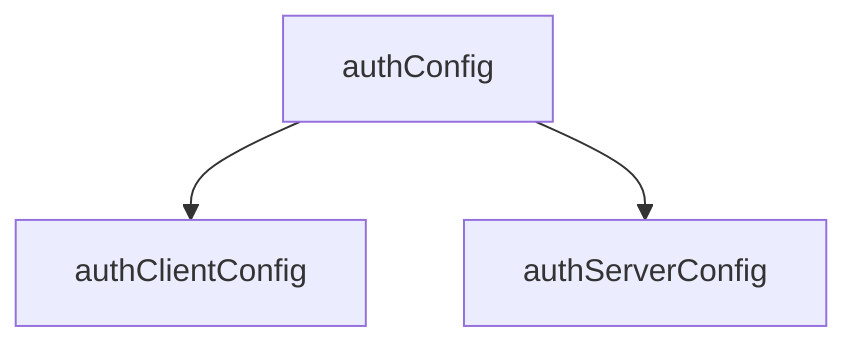
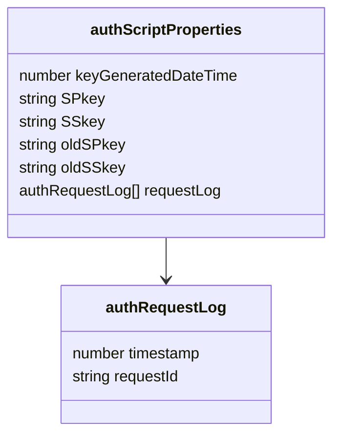
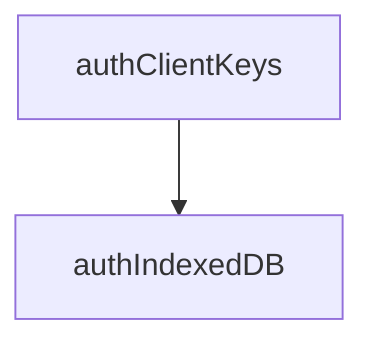

<!--::$src/common/header.md::-->

# auth関係 データ型定義

## ドキュメントの目的

各クラス・データ型の定義を一覧化し、仕様の整合性を確保すること。

## 方針

- データ型命名規約
	- 例：auth* = 内部処理系, Member* = メンバ管理系, Local* = クライアント内通信系
- クラスに限らずクロージャ関数も、一覧に記載のメンバをインスタンス変数として持つ
- 全てのクラス・クロージャ関数はインスタンス生成時、起動時引数オブジェクトでインスタンス変数を上書きする
- 起動時引数オブジェクトで定義に無いメンバは廃棄する(インスタンス変数として追加しない)

# 1 動作環境設定系



## authConfig

<!--::$tmp/authConfig.md::-->

## authClientConfig

<!--::$tmp/authClientConfig.md::-->

## authServerConfig

<!--::$tmp/authServerConfig.md::-->

# 2 鍵ペア他の格納



## authScriptProperties

<!--::$tmp/authScriptProperties.md::-->

## authRequestLog

<!--::$tmp/authRequestLog.md::-->



## authClientKeys

<!--::$tmp/authClientKeys.md::-->

上掲の構造を持つ新たなオブジェクト(鍵ペア)を持つクラス。

### constructor

- 📥 引数 {authClientConfig} arg
- authConfig.RSAbitsを参照、新たな鍵ペア生成
- 📤 戻り値：authClientKeysオブジェクト

## authIndexedDB

<!--::$tmp/authIndexedDB.md::-->

メイン処理を同期的に行うためasyncクロージャ関数として定義。<br>
またauthClientConfigを参照するためauthClient内でインスタンス化。

### 🧱 メイン処理

- 📥 引数 {authClientConfig} arg={}
- IndexedDBに`authConfig.systemName`があれば取得、メンバ変数に格納。
- 無ければ新規に生成し、IndexedDBに格納。
- SPkey未設定の場合、authServerに`authRequest`を要求、SPkeyをセット
  - 

- `authClientConfig.auditLog`シートが無ければ作成
- 引数の内、authIndexedDBと同一メンバ名があればthisに設定
- 引数にnoteがあればthis.noteに設定
- timestampに現在日時を設定

### 🧱 get()

- 📥 引数 {Object|string} arg={}
- 引数がObjectの場合：func,result,noteがあればthisに上書き
- 引数がstringの場合：this.funcにargをセット
- `this.duration = Date.now() - this.timestamp`
- timestampはISO8601拡張形式の文字列に変更
- シートの末尾行にauthAuditLogオブジェクトを追加
- メール通知：stackTraceは削除した上でauthConfig.adminMail宛にメール通知
- 📤 戻り値：シートに出力したauthAuditLogオブジェクト

### 🧱 reset()

authAuditLogインスタンス変数の値を再設定

- 📥 引数 {authRequest} arg={}
- `authClientConfig.auditLog`シートが無ければ作成
- 引数の内、authAuditLogと同一メンバ名があればthisに設定
- 📤 戻り値：変更後のauthAuditLogオブジェクト

# 3 通信・暗号化系

```mermaid
<!--::$src/common/sequence.summary.mmd::-->
```

## LocalRequest

<!--::$tmp/LocalRequest.md::-->

## authRequest

<!--::$tmp/authRequest.md::-->

## encryptedRequest

<!--::$tmp/encryptedRequest.md::-->

## decryptedRequest

<!--::$tmp/decryptedRequest.md::-->

### cryptoServer.decryptの処理結果

<!--::$src/cryptoServer/decrypt.decision.md::-->

## authResponse

<!--::$tmp/authResponse.md::-->

## encryptedResponse

<!--::$tmp/encryptedResponse.md::-->

## decryptedResponse

<!--::$tmp/decryptedResponse.md::-->

## LocalResponse

<!--::$tmp/LocalResponse.md::-->

# 4 メンバ管理系

```mermaid
<!--::$src/Member/Member.classDiagram.mmd::-->
```

<a name="stateTransition"></a>

## メンバの状態と遷移

<!--::$src/Member/stateTransition.md::-->

## Member

<!--::$tmp/Member.md::-->

## MemberDevice

<!--::$tmp/MemberDevice.md::-->

## MemberLog

<!--::$tmp/MemberLog.md::-->

## MemberProfile

<!--::$tmp/MemberProfile.md::-->

## MemberTrial

<!--::$tmp/MemberTrial.md::-->

## MemberTrialLog

<!--::$tmp/MemberTrialLog.md::-->

# 5 監査・エラーログ系

## authAuditLog

<!--::$tmp/authAuditLog.md::-->

クラスとして定義、authServer内でインスタンス化(∵authServerConfigを参照するため)<br>
暗号化前encryptedRequest.memberId/deviceIdを基にインスタンス作成、その後resetメソッドで暗号化成功時に確定したauthRequest.memberId/deviceIdで上書きする想定。

### 🧱 constructor()

- 📥 引数 {authRequest} arg={}
- `authServerConfig.auditLog`シートが無ければ作成
- 引数の内、authAuditLogと同一メンバ名があればthisに設定
- 引数にnoteがあればthis.noteに設定
- timestampに現在日時を設定

### 🧱 log()

- 📥 引数 {Object|string} arg={}
- 引数がObjectの場合：func,result,noteがあればthisに上書き
- 引数がstringの場合：this.funcにargをセット
- `this.duration = Date.now() - this.timestamp`
- timestampはISO8601拡張形式の文字列に変更
- シートの末尾行にauthAuditLogオブジェクトを追加
- メール通知：stackTraceは削除した上でauthConfig.adminMail宛にメール通知
- 📤 戻り値：シートに出力したauthAuditLogオブジェクト

### 🧱 reset()

authAuditLogインスタンス変数の値を再設定

- 📥 引数 {authRequest} arg={}
- `authServerConfig.auditLog`シートが無ければ作成
- 引数の内、authAuditLogと同一メンバ名があればthisに設定
- 📤 戻り値：変更後のauthAuditLogオブジェクト

## authErrorLog

<!--::$tmp/authErrorLog.md::-->

クラスとして定義、authServer内でインスタンス化(∵authServerConfigを参照するため)<br>
暗号化前encryptedRequest.memberId/deviceIdを基にインスタンス作成、その後resetメソッドで暗号化成功時に確定したauthRequest.memberId/deviceIdで上書きする想定。

### 🧱 constructor()

- 📥 引数 {authRequest} arg={}
- `authServerConfig.errorLog`シートが無ければ作成
- 引数の内、authErrorLogと同一メンバ名があればthisに設定
- timestampに現在日時を設定

### 🧱 log()

- 📥 引数 {Error} e={}
- this.message = e.message
- this.stackTrace = e.stack
- e.messageがJSON化可能な場合
  - e.messageをオブジェクト化して`obj`に代入
  - this.result = obj.result
  - this.message = obj.message
- シートの末尾行にauthErrorLogオブジェクトを追加
- 📤 戻り値：シートに出力したauthErrorLogオブジェクト

### 🧱 reset()

authErrorLogインスタンス変数の値を再設定

- 📥 引数 {authRequest} arg={}
- `authServerConfig.auditLog`シートが無ければ作成
- 引数の内、authErrorLogと同一メンバ名があればthisに設定
- 📤 戻り値：変更後のauthErrorLogオブジェクト


<!--
4.1 メンバ状態遷移(Member.status)

状態一覧：未加入 → 未審査 → 審査済 → 加入中 → 加入禁止

トリガーイベント：register(), approve(), deny(), expire()

対応クラス：Member, MemberLog

4.2 デバイス状態遷移(MemberDevice.status)

状態一覧：未認証 → 認証中 → 試行中 → 凍結中

トリガーイベント：loginRequest, loginSuccess, loginFailure, unfreezeLogin

 第5章. 参照関係と依存構造

型間参照を一覧表で整理(自動抽出推奨)

呼び出し元	参照先	関係
Member	MemberProfile	JSON文字列で保持
Member	MemberDevice[]	デバイス配列
MemberDevice	MemberTrial[]	ログイン試行履歴
MemberTrial	MemberTrialLog[]	試行履歴(子配列)
authServerConfig	MemberTrial	最大保持数制御
第6章. 補足仕様

キー生成ポリシー

各種キー(SPkey, CPkey, CSkey)の生成・更新条件

時刻管理

UNIX時刻／ISO8601変換ルール

クライアント・サーバ時差許容(allowableTimeDifference)

セキュリティ制約

StackTraceの非出力ルール

RequestId重複拒否(authRequestLog)

第7章. 生成スクリプト仕様

typedef.js の仕様

入力: typedefオブジェクト

出力: <name>.md, <name>.js

引数例: node typedef.js -o:./docs/types

Markdown出力仕様

項目定義表の列構成と表記ルール

JSDoc出力仕様

@typedef / @prop の出力形式

既定値付きプロパティの書式

第8章. 変更履歴
日付	改訂	対応内容
2025-10-18	0.9	初版構成案
2025-10-19	1.0	MemberTrial/MemberTrialLog追加
2025-10-20	1.1	stateTransition分離

-->
