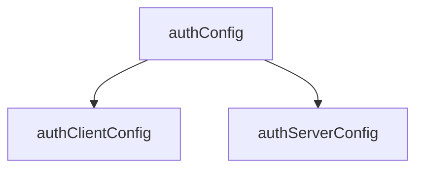
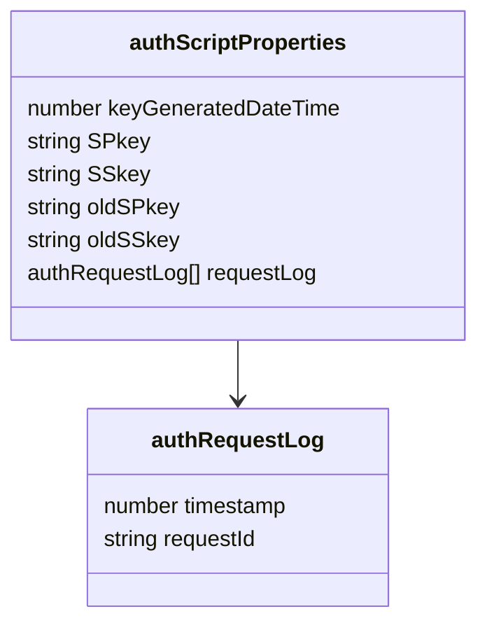
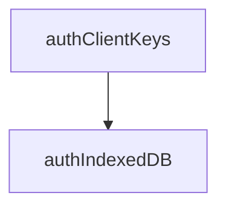

<!--
備忘。ChatGPTから作成提案があったが、時間がかかるので凍結。以下は提案のプロトタイプ
-->

## 第1章. 概要

- ドキュメントの目的
	- 各クラス・データ型の定義を一覧化し、仕様の整合性を確保すること。
- ファイル構成方針
	- 状態遷移(stateTransition.md)などの補助文書との参照関係も記載。
- データ型命名規約
	- 例：auth* = 認証系, Member* = メンバ管理系, Local* = クライアント内通信系 など。
- 依存関係図(Mermaid UMLで可視化)


<!--
## 第2章. データ型一覧(索引)

区分	データ型名	概要	出力ファイル
認証共通	authConfig
	認証系共通設定値	authConfig.js
認証クライアント	authClientConfig
	クライアント専用設定	authClientConfig.js
認証サーバ	authServerConfig
	サーバ専用設定	authServerConfig.js
メンバ管理	Member
	メンバの基本情報	Member.js
メンバ管理	MemberDevice
	デバイス情報	MemberDevice.js
メンバ管理	MemberTrial
	パスコード試行情報	MemberTrial.js
メンバ管理	MemberTrialLog
	試行履歴	MemberTrialLog.js
...	...	...	...

※ 実際のテーブルはtypedefオブジェクトから自動生成可能(章冒頭に生成スクリプト記載)
-->

## 第3章. データ型定義

### 3.1 動作環境設定



#### authConfig

<!--::$tmp/authConfig.md::-->

#### authClientConfig

<!--::$tmp/authClientConfig.md::-->

#### authServerConfig

<!--::$tmp/authServerConfig.md::-->

### 3.2 鍵ペア他の格納



#### authScriptProperties

<!--::$tmp/authScriptProperties.md::-->

#### authRequestLog

<!--::$tmp/authRequestLog.md::-->



#### authIndexedDB

<!--::$tmp/authIndexedDB.md::-->

#### authClientKeys

<!--::$tmp/authClientKeys.md::-->

### 3.3 通信・暗号化

```mermaid
<!--::$src/common/sequence.summary.mmd::-->
```

#### LocalRequest

<!--::$tmp/LocalRequest.md::-->

#### authRequest

<!--::$tmp/authRequest.md::-->

#### encryptedRequest

<!--::$tmp/encryptedRequest.md::-->

#### decryptedRequest

<!--::$tmp/decryptedRequest.md::-->

#### authResponse

<!--::$tmp/authResponse.md::-->

#### encryptedResponse

<!--::$tmp/encryptedResponse.md::-->

#### decryptedResponse

<!--::$tmp/decryptedResponse.md::-->

#### LocalResponse

<!--::$tmp/LocalResponse.md::-->

### 3.4 メンバ管理

```mermaid
<!--::$src/Member/Member.classDiagram.mmd::-->
```

#### Member

<!--::$tmp/Member.md::-->

#### MemberDevice

<!--::$tmp/MemberDevice.md::-->

#### MemberLog

<!--::$tmp/MemberLog.md::-->

#### MemberProfile

<!--::$tmp/MemberProfile.md::-->

#### MemberTrial

<!--::$tmp/MemberTrial.md::-->

#### MemberTrialLog

<!--::$tmp/MemberTrialLog.md::-->

### 3.5 監査・エラーログ

#### authAuditLog

<!--::$tmp/authAuditLog.md::-->

#### authErrorLog

<!--::$tmp/authErrorLog.md::-->

<a name="stateTransition"></a>

## 第4章. メンバの状態と遷移

<!--::$src/Member/stateTransition.md::-->

<!--
4.1 メンバ状態遷移(Member.status)

状態一覧：未加入 → 未審査 → 審査済 → 加入中 → 加入禁止

トリガーイベント：register(), approve(), deny(), expire()

対応クラス：Member, MemberLog

4.2 デバイス状態遷移(MemberDevice.status)

状態一覧：未認証 → 認証中 → 試行中 → 凍結中

トリガーイベント：loginRequest, loginSuccess, loginFailure, unfreezeLogin

## 第5章. 参照関係と依存構造

型間参照を一覧表で整理(自動抽出推奨)

呼び出し元	参照先	関係
Member	MemberProfile	JSON文字列で保持
Member	MemberDevice[]	デバイス配列
MemberDevice	MemberTrial[]	ログイン試行履歴
MemberTrial	MemberTrialLog[]	試行履歴(子配列)
authServerConfig	MemberTrial	最大保持数制御
第6章. 補足仕様

キー生成ポリシー

各種キー(SPkey, CPkey, CSkey)の生成・更新条件

時刻管理

UNIX時刻／ISO8601変換ルール

クライアント・サーバ時差許容(allowableTimeDifference)

セキュリティ制約

StackTraceの非出力ルール

RequestId重複拒否(authRequestLog)

第7章. 生成スクリプト仕様

typedef.js の仕様

入力: typedefオブジェクト

出力: <name>.md, <name>.js

引数例: node typedef.js -o:./docs/types

Markdown出力仕様

項目定義表の列構成と表記ルール

JSDoc出力仕様

@typedef / @prop の出力形式

既定値付きプロパティの書式

第8章. 変更履歴
日付	改訂	対応内容
2025-10-18	0.9	初版構成案
2025-10-19	1.0	MemberTrial/MemberTrialLog追加
2025-10-20	1.1	stateTransition分離

-->
