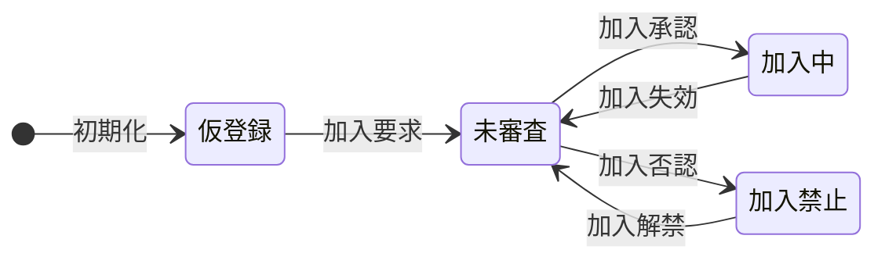
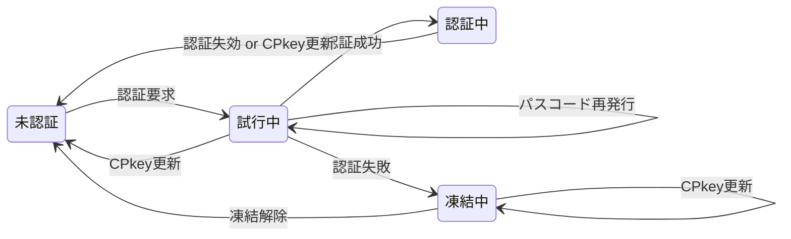

メンバ・デバイスの状態管理

<!--

[I/O項目対応](#io) | [メンバ状態遷移](#member) | [初回ロード](#onLoad) | [初回要求](#onRequest) | [デバイス状態遷移](#device) | [事前処理](#preparation) | [認証中](#login) | [未認証](#unauthenticated) | [試行中](#tring) | [内発処理](#internalProcessing)

-->

## メンバの状態遷移

| No | 状態 | 説明 |
| --: | :-- | :-- |
| 1 | 仮登録 | シートに仮のmemberId(UUID)/メンバ名("dummy"固定)が登録され、権限不要な関数のみ実行可能な状態 |
| 2 | 未審査 | シートに正しいmemberId(メアド)/メンバ名(氏名)が登録されているが、管理者からの加入認否が未定で権限不要な関数のみ実行可能な状態 |
| 3 | 加入中 | 管理者により加入が承認された状態。権限不要な関数に加え、ログイン後は付与された範囲内の要権限サーバ側関数も実行可。 加入有効期間経過により、自動的に「未審査」状態に移行する |
| 4 | 加入禁止 | 管理者により加入が否認された状態。権限不要な関数のみ実行可能 加入禁止期間経過により、自動的に「未審査」状態に移行する |

状態決定ロジック

| ①シート | ②memberId | ③加入禁止 | ④未審査 | **メンバ状態** |
| :-- | :-- | :-- | :-- | :-- |
| 未登録 | — | — | — | (未使用) |
| 登録済 | UUID | — | — | **仮登録** |
| 登録済 | e-mail | 該当 | — | **加入禁止** |
| 登録済 | e-mail | 非該当 | 該当 | **未審査** |
| 登録済 | e-mail | 非該当 | 非該当 | **加入中** |

※下表内の変数名はMemberLogのメンバ名

- ①シート：memberListシートに登録されているか
- ②memberId：メンバ識別子(文字列)の形式
- ③加入禁止：加入禁止されている 
  `0 < denial && Date.now() <= unfreezeDenial`
- ④未審査：管理者の認否が未決定 
  `approval === 0 && denial === 0`

## デバイスの状態遷移

メンバが加入承認後、使用するデバイスの状態遷移

※ 上述の未使用から加入まではメンバ単位の状態遷移。マルチデバイス対応のため、認証状態はデバイス単位で管理。

| No | 状態 | 説明 |
| --: | :-- | :-- |
| 1 | 未認証 | 未認証(未ログイン)で権限が必要な処理は行えない状態 |
| 2 | 試行中 | パスコードによる認証を試行している状態 |
| 3 | 認証中 | 認証が通り(ログイン)、権限の範囲内で要権限サーバ側関数も使用できる状態 |
| 4 | 凍結中 | 規定の試行回数連続して認証に失敗し、再認証要求が禁止された状態 |

状態決定ロジック

| ⑤認証中 | ⑥凍結中 | ⑦未認証 | デバイス状態 |
| :-- | :-- | :-- | :-- |
| 該当 | — | — | **認証中** |
| 非該当 | 該当 | — | **凍結中** |
| 非該当 | 非該当 | 該当 | **未認証** |
| 非該当 | 非該当 | 非該当 | **試行中** |

※下表内の変数名はMemberLogのメンバ名

- ⑤認証中：パスコード認証に成功し認証有効期間内 
  `0 < approval && Date.now() ≦ loginExpiration`
- ⑥凍結中：凍結期間内 
  `0 < approval && 0 < loginFailure && loginFailure < Date.now() && Date.now() <= unfreezeLogin`
- ⑦未認証：加入承認後認証要求されたことが無い 
  `0 < approval && loginRequest === 0`

## 状態別処理分岐

### authClient

| No | SPkey | func | as戻り値 | 後続処理 | 再帰func | ac戻り値 |
| --: | :-- | :-- | :-- | :-- | :-- | :-- |
| 1 | 不保持 | — | ⭕SPkey配布 | SPkey格納 | サーバ関数名 | 再帰呼出先の戻り値 |
| 2 |  |  | ❌CPkey重複 | — | — | ❌CPkey重複 |
| 3 | 保持 | ::updateCPkey:: | ⭕CPkey更新 | CPkey置換 | サーバ関数名 | 再帰呼出先の戻り値 |
| 4 |  | ::passcode:: | ⭕一致 | — | サーバ関数名 | 再帰呼出先の戻り値 |
| 5 |  |  | 🔺要再試行 | PC入力ダイアログ | ::passcode:: | 再帰呼出先の戻り値 |
| 6 |  |  |  |  | ::reissue:: | 再帰呼出先の戻り値 |
| 7 |  |  | ❌凍結中 | — | — | ❌凍結中 |
| 8 |  | ::reissue:: | ⭕再発行 | PC入力ダイアログ | ::passcode:: | 再帰呼出先の戻り値 |
| 9 |  |  |  |  | ::reissue:: | 再帰呼出先の戻り値 |
| 10 |  | サーバ関数名 | ❌メンバ未登録 | — | — | ❌メンバ未登録 |
| 11 |  |  | ❌デバイス未登録 | — | — | ❌デバイス未登録 |
| 12 |  |  | ❌CPkey未登録 | — | — | ❌CPkey未登録 |
| 13 |  |  | ❌加入禁止 | — | — | ❌加入禁止 |
| 14 |  |  | ❌仮登録 | — | — | ❌仮登録 |
| 15 |  |  | ❌未審査 | — | — | ❌未審査 |
| 16 |  |  | ❌凍結中 | — | — | ❌凍結中 |
| 17 |  |  | ⭕処理結果 | — | — | ⭕処理結果 |
| 18 |  |  | 🔺要CPkey更新 | CPkey更新 | ::updateCPkey:: | 再帰呼出先の戻り値 |
| 19 |  |  | ⭕通知メール送信 | PC入力ダイアログ | ::passcode:: | 再帰呼出先の戻り値 |
| 20 |  |  |  |  | ::reissue:: | 再帰呼出先の戻り値 |

### authServer

<table id="x60243bbc-4b2b-4684-8e5e-8881e8d705a4">
  <tr class="r1">
    <th class="c1">No</th>
    <th class="c2">受信データ</th>
    <th class="c3" title="memberId(e-mail)">mID</th>
    <th class="c4" title="deviceId(UUIDv4)">dID</th>
    <th class="c5">CP</th>
    <th class="c6">メンバ</th>
    <th class="c7">デバイス</th>
    <th class="c8">func</th>
    <th class="c9">処理内容</th>
    <th class="c10">戻り値</th>
  </tr>
  <tr class="r2">
    <td class="c1">--:</td>
    <td class="c2">:--</td>
    <td class="c3">:--</td>
    <td class="c4">:--</td>
    <td class="c5">:--</td>
    <td class="c6">:--</td>
    <td class="c7">:--</td>
    <td class="c8">:--</td>
    <td class="c9">:--</td>
    <td class="c10">:--</td>
  </tr>
  <tr class="r3">
    <td class="c1">1</td>
    <td class="c2" rowspan="2">平文</td>
    <td class="c3" rowspan="2">—</td>
    <td class="c4" rowspan="2">—</td>
    <td class="c5" rowspan="2">—</td>
    <td class="c6" rowspan="2">—</td>
    <td class="c7" rowspan="2">—</td>
    <td class="c8" rowspan="2">—</td>
    <td class="c9" rowspan="2">仮登録処理</td>
    <td class="c10">⭕SPkey配布</td>
  </tr>
  <tr class="r4">
    <td class="c1">2</td>
    <td class="c10">❌CPkey重複</td>
  </tr>
  <tr class="r5">
    <td class="c1">3</td>
    <td class="c2" rowspan="21">暗号文</td>
    <td class="c3">不在</td>
    <td class="c4">—</td>
    <td class="c5">—</td>
    <td class="c6">—</td>
    <td class="c7">—</td>
    <td class="c8">—</td>
    <td class="c9">—</td>
    <td class="c10">❌メンバ未登録</td>
  </tr>
  <tr class="r6">
    <td class="c1">4</td>
    <td class="c3" rowspan="20">存在</td>
    <td class="c4">不在</td>
    <td class="c5">—</td>
    <td class="c6">—</td>
    <td class="c7">—</td>
    <td class="c8">—</td>
    <td class="c9">—</td>
    <td class="c10">❌デバイス未登録</td>
  </tr>
  <tr class="r7">
    <td class="c1">5</td>
    <td class="c4" rowspan="19">存在</td>
    <td class="c5">不在</td>
    <td class="c6">—</td>
    <td class="c7">—</td>
    <td class="c8">—</td>
    <td class="c9">—</td>
    <td class="c10">❌CPkey未登録</td>
  </tr>
  <tr class="r8">
    <td class="c1">6</td>
    <td class="c5" rowspan="2">旧版</td>
    <td class="c6" rowspan="2">—</td>
    <td class="c7" rowspan="2">—</td>
    <td class="c8">::updateCPkey::</td>
    <td class="c9">CPkey更新</td>
    <td class="c10">⭕CPkey更新</td>
  </tr>
  <tr class="r9">
    <td class="c1">7</td>
    <td class="c8">上記以外</td>
    <td class="c9">—</td>
    <td class="c10">🔺要CPkey更新</td>
  </tr>
  <tr class="r10">
    <td class="c1">8</td>
    <td class="c5" rowspan="16">存在</td>
    <td class="c6" rowspan="2">加入禁止</td>
    <td class="c7" rowspan="2">—</td>
    <td class="c8" rowspan="2">—</td>
    <td class="c9" rowspan="2">限定処理</td>
    <td class="c10">⭕処理結果</td>
  </tr>
  <tr class="r11">
    <td class="c1">9</td>
    <td class="c10">❌加入禁止</td>
  </tr>
  <tr class="r12">
    <td class="c1">10</td>
    <td class="c6" rowspan="2">仮登録</td>
    <td class="c7" rowspan="2">—</td>
    <td class="c8" rowspan="2">—</td>
    <td class="c9" rowspan="2">限定処理</td>
    <td class="c10">⭕処理結果</td>
  </tr>
  <tr class="r13">
    <td class="c1">11</td>
    <td class="c10">❌仮登録</td>
  </tr>
  <tr class="r14">
    <td class="c1">12</td>
    <td class="c6" rowspan="2">未審査</td>
    <td class="c7" rowspan="2">—</td>
    <td class="c8" rowspan="2">—</td>
    <td class="c9" rowspan="2">限定処理</td>
    <td class="c10">⭕処理結果</td>
  </tr>
  <tr class="r15">
    <td class="c1">13</td>
    <td class="c10">❌未審査</td>
  </tr>
  <tr class="r16">
    <td class="c1">14</td>
    <td class="c6" rowspan="10">加入中</td>
    <td class="c7" rowspan="2">凍結中</td>
    <td class="c8" rowspan="2">—</td>
    <td class="c9" rowspan="2">限定処理</td>
    <td class="c10">⭕処理結果</td>
  </tr>
  <tr class="r17">
    <td class="c1">15</td>
    <td class="c10">❌凍結中</td>
  </tr>
  <tr class="r18">
    <td class="c1">16</td>
    <td class="c7" rowspan="6">試行中</td>
    <td class="c8" rowspan="3">::passcode::</td>
    <td class="c9" rowspan="3">パスコード検証</td>
    <td class="c10">⭕一致</td>
  </tr>
  <tr class="r19">
    <td class="c1">17</td>
    <td class="c10">🔺要再試行</td>
  </tr>
  <tr class="r20">
    <td class="c1">18</td>
    <td class="c10">❌凍結中</td>
  </tr>
  <tr class="r21">
    <td class="c1">19</td>
    <td class="c8">::reissue::</td>
    <td class="c9">パスコード再発行</td>
    <td class="c10">⭕再発行</td>
  </tr>
  <tr class="r22">
    <td class="c1">20</td>
    <td class="c8" rowspan="4">サーバ関数名</td>
    <td class="c9" rowspan="2">限定処理</td>
    <td class="c10">⭕処理結果</td>
  </tr>
  <tr class="r23">
    <td class="c1">21</td>
    <td class="c10">❌凍結中</td>
  </tr>
  <tr class="r24">
    <td class="c1">22</td>
    <td class="c7">未認証</td>
    <td class="c9">試行開始処理</td>
    <td class="c10">⭕通知メール送信</td>
  </tr>
  <tr class="r25">
    <td class="c1">23</td>
    <td class="c7">認証中</td>
    <td class="c9">通常処理</td>
    <td class="c10">⭕処理結果</td>
  </tr>
</table>

### 例：CPkey失効時の処理手順
