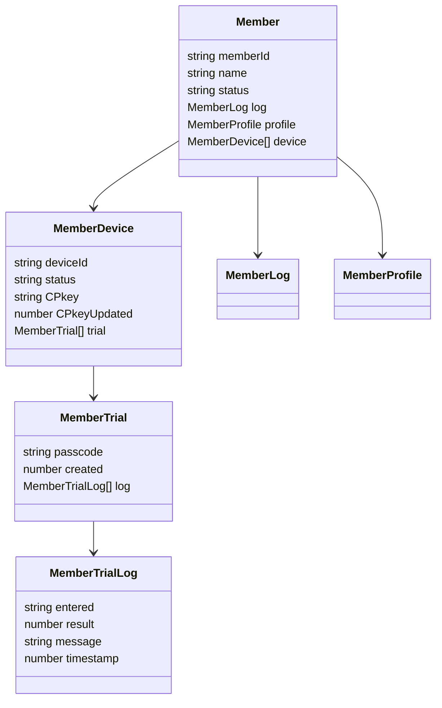

# Member クラス 仕様書

## 🧭 概è¦

- 'Member'ã¯Google SpreadSheet上ã§ãƒ¡ãƒ³ãƒ(アカウント)情報・状態を一元的ã«ç®¡ç†ã™ã‚‹ãŸã‚ã®ã‚¯ãƒ©ã‚¹ã§ã™ã€‚
- 加入・ログイン・パスコード試行・デãƒã‚¤ã‚¹åˆ¥å…¬é–‹éµ(CPkey)管ç†ãªã©ã®çŠ¶æ…‹ã‚’統一的ã«æ‰±ã„ã¾ã™ã€‚
- ãƒãƒ«ãƒãƒ‡ãƒã‚¤ã‚¹åˆ©ç”¨ã‚’å‰æã¨ã—ã€memberListスプレッドシートã®1行を1メンãƒã¨ã—ã¦ç®¡ç†ã—ã¾ã™ã€‚
- 日時ã¯å…¨ã¦UNIX時刻(numberå‹)。比較も全ã¦ãƒŸãƒªç§’å˜ä½ã§è¡Œã†

## 🧩 内部構æˆ(クラス変数)


```mermaid
classDiagram
  class Member {
    string memberId
    string name
    string status
    MemberLog log
    MemberProfile profile
    MemberDevice[] device
  }

  class MemberDevice {
    string deviceId
    string status
    string CPkey
    number CPkeyUpdated
    MemberTrial[] trial
  }

  class MemberTrial {
    string passcode
    number created
    MemberTrialLog[] log
  }

  class MemberTrialLog {
    string entered
    number result
    string message
    number timestamp
  }

  Member --> MemberLog
  Member --> MemberProfile
  Member --> MemberDevice
  MemberDevice --> MemberTrial
  MemberTrial --> MemberTrialLog
```

### Member

<!--::$tmp/Member.md::-->

### MemberLog

<!--::$tmp/MemberLog.md::-->

### MemberProfile

<!--::$tmp/MemberProfile.md::-->

### MemberDevice

<!--::$tmp/MemberDevice.md::-->

### MemberTrial

<!--::$tmp/MemberTrial.md::-->

### MemberTrialLog

<!--::$tmp/MemberTrialLog.md::-->

## 🧱 constructor()

- 引数ã¯`authServerConfig`
- `authServerConfig.memberList`シートãŒå­˜åœ¨ã—ãªã‘ã‚Œã°ã‚·ãƒ¼ãƒˆã‚’æ–°è¦ä½œæˆ
  - é …ç›®åã¯Memberクラスã®ãƒ¡ãƒ³ãƒå
  - å„é …ç›®ã®ã€Œèª¬æ˜ã€ã‚’é …ç›®åセルã®ãƒ¡ãƒ¢ã¨ã—ã¦ã‚»ãƒƒãƒˆ

#### authConfig

<!--::$tmp/authConfig.md::-->

#### authServerConfig

<!--::$tmp/authServerConfig.md::-->

## 🧱 getMember()

指定メンãƒãƒ»ãƒ‡ãƒã‚¤ã‚¹æƒ…報をmemberListシートã‹ã‚‰å–å¾—

```js
/**
 * @param {string} memberId
 * @param {string} [deviceId]
 * @returns {Member}
 */
```

- 指定ã•ã‚ŒãŸmemberIdã®ã‚¤ãƒ³ã‚¹ã‚¿ãƒ³ã‚¹ã‚’è¿”ã™
- JSON文字列ã®é …ç›®ã¯ã‚ªãƒ–ジェクト化(Member.log, Member.profile, Member.device)
- deviceIdã®æŒ‡å®šãŒæœ‰ã£ãŸå ´åˆã€Member.deviceã¯å½“該MemberDeviceã¨ã™ã‚‹

## 🧱 judgeStatus()

- 後述「状態é·ç§»ã€ã«åŸºã¥ãã€å¼•æ•°ã§æŒ‡å®šã•ã‚ŒãŸãƒ¡ãƒ³ãƒãƒ»ãƒ‡ãƒã‚¤ã‚¹ã®çŠ¶æ…‹ã‚’判断
- 事å‰ã«getMemberメソッドã§ã€ãƒ¡ãƒ³ãƒãƒ»ãƒ‡ãƒã‚¤ã‚¹ã¯ç‰¹å®šæ¸ˆã®å‰æ

```js
/**
 * @param {Member} arg
 * @returns {string} Member.deviceãŒç©ºãªã‚‰ãƒ¡ãƒ³ãƒã®ã€ç©ºã§ç„¡ã‘ã‚Œã°ãƒ‡ãƒã‚¤ã‚¹ã®status
 */
```

### 状態é·ç§»

- メンãƒã®çŠ¶æ…‹é·ç§»
- 下表内ã®å¤‰æ•°åã¯`MemberLog`ã®ãƒ¡ãƒ³ãƒå

<!--::$doc/stateTransition.md::-->

状態 | 判定å¼
:-- | :--
未加入 | 加入è¦æ±‚ã‚’ã—ãŸã“ã¨ãŒç„¡ã„ã€ã¾ãŸã¯åŠ å…¥æœŸé™åˆ‡ã‚Œ<br>joiningRequest === 0 || 0 < joiningExpiration && joiningExpiration < Date.now()
加入ç¦æ­¢ | 加入ç¦æ­¢ã•ã‚Œã¦ã„ã‚‹<br>joiningRequest < 0 && Date.now() <= unfreezeDenial
未審査 | 管ç†è€…ã®èªå¦ãŒæœªæ±ºå®š<br>approval === 0 && denial === 0
èªè¨¼ä¸­ | 加入承èªæ¸ˆã‹ã¤èªè¨¼æœ‰åŠ¹æœŸé™å†…<br>0 < approval && Date.now() ≦ loginExpiration
å‡çµä¸­ | 加入承èªæ¸ˆã‹ã¤å‡çµæœŸé–“内<br>0 < approval && loginFailure < Date.now() && Date.now() <= unfreezeLogin
未èªè¨¼ | 加入承èªå¾Œèªè¨¼è¦æ±‚ã•ã‚ŒãŸã“ã¨ãŒç„¡ã„<br>0 < approval && loginRequest === 0
試行中 | 加入承èªæ¸ˆã‹ã¤èªè¨¼è¦æ±‚済(ã‹ã¤èªè¨¼ä¸­ã§ã‚‚å‡çµä¸­ã§ã‚‚ãªã„)<br>0 < approval && 0 < loginRequest

- 上ã‹ã‚‰é †ã«åˆ¤å®šã™ã‚‹(下順ä½ã®çŠ¶æ…‹ã¯ä¸Šé †ä½ã®ä½•ã‚Œã«ã‚‚該当ã—ãªã„)

## 🧱 setMember()

指定メンãƒãƒ»ãƒ‡ãƒã‚¤ã‚¹æƒ…報をmemberListシートã«ä¿å­˜

- arg.deviceãŒé…列ã ã£ãŸå ´åˆ
  - arg.deviceã‚’Memberã«è¨­å®š(Member.device=arg.device)
- arg.deviceãŒé…列ã§ã¯ç„¡ã„å ´åˆ
  - memberList.deviceã«arg.device.deviceIdãŒå­˜åœ¨ã™ã‚‹å ´åˆ<br>
    => memberList.device内ã®device.deviceIdã‚’arg.deviceã§ç½®æ›
  - memberList.deviceã«arg.device.deviceIdãŒå­˜åœ¨ã—ãªã„å ´åˆ<br>
    => memberList.deviceã«arg.deviceを追加
- JSON文字列ã®é …ç›®ã¯æ–‡å­—列化(Member.log, Member.profile, Member.device)

```js
/**
 * @param {Member} arg
 * @returns {null|Error} æˆåŠŸæ™‚ã¯nullã€å¤±æ•—時ã¯Errorオブジェクト
 */
```

<!--
## 🧱 proto()

### 概è¦

### 📤 入力項目

### 📥 出力項目
-->
