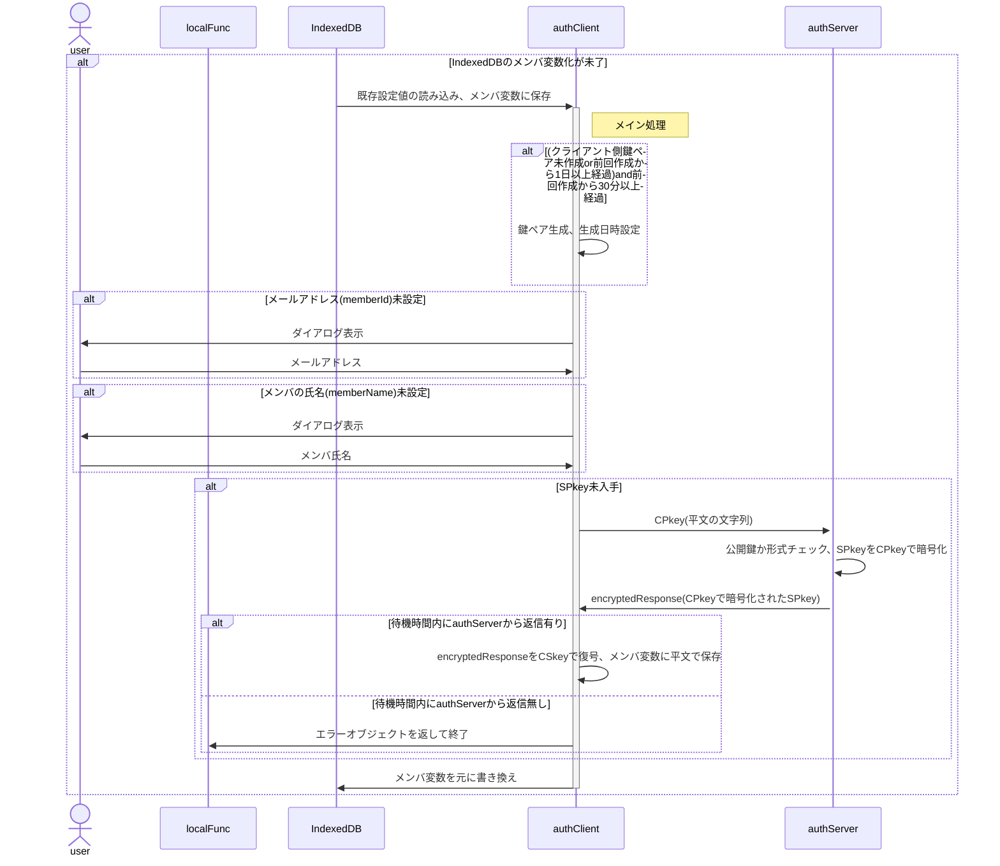

# authClient 関数 仕様書

## 🧭 概要

authClientは、ローカル関数(ブラウザ内JavaScript)からの要求を受け、
サーバ側(authServer)への暗号化通信リクエストを署名・暗号化、
サーバ側処理を経てローカル側に戻された結果を復号・検証し、
処理結果に応じてクライアント側処理を適切に振り分ける中核関数です。

## ■ 設計方針

- クロージャ関数とする

## 🧩 内部構成(クラス変数)

### authIndexedDB

<!--::$tmp/authIndexedDB.md::-->

## 🧱 メイン処理

### 概要

- classのconstructor()に相当
- 引数はauthClient内共有用の変数`pv`に保存
- `cryptoClient.constructor()`で鍵ペアの準備
- IndexedDBからメールアドレスを取得、存在しなければダイアログから入力
- IndexedDBからメンバの氏名を取得、存在しなければダイアログから入力
- deviceId未採番なら採番(UUID)
- SPkey未取得ならサーバ側に要求
- 更新した内容はIndexedDBに書き戻す
- SPkey取得がエラーになった場合、SPkey以外は書き戻す
- サーバ側から一定時間レスポンスが無い場合、`{result:'fatal',message:'No response'}`を返して終了

### 📤 入力項目

#### `authClientConfig`

<!--::$tmp/authClientConfig.md::-->

#### 参考：`authConfig`

<!--::$tmp/authConfig.md::-->

### 📥 出力項目

- 利用可能なメソッドのオブジェクト

## 🧱 exec()メソッド

### 概要

ローカル関数からの要求を受けてauthServerに問合せを行い、返信された処理結果に基づき適宜メソッドを呼び出す

- cryptoClient.encryptを呼び出し、`encryptedRequest`を作成
- authServerへの問合せを終了するまで繰り返し
  - 待機時間内にレスポンスあり
    - レスポンスの復号、署名検証
    - 問合せ結果による分岐
  - 待機時間内にレスポンスなし
    - LocalRequestに`{result:'fatal',message:'No response'}`をセット、呼出元ローカル関数に返して終了

### 問合せ結果による分岐

問合せ結果はメンバの状態により内容が異なる。

<!--::$doc/stateTransition.md::-->

### 📤 入力項目

#### `LocalRequest`

<!--::$tmp/LocalRequest.md::-->

### 📥 出力項目

#### `LocalResponse`

<!--::$tmp/LocalResponse.md::-->

#### 参考：`authResponse`

<!--::$tmp/authResponse.md::-->

## ⏰ メンテナンス処理

## 🔐 セキュリティ仕様

## 🧾 エラーハンドリング仕様
