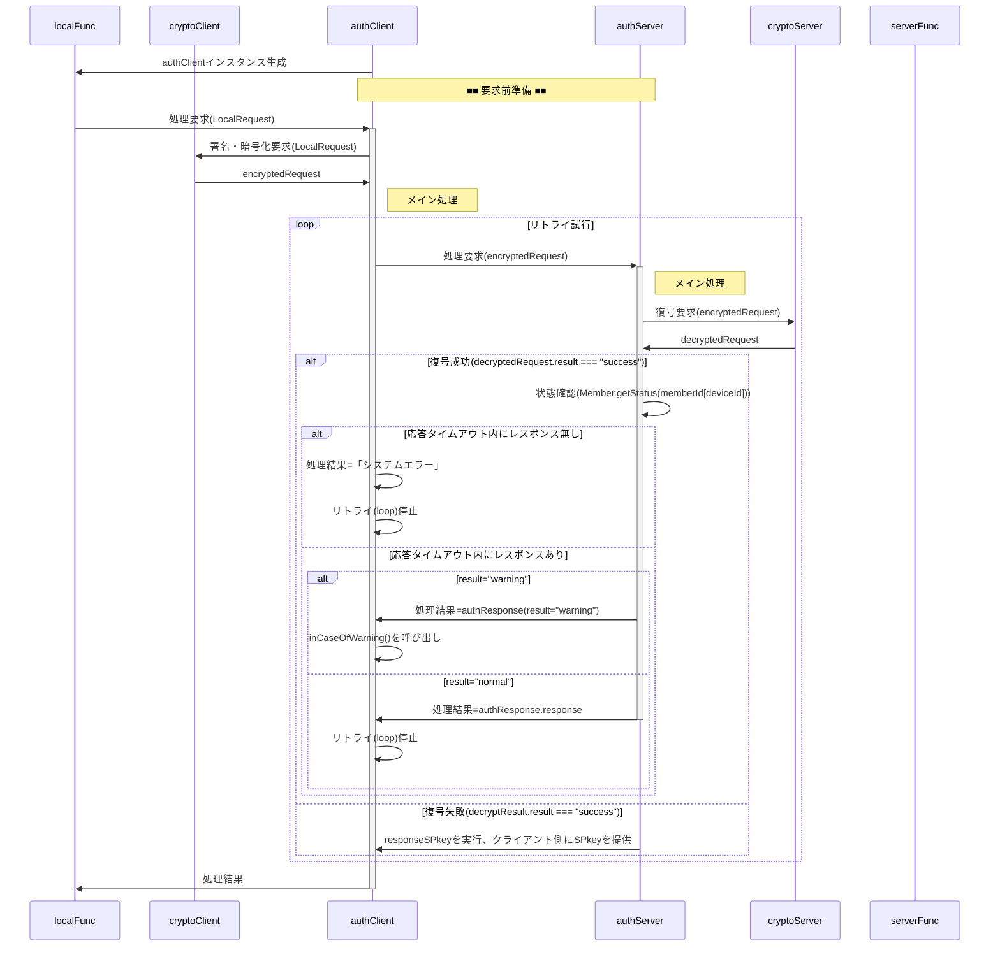

# authServer 関数 仕様書

## 概要

authServerは、クライアント（authClient）からの暗号化通信リクエストを復号・検証し、
メンバ状態と要求内容に応じてサーバ側処理を適切に振り分ける中核関数です。

## メイン処理

■ 入力 : encryptedRequest

<!--::$tmp/encryptedRequest.md::-->

■ 出力 : encryptedResponse

<!--::$tmp/encryptedResponse.md::-->

■ ScriptProperties

<!--::$tmp/authScriptProperties.md::-->

■ `memberList`シート

<!--::$tmp/Member.md::-->

## responseSPkey(arg)
- クライアントから送られた文字列がCPkeyと推定される場合に、SPkeyを暗号化して返却。

## セキュリティ制約

## エラーハンドリング
