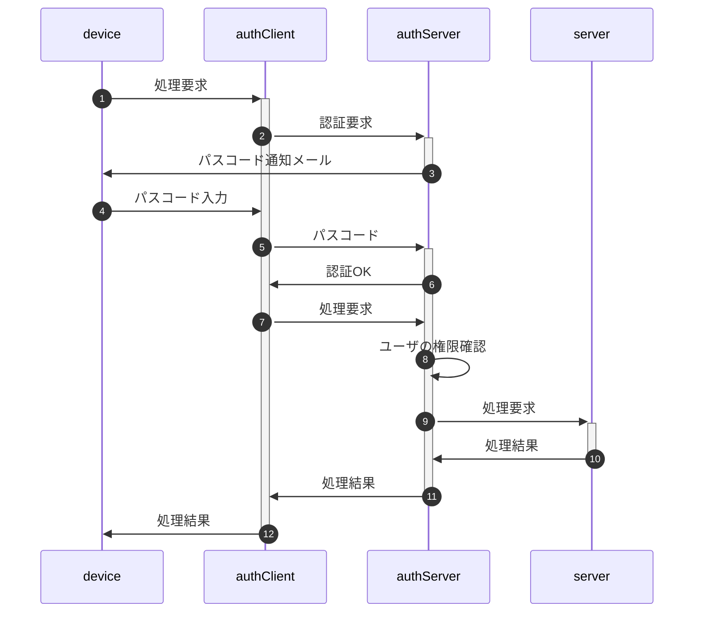
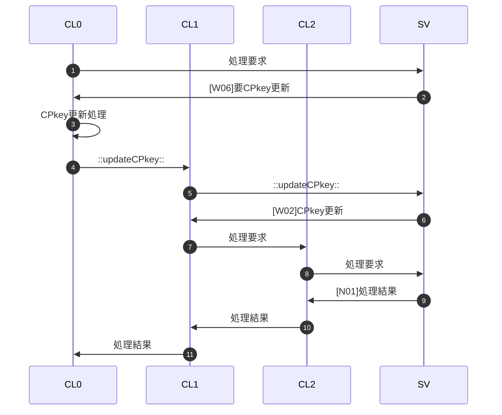
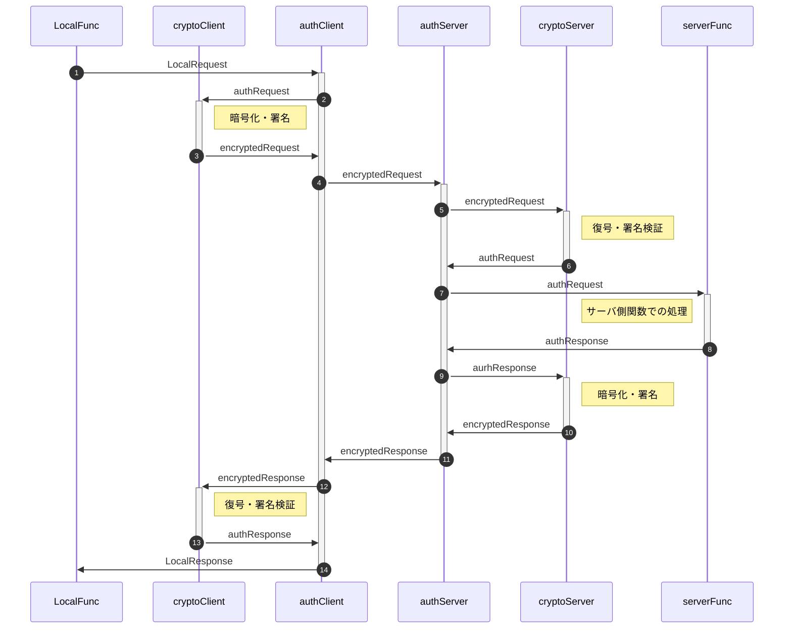

"auth"総説

[要求仕様](#require) | [用語](#dictionary) | [処理手順概要](#protocol) | [通信用データ型](#dataType)

"Auth"とは利用者(メンバ)がブラウザからサーバ側処理要求を発行、サーバ側は二要素認証を行ってメンバの権限を確認の上サーバ側の処理結果を返す、クライアント・サーバにまたがるシステムである。

なおメンバがserverのどの機能を使用可能か(権限)は、管理者が事前にメンバ一覧(Google Spread)上で設定を行う。

# <a href="#top">要求仕様</a>

- 本システムは限られた人数のサークルや小学校のイベント等での利用を想定する。 
  よってセキュリティ上の脅威は極力排除するが、一定水準の安全性・恒久性を確保した上で導入時の容易さ・技術的ハードルの低さ、運用の簡便性を重視する。
- 「セキュリティ上の脅威」として以下を想定、対策する。逆に想定外の攻撃は対策対象としない。
  - 想定する攻撃：盗聴、中間者攻撃、端末紛失、リプレイ、誤設定
  - 想定外の攻撃：高度持続的攻撃（APT）、大規模DoS、root化端末での攻撃、端末・サーバへの物理侵入
- サーバ側(以下authServer)はスプレッドシートのコンテナバインドスクリプト、クライアント側(以下authClient)はHTMLのJavaScript
- サーバ側・クライアント側とも鍵ペアを使用
- サーバ側の動作環境設定・鍵ペアはScriptProperties、クライアント側はIndexedDBに保存
- 原則として通信は受信側公開鍵で暗号化＋発信側秘密鍵で署名
- クライアントの識別(ID)はメールアドレスで行う
- 日時は特段の注記が無い限り、UNIX時刻でミリ秒単位で記録(`new Date().getTime()`)
- [メンバ情報](sv/Member.md#member_members)はスプレッドシートに保存
- 定義したクラスのインスタンス変数は、セキュリティ強度向上のため特段の記述がない限りprivateとする
- 日時は特段の指定が無い限り全てUNIX時刻(number型)。比較も全てミリ秒単位で行う

# <a href="#top">用語</a>

- メンバ、デバイス：「メンバ」とは利用者を、「デバイス」とは利用者が使用する端末を指す。マルチデバイス対応のためメンバ：デバイスは"1:n"対応となる。 
  メンバはメールアドレスで識別し、デバイスはauthClient呼出時に自動設定されるUUIDで識別する。
- SPkey, SSkey：サーバ側の公開鍵(Server side Public key)と秘密鍵(Server side Secret key)
- CPkey, CSkey：クライアント側の公開鍵(Client side Public key)と秘密鍵(Client side Secret key)
- パスフレーズ：クライアント側鍵ペア作成時のキー文字列。JavaScriptで自動的に生成
- パスワード：運用時、クライアント(人間)がブラウザ上で入力する本人確認用の文字列
- パスコード：二段階認証実行時、サーバからクライアントに送られる6桁※の数字 
  ※既定値。実際の桁数はauthConfig.trial.passcodeLengthで規定
- 内発処理：ローカル関数からの要求に基づかない、authClientでの処理の必要上発生するauthServerへの問合せ

# <a href="#top">処理手順概要</a>

authでは概ね以下のような手順でクライアント(ブラウザ)からのサーバ側処理要求に対応する。

1. [CL]ローカル関数からの処理要求受付(authClient.exec)
1. [CL]SPkeyが無ければサーバ側から取得・格納
1. [CL]署名・暗号化を実施、処理要求をauthServerに転送
1. [SV]メンバ・デバイスの状態に応じて処理分岐
1. [CL]サーバ側処理結果を受けて処理分岐
   - 正常終了ならローカル関数に結果を返す
   - 異常終了(fatal)ならエラーメッセージ表示
   - 上記以外の場合
     1. 後続処理を実行(ex.SPkeyの格納)
     1. authClient.execを再帰呼出(ex.処理要求)
     1. 再帰呼出先の結果を戻り値として返す

例としてCPkeyが有効期限切れの場合の手順を示す(CL0~2は再帰呼出されたauthClient.exec)。

## クライアント側処理分岐先決定手順

<!--::$src/doc/decisionTable.client.md::-->

## サーバ側処理分岐先決定手順

<!--::$src/doc/decisionTable.server.md::-->

# <a href="#top">通信用データ型</a>

ローカル関数〜サーバ関数間でのやりとりは、以下のデータ型で行う。

| No | データ型名 | 概要 |
| --: | :-- | :-- |
| 1 | [LocalRequest](common/index.md#LocalRequest) | ローカル関数からの処理要求 |
| 2 | [authRequest](common/index.md#authRequest) | 平文(暗号化前)の処理要求 |
| 3 | [encryptedRequest](common/index.md#encryptedRequest) | 暗号化された処理要求 |
| 4 | [encryptedResponse](common/index.md#encryptedResponse) | 暗号化された処理結果 |
| 5 | [authResponse](common/index.md#authResponse) | 平文(復号後)の処理結果 |
| 6 | [LocalResponse](common/index.md#LocalResponse) | ローカル関数への処理結果 |

## 主要属性

  
No

  
メンバ名

  
データ型

  
説明

  
LocalRequest

  
authRequest

  
encryptedRequest

  
encryptedResponse

  
authResponse

  
LocalResponse

  
1

  
memberId

  
number

  
メンバ識別子(メールアドレス)

  

  
⭕

  
⭕

  
⭕

  
⭕

  

  
2

  
deviceId

  
string

  
デバイス識別子(UUID)

  

  
⭕

  
⭕

  
⭕

  
⭕

  

  
3

  
memberName

  
string

  
メンバの氏名

  

  
⭕

  
⭕

  
⭕

  
⭕

  

  
4

  
CPkey

  
string

  
クライアント側公開鍵

  

  
⭕

  
⭕

  
⭕

  
⭕

  

  
5

  
requestTime

  
number

  
クライアント側の処理要求受付日時

  

  
⭕

  
⭕

  
⭕

  
⭕

  

  
6

  
func

  
string

  
サーバ側関数名

  
⭕

  
⭕

  
⭕

  
⭕

  
⭕

  

  
7

  
arguments

  
any[]

  
サーバ側関数に渡す引数の配列

  
⭕

  
⭕

  
⭕

  
⭕

  
⭕

  

  
8

  
nonce

  
string

  
処理要求のUUID

  

  
⭕

  
⭕

  
⭕

  
⭕

  

  
9

  
SPkey

  
string

  
サーバ側公開鍵

  

  

  

  
⭕

  
⭕

  

  
10

  
response

  
any

  
サーバ側関数の処理結果(戻り値)

  

  

  

  
⭕

  
⭕

  
⭕

  
11

  
receptTime

  
number

  
サーバ側の処理要求受付日時

  

  

  

  
⭕

  
⭕

  

  
12

  
responseTime

  
number

  
処理終了日時

  

  

  

  
⭕

  
⭕

  

  
13

  
status

  
string|authError

  
authServer他、サーバ側Auth処理結果

  

  

  

  
⭕

  
⭕

  
⭕

  
14

  
message

  
string

  
メッセージ(statusの補足)

  

  

  

  
⭕

  
⭕

  

  
15

  
decrypt

  
string

  
クライアント側での復号結果

  

  

  

  
⭕

  
⭕

  

- `status`は「アプリケーションステータス」であり HTTP レスポンスとは無関係