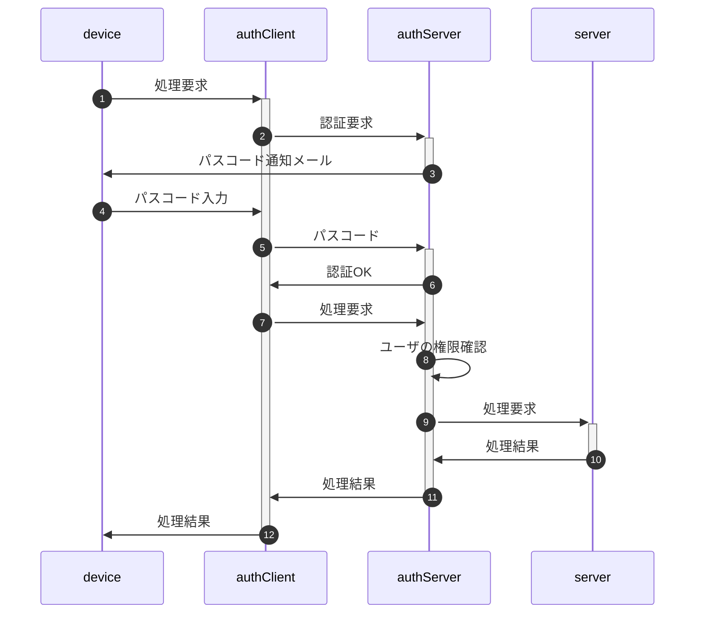

"auth"総説

[要求仕様](#require) | [用語](#dictionary) | [実装方針](#policy)

"Auth"とは利用者(メンバ)がブラウザからサーバ側処理要求を発行、サーバ側は二要素認証を行ってメンバの権限を確認の上サーバ側の処理結果を返す、クライアント・サーバにまたがるシステムである。

なおメンバがserverのどの機能を使用可能か(権限)は、管理者が事前にメンバ一覧(Google Spread)上で設定を行う。

# <a href="#top">要求仕様</a>

- 本システムは限られた人数のサークルや小学校のイベント等での利用を想定する。 
  よってセキュリティ上の脅威は極力排除するが、一定水準の安全性・恒久性を確保した上で導入時の容易さ・技術的ハードルの低さ、運用の簡便性を重視する。
- 「セキュリティ上の脅威」として以下を想定、対策する。逆に想定外の攻撃は対策対象としない。
  - 想定する攻撃：盗聴、中間者攻撃、端末紛失、リプレイ、誤設定
  - 想定外の攻撃：高度持続的攻撃（APT）、大規模DoS、root化端末での攻撃、端末・サーバへの物理侵入
- サーバ側(以下authServer)はスプレッドシートのコンテナバインドスクリプト、クライアント側(以下authClient)はHTMLのJavaScript
- サーバ側・クライアント側とも鍵ペアを使用
- サーバ側の動作環境設定・鍵ペアはScriptProperties、クライアント側はIndexedDBに保存
- 原則として通信は受信側公開鍵で暗号化＋発信側秘密鍵で署名
- クライアントの識別(ID)はメールアドレスで行う
- 日時は特段の注記が無い限り、UNIX時刻でミリ秒単位で記録(`new Date().getTime()`)
- [メンバ情報](sv/Member.md#member_members)はスプレッドシートに保存
- 定義したクラスのインスタンス変数は、セキュリティ強度向上のため特段の記述がない限りprivateとする
- 日時は特段の指定が無い限り全てUNIX時刻(number型)。比較も全てミリ秒単位で行う

# <a href="#top">用語</a>

- メンバ、デバイス：「メンバ」とは利用者を、「デバイス」とは利用者が使用する端末を指す。マルチデバイス対応のためメンバ：デバイスは"1:n"対応となる。 
  メンバはメールアドレスで識別し、デバイスはauthClient呼出時に自動設定されるUUIDで識別する。
- SPkey, SSkey：サーバ側の公開鍵(Server side Public key)と秘密鍵(Server side Secret key)
- CPkey, CSkey：クライアント側の公開鍵(Client side Public key)と秘密鍵(Client side Secret key)
- パスフレーズ：クライアント側鍵ペア作成時のキー文字列。JavaScriptで自動的に生成
- パスワード：運用時、クライアント(人間)がブラウザ上で入力する本人確認用の文字列
- パスコード：二段階認証実行時、サーバからクライアントに送られる6桁※の数字 
  ※既定値。実際の桁数はauthConfig.trial.passcodeLengthで規定
- 内発処理：ローカル関数からの要求に基づかない、authClientでの処理の必要上発生するauthServerへの問合せ
