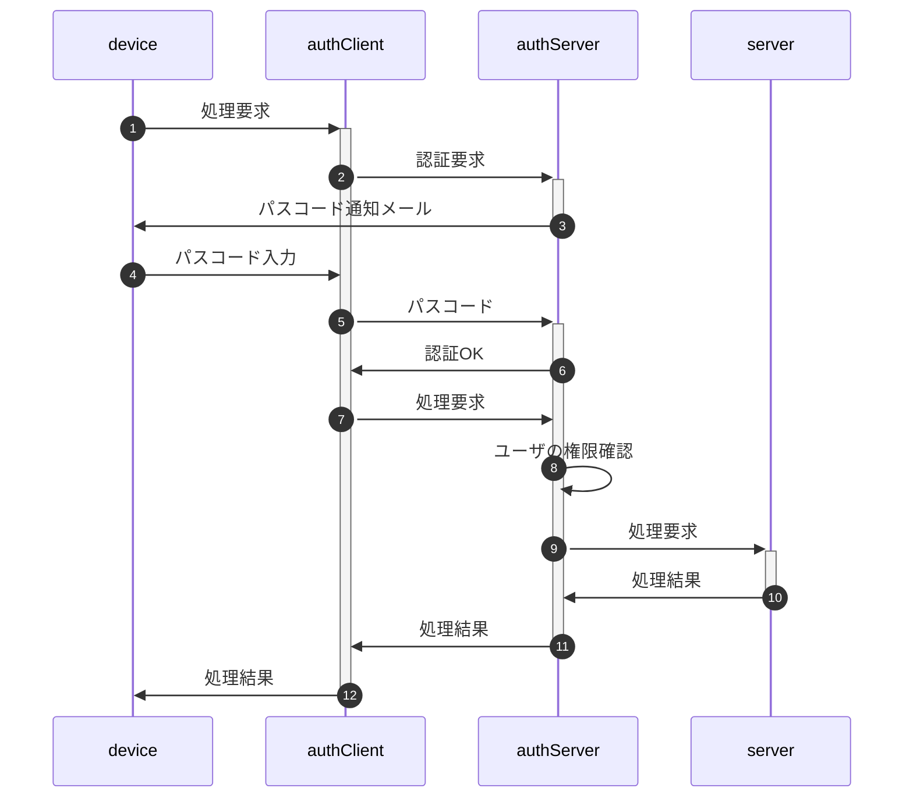
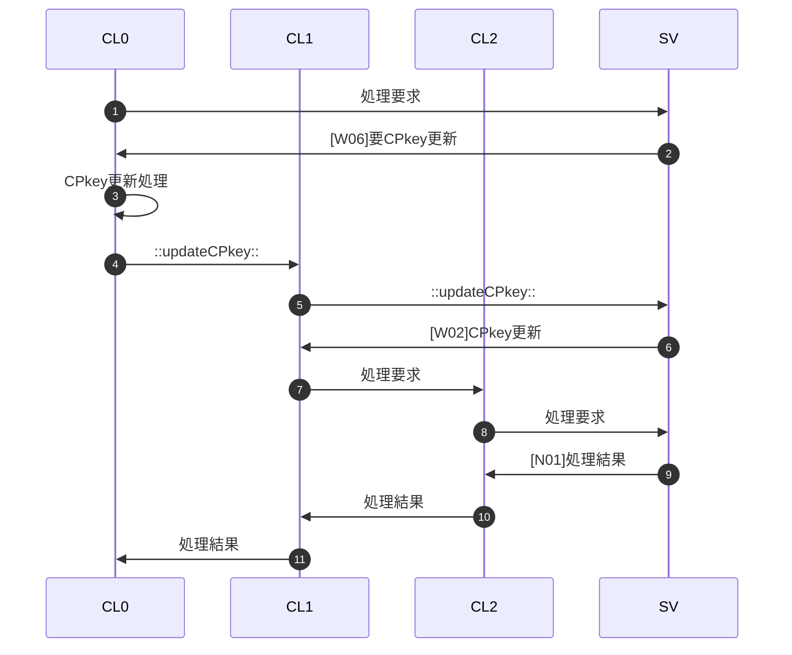
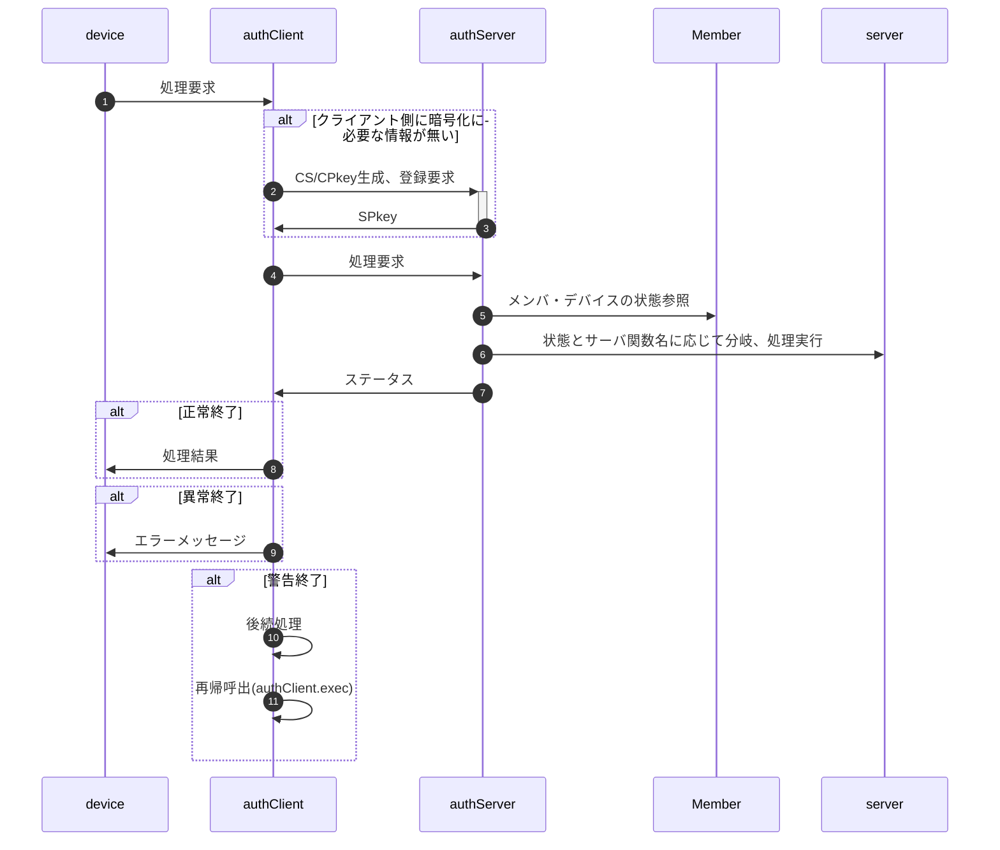

"auth"総説

[要求仕様](#require) | [用語](#dictionary) | [処理手順概要](#protocol)

"Auth"とは利用者(メンバ)がブラウザからサーバ側処理要求を発行、サーバ側は二要素認証を行ってメンバの権限を確認の上サーバ側の処理結果を返す、クライアント・サーバにまたがるシステムである。

なおメンバがserverのどの機能を使用可能か(権限)は、管理者が事前にメンバ一覧(Google Spread)上で設定を行う。

## <a href="#top">要求仕様</a>

- 本システムは限られた人数のサークルや小学校のイベント等での利用を想定する。 
  よってセキュリティ上の脅威は極力排除するが、一定水準の安全性・恒久性を確保した上で導入時の容易さ・技術的ハードルの低さ、運用の簡便性を重視する。
- 「セキュリティ上の脅威」として以下を想定、対策する。逆に想定外の攻撃は対策対象としない。
  - 想定する攻撃：盗聴、中間者攻撃、端末紛失、リプレイ、誤設定
  - 想定外の攻撃：高度持続的攻撃（APT）、大規模DoS、root化端末での攻撃、端末・サーバへの物理侵入
- サーバ側(以下authServer)はスプレッドシートのコンテナバインドスクリプト、クライアント側(以下authClient)はHTMLのJavaScript
- サーバ側・クライアント側とも鍵ペアを使用
- サーバ側の動作環境設定・鍵ペアはScriptProperties、クライアント側はIndexedDBに保存
- 原則として通信は受信側公開鍵で暗号化＋発信側秘密鍵で署名
- クライアントの識別(ID)はメールアドレスで行う
- 日時は特段の注記が無い限り、UNIX時刻でミリ秒単位で記録(`new Date().getTime()`)
- [メンバ情報](sv/Member.md#member_members)はスプレッドシートに保存
- 定義したクラスのインスタンス変数は、セキュリティ強度向上のため特段の記述がない限りprivateとする
- 日時は特段の指定が無い限り全てUNIX時刻(number型)。比較も全てミリ秒単位で行う

## <a href="#top">用語</a>

- メンバ、デバイス：「メンバ」とは利用者を、「デバイス」とは利用者が使用する端末を指す。マルチデバイス対応のためメンバ：デバイスは"1:n"対応となる。 
  メンバはメールアドレスで識別し、デバイスはauthClient呼出時に自動設定されるUUIDで識別する。
- SPkey, SSkey：サーバ側の公開鍵(Server side Public key)と秘密鍵(Server side Secret key)
- CPkey, CSkey：クライアント側の公開鍵(Client side Public key)と秘密鍵(Client side Secret key)
- パスフレーズ：クライアント側鍵ペア作成時のキー文字列。JavaScriptで自動的に生成
- パスワード：運用時、クライアント(人間)がブラウザ上で入力する本人確認用の文字列
- パスコード：二段階認証実行時、サーバからクライアントに送られる6桁※の数字 
  ※既定値。実際の桁数はauthConfig.trial.passcodeLengthで規定
- 内発処理：ローカル関数からの要求に基づかない、authClientでの処理の必要上発生するauthServerへの問合せ

## <a href="#top">処理手順概要</a>

authでは概ね以下のような手順でクライアント(ブラウザ)からのサーバ側処理要求に対応する。

1. [CL]ローカル関数からの処理要求受付(authClient.exec)
1. [CL]SPkeyが無ければサーバ側から取得・格納
1. [CL]処理要求をauthServerに転送
1. [SV]メンバ・デバイスの状態に応じて処理
1. [CL]サーバ側処理結果を受けて処理分岐
   - 正常終了ならローカル関数に結果を返す
   - 異常終了(fatal)ならエラーメッセージ表示
   - 上記以外の場合
     1. 後続処理を実行(ex.SPkeyの格納)
     1. authClient.execを再帰呼出(ex.処理要求)
     1. 再帰呼出先の結果を戻り値として返す

例としてCPkeyが有効期限切れの場合の手順を示す(CL0~2は再帰呼出されたauthClient.exec)。

<!--

-->

### authClient

| No | SPkey | func | as戻り値 | 後続処理 | 再帰func | ac戻り値 |
| --: | :-- | :-- | :-- | :-- | :-- | :-- |
| 1 | 不保持 | — | ⭕SPkey配布 | SPkey格納 | サーバ関数名 | 再帰呼出先の戻り値 |
| 2 |  |  | ❌CPkey重複 | — | — | ❌CPkey重複 |
| 3 | 保持 | ::updateCPkey:: | ⭕CPkey更新 | CPkey置換 | サーバ関数名 | 再帰呼出先の戻り値 |
| 4 |  | ::passcode:: | ⭕一致 | — | サーバ関数名 | 再帰呼出先の戻り値 |
| 5 |  |  | 🔺要再試行 | PC入力ダイアログ | ::passcode:: | 再帰呼出先の戻り値 |
| 6 |  |  |  |  | ::reissue:: | 再帰呼出先の戻り値 |
| 7 |  |  | ❌凍結中 | — | — | ❌凍結中 |
| 8 |  | ::reissue:: | ⭕再発行 | PC入力ダイアログ | ::passcode:: | 再帰呼出先の戻り値 |
| 9 |  |  |  |  | ::reissue:: | 再帰呼出先の戻り値 |
| 10 |  | サーバ関数名 | ❌メンバ未登録 | — | — | ❌メンバ未登録 |
| 11 |  |  | ❌デバイス未登録 | — | — | ❌デバイス未登録 |
| 12 |  |  | ❌CPkey未登録 | — | — | ❌CPkey未登録 |
| 13 |  |  | ❌加入禁止 | — | — | ❌加入禁止 |
| 14 |  |  | ❌仮登録 | — | — | ❌仮登録 |
| 15 |  |  | ❌未審査 | — | — | ❌未審査 |
| 16 |  |  | ❌凍結中 | — | — | ❌凍結中 |
| 17 |  |  | ⭕処理結果 | — | — | ⭕処理結果 |
| 18 |  |  | 🔺要CPkey更新 | CPkey更新 | ::updateCPkey:: | 再帰呼出先の戻り値 |
| 19 |  |  | ⭕通知メール送信 | PC入力ダイアログ | ::passcode:: | 再帰呼出先の戻り値 |
| 20 |  |  |  |  | ::reissue:: | 再帰呼出先の戻り値 |

### authServer

<table id="x60243bbc-4b2b-4684-8e5e-8881e8d705a4">
  <tr class="r1">
    <th class="c1">No</th>
    <th class="c2">受信データ</th>
    <th class="c3" title="memberId(e-mail)">mID</th>
    <th class="c4" title="deviceId(UUIDv4)">dID</th>
    <th class="c5">CP</th>
    <th class="c6">メンバ</th>
    <th class="c7">デバイス</th>
    <th class="c8">func</th>
    <th class="c9">処理内容</th>
    <th class="c10">戻り値</th>
  </tr>
  <tr class="r2">
    <td class="c1">--:</td>
    <td class="c2">:--</td>
    <td class="c3">:--</td>
    <td class="c4">:--</td>
    <td class="c5">:--</td>
    <td class="c6">:--</td>
    <td class="c7">:--</td>
    <td class="c8">:--</td>
    <td class="c9">:--</td>
    <td class="c10">:--</td>
  </tr>
  <tr class="r3">
    <td class="c1">1</td>
    <td class="c2" rowspan="2">平文</td>
    <td class="c3" rowspan="2">—</td>
    <td class="c4" rowspan="2">—</td>
    <td class="c5" rowspan="2">—</td>
    <td class="c6" rowspan="2">—</td>
    <td class="c7" rowspan="2">—</td>
    <td class="c8" rowspan="2">—</td>
    <td class="c9" rowspan="2">仮登録処理</td>
    <td class="c10">⭕SPkey配布</td>
  </tr>
  <tr class="r4">
    <td class="c1">2</td>
    <td class="c10">❌CPkey重複</td>
  </tr>
  <tr class="r5">
    <td class="c1">3</td>
    <td class="c2" rowspan="21">暗号文</td>
    <td class="c3">不在</td>
    <td class="c4">—</td>
    <td class="c5">—</td>
    <td class="c6">—</td>
    <td class="c7">—</td>
    <td class="c8">—</td>
    <td class="c9">—</td>
    <td class="c10">❌メンバ未登録</td>
  </tr>
  <tr class="r6">
    <td class="c1">4</td>
    <td class="c3" rowspan="20">存在</td>
    <td class="c4">不在</td>
    <td class="c5">—</td>
    <td class="c6">—</td>
    <td class="c7">—</td>
    <td class="c8">—</td>
    <td class="c9">—</td>
    <td class="c10">❌デバイス未登録</td>
  </tr>
  <tr class="r7">
    <td class="c1">5</td>
    <td class="c4" rowspan="19">存在</td>
    <td class="c5">不在</td>
    <td class="c6">—</td>
    <td class="c7">—</td>
    <td class="c8">—</td>
    <td class="c9">—</td>
    <td class="c10">❌CPkey未登録</td>
  </tr>
  <tr class="r8">
    <td class="c1">6</td>
    <td class="c5" rowspan="2">旧版</td>
    <td class="c6" rowspan="2">—</td>
    <td class="c7" rowspan="2">—</td>
    <td class="c8">::updateCPkey::</td>
    <td class="c9">CPkey更新</td>
    <td class="c10">⭕CPkey更新</td>
  </tr>
  <tr class="r9">
    <td class="c1">7</td>
    <td class="c8">上記以外</td>
    <td class="c9">—</td>
    <td class="c10">🔺要CPkey更新</td>
  </tr>
  <tr class="r10">
    <td class="c1">8</td>
    <td class="c5" rowspan="16">存在</td>
    <td class="c6" rowspan="2">加入禁止</td>
    <td class="c7" rowspan="2">—</td>
    <td class="c8" rowspan="2">—</td>
    <td class="c9" rowspan="2">限定処理</td>
    <td class="c10">⭕処理結果</td>
  </tr>
  <tr class="r11">
    <td class="c1">9</td>
    <td class="c10">❌加入禁止</td>
  </tr>
  <tr class="r12">
    <td class="c1">10</td>
    <td class="c6" rowspan="2">仮登録</td>
    <td class="c7" rowspan="2">—</td>
    <td class="c8" rowspan="2">—</td>
    <td class="c9" rowspan="2">限定処理</td>
    <td class="c10">⭕処理結果</td>
  </tr>
  <tr class="r13">
    <td class="c1">11</td>
    <td class="c10">❌仮登録</td>
  </tr>
  <tr class="r14">
    <td class="c1">12</td>
    <td class="c6" rowspan="2">未審査</td>
    <td class="c7" rowspan="2">—</td>
    <td class="c8" rowspan="2">—</td>
    <td class="c9" rowspan="2">限定処理</td>
    <td class="c10">⭕処理結果</td>
  </tr>
  <tr class="r15">
    <td class="c1">13</td>
    <td class="c10">❌未審査</td>
  </tr>
  <tr class="r16">
    <td class="c1">14</td>
    <td class="c6" rowspan="10">加入中</td>
    <td class="c7" rowspan="2">凍結中</td>
    <td class="c8" rowspan="2">—</td>
    <td class="c9" rowspan="2">限定処理</td>
    <td class="c10">⭕処理結果</td>
  </tr>
  <tr class="r17">
    <td class="c1">15</td>
    <td class="c10">❌凍結中</td>
  </tr>
  <tr class="r18">
    <td class="c1">16</td>
    <td class="c7" rowspan="6">試行中</td>
    <td class="c8" rowspan="3">::passcode::</td>
    <td class="c9" rowspan="3">パスコード検証</td>
    <td class="c10">⭕一致</td>
  </tr>
  <tr class="r19">
    <td class="c1">17</td>
    <td class="c10">🔺要再試行</td>
  </tr>
  <tr class="r20">
    <td class="c1">18</td>
    <td class="c10">❌凍結中</td>
  </tr>
  <tr class="r21">
    <td class="c1">19</td>
    <td class="c8">::reissue::</td>
    <td class="c9">パスコード再発行</td>
    <td class="c10">⭕再発行</td>
  </tr>
  <tr class="r22">
    <td class="c1">20</td>
    <td class="c8" rowspan="4">サーバ関数名</td>
    <td class="c9" rowspan="2">限定処理</td>
    <td class="c10">⭕処理結果</td>
  </tr>
  <tr class="r23">
    <td class="c1">21</td>
    <td class="c10">❌凍結中</td>
  </tr>
  <tr class="r24">
    <td class="c1">22</td>
    <td class="c7">未認証</td>
    <td class="c9">試行開始処理</td>
    <td class="c10">⭕通知メール送信</td>
  </tr>
  <tr class="r25">
    <td class="c1">23</td>
    <td class="c7">認証中</td>
    <td class="c9">通常処理</td>
    <td class="c10">⭕処理結果</td>
  </tr>
</table>

### 例：CPkey失効時の処理手順

