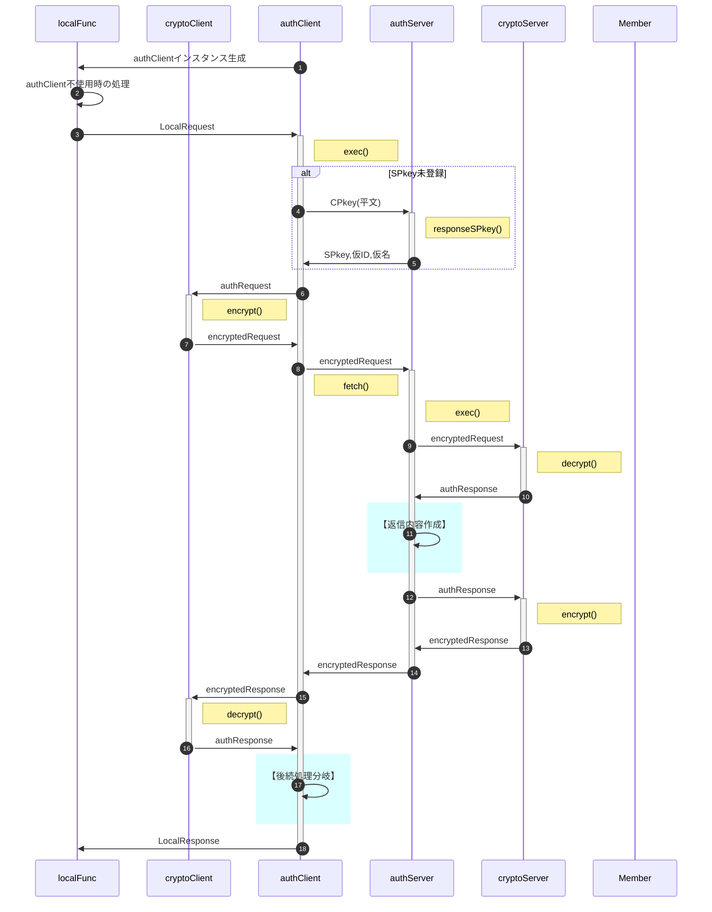
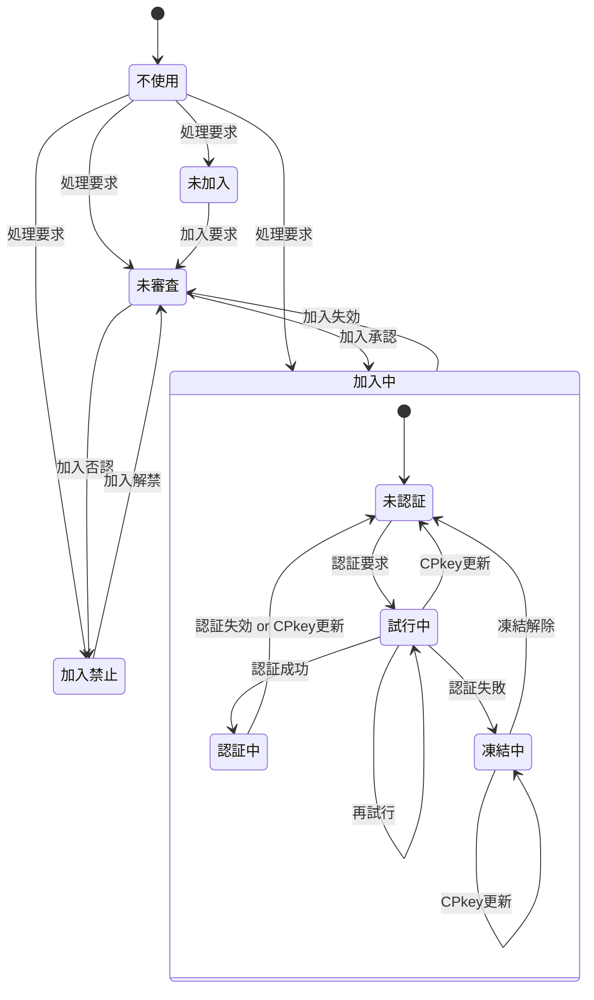

<style>
  .submenu {
    text-align: right;
    font-size: 0.8rem;
  }
</style>

# <span id="top">"auth"総説</span>

<div class="submenu">

[要求仕様](#require) | [用語](#dictionary) | [通信手順](#protocol) | [暗号化・署名方式](#crypto) | [状態遷移](#status) | [実装方針](#policy)

</div>

利用者(メンバ)がブラウザ(クライアント)からサーバ側処理要求を発行、二要素認証を行ってメンバの権限を確認の上、サーバ側の処理結果を返す。

メンバの権限については管理者が事前にメンバ一覧(Google Spread)上で認否を行う。

## <span id="require"><a href="#top">要求仕様</a></span>

- 本システムは限られた人数のサークルや小学校のイベント等での利用を想定する。<br>
  よってセキュリティ上の脅威は極力排除するが、一定水準の安全性・恒久性を確保した上で導入時の容易さ・技術的ハードルの低さ、運用の簡便性を重視する。
- サーバ側(以下authServer)はスプレッドシートのコンテナバインドスクリプト、クライアント側(以下authClient)はHTMLのJavaScript
- サーバ側・クライアント側とも鍵ペアを使用
- サーバ側の動作環境設定・鍵ペアはScriptProperties、クライアント側はIndexedDBに保存
- 原則として通信は受信側公開鍵で暗号化＋発信側秘密鍵で署名
- クライアントの識別(ID)はメールアドレスで行う
- 日時は特段の注記が無い限り、UNIX時刻でミリ秒単位で記録(`new Date().getTime()`)
- [メンバ情報](sv/Member.md#member_members)はスプレッドシートに保存
- 定義したクラスのインスタンス変数は、セキュリティ強度向上のため特段の記述がない限りprivateとする
- 日時は特段の指定が無い限り全てUNIX時刻(number型)。比較も全てミリ秒単位で行う

## <span id="dictionary"><a href="#top">用語</a></span>

- SPkey, SSkey：サーバ側の公開鍵(Server side Public key)と秘密鍵(Server side Secret key)
- CPkey, CSkey：クライアント側の公開鍵(Client side Public key)と秘密鍵(Client side Secret key)
- パスフレーズ：クライアント側鍵ペア作成時のキー文字列。JavaScriptで自動的に生成
- パスワード：運用時、クライアント(人間)がブラウザ上で入力する本人確認用の文字列
- パスコード：二段階認証実行時、サーバからクライアントに送られる6桁※の数字<br>
  ※既定値。実際の桁数はauthConfig.trial.passcodeLengthで規定
- 内発処理：ローカル関数からの要求に基づかない、authClientでの処理の必要上発生するauthServerへの問合せ

## <span id="protocol"><a href="#top">クライアント・サーバ間の通信手順</a></span>

- 以下は正常系のみ記載
- `localFunc`とは、クライアント側(ブラウザ)内で動作するJavaScriptの関数



- ①：onLoad時、authClientインスタンス生成
- ②：サーバ側との通信が不要な処理(メンバの状態は「不使用」)
- ③：サーバ側との通信が必要になった場合、処理要求を発行
- ④：【環境構築】として`authClient.setupEnvironment`を実行、SPkey入手等を行う<br>
  詳細はauthClient.[setupEnvironment](authClient.md#setupenvironment)参照
- ⑤：`authClient.exec`でauthRequest型オブジェクトに変換
- ⑥：`cryptoClient.fetch`内部でencryptメソッドを呼び出し、暗号化＋署名
- ⑦：`cryptoServer.decrypt`で署名検証＋復号
- ⑨：要求者(メンバ)の状態をシートから取得
- ⑪：【返信内容作成】メンバの状態を判断、適宜サーバ側関数の呼び出し<br>

### I/O項目対応表

| LocalRequest | encryptedRequest | authRequest | authAuditLog | authErrorLog | authResponse |
| :-- | :-- | :-- | :-- | :-- | :-- |
|  | memberId | memberId | memberId | memberId | memberId |
|  | deviceId | deviceId | deviceId | deviceId | deviceId |
|  | CPkey | CPkey |  |  | CPkey |
|  | requestTime | requestTime |  |  | requestTime |
| func | func | func | func | func | func |
| arguments | arguments | arguments | arguments | arguments | arguments |
|  | requestId | requestId |  |  | requestId |
|  |  | SPkey |  |  | SPkey |
|  |  | response |  |  | response |
|  |  | receptTime | receptTime | receptTime | receptTime |
|  |  | responseTime |  |  | responseTime |
|  |  | status | status |  |  |
|  |  |  |  | errorType |  |
|  |  |  |  | caller |  |
|  |  |  |  | step |  |
|  |  |  |  | variable |  |
|  |  |  |  | message |  |
|  |  |  |  | stack |  |
|  |  |  | elaps | elaps |  |

| No | メンバ名 | 説明 |
| --: | :-- | :-- |
| 1 | memberId | {number} - メンバ識別子。0〜999はシステムで予約 |
| 2 | deviceId | {string} - デバイス識別子(UUID) |
| 3 | CPkey | {string} - クライアント側公開鍵 |
| 4 | requestTime | {number} - クライアント側の処理要求受付日時 |
| 5 | func | {string} - サーバ側関数名 |
| 6 | arguments | {any[]} - サーバ側関数に渡す引数の配列 |
| 7 | requestId | {string} - 処理要求のUUID |
| 8 | SPkey | {string} - サーバ側公開鍵 |
| 9 | response | {any} - サーバ側関数の処理結果。Errorオブジェクトを含む |
| 10 | receptTime | {number} - サーバ側の処理要求受付日時 |
| 11 | responseTime | {number} - 処理終了日時。authErrorの場合エラー発生日時 |
| 12 | status | {string|authError} - 正常終了時は"success"(文字列)、警告終了の場合はエラーメッセージ、致命的エラーの場合はauthErrorオブジェクト |
| 13 | errorType | {string} - エラーの型(ex."ReferenceError") |
| 14 | function | {string} - エラーが起きたクラス・メソッド名 |
| 15 | step | {string} - エラーが起きたメソッド内の位置を示す文字列 |
| 16 | variable | {string} - エラー時のメソッド内汎用変数(JSON文字列) |
| 17 | message | {string} - エラーメッセージ |
| 18 | stack | {string} - エラー時のスタックトレース |
| 19 | elaps | {number} - 所要時間(ミリ秒) |


<!-- 2025/11/09 I/O変更前
sequenceDiagram
  autonumber
  %%actor user
  participant localFunc
  %%participant clientMail
  %%participant IndexedDB
  participant authClient
  participant cryptoClient
  participant authServer
  participant cryptoServer
  participant Member
  %%participant serverFunc
  %%actor admin

  %% インスタンス生成時処理：authClientConfig読み込み、IndexedDB読み込み、pvへの保存
  authClient->>localFunc: authClientインスタンス生成

  localFunc->>localFunc: authClient不使用時の処理
  localFunc->>+authClient: LocalRequest
  Note right of authClient: exec()

  %% 環境構築(SPkey要求)
  rect rgba(218, 255, 255, 1)
    authClient->>authClient: 【環境構築】
  end

  %% 処理要求
  authClient->>+cryptoClient: authRequest
  Note right of cryptoClient: fetch()

  cryptoClient->>+authServer: encryptedRequest

  authServer->>+cryptoServer: encryptedRequest
  Note right of cryptoServer: decrypt()
  cryptoServer->>-authServer: decryptedRequest

  authServer->>+Member: authRequest
  Note right of Member: getMember()
  Member->>-authServer: Member

  rect rgba(218, 255, 255, 1)
    authServer->>authServer: 【返信内容作成】
  end

  authServer->>+cryptoServer: authResponse
  Note right of cryptoServer: encrypt()
  cryptoServer->>-authServer: encryptedResponse

  authServer->>-cryptoClient: encryptedResponse
  cryptoClient->>-authClient: authResponse

  rect rgba(218, 255, 255, 1)
    authClient->>authClient: 【後続処理分岐】
  end

  %% 新規登録要求
  %% パスコード入力
  %% パスコード再発行

  authClient->>-localFunc: LocalResopnse
-->

## <span id="crypto"><a href="#top">暗号化・署名方式</a></span>

- 署名方式 : RSA-PSS
- 暗号化方式 : RSA-OAEP
- ハッシュ関数 : SHA-256以上
- 許容時差±120秒※以内
  ※既定値。実際の桁数はauthConfig.cryptoServer.[allowableTimeDifference](sv/authServerConfig.md#authserverconfig_members)で規定
- 順序は「暗号化->署名」ではなく「署名->暗号化」で行う
  1. クライアントがデータをJSON化
  2. 自身の秘密鍵で署名(署名→暗号化)
  3. サーバの公開鍵で暗号化
  4. サーバは復号後、クライアント公開鍵(CPkey)で署名を検証
- パスワードの生成は「ライブラリ > createPassword」を使用
- パスコードのメール送信は「ライブラリ > [sendMail](JSLib.md#sendmail)」を使用
- CPkeyの有効期限が切れた場合、以下の手順で更新する
  1. クライアント側から古いCPkeyで署名された要求を受信
  2. サーバ側で署名検証の結果、期限切れを確認
    - memberList.trial[0].CPkeyUpdateUntilに「現在日時＋[loginLifeTime](authServerConfig.md#authserverconfig_members)」をセット
    - クライアント側に通知
  3. クライアント側でCPkeyを更新、新CPkeyで再度リクエスト
  4. サーバ側で[loginLifeTime](authServerConfig.md#authserverconfig_members)を確認、期限内ならmemberList.CPkeyを書き換え。期限切れなら加入処理同様、adminによる個別承認を必要とする。
  5. 以降は未ログイン状態で要求が来た場合として処理を継続

## <span id="status"><a href="#top">メンバの状態遷移</a></span>



#### <span id="member_policy_statelist">状態一覧</span>

| No | 状態 | 説明 | SPkey | CPkey | memberId/メンバ名 | 無権限関数 | 要権限関数 |
| --: | :-- | :-- | :-- | :-- | :-- | :-- | :-- |
| 1 | 不使用 | Auth不使用のコンテンツのみ表示 | 未取得 | 未生成(※1) | 未登録(※1) | 実行不可 | 実行不可 |
| 2 | 未加入 | memberListにUUIDのmemberId/メンバ名で仮登録 | 取得済 | 生成済 | 仮登録(UUID) | 実行可 | 実行不可 |
| 3 | 未審査 | memberListに本来のmemberId/メンバ名で登録済だが管理者による加入認否が未決定 | 取得済 | 生成済 | 本登録 | 実行可 | 実行不可 |
| 4 | 加入中 | 管理者により加入が承認された状態 | 取得済 | 生成済 | 本登録 | 実行可 | 実行不可 |
| 4.1 | 未認証 | 未認証(未ログイン)で権限が必要な処理は行えない状態 | 取得済 | 生成済 | 本登録 | 実行可 | 実行不可 |
| 4.2 | 試行中 | パスコードによる認証を試行している状態 | 取得済 | 生成済 | 本登録 | 実行可 | 実行不可 |
| 4.3 | 認証中 | 認証が通り、ログインして認証が必要な処理も行える状態 | 取得済 | 生成済 | 本登録 | 実行可 | 実行可 |
| 4.4 | 凍結中 | 規定の試行回数連続して認証に失敗し、再認証要求が禁止された状態 | 取得済 | 生成済 | 本登録 | 実行可 | 実行不可 |
| 5 | 加入禁止 | 管理者により加入が否認された状態 | 取得済 | 生成済 | 本登録 | 実行可 | 実行不可 |

#### <span id="member_policy_decisiontable">状態決定表</span>

| ①シート | ②memberId | ③加入禁止 | ④未審査 | **メンバ状態** | ⑤認証中 | ⑥凍結中 | ⑦未認証 | **デバイス状態** |
| :-- | :-- | :-- | :-- | :-- | :-- | :-- | :-- | :-- |
| 未登録 | — | — | — | **不使用** |  |  |  |  |
| 登録済 | UUID | — | — | **未加入** |  |  |  |  |
| 登録済 | e-mail | 該当 | — | **加入禁止** |  |  |  |  |
| 登録済 | e-mail | 非該当 | 該当 | **未審査** |  |  |  |  |
| 登録済 | e-mail | 非該当 | 非該当 | **加入中** | 該当 | — | — | **認証中** |
|  |  |  |  | **加入中** | 非該当 | 該当 | — | **凍結中** |
|  |  |  |  | **加入中** | 非該当 | 非該当 | 該当 | **未認証** |
|  |  |  |  | **加入中** | 非該当 | 非該当 | 非該当 | **試行中** |

※下表内の変数名はMemberLogのメンバ名

- ①シート：memberListシートに登録されているか
- ②memberId：メンバ識別子(文字列)の形式
- ③加入禁止：加入禁止されている<br>
  `0 < denial && Date.now() <= unfreezeDenial`
- ④未審査：管理者の認否が未決定<br>
  `approval === 0 && denial === 0`
- ⑤認証中：パスコード認証に成功し認証有効期間内<br>
  `0 < approval && Date.now() ≦ loginExpiration`
- ⑥凍結中：凍結期間内<br>
  `0 < approval && 0 < loginFailure && loginFailure < Date.now() && Date.now() <= unfreezeLogin`
- ⑦未認証：加入承認後認証要求されたことが無い<br>
  `0 < approval && loginRequest === 0`

## <span id="policy"><a href="#top">実装方針</a></span>

- サーバ・クライアント共に進捗・エラー管理に[devTools](JSLib.md#devtools)を使用
- 関数・メソッドは原則として`try 〜 catch`で囲み、予期せぬエラーが発生した場合はErrorオブジェクトを返す。<br>
  以下は各メソッドのプロトタイプ("pv"はインスタンス変数)
  ```js
  function prototype(arg) {
    const v = {whois:`${pv.whois}.prototype`, arg:{arg}, rv:null};
    dev.start(v);
    try {

      // -------------------------------------------------------------
      dev.step(1); // 引数の存否確認、データ型チェック ＋ ワークの準備
      // -------------------------------------------------------------

      dev.end(); // 終了処理
      return v.rv;

    } catch (e) { return dev.error(e); }
  }
  ```