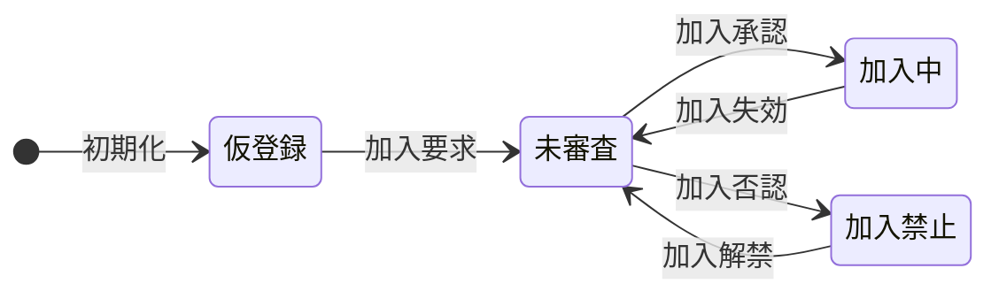
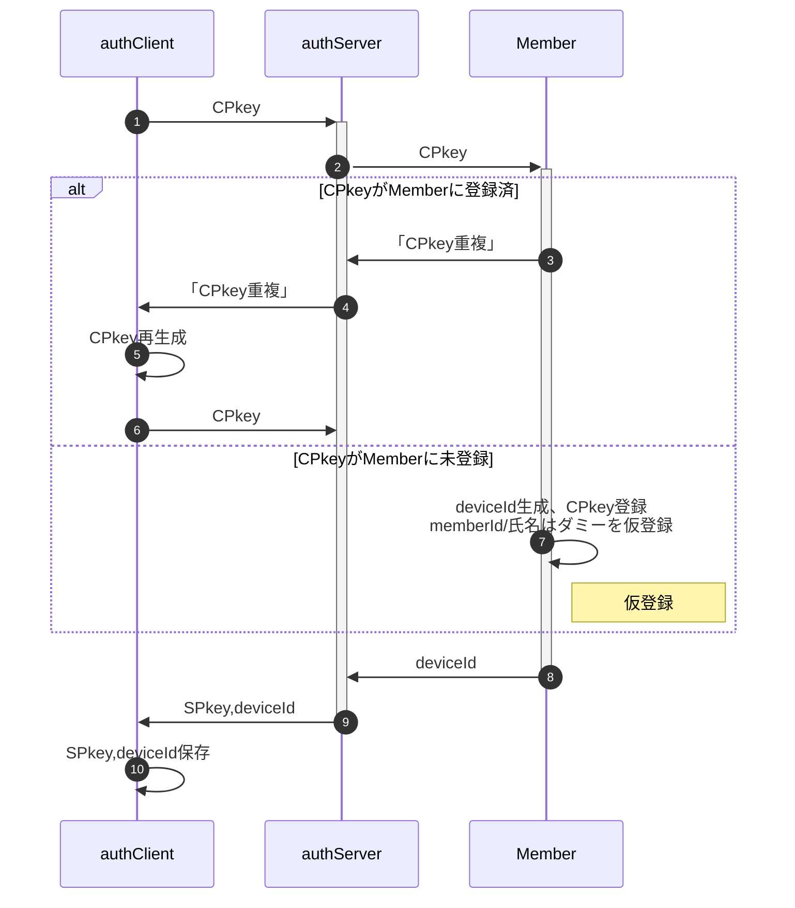
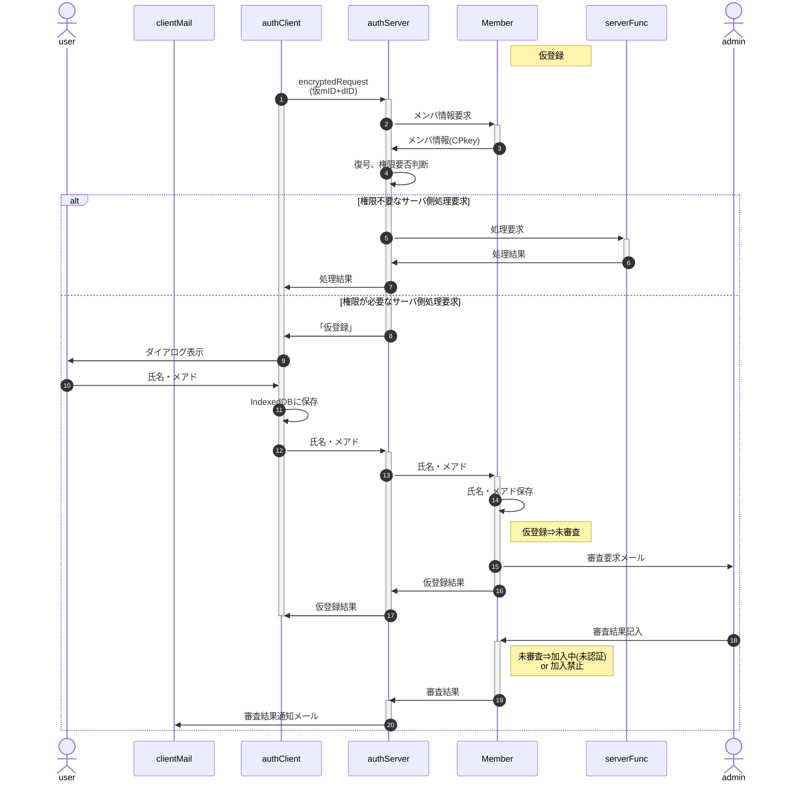
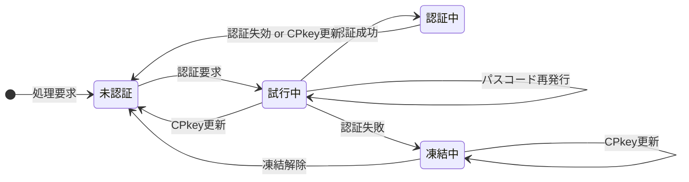
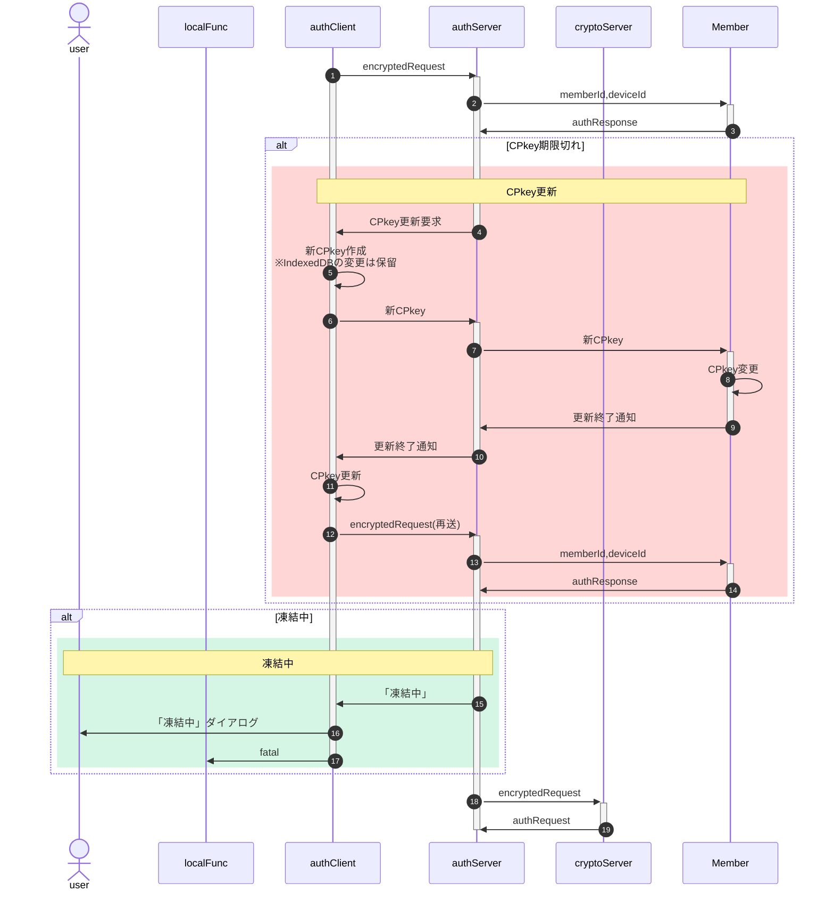
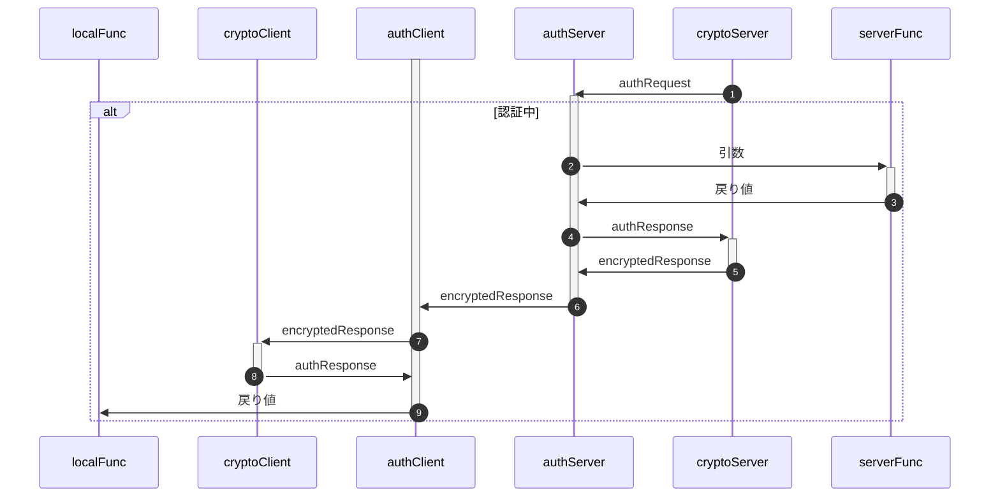
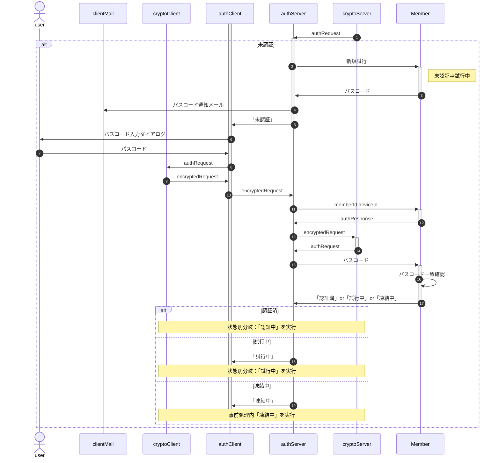
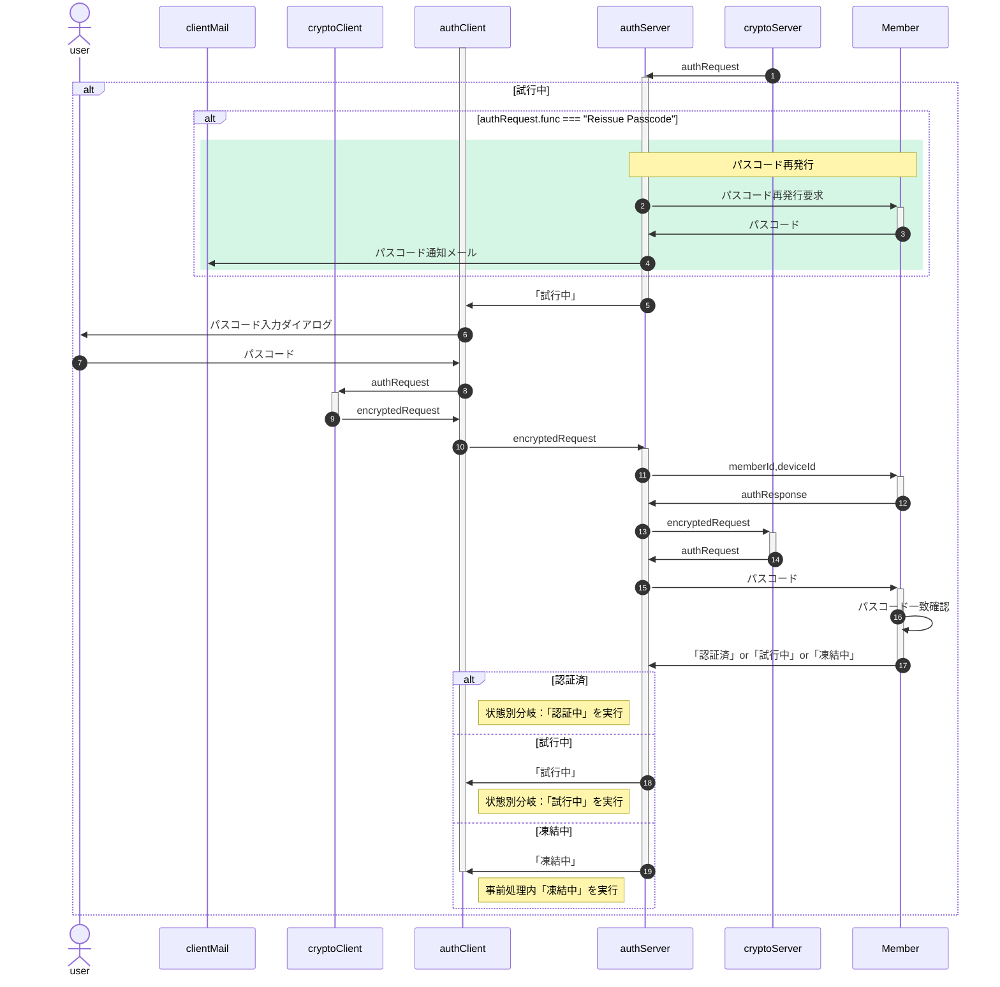

<style>
  .submenu {
    text-align: right;
    font-size: 0.8rem;
  }
  .nowrap td {white-space:nowrap;} /* 横長な表を横スクロール */
  .nowrap b {background:yellow;}

  .popup {color:#084} /* titleに文字列を設定した項目 */
</style>

# <span id="top">"auth"総説</span>

<div class="submenu">

[要求仕様](#require) | [用語](#dictionary) | [暗号化・署名方式](#crypto) | [実装方針](#policy) | [状態及び通信手順](#protocol)

</div>

"Auth"とは利用者(メンバ)がブラウザからサーバ側処理要求を発行、サーバ側は二要素認証を行ってメンバの権限を確認の上サーバ側の処理結果を返す、クライアント・サーバにまたがるシステムである。

メンバの権限については管理者が事前にメンバ一覧(Google Spread)上で認否を行う。

## <span id="require"><a href="#top">要求仕様</a></span>

- 本システムは限られた人数のサークルや小学校のイベント等での利用を想定する。<br>
  よってセキュリティ上の脅威は極力排除するが、一定水準の安全性・恒久性を確保した上で導入時の容易さ・技術的ハードルの低さ、運用の簡便性を重視する。
- 「セキュリティ上の脅威」として以下を想定、対策する。逆に想定外の攻撃は対策対象としない。
  - 想定する攻撃：盗聴、中間者攻撃、端末紛失、リプレイ、誤設定
  - 想定外の攻撃：高度持続的攻撃（APT）、大規模DoS、root化端末での攻撃、端末・サーバへの物理侵入
- サーバ側(以下authServer)はスプレッドシートのコンテナバインドスクリプト、クライアント側(以下authClient)はHTMLのJavaScript
- サーバ側・クライアント側とも鍵ペアを使用
- サーバ側の動作環境設定・鍵ペアはScriptProperties、クライアント側はIndexedDBに保存
- 原則として通信は受信側公開鍵で暗号化＋発信側秘密鍵で署名
- クライアントの識別(ID)はメールアドレスで行う
- 日時は特段の注記が無い限り、UNIX時刻でミリ秒単位で記録(`new Date().getTime()`)
- [メンバ情報](sv/Member.md#member_members)はスプレッドシートに保存
- 定義したクラスのインスタンス変数は、セキュリティ強度向上のため特段の記述がない限りprivateとする
- 日時は特段の指定が無い限り全てUNIX時刻(number型)。比較も全てミリ秒単位で行う

## <span id="dictionary"><a href="#top">用語</a></span>

- メンバ、デバイス：「メンバ」とは利用者を、「デバイス」とは利用者が使用する端末を指す。マルチデバイス対応のためメンバ：デバイスは"1:n"対応となる。<br>
  メンバはメールアドレスで識別し、デバイスはauthClient呼出時に自動設定されるUUIDで識別する。
- SPkey, SSkey：サーバ側の公開鍵(Server side Public key)と秘密鍵(Server side Secret key)
- CPkey, CSkey：クライアント側の公開鍵(Client side Public key)と秘密鍵(Client side Secret key)
- パスフレーズ：クライアント側鍵ペア作成時のキー文字列。JavaScriptで自動的に生成
- パスワード：運用時、クライアント(人間)がブラウザ上で入力する本人確認用の文字列
- パスコード：二段階認証実行時、サーバからクライアントに送られる6桁※の数字<br>
  ※既定値。実際の桁数はauthConfig.trial.passcodeLengthで規定
- 内発処理：ローカル関数からの要求に基づかない、authClientでの処理の必要上発生するauthServerへの問合せ

## <span id="crypto"><a href="#top">暗号化・署名方式</a></span>

- 署名方式 : RSA-PSS
- 暗号化方式 : RSA-OAEP
- ハッシュ関数 : SHA-256以上
- 許容時差±120秒※以内
  ※既定値。実際の桁数はauthConfig.cryptoServer.[allowableTimeDifference](sv/authServerConfig.md#authserverconfig_members)で規定
- 順序は「暗号化->署名」ではなく「署名->暗号化」で行う
  - 理由
    1. 署名を暗号化することで第三者による署名改ざん防止となる
    1. 署名公開が不要になるためメタデータ漏洩による攻撃範囲が減る
    1. リプレイ攻撃対策は requestTime + requestId で実施する
  - 手順
    1. クライアントがデータをJSON化
    2. 自身の秘密鍵で署名(署名→暗号化)
    3. サーバの公開鍵で暗号化
    4. サーバは復号後、クライアント公開鍵(CPkey)で署名を検証
- パスワードの生成は「ライブラリ > createPassword」を使用
- パスコードのメール送信は「ライブラリ > [sendMail](JSLib.md#sendmail)」を使用
- CPkeyの有効期限が切れた場合、以下の手順で更新する
  1. クライアント側から古いCPkeyで署名された要求を受信
  2. サーバ側で署名検証の結果、期限切れを確認
    - memberList.trial[0].CPkeyUpdateUntilに「現在日時＋[loginLifeTime](authServerConfig.md#authserverconfig_members)」をセット
    - クライアント側に通知
  3. クライアント側でCPkeyを更新、新CPkeyで再度リクエスト
  4. サーバ側で[loginLifeTime](authServerConfig.md#authserverconfig_members)を確認、期限内ならmemberList.CPkeyを書き換え。期限切れなら加入処理同様、adminによる個別承認を必要とする。
  5. 以降は未ログイン状態で要求が来た場合として処理を継続

## <span id="policy"><a href="#top">実装上の方針</a></span>

- サーバ・クライアント共に進捗・エラー管理に[devTools](JSLib.md#devtools)を使用
- 関数・メソッドは原則として`try 〜 catch`で囲み、予期せぬエラーが発生した場合はErrorオブジェクトを返す。
- 呼出側は原則`if( returnValue instanceof Error ) throw returnValue;`でErrorオブジェクトが返されたら処理を中断する。

以下は各メソッドのプロトタイプ("pv"はインスタンス変数)
```js
function prototype(arg) {
  const v = {whois:`${pv.whois}.prototype`, arg:{arg}, rv:null};
  dev.start(v);
  try {

    // -------------------------------------------------------------
    dev.step(1); // 引数の存否確認、データ型チェック ＋ ワークの準備
    // -------------------------------------------------------------

    dev.end(); // 終了処理
    return v.rv;

  } catch (e) { return dev.error(e); }
}
```

## <span id="protocol"><a href="#top">状態及び通信手順</a></span>

<div class="submenu">

[I/O項目対応](#io) | [メンバ状態遷移](#member) | [初回ロード](#onLoad) | [初回要求](#onRequest) | [デバイス状態遷移](#device) | [事前処理](#preparation) | [認証中](#login) | [未認証](#unauthenticated) | [試行中](#tring)

</div>

例えば認証済のデバイスからの処理要求は受け付けるが未認証なら先に認証に必要なパスコードを通知する等、クライアント側(メンバ・デバイス)の状態によりサーバ側の処理が異なる。このため、まずメンバ・デバイスの状態および状態毎の通信手順を以下に整理する。

なお「メンバ：デバイス = 1:n」のため、最初にクライアント・サーバ間通信に使用されるI/O項目(クラス)を整理した上で、メンバとデバイスを分けて記述する。

### <span id="io"><a href="#protocol">I/O項目対応表</a></span>

※ <span class="popup">緑文字</span>はカーソルを合わせると補足説明をポップアップ

※ 背景色黄色は暗号化対象項目。例：
- `encryptedRequest = {memberId,deviceId,cypherText}`
- `cypherText = encrypt(JSON.stringify(memberName〜requestId))`

<div style="overflow-x: auto;" class="nowrap">

| No | メンバ名 | データ型 | 説明 | LocalRequest | authRequest<br>encryptedRequest | authResponse<br>encryptedResponse | LocalResponse |
| --: | :-- | :-- | :-- | :-- | :-- | :-- | :-- |
| 1 | memberId | number | メンバ識別子(メールアドレス) |  | memberId | <b>memberId</b> |  |
| 2 | deviceId | string | デバイス識別子(UUID) |  | deviceId | <b>deviceId</b> |  |
| 3 | memberName | string | メンバの氏名 |  | <b>memberName</b> | <b>memberName</b> |  |
| 4 | CPkey | string | クライアント側公開鍵 |  | <b>CPkey</b> | <b>CPkey</b> |  |
| 5 | requestTime | number | クライアント側の処理要求受付日時 |  | <b>requestTime</b> | <b>requestTime</b> |  |
| 6 | func | string | サーバ側関数名 | func | <b>func</b> | <b>func</b> |  |
| 7 | arguments | any[] | サーバ側関数に渡す引数の配列 | arguments | <b>arguments</b> | <b>arguments</b> |  |
| 8 | requestId | string | 処理要求のUUID |  | <b>requestId</b> | <b>requestId</b> |  |
| 9 | SPkey | string | サーバ側公開鍵 |  |  | <b>SPkey</b> |  |
| 10 | response | any | <span class="popup" title="Errorオブジェクトを含む">サーバ側関数の処理結果(戻り値)</span> |  |  | <b>response</b> | response |
| 11 | receptTime | number | サーバ側の処理要求受付日時 |  |  | <b>receptTime</b> |  |
| 12 | responseTime | number | 処理終了日時 |  |  | <b>responseTime</b> |  |
| 13 | status | string\|authError | <span class="popup" title="正常終了時は'success'(文字列)、警告終了の場合はエラーメッセージ、致命的エラーの場合はErrorオブジェクト">authServer他、サーバ側Auth処理結果</span> |  |  | status | status |
| 14 | message | string | メッセージ(statusの補足) |  |  | message |  |
| 15 | decrypt | string | <span class="popup" title="正常に復号されたら'normal'、異常ならエラーメッセージ">クライアント側での復号結果</span> |  |  | decrypt |  |

<!--
| No | メンバ名 | 説明 | LocalRequest | authRequest<br>encryptedRequest | authResponse<br>encryptedResponse | LocalResponse |
| --: | :-- | :-- | :-- | :-- | :-- | :-- |
| 1 | memberId | {number} - メンバ識別子(メールアドレス)<br>仮登録時はUUIDを使用 |  | memberId | <b>memberId</b> |  |
| 2 | deviceId | {string} - デバイス識別子(UUID) |  | deviceId | <b>deviceId</b> |  |
| 3 | memberName | {string} - メンバの氏名 |  | <b>memberName</b> | <b>memberName</b> |  |
| 4 | CPkey | {string} - クライアント側公開鍵 |  | <b>CPkey</b> | <b>CPkey</b> |  |
| 5 | requestTime | {number} - クライアント側の処理要求受付日時 |  | <b>requestTime</b> | <b>requestTime</b> |  |
| 6 | func | {string} - サーバ側関数名 | func | <b>func</b> | <b>func</b> |  |
| 7 | arguments | {any[]} - サーバ側関数に渡す引数の配列 | arguments | <b>arguments</b> | <b>arguments</b> |  |
| 8 | requestId | {string} - 処理要求のUUID |  | <b>requestId</b> | <b>requestId</b> |  |
| 9 | SPkey | {string} - サーバ側公開鍵 |  |  | <b>SPkey</b> |  |
| 10 | response | {any} - サーバ側関数の処理結果。<br>Errorオブジェクトを含む |  |  | <b>response</b> | response |
| 11 | receptTime | {number} - サーバ側の処理要求受付日時 |  |  | <b>receptTime</b> |  |
| 12 | responseTime | {number} - 処理終了日時。<br>authErrorの場合エラー発生日時 |  |  | <b>responseTime</b> |  |
| 13 | status | {string\\|authError} - 正常終了："success"(文字列)<br>警告終了：エラーメッセージ、<br>致命的エラー：authErrorオブジェクト |  |  | status | status |
| 14 | errorType | {string} - エラーの型(ex."ReferenceError") |  |  |  |  |
| 15 | function | {string} - エラーが起きたクラス・メソッド名 |  |  |  |  |
| 16 | step | {string} - エラーが起きたメソッド内の位置を示す文字列 |  |  |  |  |
| 17 | variable | {string} - エラー時のメソッド内汎用変数(JSON文字列) |  |  |  |  |
| 18 | message | {string} - エラーメッセージ |  |  |  |  |
| 19 | stack | {string} - エラー時のスタックトレース |  |  |  |  |
| 20 | elaps | {number} - 所要時間(ミリ秒) |  |  |  |  |
| 21 | decrypt | {string} - 正常に復号されたら"normal"、<br>異常ならエラーメッセージ |  |  | decrypt |  |
-->

</div>

- ⑬status：status は「アプリケーションステータス」であり HTTP レスポンスとは無関係

### <span id="member"><a href="#protocol">メンバの状態遷移</a></span>

#### <a href="#protocol">状態遷移図</a>



| No | 状態 | 説明 |
| --: | :-- | :-- |
| 1 | 仮登録 | シートに仮のmemberId(UUID)/メンバ名("dummy"固定)が登録され、権限不要な関数のみ実行可能な状態 |
| 2 | 未審査 | シートに正しいmemberId(メアド)/メンバ名(氏名)が登録されているが、管理者からの加入認否が未定で権限不要な関数のみ実行可能な状態 |
| 3 | 加入中 | 管理者により加入が承認された状態。権限不要な関数に加え、ログイン後は付与された範囲内の要権限サーバ側関数も実行可。<br>加入有効期間経過により、自動的に「未審査」状態に移行する |
| 4 | 加入禁止 | 管理者により加入が否認された状態。権限不要な関数のみ実行可能<br>加入禁止期間経過により、自動的に「未審査」状態に移行する |

■ 状態決定表

| ①シート | ②memberId | ③加入禁止 | ④未審査 | **メンバ状態** |
| :-- | :-- | :-- | :-- | :-- |
| 未登録 | — | — | — | (未使用) |
| 登録済 | UUID | — | — | **仮登録** |
| 登録済 | e-mail | 該当 | — | **加入禁止** |
| 登録済 | e-mail | 非該当 | 該当 | **未審査** |
| 登録済 | e-mail | 非該当 | 非該当 | **加入中** |

※下表内の変数名はMemberLogのメンバ名

- ①シート：memberListシートに登録されているか
- ②memberId：メンバ識別子(文字列)の形式
- ③加入禁止：加入禁止されている<br>
  `0 < denial && Date.now() <= unfreezeDenial`
- ④未審査：管理者の認否が未決定<br>
  `approval === 0 && denial === 0`

#### <span id="onLoad"><a href="#protocol">通信手順：初回HTMLロード時</a></span>

- 「🔢」はクライアント側(IndexedDB)の、「🧩」はサーバ側(シート)の項目・格納値
  - mID: memberId
  - CP : CPkey
  - 氏名 : メンバ氏名(ハンドルネーム)
  - dID : deviceId
  - SP : SPkey
  - 状態 : 処理による遷移先の状態名
- シーケンス図の下の表は、シーケンス図上のNoにおける処理終了時点での各変数の状態
- <span style="color:red">赤</span>字は前ステップからの変更点

-----

「初回HTMLロード時」とは、クライアント側でIndexedDB未作成・サーバ側SPkey未取得の状態を指す。



- CPkey重複チェックは送付の都度行う(⑥で再送されたCPkeyも重複していたら③に戻る)

| No  | 🔢mID | 🔢CP      | 🔢氏名  | 🔢dID    | 🔢SP | 🧩mID    | 🧩CP | 🧩氏名    | 🧩dID     | 🧩状態 |
| :-- | :--   | :--       | :--    | :--     | :--  | :--      | :-- | :--      | :--      | :--   |
| ①CPkey送信 | —     | <b>有</b> | —      | —       | —    | —        | —  |  —       | —         | —     |
| ③仮登録 | —     | 有        | —      | —       | —    | <b>仮</b> | 有  | <b>仮</b> | <b>有</b> | 仮登録 |
| ⑥SPkey保存 |<b>仮</b>| 有      |<b>仮</b>|<b>有</b>|<b>有</b>| 仮     | 有  | 仮        | 有        | 仮登録 |

#### <span id="onRequest"><a href="#protocol">通信手順：初回処理要求時</a></span>

「初回処理要求時」とは、初回HTMLロード時の処理終了後、初めての処理要求を出す状態を指す。



| No  | 🔢mID | 🔢CP | 🔢氏名 | 🔢dID | 🔢SP | 🧩mID | 🧩CP | 🧩氏名 | 🧩dID | 🧩状態 |
| :-- | :--   | :-- | :--   | :--   | :--  | :--  | :--  | :--   | :--   | :--   |
| 初期状態 | 仮    | 有   | 仮    | 有    | 有   | 仮    | 有   | 仮    | 有    | 仮登録 |
| ⑪iDB保存 |<b>有</b>| 有 |<b>有</b>| 有   | 有   | 仮    | 有   | 仮    | 有    | 仮登録 |
| ⑭メアド保存 | 有    | 有   | 有    | 有    | 有   |<b>有</b>| 有 |<b>有</b>| 有    | 仮登録 |

### <span id="device"><a href="#protocol">デバイスの状態遷移</a></span>

メンバが加入承認後、使用するデバイスの状態遷移

※ 上述の未使用から加入まではメンバ単位の状態遷移。マルチデバイス対応のため、認証状態はデバイス単位で管理。

#### <a href="#protocol">状態遷移図</a>



| No | 状態 | 説明 |
| --: | :-- | :-- |
| 1 | 未認証 | 未認証(未ログイン)で権限が必要な処理は行えない状態 |
| 2 | 試行中 | パスコードによる認証を試行している状態 |
| 3 | 認証中 | 認証が通り(ログイン)、権限の範囲内で要権限サーバ側関数も使用できる状態 |
| 4 | 凍結中 | 規定の試行回数連続して認証に失敗し、再認証要求が禁止された状態 |

■ 状態決定表

| ⑤認証中 | ⑥凍結中 | ⑦未認証 | デバイス状態 |
| :-- | :-- | :-- | :-- |
| 該当 | — | — | **認証中** |
| 非該当 | 該当 | — | **凍結中** |
| 非該当 | 非該当 | 該当 | **未認証** |
| 非該当 | 非該当 | 非該当 | **試行中** |

※下表内の変数名はMemberLogのメンバ名

- ⑤認証中：パスコード認証に成功し認証有効期間内<br>
  `0 < approval && Date.now() ≦ loginExpiration`
- ⑥凍結中：凍結期間内<br>
  `0 < approval && 0 < loginFailure && loginFailure < Date.now() && Date.now() <= unfreezeLogin`
- ⑦未認証：加入承認後認証要求されたことが無い<br>
  `0 < approval && loginRequest === 0`

#### <span id="preparation"><a href="#protocol">通信手順：事前処理(処理要求〜サーバ側での復号)</a></span>

以下は初回処理要求後に加入承認されたメンバであることが前提。

クライアント側からの処理要求をサーバ側で復号・署名検証するまでを「事前処理」とする。
この結果を受け、サーバ側はメンバ・デバイスの状態により処理内容を分岐させる。



- ③authResponse
  - response = 該当者/デバイスのMemberインスタンス
  - status = 通常は"normal"(文字列)。CPkey期限切れならError.message="CPkey expired"
- ④CPkey更新要求：データ型はauthResponse(暗号化)
  - status = "fatal"
  - response = "CPkey expired"
- ⑤新CPkey作成：authClient.IndexedDBの更新はこの時点では無く、authServerからの⑫変更終了通知を待って行う

#### <span id="login"><a href="#protocol">通信手順：「認証中」状態時</a></span>

※ ①authRequest = 事前処理⑲authRequest




#### <span id="unauthenticated"><a href="#protocol">通信手順：「未認証」状態時</a></span>

※ ①authRequest = 事前処理⑲authRequest




#### <span id="tring"><a href="#protocol">通信手順：「試行中」状態時</a></span>

※ ①authRequest = 事前処理⑲authRequest


