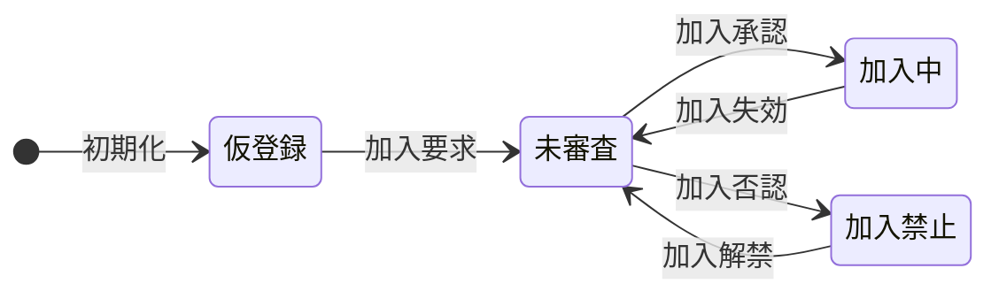
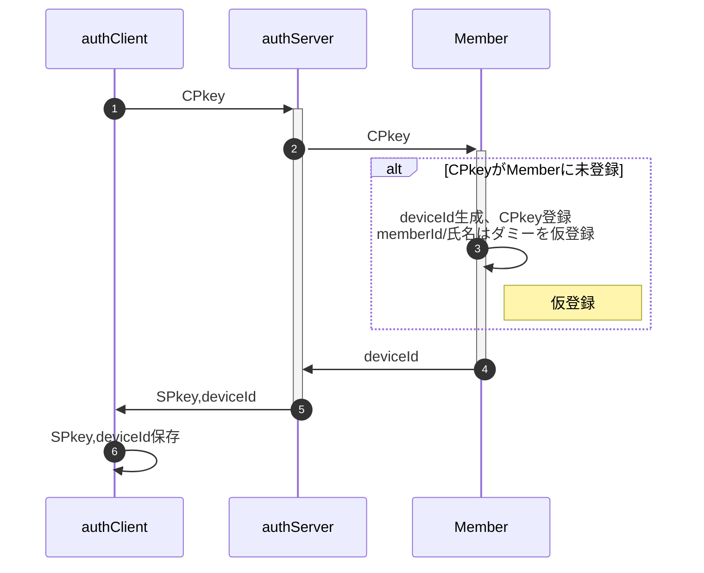
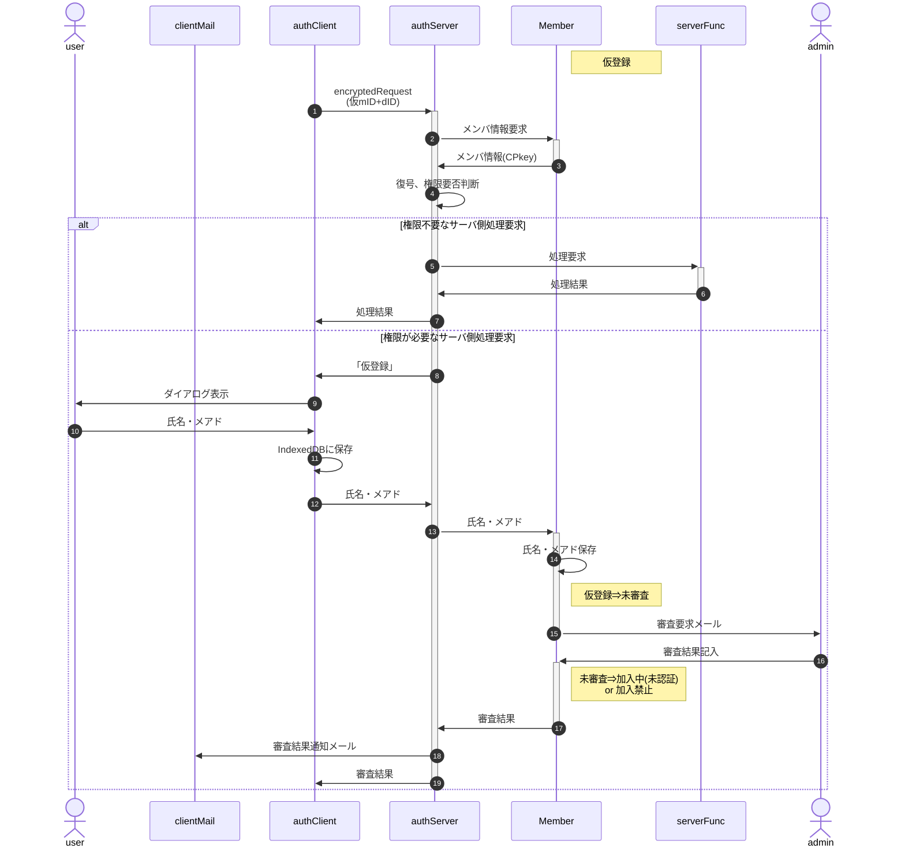
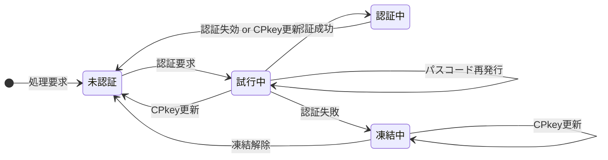
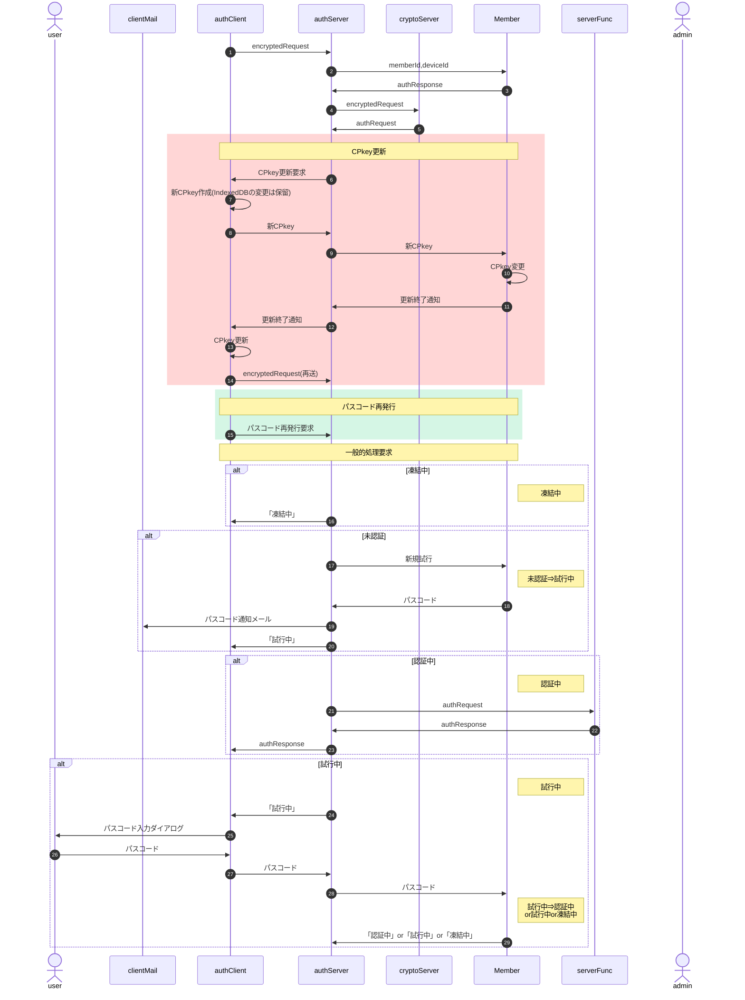

<style>
  .submenu {
    text-align: right;
    font-size: 0.8rem;
  }
  .nowrap td {white-space:nowrap;} /* 横長な表を横スクロール */
</style>

# <span id="top">"auth"総説</span>

<div class="submenu">

[要求仕様](#require) | [用語](#dictionary) | [暗号化・署名方式](#crypto) | [実装方針](#policy) | [状態及び通信手順](#protocol) | [①メンバ](#member) | [②デバイス](#device) 

</div>

利用者(メンバ)がブラウザ(クライアント)からサーバ側処理要求を発行、二要素認証を行ってメンバの権限を確認の上、サーバ側の処理結果を返す。

メンバの権限については管理者が事前にメンバ一覧(Google Spread)上で認否を行う。

## <span id="require"><a href="#top">要求仕様</a></span>

- 本システムは限られた人数のサークルや小学校のイベント等での利用を想定する。<br>
  よってセキュリティ上の脅威は極力排除するが、一定水準の安全性・恒久性を確保した上で導入時の容易さ・技術的ハードルの低さ、運用の簡便性を重視する。
- サーバ側(以下authServer)はスプレッドシートのコンテナバインドスクリプト、クライアント側(以下authClient)はHTMLのJavaScript
- サーバ側・クライアント側とも鍵ペアを使用
- サーバ側の動作環境設定・鍵ペアはScriptProperties、クライアント側はIndexedDBに保存
- 原則として通信は受信側公開鍵で暗号化＋発信側秘密鍵で署名
- クライアントの識別(ID)はメールアドレスで行う
- 日時は特段の注記が無い限り、UNIX時刻でミリ秒単位で記録(`new Date().getTime()`)
- [メンバ情報](sv/Member.md#member_members)はスプレッドシートに保存
- 定義したクラスのインスタンス変数は、セキュリティ強度向上のため特段の記述がない限りprivateとする
- 日時は特段の指定が無い限り全てUNIX時刻(number型)。比較も全てミリ秒単位で行う

## <span id="dictionary"><a href="#top">用語</a></span>

- メンバ、デバイス：「メンバ」とは利用者を、「デバイス」とは利用者が使用する端末を指す。マルチデバイス対応のためメンバ：デバイスは"1:n"対応となる。<br>
  メンバはメールアドレスで識別し、デバイスはauthClient呼出時に自動設定されるUUIDで識別する。
- SPkey, SSkey：サーバ側の公開鍵(Server side Public key)と秘密鍵(Server side Secret key)
- CPkey, CSkey：クライアント側の公開鍵(Client side Public key)と秘密鍵(Client side Secret key)
- パスフレーズ：クライアント側鍵ペア作成時のキー文字列。JavaScriptで自動的に生成
- パスワード：運用時、クライアント(人間)がブラウザ上で入力する本人確認用の文字列
- パスコード：二段階認証実行時、サーバからクライアントに送られる6桁※の数字<br>
  ※既定値。実際の桁数はauthConfig.trial.passcodeLengthで規定
- 内発処理：ローカル関数からの要求に基づかない、authClientでの処理の必要上発生するauthServerへの問合せ

## <span id="crypto"><a href="#top">暗号化・署名方式</a></span>

- 署名方式 : RSA-PSS
- 暗号化方式 : RSA-OAEP
- ハッシュ関数 : SHA-256以上
- 許容時差±120秒※以内
  ※既定値。実際の桁数はauthConfig.cryptoServer.[allowableTimeDifference](sv/authServerConfig.md#authserverconfig_members)で規定
- 順序は「暗号化->署名」ではなく「署名->暗号化」で行う
  1. クライアントがデータをJSON化
  2. 自身の秘密鍵で署名(署名→暗号化)
  3. サーバの公開鍵で暗号化
  4. サーバは復号後、クライアント公開鍵(CPkey)で署名を検証
- パスワードの生成は「ライブラリ > createPassword」を使用
- パスコードのメール送信は「ライブラリ > [sendMail](JSLib.md#sendmail)」を使用
- CPkeyの有効期限が切れた場合、以下の手順で更新する
  1. クライアント側から古いCPkeyで署名された要求を受信
  2. サーバ側で署名検証の結果、期限切れを確認
    - memberList.trial[0].CPkeyUpdateUntilに「現在日時＋[loginLifeTime](authServerConfig.md#authserverconfig_members)」をセット
    - クライアント側に通知
  3. クライアント側でCPkeyを更新、新CPkeyで再度リクエスト
  4. サーバ側で[loginLifeTime](authServerConfig.md#authserverconfig_members)を確認、期限内ならmemberList.CPkeyを書き換え。期限切れなら加入処理同様、adminによる個別承認を必要とする。
  5. 以降は未ログイン状態で要求が来た場合として処理を継続

## <span id="policy"><a href="#top">実装上の方針</a></span>

- サーバ・クライアント共に進捗・エラー管理に[devTools](JSLib.md#devtools)を使用
- 関数・メソッドは原則として`try 〜 catch`で囲み、予期せぬエラーが発生した場合はErrorオブジェクトを返す。<br>
  以下は各メソッドのプロトタイプ("pv"はインスタンス変数)
  ```js
  function prototype(arg) {
    const v = {whois:`${pv.whois}.prototype`, arg:{arg}, rv:null};
    dev.start(v);
    try {

      // -------------------------------------------------------------
      dev.step(1); // 引数の存否確認、データ型チェック ＋ ワークの準備
      // -------------------------------------------------------------

      dev.end(); // 終了処理
      return v.rv;

    } catch (e) { return dev.error(e); }
  }
  ```

## <span id="protocol"><a href="#top">状態及び通信手順</a></span>
例えば認証済のデバイスからの処理要求は受け付けるが未認証なら先に認証に必要なパスコードを通知する等、クライアント側(メンバ・デバイス)の状態によりサーバ側の処理が異なる。

なお「メンバ：デバイス = 1:n」のため、最初にクライアント・サーバ間通信に使用されるI/O項目(クラス)を整理した上で、メンバとデバイスを分けて記述する。

### <span id="io"><a href="#top">I/O項目対応表</a></span>

残課題：通信に関係するクラスに絞った上で最新化

| LocalRequest | encryptedRequest | authRequest | authAuditLog | authErrorLog | authResponse |
| :-- | :-- | :-- | :-- | :-- | :-- |
|  | memberId | memberId | memberId | memberId | memberId |
|  | deviceId | deviceId | deviceId | deviceId | deviceId |
|  | CPkey | CPkey |  |  | CPkey |
|  | requestTime | requestTime |  |  | requestTime |
| func | func | func | func | func | func |
| arguments | arguments | arguments | arguments | arguments | arguments |
|  | requestId | requestId |  |  | requestId |
|  |  | SPkey |  |  | SPkey |
|  |  | response |  |  | response |
|  |  | receptTime | receptTime | receptTime | receptTime |
|  |  | responseTime |  |  | responseTime |
|  |  | status | status |  |  |
|  |  |  |  | errorType |  |
|  |  |  |  | caller |  |
|  |  |  |  | step |  |
|  |  |  |  | variable |  |
|  |  |  |  | message |  |
|  |  |  |  | stack |  |
|  |  |  | elaps | elaps |  |

| No | メンバ名 | 説明 |
| --: | :-- | :-- |
| 1 | memberId | {number} - メンバ識別子。0〜999はシステムで予約 |
| 2 | deviceId | {string} - デバイス識別子(UUID) |
| 3 | CPkey | {string} - クライアント側公開鍵 |
| 4 | requestTime | {number} - クライアント側の処理要求受付日時 |
| 5 | func | {string} - サーバ側関数名 |
| 6 | arguments | {any[]} - サーバ側関数に渡す引数の配列 |
| 7 | requestId | {string} - 処理要求のUUID |
| 8 | SPkey | {string} - サーバ側公開鍵 |
| 9 | response | {any} - サーバ側関数の処理結果。Errorオブジェクトを含む |
| 10 | receptTime | {number} - サーバ側の処理要求受付日時 |
| 11 | responseTime | {number} - 処理終了日時。authErrorの場合エラー発生日時 |
| 12 | status | {string|authError} - 正常終了時は"success"(文字列)、警告終了の場合はエラーメッセージ、致命的エラーの場合はauthErrorオブジェクト |
| 13 | errorType | {string} - エラーの型(ex."ReferenceError") |
| 14 | function | {string} - エラーが起きたクラス・メソッド名 |
| 15 | step | {string} - エラーが起きたメソッド内の位置を示す文字列 |
| 16 | variable | {string} - エラー時のメソッド内汎用変数(JSON文字列) |
| 17 | message | {string} - エラーメッセージ |
| 18 | stack | {string} - エラー時のスタックトレース |
| 19 | elaps | {number} - 所要時間(ミリ秒) |

### <span id="member"><a href="#top">メンバの状態遷移</a></span>

#### 状態遷移図



#### 状態一覧

| No | 状態 | 説明 |
| --: | :-- | :-- |
| 1 | 仮登録 | シートに仮のmemberId(UUID)/メンバ名("dummy"固定)が登録され、権限不要な関数のみ実行可能な状態 |
| 2 | 未審査 | シートに正しいmemberId(メアド)/メンバ名(氏名)が登録されているが、管理者からの加入認否が未定で権限不要な関数のみ実行可能な状態 |
| 3 | 加入中 | 管理者により加入が承認された状態。権限不要な関数に加え、ログイン後は付与された範囲内の要権限サーバ側関数も実行可。 |
| 4 | 加入禁止 | 管理者により加入が否認された状態。権限不要な関数のみ実行可能 |

#### 状態決定表

| ①シート | ②memberId | ③加入禁止 | ④未審査 | **メンバ状態** |
| :-- | :-- | :-- | :-- | :-- |
| 未登録 | — | — | — | (未使用) |
| 登録済 | UUID | — | — | **仮登録** |
| 登録済 | e-mail | 該当 | — | **加入禁止** |
| 登録済 | e-mail | 非該当 | 該当 | **未審査** |
| 登録済 | e-mail | 非該当 | 非該当 | **加入中** |

※下表内の変数名はMemberLogのメンバ名

- ①シート：memberListシートに登録されているか
- ②memberId：メンバ識別子(文字列)の形式
- ③加入禁止：加入禁止されている<br>
  `0 < denial && Date.now() <= unfreezeDenial`
- ④未審査：管理者の認否が未決定<br>
  `approval === 0 && denial === 0`

#### 通信手順：初回HTMLロード時

- 「🔢」はクライアント側(IndexedDB)の、「🧩」はサーバ側(シート)の項目・格納値
  - mID: memberId
  - CP : CPkey
  - 氏名 : メンバ氏名(ハンドルネーム)
  - dID : deviceId
  - SP : SPkey
  - 状態 : 処理による遷移先の状態名
- シーケンス図の下の表は、シーケンス図上のNoにおける処理終了時点での各変数の状態
- <span style="color:red">赤</span>字は前ステップからの変更点

-----

「初回HTMLロード時」とは、クライアント側でIndexedDB未作成・サーバ側SPkey未取得の状態を指す。



| No  | 🔢mID | 🔢CP      | 🔢氏名  | 🔢dID    | 🔢SP | 🧩mID    | 🧩CP | 🧩氏名    | 🧩dID     | 🧩状態 |
| --: | :--   | :--       | :--    | :--     | :--  | :--      | :-- | :--      | :--      | :--   |
| 1   | —     | <b>有</b> | —      | —       | —    | —        | —  |  —       | —         | —     |
| 3   | —     | 有        | —      | —       | —    | <b>仮</b> | 有  | <b>仮</b> | <b>有</b> | 仮登録 |
| 6   |<b>仮</b>| 有      |<b>仮</b>|<b>有</b>|<b>有</b>| 仮     | 有  | 仮        | 有        | 仮登録 |

#### 通信手順：初回処理要求時

「初回処理要求時」とは、初回HTMLロード時の処理終了後、初めての処理要求を出す状態を指す。



| No  | 🔢mID | 🔢CP | 🔢氏名 | 🔢dID | 🔢SP | 🧩mID | 🧩CP | 🧩氏名 | 🧩dID | 🧩状態 |
| --: | :--   | :-- | :--   | :--   | :--  | :--  | :--  | :--   | :--   | :--   |
| 0   | 仮    | 有   | 仮    | 有    | 有   | 仮    | 有   | 仮    | 有    | 仮登録 |
| 11  |<b>有</b>| 有 |<b>有</b>| 有   | 有   | 仮    | 有   | 仮    | 有    | 仮登録 |
| 14  | 有    | 有   | 有    | 有    | 有   |<b>有</b>| 有 |<b>有</b>| 有    | 仮登録 |

### <span id="device"><a href="#top">デバイスの状態遷移</a></span>

メンバが加入承認後、使用するデバイスの状態遷移

※ 上述の未使用から加入まではメンバ単位の状態遷移。マルチデバイス対応のため、認証状態はデバイス単位で管理。

#### 状態遷移図



#### 状態一覧

| No | 状態 | 説明 |
| --: | :-- | :-- |
| 1 | 未認証 | 未認証(未ログイン)で権限が必要な処理は行えない状態 |
| 2 | 試行中 | パスコードによる認証を試行している状態 |
| 3 | 認証中 | 認証が通り(ログイン)、権限の範囲内で要権限サーバ側関数も使用できる状態 |
| 4 | 凍結中 | 規定の試行回数連続して認証に失敗し、再認証要求が禁止された状態 |

#### 状態決定表

| ⑤認証中 | ⑥凍結中 | ⑦未認証 | デバイス状態 |
| :-- | :-- | :-- | :-- |
| 該当 | — | — | **認証中** |
| 非該当 | 該当 | — | **凍結中** |
| 非該当 | 非該当 | 該当 | **未認証** |
| 非該当 | 非該当 | 非該当 | **試行中** |

※下表内の変数名はMemberLogのメンバ名

- ⑤認証中：パスコード認証に成功し認証有効期間内<br>
  `0 < approval && Date.now() ≦ loginExpiration`
- ⑥凍結中：凍結期間内<br>
  `0 < approval && 0 < loginFailure && loginFailure < Date.now() && Date.now() <= unfreezeLogin`
- ⑦未認証：加入承認後認証要求されたことが無い<br>
  `0 < approval && loginRequest === 0`

#### 通信手順

以下は初回処理要求後に加入承認されたメンバであることが前提。

残課題：パスコード再発行以下の手順を確認・修正



- ③authResponse
  - response = 該当者/デバイスのMemberインスタンス
  - status = 通常は"normal"(文字列)。CPkey期限切れならError.message="CPkey expired"
- ⑦新CPkey作成：authClient.IndexedDBの更新はこの時点では無く、authServerからの⑫変更終了通知を待って行う
- ⑲終了後は④に戻って状態別の処理を実行
