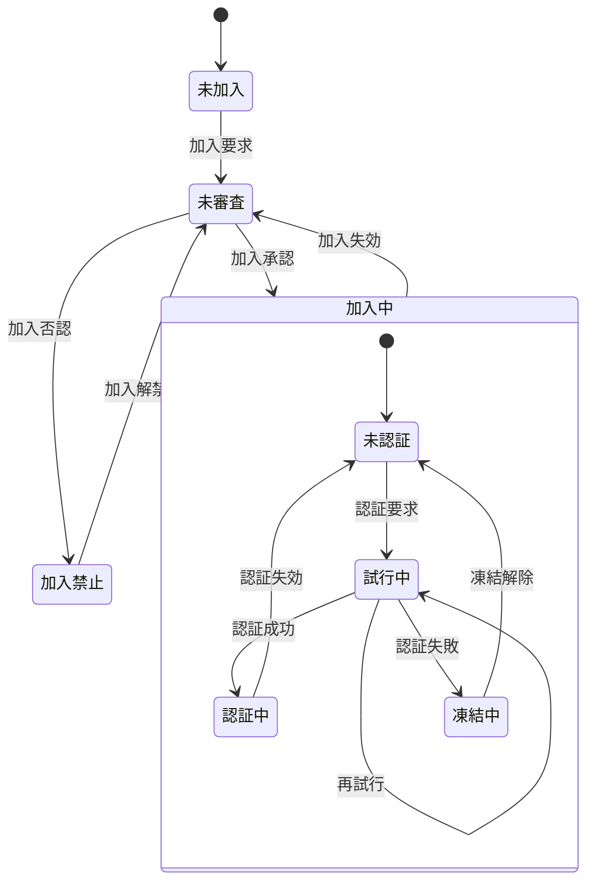

No | 状態 | 説明
:-- | :-- | :--
1 | 未加入 | memberList未登録
2 | 未審査 | memberList登録済だが、管理者による加入認否が未決定
3 | 加入中 | 管理者により加入が承認された状態
3.1 | 未認証 | 認証(ログイン)不要の処理しか行えない状態
3.2 | 試行中 | パスコードによる認証を試行している状態
3.3 | 認証中 | 認証が通り、ログインして認証が必要な処理も行える状態
3.4 | 凍結中 | 規定の試行回数連続して認証に失敗し、再認証要求が禁止された状態
4 | 加入禁止 | 管理者により加入が否認された状態

<!--
No | 状態 | 説明
:-- | :-- | :--
1 | 未加入 | memberList未登録
2 | 未審査 | memberList登録済だが、管理者による加入認否が未決定
3 | 審査済 | 管理者による加入認否が決定済
4 | 加入中 | 管理者により加入が承認された状態
4.1 | 未認証 | 認証(ログイン)不要の処理しか行えない状態
4.2 | 試行中 | パスコードによる認証を試行している状態
4.3 | 認証中 | 認証が通り、ログインして認証が必要な処理も行える状態
4.4 | 凍結中 | 規定の試行回数連続して認証に失敗し、再認証要求が禁止された状態
5 | 加入禁止 | 管理者により加入が否認された状態
-->
