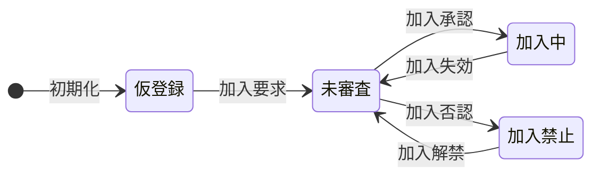
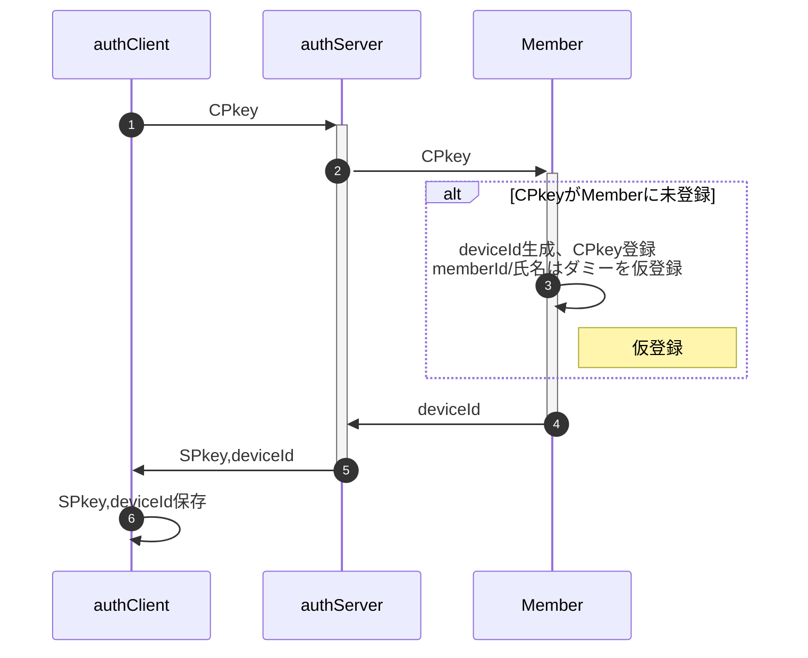
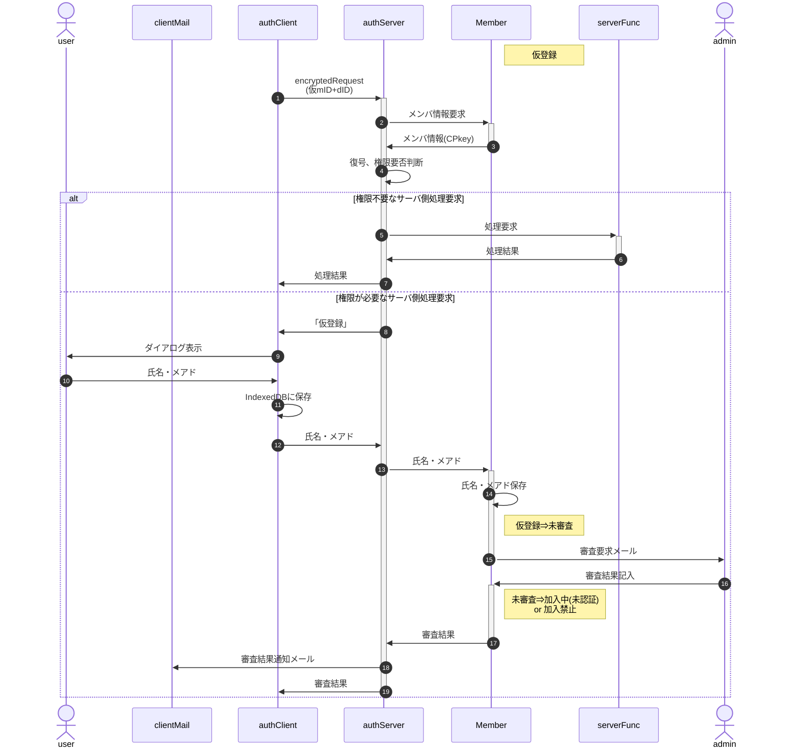
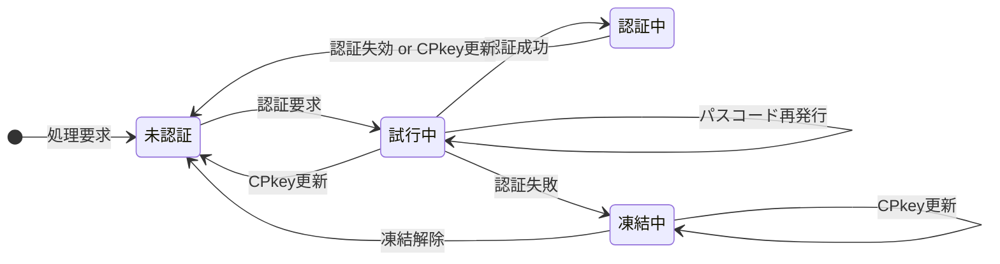
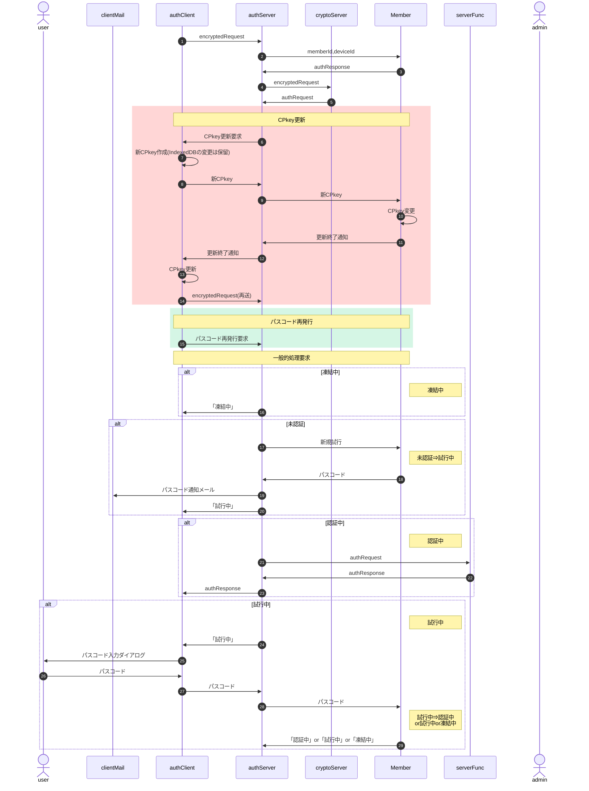

## <a href="#top">メンバの状態遷移</a>

### 状態遷移図

### 状態一覧

| No | 状態 | 説明 |
| --: | :-- | :-- |
| 1 | 仮登録 | シートに仮のmemberId(UUID)/メンバ名("dummy"固定)が登録され、権限不要な関数のみ実行可能な状態 |
| 2 | 未審査 | シートに正しいmemberId(メアド)/メンバ名(氏名)が登録されているが、管理者からの加入認否が未定で権限不要な関数のみ実行可能な状態 |
| 3 | 加入中 | 管理者により加入が承認された状態。権限不要な関数に加え、ログイン後は付与された範囲内の要権限サーバ側関数も実行可。 |
| 4 | 加入禁止 | 管理者により加入が否認された状態。権限不要な関数のみ実行可能 |

### 状態決定表

| ①シート | ②memberId | ③加入禁止 | ④未審査 | **メンバ状態** |
| :-- | :-- | :-- | :-- | :-- |
| 未登録 | — | — | — | (未使用) |
| 登録済 | UUID | — | — | **仮登録** |
| 登録済 | e-mail | 該当 | — | **加入禁止** |
| 登録済 | e-mail | 非該当 | 該当 | **未審査** |
| 登録済 | e-mail | 非該当 | 非該当 | **加入中** |

※下表内の変数名はMemberLogのメンバ名

- ①シート：memberListシートに登録されているか
- ②memberId：メンバ識別子(文字列)の形式
- ③加入禁止：加入禁止されている 
  `0 < denial && Date.now() <= unfreezeDenial`
- ④未審査：管理者の認否が未決定 
  `approval === 0 && denial === 0`

### トリガーと処理

- 「🔢」はクライアント側(IndexedDB)の、「🧩」はサーバ側(シート)の項目・格納値
  - mID: memberId
  - CP : CPkey
  - 氏名 : メンバ氏名(ハンドルネーム)
  - dID : deviceId
  - SP : SPkey
  - 状態 : 処理による遷移先の状態名
- シーケンス図の下の表は、シーケンス図上のNoにおける処理終了時点での各変数の状態
- 赤字は前ステップからの変更点

#### 初回HTMLロード時

「初回HTMLロード時」とは、クライアント側でIndexedDB未作成・サーバ側SPkey未取得の状態を指す。

| No  | 🔢mID | 🔢CP      | 🔢氏名  | 🔢dID    | 🔢SP | 🧩mID    | 🧩CP | 🧩氏名    | 🧩dID     | 🧩状態 |
| --: | :--   | :--       | :--    | :--     | :--  | :--      | :-- | :--      | :--      | :--   |
| 1   | —     | <b>有</b> | —      | —       | —    | —        | —  |  —       | —         | —     |
| 3   | —     | 有        | —      | —       | —    | <b>仮</b> | 有  | <b>仮</b> | <b>有</b> | 仮登録 |
| 6   |<b>仮</b>| 有      |<b>仮</b>|<b>有</b>|<b>有</b>| 仮     | 有  | 仮        | 有        | 仮登録 |

#### 初回処理要求時

「初回処理要求時」とは、初回HTMLロード時の処理終了後、初めての処理要求を出す状態を指す。

| No  | 🔢mID | 🔢CP | 🔢氏名 | 🔢dID | 🔢SP | 🧩mID | 🧩CP | 🧩氏名 | 🧩dID | 🧩状態 |
| --: | :--   | :-- | :--   | :--   | :--  | :--  | :--  | :--   | :--   | :--   |
| 0   | 仮    | 有   | 仮    | 有    | 有   | 仮    | 有   | 仮    | 有    | 仮登録 |
| 11  |<b>有</b>| 有 |<b>有</b>| 有   | 有   | 仮    | 有   | 仮    | 有    | 仮登録 |
| 14  | 有    | 有   | 有    | 有    | 有   |<b>有</b>| 有 |<b>有</b>| 有    | 仮登録 |

## デバイスの状態遷移

メンバが加入承認後、使用するデバイスの状態遷移

※ 上述の未使用から加入まではメンバ単位の状態遷移。マルチデバイス対応のため、認証状態はデバイス単位で管理。

### 状態遷移図

### 状態一覧

| No | 状態 | 説明 |
| --: | :-- | :-- |
| 1 | 未認証 | 未認証(未ログイン)で権限が必要な処理は行えない状態 |
| 2 | 試行中 | パスコードによる認証を試行している状態 |
| 3 | 認証中 | 認証が通り(ログイン)、権限の範囲内で要権限サーバ側関数も使用できる状態 |
| 4 | 凍結中 | 規定の試行回数連続して認証に失敗し、再認証要求が禁止された状態 |

### 状態決定表

| ⑤認証中 | ⑥凍結中 | ⑦未認証 | デバイス状態 |
| :-- | :-- | :-- | :-- |
| 該当 | — | — | **認証中** |
| 非該当 | 該当 | — | **凍結中** |
| 非該当 | 非該当 | 該当 | **未認証** |
| 非該当 | 非該当 | 非該当 | **試行中** |

※下表内の変数名はMemberLogのメンバ名

- ⑤認証中：パスコード認証に成功し認証有効期間内 
  `0 < approval && Date.now() ≦ loginExpiration`
- ⑥凍結中：凍結期間内 
  `0 < approval && 0 < loginFailure && loginFailure < Date.now() && Date.now() <= unfreezeLogin`
- ⑦未認証：加入承認後認証要求されたことが無い 
  `0 < approval && loginRequest === 0`

### トリガーと処理

以下は初回処理要求後に加入承認されたメンバであることが前提。

- ③authResponse
  - response = 該当者/デバイスのMemberインスタンス
  - status = 通常は"normal"(文字列)。CPkey期限切れならError.message="CPkey expired"
- ⑦新CPkey作成：authClient.IndexedDBの更新はこの時点では無く、authServerからの⑫変更終了通知を待って行う
- ⑲終了後は④に戻って状態別の処理を実行
